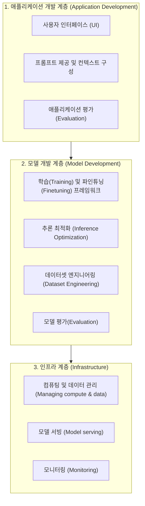

# 02. 3계층 AI 기술 스택 (The AI Stack)

## 📌 핵심 요약 & 전체 맥락
> **"복잡한 AI 생태계를 이해하기 위한 3계층 프레임워크"**  
> 
> 복잡하고 방대해진 생성형 AI 생태계를 이해하기 위해, 칩 후옌(Chip Huyen)은 이를 3개의 계층(Layer)으로 분리합니다. 데이터와 컴퓨팅 관리를 담당하는 **인프라(Infrastructure) 계층**, 파인튜닝과 추론 최적화를 포함하는 **모델 개발(Model development) 계층**, 그리고 사용자와 상호작용하는 **애플리케이션 개발(Application development) 계층**입니다.

---

## 1. 3계층 AI 스택 구조도

---

## 2. 각 계층별 상세 역할과 핵심 기술

### ① 인프라 계층 (Infrastructure)
가장 밑바탕에서 막대한 연산력과 서빙 인프라를 제공하는 토대입니다.
* **주요 역할:** 모델 서빙(Model serving), 데이터와 컴퓨팅 자원의 관리, 그리고 모니터링을 담당합니다.

### ② 모델 개발 계층 (Model Development)
파운데이션 모델을 환경에 맞게 개발하고 다듬는 계층입니다.
* **주요 역할:** 모델링, 학습(Training), 파인튜닝 프레임워크를 포함합니다. 
* **데이터셋 엔지니어링:** 데이터는 모델 개발의 핵심이므로, 이 계층에는 데이터셋 엔지니어링이 포함됩니다.
* **추론 최적화:** 모델이 더 빠르고 저렴하게 동작하도록 만드는 추론 최적화(Inference optimization) 역시 인프라가 아닌 모델 개발 계층에 속합니다.

### ③ 애플리케이션 개발 계층 (Application Development)
모델의 지능을 가져와 특정 비즈니스 문제를 해결하고 사용자와 맞닿는 계층입니다.
* **주요 역할:** 모델에 좋은 프롬프트와 컨텍스트를 제공합니다.
* **사용자 경험:** 성공적인 애플리케이션을 위한 좋은 인터페이스(UI)를 구성합니다.
* **평가(Evaluation):** 모델 개발 계층과 마찬가지로 엄격한 평가(Rigorous evaluation) 과정이 필수적입니다.

---

## 3. 엔지니어의 스탠스: 나는 어디에 위치할 것인가?
AI 애플리케이션 개발을 시작할 때는 일반적으로 **최상단의 애플리케이션 개발 계층에서 시작하여, 필요한 경우 점차 하위 계층(모델 개발 -> 인프라)으로 내려가며 작업**하게 됩니다. 이 3계층 프레임워크는 AI 엔지니어링의 방대한 툴과 기법들이 각각 어느 영역의 문제를 풀기 위해 존재하는지 이해하는 나침반이 됩니다.

---

## 🔗 연관 문서
* [[00-ch01-overview|00. Chapter 1 전체 개요 및 목차]]
* [[01-ai-engineering-vs-ml-engineering|01. 머신러닝 엔지니어링 vs AI 엔지니어링]]
