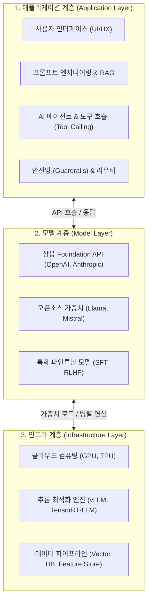

# 02. 3계층 AI 기술 스택 (The AI Stack)

## 📌 핵심 요약 & 전체 맥락
> **"현대 AI 생태계는 거대한 3층 케이크와 같다."**  
> 
> 복잡하고 방대해진 생성형 AI 생태계를 이해하기 위해, 칩 후옌(Chip Huyen)은 이를 3개의 명확한 계층(Layer)으로 분리합니다. 하드웨어와 학습 플랫폼을 제공하는 **인프라(Infrastructure) 계층**, 근간이 되는 두뇌인 **모델(Model) 계층**, 그리고 사용자와 직접 맞닿아 비즈니스 가치를 창출하는 **애플리케이션(Application) 계층**입니다.

---

## 1. 3계층 AI 스택 구조도

---

## 2. 각 계층별 상세 역할과 핵심 기술

### ① 인프라 계층 (Infrastructure Layer)
가장 밑바탕에서 막대한 연산력과 데이터 저장을 책임지는 토대입니다.
* **컴퓨팅 하드웨어:** NVIDIA H100 GPU 클러스터, Google TPU 등. 
* **데이터 플랫폼:** 방대한 문서를 저장하고 검색하는 벡터 데이터베이스(Vector DB, 예: Pinecone, Milvus), 데이터 클렌징 파이프라인.
* **학습 및 서빙 최적화:** PagedAttention 기반의 vLLM, 분산 병렬 학습을 위한 Megatron-LM이나 DeepSpeed 등.
* **비즈니스 특성:** 가장 자본 집약적이며, AWS, GCP, Azure, NVIDIA 같은 소수의 거대 테크 기업들이 시장을 장악하고 있습니다.

### ② 모델 계층 (Model Layer)
인류의 지식과 언어 구조를 압축하여 저장하고 있는 '두뇌'입니다.
* **폐쇄형(Closed-source) API:** OpenAI(GPT-4), Anthropic(Claude 3), Google(Gemini). 편의성과 성능이 높지만 종속성(Lock-in) 리스크가 존재합니다.
* **오픈소스(Open-weight) 모델:** Meta(Llama 3), Mistral. 직접 서버에 올려 보안을 유지하고 입맛에 맞게 커스텀(Fine-tuning)할 수 있습니다.
* **비즈니스 특성:** 승자 독식 기조가 강하며, 막대한 사전 학습 비용 때문에 이 역시 거대 기업들의 전쟁터입니다. 

### ③ 애플리케이션 계층 (Application Layer)
모델 계층의 지능을 가져와 특정 비즈니스 문제를 해결하는 가장 활발한 혁신의 무대입니다.
* **프레임워크:** LangChain, LlamaIndex 등을 사용하여 LLM의 입출력을 엮어냅니다.
* **RAG (검색 증강 생성):** 회사 내부의 기밀 문서를 모델의 지식과 결합하여 환각(Hallucination)을 없앱니다.
* **AI 에이전트:** 모델에게 인터넷 검색, DB 쿼리, 이메일 전송 등의 '행동(Action)' 권한을 부여합니다.
* **비즈니스 특성:** **대부분의 스타트업과 AI 엔지니어들이 종사하는 영역**입니다. 모델 자체를 밑바닥부터 만들기보다는, 이미 존재하는 모델을 어떻게 잘 조립하여 사용자에게 최고의 가치를 줄 것인가에 집중합니다.

---

## 3. 엔지니어의 스탠스: 나는 어디에 위치할 것인가?
AI 엔지니어링을 할 때 자신이 3계층 중 **어느 레이어의 문제를 풀고 있는지**를 명확히 인지해야 합니다. 
만약 당신이 "의료용 챗봇 앱(Layer 1)"을 만드는 스타트업이라면, 자체 LLM을 밑바닥부터 학습(Layer 2)시키거나 GPU 최적화 커널을 직접 짜는(Layer 3) 오류를 피하고, 최고의 API를 골라 RAG 파이프라인과 Guardrails를 고도화하는 데 모든 역량을 쏟아야 합니다.

---

## 🔗 연관 문서
* [[00-ch01-overview|00. Chapter 1 전체 개요 및 목차]]
* [[01-ai-engineering-vs-ml-engineering|01. 머신러닝 엔지니어링 vs AI 엔지니어링]]
