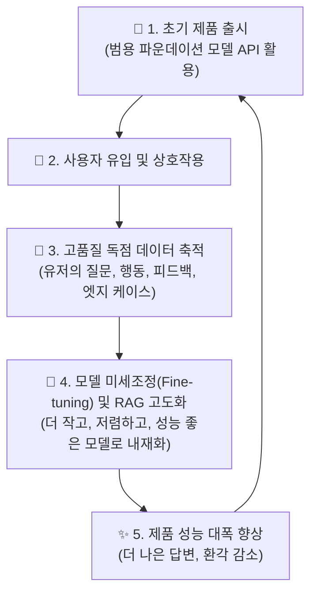

# 04. 방어 가능성(Defensibility)과 데이터 플라이휠

## 📌 핵심 요약 & 전체 맥락
> **"나와 경쟁자가 똑같은 GPT-4 API를 쓴다면, 내 제품이 어떻게 살아남을 수 있는가?"**  
> 
> 파운데이션 모델의 대중화로 인해, '그럴듯한 AI 데모'를 며칠 만에 뚝딱 만들어내는 것은 대학생도 할 수 있는 시대가 되었습니다. 초기 진입 장벽이 낮아졌다는 것은 역으로 강력한 경쟁자들이 언제든 내 제품을 복제할 수 있다는 뜻입니다. 
> 이 장에서는 AI 애플리케이션을 구축하는 기업이 살아남기 위해 구축해야 하는 **3가지 기술적 해자(Moats)**와 궁극의 무기인 **데이터 플라이휠(Data Flywheel)**을 다룹니다.

---

## 1. 생성형 AI 시대의 3가지 기술적 해자 (Moats)

경제학자 워렌 버핏이 주창한 '경제적 해자(Economic Moat)' 개념을 AI 애플리케이션 생태계에 적용해 볼 수 있습니다.

### ① 기술 및 아키텍처 해자 (Technology Moat)
단순히 "GPT-4에게 질문하기" 수준의 얇은 래퍼(Thin Wrapper) 앱은 며칠이면 복제됩니다.
* **복잡한 시스템 엔지니어링:** 프롬프트 하나로 끝내는 것이 아니라, 10개의 특화 프롬프트를 연결한 체인(Chain), 복잡한 벡터 데이터베이스(Vector DB) 검색 알고리즘, 자체 구축한 안전 가드레일(Guardrails) 등은 쉽게 모방할 수 없는 시스템 아키텍처가 됩니다.

### ② 유통망과 고객 장악 (Distribution Moat)
기술력이 동일하다면, 이미 수백만 명의 사용자를 보유한 기업이 무조건 승리합니다.
* 마이크로소프트가 GitHub Copilot이나 Office 365에 AI를 결합하면, 스타트업이 더 나은 AI를 만들어도 기존 B2B 고객의 유통망을 뚫고 들어가기 어렵습니다. 즉, **"기존 제품에 AI를 끼워 파는 것"**이 가장 강력한 배포 무기가 됩니다.

### ③ 데이터 해자 (Data Moat) ⭐ (가장 핵심)
인터넷의 공개된 데이터(위키백과, 뉴스)로 학습한 모델은 누구나 돈을 내면 쓸 수 있습니다.
* **고유 데이터 확보:** 회사 내부의 프라이빗한 기밀 문서, 의료 기록, 특정 산업의 폐쇄적인 데이터베이스를 RAG로 연결하거나 파인튜닝에 사용하는 순간, 다른 누구도 제공할 수 없는 독보적인 통찰을 제공하게 됩니다.

---

## 2. 궁극의 무기: 데이터 플라이휠 (Data Flywheel)

진정한 방어벽은 멈춰있는 데이터가 아니라, **사용자가 제품을 쓸수록 제품이 스스로 똑똑해지는 선순환 구조**에서 완성됩니다. 이를 **데이터 플라이휠(Data Flywheel)**이라고 부릅니다.

### ⚙️ 데이터 플라이휠의 작동 원리
1. **Cold Start 극복:** 초기에는 데이터가 없으므로 GPT-4 같은 비싸고 강력한 상용 모델을 써서 빠르게 시장에 출시합니다.
2. **희귀 데이터 수집:** 사용자들이 챗봇을 쓰면서 남기는 질문들, 챗봇의 답변을 수정(Edit)하는 행동, '좋아요/싫어요' 피드백은 돈을 주고도 살 수 없는 **초고품질 선호도 데이터**입니다.
3. **독자적 모델 구축:** 수만 건의 피드백 데이터가 쌓이면, 이를 사용해 저렴한 오픈소스 모델(예: Llama 3 8B)을 미세조정(Fine-tuning)합니다.
4. **승자 독식:** 내재화된 모델은 GPT-4보다 빠르고 저렴하면서도 **내 비즈니스 영역에서만큼은 압도적으로 똑똑합니다.** 성능이 좋아지니 사용자가 더 몰리고, 데이터는 기하급수적으로 더 빨리 쌓이게 되어 후발 주자가 영원히 따라잡을 수 없는 격차를 만듭니다.

> 💡 **"모델은 교체 가능하지만(Commoditized), 사용자가 남긴 데이터 플라이휠은 당신만의 고유한 자산이다."**

---

## 🔗 연관 문서
* [[00-ch01-overview|00. Chapter 1 전체 개요 및 목차]]
* [[01-ai-engineering-vs-ml-engineering|01. 머신러닝 엔지니어링 vs AI 엔지니어링]]
* [[chapter-qa/ch10-architecture-and-feedback-qa/03-user-feedback-flywheel-and-ui-mechanisms|Ch10-03. 사용자 피드백 플라이휠과 UI 메커니즘]]
