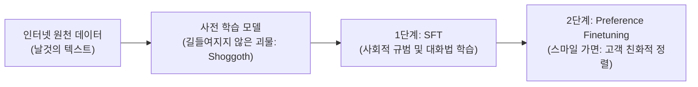
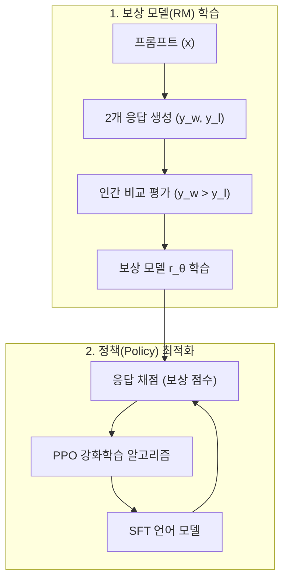

# 07. 포스트 트레이닝(Post-Training)과 가치 정렬(Alignment)

## 📌 핵심 요약
> **사후 학습(Post-Training)은 사전 학습된 거대 모델의 방대한 지식과 잠재력을 단 2% 미만의 컴퓨팅 연산량으로 '대화 및 지시 수행' 인터페이스로 잠금 해제(Unlock)하고, 인간의 선호도와 안전성 가치에 부합하도록 정렬(Alignment)하는 필수적인 2단계(SFT ➔ Preference Finetuning) 프로세스입니다.**

---

## 1. 포스트 트레이닝(Post-Training)의 필요성과 본질

### ① 사전 학습(Pre-training) 모델의 2가지 근본 한계
1. **텍스트 완성(Text Completion)에만 최적화:** 자기지도학습(Next-token prediction)으로 학습되어 사용자의 질문에 답하는 것이 아니라 단순 '웹페이지 글 이어쓰기' 방식으로 동작함.
2. **유해성·편향·오류:** 무차별 크롤링된 인터넷 데이터로 학습되어 무례하거나 편향되고 부정확한 출력을 생성할 위험이 큼.

### ② 사전 학습 vs 사후 학습 비교

| 구분 | 사전 학습 (Pre-training) | 사후 학습 (Post-training) |
| :--- | :--- | :--- |
| **최적화 대상** | **토큰 수준 품질** (다음 단어 예측 정확도) | **전체 응답 품질** (사용자 만족도 및 정렬) |
| **지식 관점 비유** | 지식을 습득하기 위한 **독서/공부** | 습득한 지식을 **실제 활용하는 법 훈련** |
| **연산 비용** | 전체 컴퓨팅의 **~98%** 소모 (수백만 달러) | 전체 컴퓨팅의 **~2%** 소모 (InstructGPT 기준) |
| **역할의 본질** | 거대한 잠재 지식 기반 구축 | 내재된 능력을 꺼내는 **잠금 해제(Unlock)** |

### ③ 쇼고스(Shoggoth) 밈으로 이해하는 파이프라인


---

## 2. 1단계: 지도 미세조정 (Supervised Finetuning, SFT)

### ① Text Completion vs Conversation 비교
프롬프트로 `"How to make pizza (피자 만드는 법)"`을 입력했을 때:
* **Pre-trained 모델:** 텍스트 완성을 수행하여 `"...for a family of six?"`(맥락 추가) 또는 `"...What ingredients do I need?"`(질문 나열)을 출력함.
* **SFT 모델:** 사용자의 의도를 파악하여 **"피자 레시피 및 조리 단계"**를 친절하게 안내함.

### ② 시연 데이터(Demonstration Data)와 행동 복제(Behavior Cloning)
* `(prompt, response)` 형태의 모범 답변 쌍을 모델에 보여주고, 모델이 이 모범 행동을 복제(Cloning)하도록 학습시킵니다.
* **작업 다양성:** QA, 요약, 번역, 텍스트 변환, 코딩 등 모델이 다루어야 할 광범위한 태스크 분포를 포함해야 합니다.

### ③ 데이터 구축 전략 및 트레이드오프
* **전문 인간 라벨러 (OpenAI InstructGPT):**
  * 고학력 라벨러(90% 대졸 이상, 1/3 이상 석사) 활용.
  * 1개 샘플 생성에 최대 30분 소요, 샘플당 **$10~$25**의 높은 비용 발생.
* **자원봉사 기반 오픈데이터 (LAION OpenAssistant):**
  * 13,500명 자원봉사자로 16만 개 메시지 확보했으나, **인구통계학적 편향** 존재 (참여자의 90%가 남성).
* **휴리스틱 필터링 (DeepMind Gopher):**
  * 웹 텍스트 중 `[A]: ... [B]: ...` 형태의 대화형 패턴을 규칙 기반으로 크롤링.
* **합성 데이터 (Synthetic Data):**
  * 고성능 LLM을 라벨러로 활용하여 데이터 생성 비용을 절감하는 현대적 핵심 트렌드.

---

## 3. 2단계: 선호도 미세조정 (Preference Finetuning)

### ① 선호도 정렬의 딜레마
* **유해 요청 거부:** 무기 제조, 범죄 모의, 혐오 표현 등 명백한 위험은 차단해야 함.
* **논쟁적 주제의 난제:** 정치, 종교, 사회적 이슈(총기 규제, 낙태 등)는 인간 집단마다 선호가 다르므로 단일한 수학적 가치 함수로 정의하기 극도로 어려움.
* **과도한 검열(Over-censorship)의 역효과:** 모델이 무해한 질문까지 과도하게 거절(Refusal)하면 모델의 유용성이 저하되고 사용자가 이탈함.

---

## 4. RLHF (인간 피드백 기반 강화학습)의 메커니즘

RLHF는 **(1) 보상 모델 학습**과 **(2) 보상 모델 기반 정책 최적화**의 2단계로 동작합니다.



### ① 보상 모델 (Reward Model, RM) 학습
* **Pairwise Comparison (비교 평가):** 점수를 직접 매기게(Pointwise) 하면 라벨러 간 편차가 심하므로, 두 응답 중 우열을 가리는 **비교 데이터 `(x, y_w, y_l)`**를 수집합니다. (비교 라벨링은 약 **$3.50/건**으로 작성 비용보다 훨씬 저렴).
* **목적 함수 (Loss Function):** 승리한 응답의 점수와 패배한 응답의 점수 차이를 극대화하도록 최적화합니다.
$$\mathcal{L}(\theta) = - \mathbb{E}_{(x, y_w, y_l)} \left[ \log \sigma \left( r_\theta(x, y_w) - r_\theta(x, y_l) \right) \right]$$
*(여기서 $x$는 프롬프트, $y_w$는 선호된 응답, $y_l$은 비선호 응답, $\sigma$는 시그모이드 함수)*

### ② 보상 모델을 통한 정책 미세조정 (PPO)
* 프롬프트를 SFT 모델에 입력하여 나온 응답을 보상 모델이 채점하고, **PPO(Proximal Policy Optimization)** 알고리즘을 통해 보상 점수를 극대화하도록 모델의 가중치를 업데이트합니다.

---

## 5. 최신 대안 기법: DPO, RLAIF, Best-of-N

### ① DPO (Direct Preference Optimization)
* **특징:** 별도의 보상 모델 학습이나 복잡하고 불안정한 강화학습(PPO) 루프 없이, **비교 데이터셋으로 모델을 직접 미세조정**.
* **장점:** 파이프라인 단순화, 훈련 안정성 향상 (**Meta의 Llama 3**에서 채택).

### ② RLAIF (AI 피드백 기반 강화학습)
* 인간 라벨러 대신 고성능 AI(Anthropic의 Constitutional AI 등)가 피드백과 비교 평가를 제공하여 대규모 정렬을 고속/저비용으로 수행.

### ③ Best-of-N 샘플링 전략 (RL 생략)
* **방식:** 복잡한 강화학습 훈련을 건너뛰고, 서빙 시점에 모델이 N개의 응답 후보를 생성한 뒤 **보상 모델이 최고점을 준 1개 응답만 선택**하여 출력.
* **실무 사례:** Stitch Fix, Grab 등 실제 기업 환경에서 효율적인 성능 향상 기법으로 적극 활용.

---

## 6. 핵심 비교 요약

```
[ 선호도 미세조정 접근법 비교 ]

1. RLHF   : 프롬프트 ──▶ 모델 응답 ──▶ 보상 모델 채점 ──▶ PPO 강화학습 갱신 (유연하나 복잡함)
2. DPO     : 비교 데이터 (Win/Lose) ──▶ 손실함수로 언어모델 직접 최적화 (단순하고 안정적)
3. Best-of-N: 프롬프트 ──▶ N개 후보 생성 ──▶ 보상 모델 최고점 1개 선별 (훈련 없이 추론 시 적용)
```

---

## 🔗 연관 문서
* [[00-ch02-overview|00. Chapter 2 전체 개요 및 목차]]
* [[05-parameters-tokens-flops-and-moe|05. 파라미터, 연산량(FLOPs)과 MoE]]
* [[06-scaling-extrapolation-and-bottlenecks|06. 스케일링 외삽과 2대 병목]]
