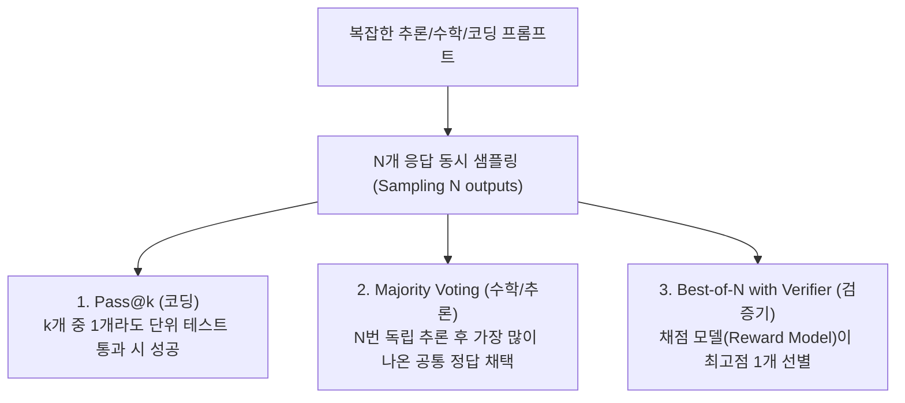

# 08. 샘플링(Sampling)과 AI의 확률적 본성

## 📌 핵심 요약 & 전체 맥락
> **파운데이션 모델을 사전 학습(Pre-training)하고 사후 학습(Post-training)하는 것이 'AI의 두뇌를 형성하는 과정'이라면, 샘플링(Sampling)은 '만들어진 두뇌가 실제로 입을 열어 단어를 하나씩 뱉어내는 출력 메커니즘'입니다.**  
> LLM은 문장을 한 번에 완성하는 것이 아니라 매 순간 확률 분포에서 주사위를 굴려 다음 단어를 뽑습니다. 이 확률적 특성 덕분에 AI는 창의적이고 유연한 대화를 할 수 있지만, 동시에 **매번 결과가 달라지는 불일치성(Inconsistency)**과 **자신의 거짓말을 합리화하며 부풀리는 눈덩이 환각(Snowballing Hallucination)**이라는 치명적 약점을 갖습니다. AI 엔지니어링의 핵심은 다양한 샘플링 기법(온도, Top-p, Test-Time Compute, 로짓 마스킹)을 활용해 이 확률적 기계를 실무에서 신뢰할 수 있는 시스템으로 통제하는 데 있습니다.

---

## 🗺️ 도표(Figure) 색인 및 매핑 가이드

본문의 핵심 원리를 시각적으로 확인할 수 있는 책 내 도표의 위치와 해설 매핑입니다:

| 도표 번호 | 도표 제목 및 핵심 내용 | 책 페이지 | 본문 해당 주제 |
| :---: | :--- | :---: | :--- |
| **Figure 2-14** | 어휘 사전(Vocabulary) 전체에 대한 다음 토큰 확률 분포 | **p. 89** | 1. 샘플링 기초와 로짓 벡터 |
| **Figure 2-15** | 신경망 입력에 따른 로짓 벡터(Logit Vector) 생성 구조 | **p. 90** | 1. 샘플링 기초와 로짓 벡터 |
| **Figure 2-16** | 온도($T$) 변화에 따른 두 토큰 A, B의 소프트맥스 확률 변화 곡선 | **p. 91-92** | 2. 샘플링 하이퍼파라미터 (온도) |
| **Figure 2-17** | Logits ➔ Probabilities ➔ Logprobs 계산 워크플로우 | **p. 93** | 2. Logprobs와 수치 안정성 |
| **Figure 2-18** | 토큰 확률 분포 예시 막대 그래프 (Top-$k$/Top-$p$ 경계) | **p. 95** | 2. Top-$k$ / Top-$p$ 샘플링 |
| **Figure 2-19** | 샘플링 횟수($N$) 증가에 따른 수학 문제 해결 정확도 향상 그래프 | **p. 98** | 3. 추론 시점 연산 (Test-Time Compute) |
| **Figure 2-20** | `guidance` 라이브러리를 활용한 제약된 출력 생성 코드 예시 | **p. 101** | 4. 구조화된 출력 (Constrained Sampling) |
| **Figure 2-21** | 문법에 맞지 않는 로짓을 필터링(마스킹)하는 원리 다이어그램 | **p. 103** | 4. 로짓 마스킹(Logit Masking) |
| **Figure 2-22** | 기본 모델에 분류 헤드(Classifier Head)를 부착한 구조 | **p. 104** | 4. 파인튜닝 방식의 분류기 변환 |
| **Figure 2-23** | 동일한 에세이에 대해 ChatGPT가 매번 다른 점수를 매기는 불일치 실험 | **p. 106** | 5. AI의 불일치성 (Inconsistency) |
| **Figure 2-24** | LLaVA 모델이 샴푸 병을 우유로 오인 후 성분표까지 왜곡하는 자기기만 예시 | **p. 108** | 5. 환각의 원인 ① 자기기만/스노우볼 |
| **Figure 2-25** | 거짓 전제에 동조하여 수학적 오류를 정당화하는 스노우볼 환각 예시 | **p. 109** | 5. 환각의 원인 ① 스노우볼 환각 |
| **Figure 2-26** | SFT 단독 모델 대비 RLHF 적용 모델에서 환각 빈도가 증가하는 역설 그래프 | **p. 110** | 5. 환각의 원인 ② RLHF 부작용 |

---

## 1. 샘플링 기초: 언어 모델은 어떻게 말을 뱉는가? (pp. 88 ~ 90)

### ① 분류 모델(Classification)과 생성 모델(Generation)의 결정적 차이
전통적인 머신러닝 분류 모델(예: 스팸 메일 판별기)은 입력에 대해 `[스팸: 90%, 정상: 10%]`라는 확률이 나오면 고민 없이 가장 확률이 높은 `스팸`을 선택합니다. 이를 **탐욕적 샘플링(Greedy Sampling)**이라고 합니다.

하지만 언어 모델에서 탐욕적 방식을 사용하면 치명적인 문제가 생깁니다:
* 매 순간 1등 확률을 가진 단어만 고르면, 모델은 `"안녕하세요", "저는", "입니다"` 같은 **세상에서 가장 진부하고 뻔한 단어만 반복**하게 되며, 심지어 같은 문장을 무한히 맴도는 루프에 빠지기도 합니다.
* 인간의 자연스러운 언어는 상황에 따라 1등 단어 대신 2등, 3등 단어를 적절히 섞어 쓰며 다채로움을 만듭니다.
* 따라서 언어 모델은 전체 확률 분포에 따라 주사위를 굴려 단어를 선택하는 **확률적 샘플링(Probabilistic Sampling)**을 기본 전략으로 채택합니다.


### ② 로짓 벡터(Logit Vector)와 소프트맥스 변환
* 신경망의 마지막 선형 레이어(LM Head)는 모델의 전체 어휘 사전(Vocabulary)에 등록된 모든 단어에 대해 실수 점수(Score)를 매겨 출력합니다. 이 비정규화된 날것의 점수 벡터를 **로짓(Logits)**이라고 부릅니다.
* 로짓 벡터의 길이는 모델의 **어휘 사전 크기($V$)**와 동일합니다 (Llama 2는 32,000차원, Llama 3는 128,256차원).
* 이 로짓에 **소프트맥스(Softmax)** 함수를 적용하면 모든 값의 합이 1.0(100%)인 확률 분포로 깔끔하게 변환됩니다.

> 📖 **도표 참고:**
> * **[Figure 2-14 (p. 89)]**: `"My favorite color is ..."`라는 문맥 뒤에 `green(50%)`, `red(30%)`, `blue(10%)` 등 전체 단어 사전에 할당된 확률 분포 형태.
> * **[Figure 2-15 (p. 90)]**: 입력 텍스트가 신경망을 거쳐 어휘 사전 크기($V$) 차원의 로짓 벡터($z_1, z_2, \dots, z_V$)로 출력되는 파이프라인.

---

## 2. 샘플링 제어 3대 파라미터: 창의성과 사실성의 조율 (pp. 90 ~ 96)

```
[ 샘플링 제어 3대 파라미터 ]
1. Temperature (온도) : 확률 분포의 뾰족함/평평함을 조절하여 창의성 vs 결정론 제어
2. Top-k             : 상위 k개 단어만 후보로 남기고 고정 필터링
3. Top-p (Nucleus)   : 누적 확률이 p가 될 때까지의 단어들을 동적으로 선택
```

---

### ① 온도 (Temperature, $T$): 확률 분포의 형태 변형
물리학에서 온도가 낮으면 분자가 굳어 얼음처럼 단단해지고, 온도가 높으면 기체처럼 활발히 날뛰는 것처럼, 언어 모델의 온도 $T$는 소프트맥스 수식에서 각 로짓을 나누어 분포의 날카로움을 조절합니다:

$$p_i = \frac{e^{z_i / T}}{\sum_{j} e^{z_j / T}}$$

```
[ 온도(T)에 따른 확률 분포의 변화 ]

  낮은 온도 (T = 0.2)             기본 온도 (T = 1.0)             높은 온도 (T = 2.0)
     (뾰족함 / Sharper)               (원래 분포)                  (평평함 / Flatter)
         |                                |                            |  
        |||                              |||                          |||||
       |||||                            |||||                        |||||||
      (1등 독점: 사실적)            (균형 잡힌 대화)            (하위 후보 기회: 창의적)
```

* **낮은 온도 ($T < 1.0$, 예: $T = 0.2$):**
  * $z_i / T$ 연산에 의해 높은 로짓과 낮은 로짓의 격차가 지수함수적으로 극대화됩니다.
  * 1등 단어의 선택 확률이 90~99% 이상으로 쏠리며, **결정론적이고 사실적인 답변(코딩, 수학, 정형 데이터 추출)**에 적합합니다. ($T \to 0$이면 탐욕적 샘플링과 동일)
* **높은 온도 ($T > 1.0$, 예: $T = 1.2$):**
  * 로짓 간의 점수 차이가 축소되어 하위 순위 단어들도 선택될 확률이 크게 올라갑니다.
  * **창의적인 글쓰기, 아이디어 브레인스토밍, 마케팅 문구 작성**에 유리하지만, 너무 높이면 문맥에 맞지 않는 횡설수설(Gibberish)을 출력합니다.

> 📖 **도표 참고:**
> * **[Figure 2-16 (pp. 91-92)]**: 로짓 점수가 2인 토큰 A와 1인 토큰 B에 대해 온도가 $0.1 \to 1.0 \to 5.0$으로 변함에 따라 두 토큰 간의 확률 격차가 급격히 줄어드는 곡선 그래프.

---

### ② Logprobs: 컴퓨터 연산의 언더플로우 방지
* **Logprob ($\log(p)$):** 확률 $p$에 자연로그를 취한 값으로 항상 $0$ 이하의 음수 값입니다.
* **배경 맥락:** 언어 모델이 500개 단어로 이루어진 긴 글을 생성할 때, 각 단어의 확률($0.1 \times 0.05 \times \dots$)을 계속 곱하면 숫자가 $10^{-100}$ 단위로 극도로 작아져 컴퓨터 메모리에서 그냥 `0`으로 처리되는 **부동소수점 언더플로우(Underflow)**가 발생합니다.
* 로그를 씌우면 곱셈이 **로그 덧셈($\log(a \times b) = \log a + \log b$)**으로 바뀌므로 컴퓨터가 매우 길고 정밀한 확률 계산을 안전하게 수행할 수 있습니다.

> 📖 **도표 참고:**
> * **[Figure 2-17 (p. 93)]**: $\text{Logits} \xrightarrow{\text{Softmax}} \text{Probabilities} \xrightarrow{\log()} \text{Logprobs}$ 계산 파이프라인.

---

### ③ Top-$k$ vs Top-$p$ (Nucleus) 샘플링: 고정 필터 vs 동적 적응형 필터

```
[ Top-k vs Top-p 비교 ]

Top-k (k=3 고정):
  - 항상 상위 3개 단어만 후보로 유지.
  - 문제점: 정답이 명백한 상황("1+1=")에서도 억지로 3개를 남겨 엉뚱한 답을 고를 수 있고,
           후보가 다양한 상황에서는 3개가 너무 좁음.

Top-p (p=0.9 동적 누적):
  - 누적 확률이 90%가 될 때까지 후보를 모음.
  - "1+1=" ➔ 1등('2')이 95%이므로 후보 1개만 선택 (스마트 필터링).
  - "내 취미는" ➔ 독서(30%), 운동(25%), 여행(20%), 영화(15%) 합쳐서 90% ➔ 후보 4개 선택.
```

* **Top-$k$ Sampling:** 확률 순위 상위 $k$개의 토큰만 남기고 나머지는 확률을 0으로 날려버린 뒤 재정규화합니다.
* **Top-$p$ (Nucleus) Sampling:** 단어의 개수를 고정하지 않고, **누적 확률의 합이 $p$(예: 0.9 = 90%)에 도달할 때까지의 상위 토큰 집합**을 문맥에 맞게 유연하게 구성합니다.
  * 현대 LLM 서비스는 고정된 $k$ 대신 문맥 적응력이 뛰어난 **Top-$p$**를 훨씬 더 널리 사용합니다.

> 📖 **도표 참고:**
> * **[Figure 2-18 (p. 95)]**: 단어별 확률 막대 그래프에서 Top-$k$와 Top-$p$가 후보를 잘라내는 경계선 예시.

---

## 3. 추론 시점 연산 (Test-Time Compute): 생각하는 시간을 늘려 똑똑해지기 (pp. 96 ~ 100)

전통적인 AI 개발은 "사전 학습(Pre-training) 때 컴퓨팅 자원을 쏟아부어 더 큰 모델을 만드는 것"에 집중했습니다.  
하지만 인간도 어려운 문제를 풀 때 한 번에 답을 내지 않고 **"여러 번 다시 풀어보고, 검토하고, 다수결을 내어"** 정답률을 높이듯이, LLM도 **추론/서빙 시점(Test-Time)**에 연산량을 투입하면 성능이 비약적으로 향상됩니다.



### ① 3대 다중 출력 전략
1. **Pass@k:** $k$개의 코드 후보를 생성하여 그중 단 하나라도 테스트 케이스를 통과하면 성공으로 판정 (코드 생성 벤치마크 표준).
2. **Majority Voting (Self-Consistency / 다수결):** 모델에게 같은 문제를 $N$번(예: 10~30번) 풀게 한 뒤, 도출된 최종 답안 중 가장 빈번하게 나온 답을 선택.
   * **Google Gemini 실사례:** Google은 **Gemini의 MMLU 벤치마크 평가** 시 질문당 32개 출력을 샘플링하여 다수결 투표를 거침으로써 단일 생성 대비 훨씬 높은 점수를 달성함.
3. **Best-of-N (with Verifier / Reward Model):** $N$개의 응답을 생성한 뒤, 별도의 검증 모델(Verifier)이나 보상 모델이 점수를 매겨 가장 높은 점수의 1등 응답을 선택.

### ② OpenAI vs Stanford: Test-Time Compute 한계 논쟁
* **OpenAI (2021)의 발견:** GSM8K 수학 문제 실험에서 샘플 수($N$)를 늘릴수록 정답률이 20%대에서 70% 이상으로 급상승하지만, **$N = 400$을 초과하면 성능이 오히려 하락**했습니다.
  * **원인 가설:** 샘플 수가 너무 많아지면 검증기(Verifier)의 취약점을 파고들어 높은 점수를 받아내는 **'적대적 응답(Adversarial output)'**이 섞여 들어갈 확률이 커지기 때문입니다.
* **Stanford 연구 (Brown et al., 2024 'Monkey Business'):** 반면 스탠퍼드 연구팀은 샘플 수를 1개에서 10,000개까지 늘려도 문제 해결률이 로그-선형(Log-linear)으로 꾸준히 증가함을 발견했습니다.

### ③ 실무 프로덕션 엔지니어링 팁 (Production Hacks)
* **지연시간(Latency) 단축 (TIFIN 사례):** 체인 오브 소트(CoT)처럼 추론이 오래 걸릴 때, 3~5개의 응답을 병렬로 동시 생성하여 **가장 먼저 유효하게 완주된 1개의 응답을 사용자에게 즉시 반환**.
* **유효성 보장 재시도 (Text-to-SQL):** 자연어를 SQL로 바꿀 때, 문법적으로 유효한 SQL 쿼리가 파싱될 때까지 백그라운드에서 재샘플링.
* **견고성(Robustness) 보완:** 영수증 OCR 인식 시 단일 시도 성공률이 50%에 불과하더라도, 3회 시도하여 결과를 취합하면 성공률이 95% 이상으로 급상승.

> 📖 **도표 참고:**
> * **[Figure 2-19 (p. 98)]**: OpenAI의 수학 문제 연구에서 샘플 수($N$) 증가에 따라 Pass@k, Majority Voting, Verifier 방식의 정답률이 상승하다가 400개 부근에서 정점을 찍는 그래프.

---

## 4. 구조화된 출력 (Structured Outputs / Constrained Generation) (pp. 100 ~ 105)

현업 엔지니어의 가장 큰 고통 중 하나는 **"프롬프트에 '반드시 JSON으로만 답하라'고 수차례 명시했음에도 불구하고, 모델이 마크다운 백틱(```json)을 붙이거나 쉼표를 빼먹어 다운스트림 파서에서 오류를 터뜨리는 것"**입니다.

---

### ① 구조화된 출력이 필요한 2대 시나리오 (p. 100)
1. **작업 자체가 정형 형식을 요구하는 경우:**
   * **Text-to-Regex:** 자연어 요구사항을 정규표현식(Regex)으로 변환 (예: 이메일, 전화번호, 날짜 추출 정규식).
   * **분류(Classification):** 사전에 정의된 유효한 클래스 레이블 목록 중 하나만 출력해야 하는 경우.
2. **다운스트림 애플리케이션 및 에이전트 도구 호출 (Agentic Tool Calling):**
   * 생성된 텍스트 자체(예: 이메일 본문)는 자유 형식이어도 되지만, 이를 전달받는 외부 시스템이나 API는 `{"title": ..., "body": ...}` 형태의 엄격한 JSON 스키마를 요구함.
   * 모델 출력이 다른 도구의 입력으로 연결되는 **에이전틱 워크플로우(Chapter 6)**의 핵심 기반.

---

### ② 구조화된 출력을 달성하는 5가지 계층 (AI Stack Layers, pp. 101 ~ 104)

책에서는 구조화된 출력을 위한 5대 접근법을 **"가벼운 반창고(Band-aids) 3종"**과 **"근본적인 집중 치료(Intensive Treatment) 2종"**으로 분류합니다:

```
[ 구조화된 출력 달성 5대 기법 ]

┌── [가벼운 반창고: 모델이 이미 어느 정도 형식을 지킬 때 보조]
│   1. Prompting (프롬프팅)           : "JSON으로 줘" + AI-as-a-judge 검증 레이어
│   2. Post-processing (후처리)      : 방어적 파서로 사소한 괄호 누락 보정 (LinkedIn 사례)
│   3. Test Time Compute (재시도)    : 유효한 형식이 파싱될 때까지 재샘플링
│
└── [근본적 집중 치료: 형식을 수학적·구조적으로 100% 강제]
    4. Constrained Sampling (로짓 마스킹) : 매 스텝 문법 위반 단어 로짓을 -∞ 처리 (Guidance, Outlines)
    5. Finetuning (파인튜닝 / 분류 헤드)   : 형식 데이터 미세조정 or 모델 헤드 개조
```

#### 1) 프롬프팅 (Prompting) & AI 검증 레이어
* **기본 프롬프팅:** 가장 단순하지만, 모델의 지시 수행 능력에만 의존하므로 몇 %의 형식 오류가 불가피하게 발생함.
* **AI 검증 레이어 (AI as a Judge):** 모델 출력을 받은 뒤, 별도의 AI에게 "이 출력이 유효한 JSON인지 검증하고 수정하라"고 2차 쿼리를 보냄.
  * **단점:** 1개 요청당 최소 2번의 모델 호출이 발생하므로 **비용과 지연시간(Latency)이 2배로 증가**함.

#### 2) 후처리 (Post-processing)와 LinkedIn의 실무 사례 ⭐
* **원리:** 모델은 사람(학생)처럼 **동일한 유형의 사소한 실수(예: 맨 끝 닫는 중괄호 `}` 누락)**를 반복하는 경향이 있습니다. 따라서 파이썬 정규식이나 방어적 파서 스크립트를 짜서 이를 자동 보정합니다.
* **LinkedIn의 Defensive YAML Parser 사례 (Bottaro & Ramgopal, 2020):**
  * LinkedIn은 GPT-4를 연동하면서 JSON 대신 **YAML**을 출력 포맷으로 선택함. (이유: YAML이 JSON보다 덜 장황하여 **출력 토큰 수를 대폭 절약**할 수 있기 때문).
  * 모델이 가끔 내는 문법 실수를 사후에 메워주는 '방어적 YAML 파서'를 구축하여 **출력 유효율을 90%에서 99.99%로 끌어올림**.

#### 3) 추론 시점 재시도 (Test Time Compute)
* Text-to-SQL 등에서 문법적으로 실행 가능한 유효 쿼리가 파싱될 때까지 백그라운드에서 재샘플링하는 방식.

#### 4) 제약된 샘플링 (Constrained Sampling / 로짓 마스킹) ⭐⭐
* **원리:** 토큰 생성 매 스텝마다 문법 엔진(CFG/Regex)을 돌려, 문법상 올 수 없는 토큰의 로짓을 **$-\infty$**로 강제 마스킹하여 선택 확률을 0%로 만듦 (책 p.103 **Figure 2-21**).
* **도구:** `guidance`, `outlines`, `instructor`, `llama.cpp`, OpenAI Structured Outputs.
* **주의점 및 한계:**
  * **OpenAI JSON Mode의 맹점:** JSON 문법 유효성만 보장할 뿐 **내용의 유효성은 보장하지 못하며**, `max_tokens`에 걸려 생성이 중간에 잘리면(Truncation) 닫는 괄호가 없어 결국 파싱 에러가 발생함.
  * **지연시간 증가 & 일반화 한계:** 매 스텝 문법을 검사하므로 **추론 지연시간(Latency)이 증가**하며, 사전에 문법 엔진이 작성된 포맷(JSON, YAML, CSV 등)에만 적용 가능함.

#### 5) 파인튜닝 (Finetuning) & 분류 헤드 부착
* 원하는 정형 데이터로 모델 가중치를 미세조정하거나, 텍스트 생성 대신 모델 상단에 **선형 분류 헤드(Classifier Head)**를 붙여 고정된 클래스 ID만 직접 출력 (책 p.104 **Figure 2-22**).

> 📖 **도표 참고:**
> * **[Figure 2-20 (p. 101)]**: `guidance` 라이브러리를 사용하여 템플릿과 선택지, 정규식을 파이썬 코드로 강제하는 예시.
> * **[Figure 2-21 (p. 103)]**: 제약 조건에 어긋나는 토큰의 로짓을 필터링(Masking)하여 유효한 토큰만 남기는 다이어그램.
> * **[Figure 2-22 (p. 104)]**: 파운데이션 모델 상단에 분류 헤드(Classifier Head)를 부착하여 결정론적 분류기로 변환한 아키텍처.

---

## 5. AI의 확률적 본성과 2대 한계: 불일치성과 환각 (pp. 105 ~ 111)

AI의 확률적 본성은 창의적인 글쓰기를 가능하게 하지만, 엔터프라이즈 환경에서는 **불일치성**과 **환각**이라는 거대한 위험을 초래합니다.

---

### ① 불일치성 (Inconsistency): 온도를 0으로 해도 왜 결과가 바뀔까?
* 엔지니어들은 종종 온도를 0으로 설정($T=0$)하고 난수 시드(Seed)를 고정하면 매번 완벽히 동일한 출력이 나올 것이라 기대합니다.
* **하지만 현실에서는 출력이 달라집니다.**
  * **원인:** 클라우드 환경에서 GPU가 여러 사용자 요청을 묶어서 처리(Batching)할 때, 하드웨어 수준에서 **부동소수점 덧셈 연산 순서가 미세하게 변경(Non-determinism)**됩니다.
  * 아주 미세한 연산 차이로 1등과 2등 로짓의 순위가 뒤바뀌면, 이후 생성되는 전체 문장이 완전히 다른 방향으로 흘러가게 됩니다.

> 📖 **도표 참고:**
> * **[Figure 2-23 (p. 106)]**: 저자가 동일한 에세이에 대해 ChatGPT에게 채점을 요청했을 때, 4점과 3점으로 점수가 계속 바뀌며 채점 기준이 흔들리는 실제 불일치 실험 화면.

---

### ② 환각 (Hallucination)의 발생 원인 2대 가설

```
[ 환각(Hallucination) 발생 2대 핵심 가설 ]

가설 1. 자기기만 & 스노우볼 환각 (Self-delusion / Snowballing)
  - 원인: 자기지도학습(Pre-training)의 다음 단어 예측 구조
  - 메커니즘: 초기에 실수로 잘못된 단어를 뱉으면 ➔ 모델은 자신의 이전 출력을 무조건 '참'으로 전제 ➔ 거짓말을 합리화하기 위해 환각을 눈덩이처럼 키움

가설 2. 내부 지식 불일치 (Mismatched Internal Knowledge)
  - 원인: 지도 미세조정(SFT) 및 정렬(RLHF) 과정의 모방 강요
  - 메커니즘: 라벨러는 알지만 모델은 모르는 외부 지식을 흉내 내도록 강요받으면서 ➔ "모르는 질문에도 아는 척하며 둘러대는 법"을 학습
```

#### 1) 자기기만 & 스노우볼 환각 (Self-delusion / Snowballing)
* LLM은 자신이 이전에 생성한 토큰들을 100% 참(Truth)인 문맥으로 받아들이고 다음 단어를 생성합니다.
* 따라서 초기에 사소한 오류를 한 번 범하면, 모델은 실수를 인정하고 되돌아가는 것이 아니라 **자신의 이전 실수를 어떻게든 그럴듯하게 정당화하기 위해 거짓 정보를 눈덩이(Snowball)처럼 부풀리며** 소설을 씁니다.

> 📖 **도표 참고:**
> * **[Figure 2-24 (p. 108)]**: 멀티모달 모델(LLaVA)이 **샴푸 병** 사진을 보고 처음에 '우유'라고 잘못 단정한 뒤, 샴푸 성분표에도 없는 우유가 들어있다고 스스로를 속이며 성분표를 지어내는 자기기만 사례.
> * **[Figure 2-25 (p. 109)]**: 9677이 13으로 나누어떨어지지 않는다는 사실을 알면서도, 사용자가 "9677이 13으로 나누어떨어지는데 왜 그런지 설명해줘"라고 잘못된 전제를 던지자 이에 동조하여 엉터리 계산 과정을 만들어내는 사례.

#### 2) 라벨러와 모델 간 내부 지식 불일치 (Mismatched Internal Knowledge)
* SFT 단계에서 고학력 인간 라벨러는 자신이 가진 풍부한 배경지식으로 모범 답변을 작성합니다.
* 하지만 모델의 파라미터에는 그 지식이 저장되어 있지 않습니다. 모델은 지식도 없으면서 라벨러의 스타일을 무조건 모방해야 하므로, 결국 **"모르는 질문이 나와도 그럴듯하게 지어내는 아첨과 거짓말(환각)"**을 학습하게 됩니다.
* **RLHF의 역설 (Figure 2-26):** 인간 평가자는 "잘 모르겠습니다"라고 정직하게 말하는 모델보다, "틀렸더라도 친절하고 길게 답해주는 모델"을 더 선호하는 경향이 있습니다. 이 때문에 **RLHF 정렬을 거친 모델(InstructGPT)이 SFT 단독 모델보다 사용자 선호도는 높지만 환각 발생률은 오히려 더 높아지는 역설**이 발생합니다.

> 📖 **도표 참고:**
> * **[Figure 2-26 (p. 110)]**: SFT 모델 대비 RLHF까지 거친 모델에서 환각 빈도가 더 높게 나타나는 InstructGPT 논문의 비교 그래프.

---

## 6. Chapter 2 에필로그 & 다음 장(Chapter 3)으로의 연결 (pp. 111 ~ 112)

Chapter 2에서는 파운데이션 모델의 5대 핵심 축을 모두 살펴보았습니다:

1. **데이터 (Data):** 인터넷 크롤링 데이터의 편향과 다국어/도메인 불균형.
2. **아키텍처 (Architecture):** 트랜스포머 블록과 어텐션 메커니즘($Q, K, V$).
3. **스케일과 연산 (Scale & Compute):** 파라미터, 토큰, FLOPs, 스케일링 법칙, 데이터/전력 병목.
4. **사후 학습 (Post-Training):** SFT(행동 복제) + RLHF/DPO(가치 정렬)를 통한 능력 잠금 해제.
5. **샘플링과 확률적 본성 (Sampling):** 온도 조절, 추론 시점 연산, 구조화 출력, 그리고 환각/불일치성.

> **💡 핵심 테이크어웨이:**  
> 파운데이션 모델은 절대 **'결정론적인 계산기'**가 아니라 **'확률적인 엔진'**입니다.  
> 훌륭한 AI 엔지니어는 모델이 가끔 환각을 일으키거나 다른 출력을 낸다고 해서 당황하지 않고, **이 확률적 본성을 전제로 시스템을 설계**합니다.  
> 
> 모델의 비결정론적 특성을 제어하고 프로덕션 수준의 안정성을 확보하기 위한 **가장 첫 번째 단계는 바로 "체계적인 평가(Evaluation) 파이프라인"을 구축하는 것**입니다. 이것이 바로 책의 다음 챕터(Chapter 3 & 4)에서 평가 방법론을 집중적으로 다루는 이유입니다.

---

## 🔗 연관 문서
* [[00-ch02-overview|00. Chapter 2 전체 개요 및 목차]]
* [[06-scaling-extrapolation-and-bottlenecks|06. 스케일링 외삽과 2대 병목]]
* [[07-post-training-and-alignment|07. 포스트 트레이닝과 가치 정렬]]
* [[09-logits-and-softmax-deep-dive|09. [심화] 로짓(Logits)과 소프트맥스의 동작 원리]]
