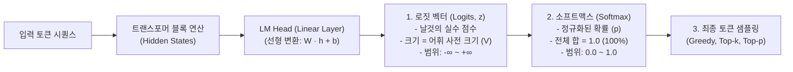

# 09. [심화] 로짓(Logits)과 소프트맥스(Softmax)의 동작 원리

## 📌 핵심 요약
> **로짓(Logits)은 신경망의 선형 레이어(LM Head)가 출력한 "소프트맥스(Softmax)를 거치기 직전의 날것의 점수(Raw Score)"입니다. 실수 전 구간($-\infty \sim +\infty$)을 갖는 비정규화 벡터이며, 온도(Temperature) 조절, 로짓 마스킹(구조화 출력 강제), Logprobs 계산 등 LLM 추론 제어의 핵심 인터페이스 역할을 합니다.**

---

## 1. 로짓(Logits)의 위치와 변환 흐름

언어 모델이 다음 토큰을 생성할 때 내부적으로 거치는 3단계 파이프라인입니다:



---

## 2. 구체적인 수치 예시로 이해하기

모델에게 `"내가 가장 좋아하는 과일은 [ ? ]"`라는 프롬프트를 입력했을 때, 단어 사전(Vocabulary)에 4개 단어만 있다고 가정한 경우의 계산 과정입니다:

| 단어 토큰 ($i$) | **로짓 값 ($z_i$)** <br>*(신경망의 날것의 점수)* | $e^{z_i}$ 계산 | **소프트맥스 후 확률 ($p_i$)** <br>*(수식: $\frac{e^{z_i}}{\sum e^{z_j}}$)* | 비고 |
| :--- | :---: | :---: | :---: | :--- |
| **사과 (apple)** | **`10.5`** | $e^{10.5} \approx 36315.5$ | **`78.5%`** (0.785) | 가장 유력한 후보 |
| **바나나 (banana)** | **`8.2`** | $e^{8.2} \approx 3640.9$ | **`18.2%`** (0.182) | 대안 후보 |
| **딸기 (strawberry)** | **`6.1`** | $e^{6.1} \approx 445.9$ | **`3.3%`** (0.033) | 낮은 확률 |
| **자동차 (car)** | **`-4.0`** | $e^{-4.0} \approx 0.018$ | **`0.0%`** (0.000...) | 문맥상 불가능 |
| **합계 (Sum)** | *정해지지 않음* | $\sum \approx 46247.3$ | **`100.0%`** (1.0) | 확률 공리 충족 |

* **로짓 벡터의 차원(길이):** 모델의 **어휘 사전 크기(Vocabulary Size, $V$)**와 정확히 일치합니다.
  * **Llama 2:** 32,000차원 로짓 벡터
  * **Llama 3:** 128,256차원 로짓 벡터
  * **GPT-4:** 약 100,000차원 수준

---

## 3. 왜 바로 확률을 내지 않고 '로짓'을 거칠까?

1. **신경망의 본질적 연산 구조:**
   * 신경망의 마지막 출력 레이어(LM Head)는 가중치 행렬 곱과 편향 덧셈($z = W \cdot h + b$)이라는 선형 연산입니다.
   * 이 연산의 결과는 자연스럽게 음수부터 양수까지 **임의의 실수 범위($-\infty \sim +\infty$)**를 갖게 됩니다.
2. **소프트맥스(Softmax)와의 분리 필요성:**
   * 로짓 상태로 유지해야 **온도(Temperature)**를 나누거나, 특정 토큰을 금지하는 **로짓 마스킹(Logit Masking)** 등의 조작을 수학적으로 자연스럽게 수행할 수 있습니다.

---

## 4. 통계학적 배경: 로짓(Logit)이라는 단어의 유래

* **통계학의 로짓 함수:** 확률 $p$에 대해 **로그 승산(Log-Odds)**을 계산하는 함수를 의미합니다.
$$\text{logit}(p) = \log\left(\frac{p}{1-p}\right)$$
* **딥러닝에서의 확장:** 
  * 로짓 함수 $\text{logit}(p)$의 역함수가 바로 **시그모이드(Sigmoid) / 소프트맥스(Softmax)** 함수입니다.
  * 따라서 딥러닝에서는 **"소프트맥스를 통과시키면 확률이 되는 입력값(Pre-activation / Pre-softmax value)"**을 관례적으로 **로짓(Logits)**이라고 부릅니다.

---

## 5. 엔지니어링 실무에서 로짓(Logits)의 3대 활용

```
[ AI 엔지니어링에서의 로짓 조작 ]

1. 온도 (Temperature) 조절 ──▶ 로짓을 T로 나누어 확률 분포의 날카로움 제어
2. 로짓 마스킹 (Masking)    ──▶ 특정 토큰의 로짓을 -∞로 덮어씌워 100% 선택 배제
3. Logprobs & 수치 안정성   ──▶ 부동소수점 언더플로우 방지 (Log-Sum-Exp)
```

### ① 온도(Temperature, $T$) 제어의 수학적 원리
소프트맥스 계산 전 로짓 $z_i$를 온도 $T$로 나눕니다:
$$p_i = \frac{e^{z_i / T}}{\sum_{j} e^{z_j / T}}$$

* **낮은 온도 ($T = 0.2$):** $z_i / T$ 값이 매우 커져 $10.5 / 0.2 = 52.5$, $8.2 / 0.2 = 41.0$이 됨. 지수함수 $e^{52.5}$가 $e^{41.0}$을 압도하여 **최고점 단어의 선택 확률이 99.9% 이상으로 집중 (결정론적 / 사실적 답변)**.
* **높은 온도 ($T = 2.0$):** $z_i / T$ 값이 작아져 점수 차이가 축소됨. **하위 후보 단어들의 선택 확률이 상승 (창의적 / 다양한 답변)**.

### ② 로짓 마스킹 (Constrained Sampling / JSON 강제 출력)
* JSON 형식, 정규표현식, 특정 문법(CFG)을 강제할 때 사용합니다.
* 다음 위치에 문법상 올 수 없는 모든 토큰의 로짓 값을 **$-\infty$ (또는 프로그래밍상 `-1e9`)**로 덮어씌웁니다.
* $e^{-\infty} = 0$이 되므로, 소프트맥스 통과 후 해당 토큰의 **선택 확률이 정확히 0%**가 되어 문법을 100% 준수하게 됩니다. (책 p.103 **Figure 2-21** 연계)

### ③ Logprobs와 수치적 안정성 (Log-Sum-Exp Trick)
* 수십~수백 개의 토큰 확률 $p_1, p_2, \dots, p_n$을 연속으로 곱하면 숫자가 $10^{-45}$ 등으로 작아져 컴퓨터 메모리에서 0으로 뭉개지는 **언더플로우(Underflow)**가 발생합니다.
* 따라서 로짓에서 직접 로그 확률을 계산하여 곱셈을 **로그 덧셈**으로 변환합니다:
$$\log(p_i) = z_i - \log\left(\sum_j e^{z_j}\right)$$

---

## 🔗 연관 문서
* [[00-ch02-overview|00. Chapter 2 전체 개요 및 목차]]
* [[04-transformer-block-architecture|04. 트랜스포머 블록 구조 (LM Head)]]
* [[08-sampling-and-probabilistic-nature|08. 샘플링과 AI의 확률적 본성]]
