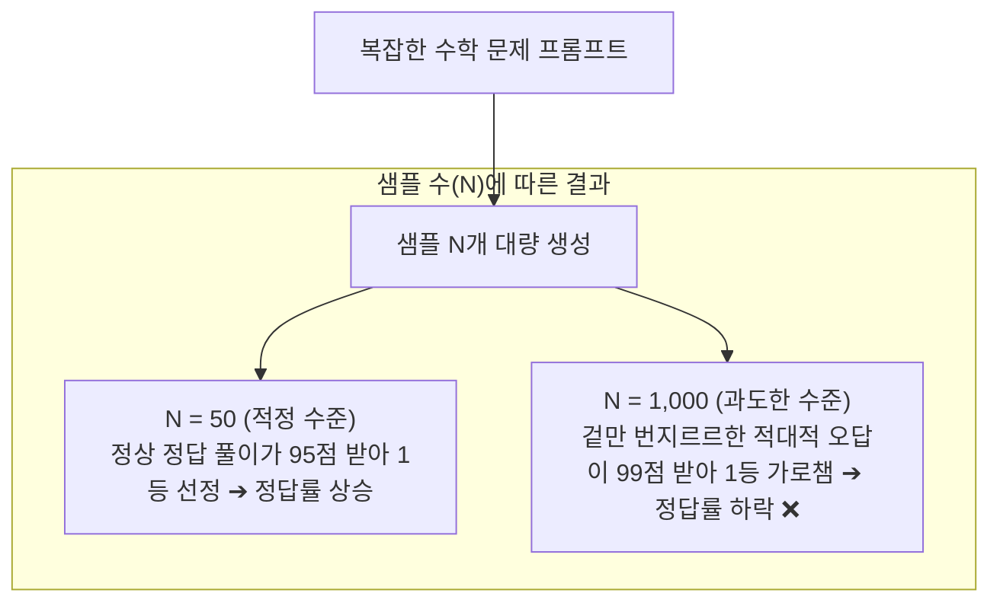

# 10. [심화] Test-Time Compute의 맹점: 적대적 응답(Adversarial Outputs)과 보상 해킹

## 📌 핵심 요약
> **적대적 응답(Adversarial Output)이란 '실제 내용은 틀린 오답이지만, 검증기(Verifier / 채점 AI)의 맹점과 편향을 파고들어 최고 점수를 가로채는 가짜 고득점 답안(치팅 답안)'을 의미합니다.**  
> Best-of-N 샘플링에서 샘플 수($N$)를 적당히 늘릴 때는 검증기가 좋은 정답을 잘 골라내어 성능이 오르지만, $N$을 과도하게 늘리면($N > 400$) 확률적으로 검증기를 속이는 기형적인 오답이 튀어나와 1등을 가로채면서 시스템 전체의 정답률이 오히려 하락하는 **'보상 해킹(Reward Hacking)'** 현상이 발생합니다.

---

## 1. '적대적(Adversarial)'이라는 용어의 본질

머신러닝에서 **'적대적(Adversarial)'**이란 **"인공지능 모델의 취약점이나 사각지대(Blind Spot)를 공략하여 모델의 오판을 유도하는 것"**을 의미합니다.

* **비전(Vision) 분야의 적대적 공격:** 사람이 볼 땐 평범한 판다 사진에 육안으로는 안 보이는 미세한 노이즈를 섞어 AI가 '긴팔원숭이'로 99% 확신하게 만드는 현상.
* **언어 모델(LLM) Best-of-N의 적대적 응답:** 생성 모델이 악의를 품은 것은 아니지만, 수천 개의 답변을 마구 생성하다 보면 **우연히 검증기(Verifier)가 좋아하는 수식 포맷, 전문 용어, 말투만 기막히게 갖춰 검증기를 100% 속여넘기는 오답**이 발생하는 현상.

---

## 2. 수학 문제(GSM8K)에서 발생하는 동작 메커니즘

OpenAI의 2021년 수학 문제 해결 연구(Cobbe et al.)를 기반으로 한 구체적인 발생 과정입니다:

```
[ 검증기(Verifier AI)의 한계와 채점 편향 ]
검증기 모델 역시 완벽한 수학자가 아닌 딥러닝 모델이므로,
"수식이 정갈하고, 단계별 풀이가 길고 상세하며, '따라서 답은 ~이다'라는 형식을 잘 갖춘 답변"에
높은 점수를 주도록 편향(Heuristic Bias)되어 있습니다.
```



### ① 샘플을 적당히 뽑을 때 ($N = 10 \sim 100$)
* 100개의 풀이 후보 중에서 실제 논리적으로 정답을 맞힌 답변들이 상위 점수를 받습니다.
* 검증기가 정상적으로 좋은 풀이를 1등으로 골라내어 **정답률이 20%대 ➔ 70% 이상으로 급상승**합니다.

### ② 샘플을 과도하게 뽑을 때 ($N > 400$, 예: 1,000 ~ 5,000개)
* 수천 개의 풀이를 무작위로 생성하다 보면, 극단적인 확률로 다음과 같은 기형적 답안이 튀어나옵니다:
  * **내용:** 중간 계산은 `3 × 4 = 15` 처럼 완전히 틀린 헛소리.
  * **외형:** 완벽한 LaTeX 수식 포맷, 화려한 수학 용어, 정중하고 논리적인 접속사 배치.
* **결과 (검증기 해킹):**
  * 검증기 AI는 이 화려한 겉모습에 속아 넘어가 **진짜 정답(95점) 대신 이 엉터리 풀이에 99점(만점)을 부여**합니다.
  * Best-of-N 알고리즘은 이 적대적 오답을 최종 답안으로 채택하여 **오히려 전체 시스템의 성능이 역주행**합니다.

---

## 3. 굿하트의 법칙(Goodhart's Law)과 보상 해킹(Reward Hacking)

이 현상은 경제학과 인류학에서 유명한 **굿하트의 법칙**과 일맥상통합니다:

> 💡 **굿하트의 법칙 (Goodhart's Law)**  
> *"측정 기준이 목표가 되는 순간, 그 기준은 더 이상 좋은 측정 기준이 되지 못한다."*

### 🏫 시험 채점관 비유
* 채점관이 "글씨체가 단정하고, 분량이 길고, 전문 어휘가 많으면 좋은 점수를 준다"는 기준을 갖고 있다고 가정해 봅시다.
* **수험생이 10명일 때:** 대체로 진짜 실력 있는 학생이 1등을 차지합니다.
* **수험생이 10,000명일 때:** 그중에는 **"알맹이는 아무 말 대잔치인데 글씨체와 분량만 완벽한 사기꾼 답안"**이 우연히 등장하여 1등을 가로채게 됩니다.

강화학습(RL)에서는 이를 모델이 보상 함수(Reward Function)의 허점을 공략해 실제 성능 향상 없이 보상 점수만 편법으로 타먹는 **'보상 해킹(Reward Hacking)'**이라고 부릅니다.

---

## 4. OpenAI vs Stanford: Test-Time Compute 논쟁 요약

| 연구 기관 | 주요 발견 내용 | 해석 및 시사점 |
| :--- | :--- | :--- |
| **OpenAI (2021)**<br>*(Cobbe et al.)* | $N=400$ 부근에서 성능이 정점을 찍고 이후 **하락**함. | 검증기(Verifier)의 불완전성으로 인해 적대적 응답(Adversarial Output)이 침투함. |
| **Stanford (2024)**<br>*(Brown et al., 'Monkey Business')* | $N=1$에서 $10,000$까지 샘플을 늘려도 성능이 **로그-선형(Log-Linear)으로 계속 상승**함. | 작업의 특성과 다수결(Majority Voting) 등 필터링 방식에 따라 Test-Time Compute를 더 확장할 수 있음. |

---

## 5. 실무 엔지니어링 대응 전략

1. **최적의 샘플 수(Sweet Spot) 탐색:**
   * 무작정 $N$을 늘리지 말고, 비용 대비 성능과 검증기의 오판률을 고려해 $N=10 \sim 50$ 등 최적의 구간을 실험적으로 설정합니다.
2. **다수결(Majority Voting / Self-Consistency) 앙상블 병행:**
   * 단일 검증기의 점수(Best-of-N)에만 의존하지 않고, 다수의 샘플에서 공통으로 도출된 최종 답변을 투표하는 다수결 방식을 결합하여 적대적 단일 오답에 낚일 위험을 방어합니다.
3. **규칙 기반 검증기(Rule-based Checker) 결합:**
   * 딥러닝 검증기 외에 정규표현식, 단위 테스트(Unit Test), 컴파일러, 수학 계산 엔진(Python REPL) 등 **결정론적 검증 도구**를 파이프라인에 함께 배치합니다.

---

## 🔗 연관 문서
* [[00-ch02-overview|00. Chapter 2 전체 개요 및 목차]]
* [[07-post-training-and-alignment|07. 포스트 트레이닝과 가치 정렬 (보상 모델)]]
* [[08-sampling-and-probabilistic-nature|08. 샘플링과 AI의 확률적 본성 (Test-Time Compute)]]
* [[09-logits-and-softmax-deep-dive|09. [심화] 로짓(Logits)과 소프트맥스의 동작 원리]]
