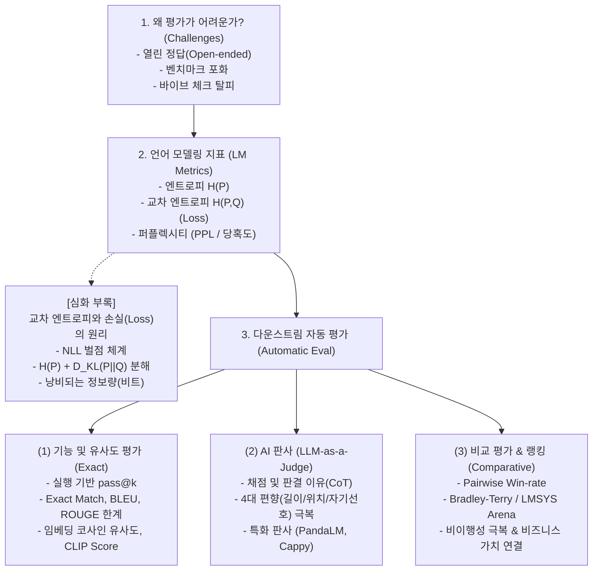

# Chapter 3: Evaluation Methodology (평가 방법론)

> **교재:** *AI Engineering: Building Applications with Foundation Models* (Chip Huyen 저)  
> **범위:** Chapter 3 (Evaluation Challenges, Language Modeling Metrics, Exact/Semantic Eval, LLM-as-a-Judge, Comparative Evaluation) (pp. 113–156)

---

## 🗺️ 개념 지도 및 목차

| 번호 | 문서명 | 핵심 주제 | 주요 키워드 |
| :---: | :--- | :--- | :--- |
| **01** | [[01-challenges-and-language-modeling-metrics\|01. 평가의 난제와 언어 모델링 지표 (PPL)]] | 생성형 AI 평가 5대 난제, 엔트로피/교차엔트로피, 퍼플렉시티(PPL)와 데이터 오염 탐지 (pp. 113-124) | `Vibe Check`, `Open-endedness`, `Entropy`, `Cross-Entropy`, `Perplexity`, `BPB`, `Contamination` |
| **02** | [[02-exact-and-semantic-evaluation\|02. 정확한 평가와 유사도 지표 (BLEU, ROUGE, 임베딩, CLIP)]] | 기능적 정확성(`pass@k`), 정답 일치(Exact Match), BLEU/ROUGE의 한계, 임베딩 코사인 유사도, 멀티모달 CLIP Score (pp. 125-136) | `Exact Match`, `pass@k`, `BLEU`, `ROUGE`, `Embedding`, `Cosine Similarity`, `BERTScore`, `CLIP Score` |
| **03** | [[03-ai-as-a-judge\|03. AI 판사 (LLM-as-a-Judge)와 4대 편향 및 전문 판사 모델]] | LLM-as-a-Judge 원리, 4대 편향(자기선호/길이/위치/샌드위치), 기준 모호성 극복, 특화 판사 모델 (Cappy, PandaLM) (pp. 136-148) | `LLM-as-a-Judge`, `Position Bias`, `Verbosity Bias`, `Self-Bias`, `PandaLM`, `Cappy`, `Rubric` |
| **04** | [[04-ranking-models-with-comparative-evaluation\|04. 비교 평가와 Elo/Bradley-Terry 랭킹 시스템]] | 쌍체 비교 평가, Elo Rating 수식, Bradley-Terry 모델, LMSYS Chatbot Arena 생태계, 비이행성(가위바위보 현상)과 ROI 괴리 (pp. 148-156) | `Comparative Evaluation`, `Elo Rating`, `Bradley-Terry`, `LMSYS Arena`, `Non-transitivity`, `ROI` |
| **05** | [[05-deep-dive-cross-entropy-loss-and-information-theory\|05. [심화] 교차 엔트로피와 손실(Loss)의 수학적·정보이론적 원리]] | 교차 엔트로피가 모델의 손실(Loss)인 3가지 이유, 음의 로그 우도(NLL) 벌점표, $H(P) + D_{KL}(P \parallel Q)$ 분해 증명, Bits vs Nats (pp. 118-121 부록) | `Cross-Entropy`, `Loss Function`, `KL Divergence`, `NLL`, `Entropy`, `Information Theory`, `Bits vs Nats` |

---

## 💡 한눈에 꿰뚫는 핵심 흐름

