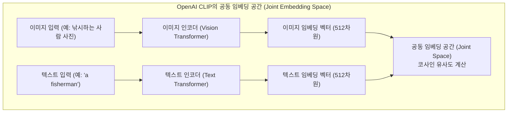

# 02. 정확한 평가(Exact)와 유사도 지표 (BLEU, ROUGE, 임베딩, CLIP)

## 📌 핵심 요약 & 전체 맥락
> **"생성형 AI의 평가에서 가장 강력하고 객관적인 지표는 '시스템이 본래 의도한 기능을 실제로 실행해 내는가(Functional Correctness)'입니다."**  
> 코딩의 유닛 테스트(`pass@k`)처럼 기능 실행이 불가능한 일반 텍스트의 경우, 전통적으로 정답지(Reference)와 비교하는 **완전 일치(Exact Match)**나 **어휘적 유사도(BLEU, ROUGE, METEOR, TER, CIDEr)**를 사용해 왔습니다. 그러나 이 지표들은 겉모습(단어 중첩)만 따져서 올바른 패러프레이징을 오답 처리하는 치명적 한계를 가집니다.  
> 이를 극복하기 위해 문맥과 의미를 숫자로 벡터화하는 **임베딩 기반 의미론적 유사도(BERTScore, MoverScore, 코사인 유사도)**와 텍스트-이미지를 하나의 공간에 묶는 **멀티모달 공동 임베딩(CLIP Score, ImageBind)**이 현대적 정량 평가의 핵심 기둥으로 자리 잡았습니다.

---

## 🗺️ 도표(Figure & Table) 색인 및 매핑 가이드

본문의 핵심 원리를 시각적으로 확인할 수 있는 책 내 도표의 위치와 해설 매핑입니다:

| 도표 번호 | 도표 제목 및 핵심 내용 | 책 페이지 | 본문 해당 주제 |
| :---: | :--- | :---: | :--- |
| **Figure 3-5** | Fuyu 모델이 올바른 캡션을 생성했음에도 정답지 누락으로 0점 처리된 사례 | **p. 131** | 2. 어휘적 유사도(BLEU/ROUGE)의 한계 |
| **Table 3-2** | 주요 모델별 임베딩 벡터 차원 크기 (BERT, CLIP, OpenAI, Cohere) | **p. 134** | 3. 임베딩(Embedding) 기초 |
| **Figure 3-6** | OpenAI CLIP의 텍스트-이미지 공동 임베딩 공간(Joint Space) 아키텍처 | **p. 135-136** | 4. 멀티모달 평가와 CLIP Score |

---

## 1. 기능적 정확성 (Functional Correctness): 실행 기반의 궁극적 평가 (pp. 125 ~ 127)

### ① 주관적 평가(Subjective) vs 정확한 평가(Exact) (p. 125)
* **주관적 평가 (Subjective):** 채점관의 성향이나 프롬프트에 따라 점수가 달라지는 평가 (예: 에세이 채점, LLM-as-a-Judge).
* **정확한 평가 (Exact):** 정답 여부가 수학적·기계적으로 모호함 없이 이진($0$ 또는 $1$)이나 결정론적 수치로 판정되는 평가.

---

### ② 언어 모델을 이용한 텍스트의 PPL 계산 수식 (p. 125 상단)
언어 모델 $X$와 토큰 시퀀스 $x_1, x_2, \dots, x_n$이 주어졌을 때, 텍스트에 대한 모델의 퍼플렉시티는 각 토큰의 조건부 확률의 기하평균 역수로 계산됩니다:
$$\text{PPL}(x_1, \dots, x_n) = P(x_1, \dots, x_n)^{-\frac{1}{n}} = \left( \prod_{i=1}^n P(x_i \mid x_1, \dots, x_{i-1}) \right)^{-\frac{1}{n}}$$
* 💡 **실무 요건:** 이 계산을 수행하려면 모델이 각 토큰에 부여하는 **로그 확률(Logprobs)**에 접근할 수 있어야 합니다.

---

### ③ 소프트웨어 공학의 지혜: 유닛 테스트와 `pass@k` (pp. 125 ~ 127)
생성형 모델의 출력을 평가하는 가장 이상적인 방법은 **"그 출력이 실제로 작동하는가?"**를 직접 실행해보는 것입니다.

* **코드 생성의 실행 정확도 (Execution Accuracy):**
  * 모델이 생성한 파이썬 함수에 실제 입력값 `gcd(15, 20)`을 넣고 인터프리터로 실행하여 결과가 `5`가 나오는지 `assert` 구문으로 검증합니다.
  * **표준 벤치마크:** OpenAI의 **HumanEval**, Google의 **MBPP** (Python 코드 검증), **Spider / BIRD-SQL / WikiSQL** (Text-to-SQL 쿼리 실행 검증).

```
[ HumanEval의 단위 테스트(Unit Test) 검증 방식 ]

1. 모델에게 문제 제시 : "리스트 내 숫자 중 threshold보다 가까운 쌍이 있는지 판별하는 has_close_elements 함수 작성"
2. 모델이 코드 생성   : def has_close_elements(...) 작성
3. 자동 검증기 실행   : check(candidate) 내부의 7개 assert 문을 모두 통과하는지 확인!
                       assert candidate([1.0, 2.0, 3.9, 4.0, 5.0, 2.2], 0.3) == True
                       assert candidate([1.0, 2.0, 3.9, 4.0, 5.0, 2.2], 0.05) == False
                       assert candidate([1.0, 2.0, 5.9, 4.0, 5.0], 0.95) == True
```

* **`pass@k` 메트릭의 동작 원리:**
  * 각 문제마다 모델에게 $k$개의 코드 후보를 생성하게 합니다.
  * 그중 **단 하나라도 모든 테스트 케이스를 통과하면 해당 문제를 해결한 것으로 판정**합니다.
  * 표본 수가 많을수록 성공 확률이 높아지므로 기대 점수는 $\text{pass@1} < \text{pass@3} < \text{pass@10}$ 순으로 증가합니다.

* **기타 측정 가능한 기능성 평가 태스크:**
  * **게임 봇 (Game Bots):** 테트리스 봇의 최종 게임 득점.
  * **자원 최적화:** AI가 작업 스케줄링을 통해 절감한 전력 소비량(kWh).
  * 💡 **각주 11 (부분 평가의 어려움):** 최종 승패(체스 경기 승/패)를 채점하는 것은 쉽지만, 진행 중인 단 하나의 수(Move)가 좋은지 나쁜지를 평가하는 것은 훨씬 어렵습니다.

---

## 2. 참조 데이터 기반 유사도 평가 (Reference-Based Metrics, pp. 127 ~ 132)

실행 불가능한 일반 텍스트(번역, 요약, 질의응답)의 경우, 정답지 `(input, reference responses)`와 모델의 출력을 비교하는 유사도 측정을 사용합니다.

```
[ 참조 데이터 기반 유사도 측정 3단계 발전사 ]

1. 완전 일치 (Exact Match)     : 정답 문장과 토씨 하나 안 틀리고 똑같은가? (단답형 전용)
2. 어휘적 유사도 (BLEU, ROUGE)  : 겹치는 단어(n-gram)와 편집 거리가 몇 %인가? (겉모양 비교)
3. 의미론적 유사도 (BERTScore)  : 단어는 달라도 내포된 의미와 맥락이 같은가? (임베딩 비교)
```

> 💡 **유사도(Similarity) 지표의 실무 5대 활용 분야 (p. 128):**  
> 1. **검색(Retrieval):** 쿼리와 가장 유사한 아이템 탐색  
> 2. **랭킹(Ranking):** 유사도 순으로 아이템 정렬  
> 3. **군집화(Clustering):** 서로 유사한 아이템끼리 그룹화  
> 4. **이상 탐지(Anomaly Detection):** 나머지 데이터와 가장 이질적인 이상치 식별  
> 5. **데이터 중복 제거(Deduplication):** 유사도가 너무 높은 중복 데이터 제거  

---

### ① 완전 일치 (Exact Match, EM, p. 129)
* **적용처:** `"2 + 3은?"`, `"노벨상을 수상한 최초의 여성은?"`, `"프랑스의 파리는 영국의 ___와 같다"`처럼 짧고 명확한 정답이 존재하는 퀴즈/상식 태스크.
* **부분 일치(Contains) 변형의 위험한 함정:**
  * 프롬프트: *"안네 프랑크가 태어난 연도는?"* (정답: 1929년 6월 12일)
  * 모델 출력: *"그녀는 1929년 9월 12일에 태어났습니다."*
  * `'1929'`라는 정답 문자열이 포함되어 있어 부분 일치 알고리즘은 정답으로 처리하지만, **실제로는 날짜가 완전히 틀린 거짓 정보**입니다.
* **오픈엔디드 태스크에서의 붕괴:**
  * 프랑스어 `"Comment ça va?"`를 번역할 때, 정답지에 `"How are you?"`, `"How is everything?"`만 등록되어 있다면, 모델이 완벽한 번역인 `"How is it going?"`을 내놓아도 **0점 오답 처리**됩니다.

---

### ② 어휘적 유사도 (Lexical Similarity, pp. 130 ~ 131)

#### 1) 퍼지 매칭과 편집 거리 (Edit Distance / Fuzzy Matching)
텍스트를 다른 텍스트로 변환하는 데 필요한 최소 편집 연산 횟수를 측정합니다:
* **삭제 (Deletion):** `"brad"` ➔ `"bad"` (1회)
* **삽입 (Insertion):** `"bad"` ➔ `"bard"` (1회)
* **치환 (Substitution):** `"bad"` ➔ `"bed"` (1회)
* **전위 (Transposition):** `"mats"` ➔ `"mast"` (1회의 전위 연산 또는 1회 삭제 + 1회 삽입으로 처리)
* *예시: `"bad"`는 `"bard"`와는 편집 거리 1이지만, `"cash"`와는 편집 거리 3입니다.*

#### 2) n-gram 중첩 메트릭 (BLEU, ROUGE, METEOR++, TER, CIDEr)
* **1-gram (Unigram):** 단일 단어 (`"my"`, `"cats"`).
* **2-gram (Bigram):** 두 단어 조합 (`"my cats"`, `"cats scare"`).
* **주요 지표:**
  * **BLEU:** 기계 번역 표준 (정밀도 Precision 중심).
  * **ROUGE:** 문서 요약 표준 (재현율 Recall 중심).
  * **METEOR++, TER (Translation Edit Rate), CIDEr (이미지 캡셔닝 전용):** WMT, COCO Captions, GEMv2 등에서 활용.

#### ⚠️ 어휘적 유사도의 2대 치명적 결함
1. **정답지 누락으로 인한 억울한 오답 (Figure 3-5):**
   * Adept 사의 멀티모달 모델 **Fuyu**는 이미지 캡셔닝 태스크에서 사진을 보고 완벽하게 올바른 설명을 생성했으나, 벤치마크 정답지 목록에 해당 표현이 없다는 이유로 **0점을 받는 왜곡**이 발생했습니다.
   * WMT 2023 번역 벤치마크 주최 측 조사 결과, **인간이 만든 정답지 자체에 오역과 오류가 수두룩하게 발견**되었습니다.
2. **기능적 유효성과의 괴리 (HumanEval 실험):**
   * OpenAI의 연구에 따르면, 코딩 문제에서 **테스트를 통과한 정답 코드와 문법 에러가 난 오답 코드의 BLEU 점수가 거의 똑같이** 나왔습니다 (Chen et al., 2021). 단어 중첩률은 실제 코드 동작 여부와 아무런 상관이 없습니다.

> 📖 **도표 참고:**
> * **[Figure 3-5 (p. 131)]**: Fuyu 모델이 실제 사진 내용을 정확하게 묘사했음에도 불구하고, 참조 캡션(Ground Truth)의 한계로 인해 부당하게 낮은 점수를 받은 실제 실패 사례.

---

## 3. 의미론적 유사도 (Semantic Textual Similarity, pp. 132 ~ 135)

어휘적 유사도는 글자의 겉모양만 볼 뿐 **단어의 '의미(Semantics)'**를 이해하지 못합니다.

```
[ 어휘적 유사도 vs 의미론적 유사도의 역설 ]

• "What's up?" vs "How are you?"
  ➔ 어휘 유사도: 0% (겹치는 글자 없음)  |  의미 유사도: 99% (동일한 인사)

• "Let's eat, grandma (할머니, 식사해요)" vs "Let's eat grandma (할머니를 잡아먹자)"
  ➔ 어휘 유사도: 95% (쉼표 하나 차이)    |  의미 유사도: -99% (완전히 다른 뜻)
```

---

### ① 임베딩(Embedding)과 코사인 유사도 (Cosine Similarity)
* **임베딩(Embedding)이란?**  
  컴퓨터가 텍스트의 '의미'를 계산할 수 있도록, 복잡한 원본 데이터를 $100 \sim 10,000$ 차원의 **저차원 실수 벡터 공간(Vector Space)**으로 투영한 좌표값입니다 (각주 13).
  * *고전 단어 임베딩(Word2Vec, GloVe - 각주 14) ➔ 현대 문맥/문서 임베딩(BERT, Sentence Transformers)*
* **코사인 유사도 (Cosine Similarity) 수식 (p. 133):**
  두 텍스트의 임베딩 벡터를 $A, B$라고 할 때, 두 벡터의 내적을 각각의 유클리드 노름($L_2$ norm)의 곱으로 나눕니다:
$$\text{Cosine Similarity}(A, B) = \frac{A \cdot B}{\|A\| \|B\|} = \frac{\sum_{i} A_i B_i}{\sqrt{\sum A_i^2} \sqrt{\sum B_i^2}}$$
  * *만약 $A = [0.11, 0.02, 0.54]$라면 $\|A\| = \sqrt{0.11^2 + 0.02^2 + 0.54^2}$ 입니다.*
  * **$+1.0$:** 의미가 완벽히 일치하는 두 문장
  * **$0.0$:** 아무런 상관관계가 없는 독립적인 두 문장
  * **$-1.0$:** 정반대의 의미를 갖는 두 문장

* **대표 메트릭:**
  * **BERTScore:** BERT 임베딩을 이용해 생성 문장과 정답 문장 토큰 간의 코사인 유사도 매칭을 수행.
  * **MoverScore:** 여러 알고리즘을 결합하여 두 문장 간의 단어 이동 거리를 계산.
  * **MTEB (Massive Text Embedding Benchmark):** 임베딩 모델의 성능을 다각도로 평가하는 글로벌 표준 벤치마크.

---

### ② 주요 임베딩 모델 스펙 비교 (Table 3-2)

| 모델 제공자 | 모델명 | 임베딩 벡터 차원 수 (Embedding Size) | 특징 |
| :--- | :--- | :---: | :--- |
| **Google** | BERT Base / Large | 768 / 1024 | 문맥 기반 텍스트 임베딩의 시초 |
| **OpenAI** | CLIP (Text & Image) | 512 | 텍스트와 이미지를 동일 차원으로 투영 |
| **OpenAI** | `text-embedding-3-small` <br> `text-embedding-3-large` | **1536** <br> **3072** | 현대 RAG 및 검색 시스템의 표준 API |
| **Cohere** | `embed-english-v3.0` <br> `embed-english-light-3.0` | 1024 <br> 384 | 검색 및 랭킹에 특화된 고성능 임베딩 |

* 💡 **비텍스트 도메인의 임베딩 활용 사례 (p. 135):**  
  * **Criteo / Coveo:** 이커머스 상품(Products) 임베딩  
  * **Pinterest:** 이미지, 지식 그래프, 검색 쿼리, 사용자(User) 프로필 임베딩  

> 📖 **도표 참고:**
> * **[Table 3-2 (p. 134)]**: BERT, CLIP, OpenAI, Cohere의 임베딩 차원 수(384차원~3072차원)를 비교한 표.

---

## 4. 멀티모달 평가와 CLIP Score (pp. 135 ~ 136)

텍스트와 이미지처럼 서로 다른 형태의 데이터를 어떻게 비교하고 채점할 수 있을까요?  
OpenAI의 **CLIP (Contrastive Language–Image Pre-training)**은 이를 해결한 혁신적인 아키텍처입니다.



### ① CLIP의 동작 메커니즘과 평가 활용
1. **공동 임베딩 공간 (Joint Embedding Space):**
   * 텍스트 인코더와 이미지 인코더를 별도로 두고, 두 벡터를 **동일한 512차원의 공유 공간**으로 매핑합니다.
   * `낚시하는 남자 사진`의 이미지 임베딩은 `"a fisherman"` 텍스트 임베딩과는 거리가 매우 가깝고, `"fashion show"`와는 거리가 멀어집니다.
2. **멀티모달 자동 평가 (CLIP Score):**
   * 텍스트-to-이미지 생성 모델(DALL-E, Midjourney 등)이 사용자의 프롬프트를 얼마나 잘 반영하여 그림을 그렸는지 **인간 검수자 없이 코사인 유사도로 0~100점 자동 채점**을 수행합니다.
3. **확장 모델들:**
   * **ULIP:** 텍스트 + 이미지 + 3D 점군(Point Clouds) 3종 결합.
   * **Meta ImageBind:** 텍스트, 이미지, 오디오, 열화상, 깊이, IMU 센서 등 **6개 모달리티를 단일 공간에 통합**.

> 📖 **도표 참고:**
> * **[Figure 3-6 (pp. 135-136)]**: CLIP이 (Image, Text) 쌍을 받아 각각 인코딩한 뒤 공동 공간에서 유사도를 대조 학습하는 전체 아키텍처 다이어그램.

---

## 🔗 연관 문서
* [[00-ch03-overview|00. Chapter 3 전체 개요 및 목차]]
* [[01-challenges-and-language-modeling-metrics|01. 평가의 난제와 언어 모델링 지표 (PPL)]]
* [[03-ai-as-a-judge|03. AI 판사 (LLM-as-a-Judge)와 4대 편향]]
