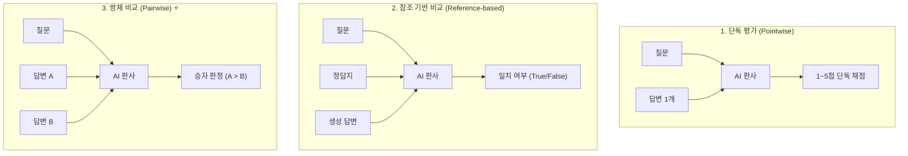

# 03. AI 판사(LLM-as-a-Judge)와 4대 편향 및 전문 판사 모델

## 📌 핵심 요약 & 전체 맥락
> **"AI로 AI를 평가한다(LLM-as-a-Judge)."**  
> 정답지(Reference)가 없는 열린 결말(Open-ended) 환경과 실시간 프로덕션에서, 인간 평가자의 비싼 비용과 느린 속도를 대체하기 위해 **고성능 LLM을 채점관(Judge)으로 활용하는 기법**이 업계의 핵심 표준으로 자리 잡았습니다 (LangChain 평가의 58% 점유).  
> AI 판사는 점수뿐만 아니라 **판결 이유(Explanation / CoT)**를 제공하여 감사(Audit)를 돕는 강력한 장점이 있지만, **자기 선호 편향(Self-Bias)**, **100단어짜리 오답을 50단어 정답보다 선호하는 길이 편향(Verbosity Bias)**, **위치 편향(Position Bias)**, 그리고 도구마다 점수 체계가 제각각인 **기준 모호성(Criteria Ambiguity)**이라는 치명적 맹점을 안고 있습니다.  
> 이를 극복하기 위해 루브릭 프롬프트 가드레일, 1~5점 이산형 척도, 그리고 Cappy·PandaLM과 같은 **특화 소형 판사 모델(Specialized Judges)**을 구축하는 엔지니어링 전략이 필수적입니다.

---

## 🗺️ 도표(Figure & Table) 색인 및 매핑 가이드

본문의 핵심 원리를 시각적으로 확인할 수 있는 책 내 도표의 위치와 해설 매핑입니다:

| 도표 번호 | 도표 제목 및 핵심 내용 | 책 페이지 | 본문 해당 주제 |
| :---: | :--- | :---: | :--- |
| **Figure 3-7** | GPT-4 AI 판사가 점수(8/10)와 함께 구체적 판결 이유를 서술하는 출력 화면 | **p. 138** | 1. 왜 AI 판사를 쓰는가? |
| **Table 3-3** | 주요 AI 도구별 기본 제공 평가 기준 (Azure, MLflow, LangChain, Ragas) | **p. 139** | 2. AI 판사의 활용 방식 |
| **Figure 3-8** | 질문과 생성 답변을 입력받아 품질 점수를 매기는 AI 판사 인터페이스 구조 | **p. 141** | 2. AI 판사 프롬프트 설계 |
| **Table 3-4** | 동일한 'Faithfulness(충실도)' 기준에 대해 도구마다 서로 다른 기본 프롬프트 비교 | **p. 142-143** | 3. AI 판사의 한계 (기준 모호성) |
| **Figure 3-9** | PandaLM이 두 응답을 비교하여 승자를 선언하고 이유를 설명하는 출력 예시 | **p. 147-148** | 4. 특화 선호도 판사 (PandaLM) |

---

## 1. AI 판사(LLM-as-a-Judge)의 부상과 신뢰성 (pp. 136 ~ 138)

### ① 역사적 배경과 필요성
* **역사적 흐름:** 2017년 저자(Chip Huyen)의 NeurIPS 워크숍 발표(MEWR: 무참조 기계번역 평가) 이후, 2020년 GPT-3 출시와 함께 AI를 채점관으로 쓰는 시도가 본격화되었습니다 (각주 16). 2023년 LangChain 조사에 따르면 **플랫폼 내 평가의 58%가 AI 판사**로 수행되고 있습니다.
* **무참조(Reference-free) 평가 가능:** 정답 모범 답안이 존재하지 않는 프로덕션 실시간 대화에서도 즉시 품질 판정이 가능합니다.
* **설명 가능성 (Explainability, Figure 3-7):** 단순 숫자 점수만 뱉는 고전 알고리즘과 달리, **"왜 8점을 주었는지, 어떤 부분이 미흡했는지" 논리적인 판결문(Reasoning)**을 함께 작성하므로 평가 결과를 사람이 감사(Audit)하기 매우 유리합니다.

### ② 인간과의 일치도 (Empirical Agreement)
* **MT-Bench 벤치마크 (Zheng et al., 2023):** GPT-4 판사와 인간 평가자 간의 채점 일치도가 **85%**에 도달하여, **인간 평가자들끼리의 상호 일치도(81%)보다 오히려 더 높은 일관성**을 기록함.
* **AlpacaEval (Dubois et al., 2023):** AI 판사의 랭킹 결과가 인간들이 직접 블라인드 투표한 LMSYS Chatbot Arena 순위와 **0.98의 초고상관도**를 보임.

> 📖 **도표 참고:**
> * **[Figure 3-7 (p. 138)]**: GPT-4 AI 판사가 사용자의 질문과 챗봇의 답변을 검토한 뒤 `Score: 8/10`을 부여하고, "정확한 정보를 전달했으나 톤이 다소 딱딱하다"는 구체적 피드백을 제공하는 실제 인터페이스.

---

## 2. AI 판사의 3대 활용 방식 및 프롬프트 설계 (pp. 138 ~ 141)



---

### ① 3대 채점 모드의 실제 프롬프트 구조 (pp. 138-139)

#### 1) 단독 평가 (Pointwise Evaluation)
질문과 단일 답변을 보고 독립적으로 점수를 부여합니다:
```text
"다음 질문과 답변이 주어졌을 때, 답변의 품질을 1부터 5까지 점수로 평가하시오.
- 1: 매우 나쁨 / 5: 매우 우수함
질문: [QUESTION]
답변: [ANSWER]
점수:"
```

#### 2) 참조 기반 비교 (Reference-based Evaluation)
모범 답안과 모델의 출력을 비교하여 사실적 일치 여부를 판정합니다:
```text
"다음 질문, 모범 정답, 그리고 생성된 답변이 주어졌을 때, 생성된 답변이 모범 정답과 동일한 의미를 갖는지 True 또는 False로 출력하시오.
질문: [QUESTION]
모범 정답: [REFERENCE ANSWER]
생성된 답변: [GENERATED ANSWER]"
```

#### 3) 쌍체 비교 (Pairwise Comparison)
두 모델의 답변(A vs B) 중 사용자 관점에서 더 우수한 쪽을 선택합니다:
```text
"다음 질문과 두 개의 답변이 주어졌을 때, 어느 답변이 더 나은지 A 또는 B로 출력하시오.
질문: [QUESTION]
A: [FIRST ANSWER]
B: [SECOND ANSWER]
더 나은 답변:"
```

---

### ② 주요 도구별 빌트인 평가 기준 (Table 3-3)
* **Azure AI Studio:** Groundedness(근거성), Relevance(관련성), Coherence(일관성), Fluency(유창성), Similarity(유사도).
* **MLflow:** Faithfulness(충실도), Relevance.
* **LangChain Criteria:** Conciseness(간결성), Correctness(정확성), Harmfulness(유해성), Maliciousness(악의성), Misogyny(여성혐오), Criminality(범죄성).
* **Ragas:** Faithfulness, Answer Relevance.

---

### ③ AI 판사 프롬프트 엔지니어링 실무 팁 (pp. 140 ~ 141)
1. **LLM은 숫자보다 텍스트에 강하다:**  
   $0.0 \sim 1.0$ 사이의 연속형 실수 점수보다 **범주형(Good/Bad)**이나 **1~5점 이산형(Likert Scale)** 척도가 훨씬 정확합니다. 점수 범위가 $1 \sim 100$처럼 너무 넓어지면 모델의 채점 변별력이 붕괴됩니다.
2. **루브릭(Rubric)과 Few-shot 예시 필수:**  
   Azure AI Studio의 Relevance 프롬프트처럼 1점부터 5점까지 각 점수에 해당하는 구체적 정의와 *"이 문장은 왜 2점인가?"*에 대한 근거 예시를 프롬프트에 제공해야 일관성이 유지됩니다.

> 📖 **도표 참고:**
> * **[Table 3-3 (p. 139)]**: 주요 AI 도구들이 기본 탑재한 AI 판사 평가 기준 목록.
> * **[Figure 3-8 (p. 141)]**: 질문, 생성 응답, 채점 기준 루브릭을 구조화하여 AI 판사에 전달하는 시스템 프롬프트 템플릿.

---

## 3. AI 판사의 4대 치명적 한계와 고유 편향 (pp. 141 ~ 145)

---

### ① 비일관성 (Inconsistency)과 비용 폭증
* AI 판사도 확률적 모델이므로, 동일한 프롬프트라도 실행할 때마다 점수가 흔들립니다.
* **Few-shot의 딜레마 (Zheng et al., 2023):** 프롬프트에 예시를 많이 추가하면 일치도가 $65\% \to 77.5\%$로 상승하지만, 프롬프트 길이가 길어져 **GPT-4 API 비용이 4배로 폭증**합니다. 높은 일관성이 높은 정확도를 의미하지는 않으며(항상 똑같이 틀릴 위험), 비용 부담이 심각해집니다.

---

### ② 기준 모호성 (Criteria Ambiguity, Table 3-4) ⚠️
동일하게 'Faithfulness(충실도)'를 측정한다고 주장하는 도구들이라도 내부 프롬프트와 척도가 완전히 다릅니다:
* **MLflow:** $1 \sim 5$점 척도로 세분화 채점.
* **Ragas:** 개별 문장별로 $0$ 또는 $1$ 이진 채점.
* **LlamaIndex:** 문맥에 포함되어 있는지 `YES` / `NO`로 판정.

```
[ 버전 관리 및 다중 팀 협업의 함정 (p. 143) ]

• 지난달 서비스의 충실도 점수: 90%  ➔  이번 달 충실도 점수: 92%
• "우리 서비스의 성능이 향상된 것인가?"
  ➔ 알 수 없음! 평가 담당 팀이 판사 프롬프트의 오타를 수정했거나 더 관대한 프롬프트로 변경했을 수 있음.
```

> ⚠️ **저자의 강력한 경고:**  
> *"어떤 기본 모델과 어떤 프롬프트 템플릿을 사용했는지 투명하게 공개되지 않은 AI 판사의 점수는 절대 신뢰하지 마라."*

> 📖 **도표 참고:**
> * **[Table 3-4 (pp. 142-143)]**: MLflow, Ragas, LlamaIndex가 동일한 충실도(Faithfulness) 기준에 대해 완전히 다른 프롬프트와 채점 체계를 사용하는 실제 코드 비교 표.

---

### ③ 비용 및 지연시간(Latency) 폭증
* 서비스 응답 생성에 GPT-4를 쓰고 평가에도 GPT-4를 쓰면 API 호출이 2배로 늘어납니다.
* 만약 품질, 사실성, 유해성의 3가지 기준을 평가한다면 **API 호출은 4배로 폭증**하며, 경우에 따라 **평가 비용이 응답 생성 비용을 추월**합니다 (각주 17).
* 실시간 서빙 가드레일로 배치하면 사용자 응답 지연시간(Latency)이 2배로 늘어납니다.

---

### ④ AI 판사의 4대 고유 편향 (Biases, pp. 144 ~ 145)

```
[ AI 판사의 4대 편향 ]

1. 자기 선호 편향 (Self-Enhancement Bias) : 자신이 생성한 문체와 스타일에 무의식적 가산점 부여
2. 길이 편향 (Verbosity Bias)           : 팩트 오류가 있더라도 길고 장황한 답변을 맹목적 선호
3. 위치 편향 (Position Bias)            : A vs B 비교 시 1번에 배치된 답변(A)을 무조건 선호
4. 어텐션 샌드위치 편향 (Lost in the Middle): 프롬프트의 맨 앞과 맨 뒤만 보고 중간 내용을 간과
```

1. **자기 선호 편향 (Self-Enhancement Bias):**  
   GPT-4 판사는 Claude나 Llama가 작성한 완벽한 답변보다 **자신(GPT-4)이 생성한 특유의 톤과 스타일을 가진 답변에 더 높은 점수**를 주는 편애 현상.
2. **길이 편향 (Verbosity Bias, Wu & Aji 2023):**  
   GPT-4와 Claude-1은 **50단어짜리 정확한 정답보다 100단어짜리 팩트 오류가 섞인 장황한 오답을 더 우수한 답변으로 판정**하는 치명적 맹점을 보임. (Saito et al. 2023: 답변 길이가 2배 길면 판사는 거의 항상 긴 쪽을 선택함).
3. **위치 편향 (Position Bias):**  
   쌍체 비교 시 1번에 배치된 답변(Option A)을 선호하는 경향 ➔ **대응책: A/B 위치를 맞바꿔 2번 평가(Swapping)한 뒤 교차 검증**.

---

## 4. 판사 모델 아키텍처: 누가 누구를 심판하는가? (pp. 145 ~ 148)

```
[ 판사 모델의 3가지 구성 전략 ]

1. Stronger Judge (강한 판사) : 똑똑한 모델(GPT-4)이 경량 모델(Llama-8B)을 채점
2. Self-Critique (자기 평가)  : 모델이 자신의 출력을 스스로 되물어보고(Self-Ask) 반성 교정
3. Specialized Judge (특화 판사): 특정 채점 기준만 전문 훈련한 초경량 모델 (PandaLM, Cappy)
```

---

### ① Stronger Judge (강한 판사) & 실무 서빙 패턴
* **실무 비용 최적화 패턴 (Spot-Checking):**  
  사용자 요청 100%는 저렴하고 빠른 인하우스 경량 모델로 서비스하고, **품질 감사를 위해 전체 트래픽의 1%만 샘플링하여 GPT-4 판사에게 검증**을 맡김.
* **한계:** 당대 최고의 SOTA 모델은 자신보다 더 뛰어난 판사가 존재하지 않음.

---

### ② 자기 평가와 반성 메커니즘 (Self-Critique / Self-Ask, p. 146)
모델이 자신이 생성한 답변에 대해 스스로 맞는지 되물어보는 기법입니다 (Press et al., 2022; Gou et al., 2023):
```text
사용자 질문: "10 + 3은 얼마인가?"
AI의 첫 답변: "30"
AI의 자체 반성(Self-Critique): "이 답변이 정확한가?"
AI의 최종 답변: "아닙니다. 정확한 정답은 13입니다."
```

---

### ③ Weaker Judge와 3대 전문 판사 모델 (Specialized Judges, pp. 146 ~ 148)
> *"누구나 노래를 작곡할 수는 없지만, 누구나 그 노래가 좋은지 나쁜지는 들으면 알 수 있다."*  
* 텍스트 생성보다 평가는 훨씬 쉬운 태스크이므로, 특정 채점 기준만 전문적으로 학습한 소형 특화 판사가 거대 범용 모델보다 훨씬 효율적이고 안정적입니다.

| 전문 판사 분류 | 대표 모델 | 파라미터 / 입력 포맷 | 동작 방식 및 특징 |
| :--- | :--- | :---: | :--- |
| **보상 모델 (Reward Model)** | **Google Cappy** (2023) | **360M** 초경량 <br>`(prompt, response)` | $0.0 \sim 1.0$ 사이의 정답 신뢰도 점수를 초고속 출력 |
| **참조 기반 판사** | **BLEURT / Prometheus** | `(prompt, response, ref, rubric)` | 모범 답안 대비 $1 \sim 5$점 품질 점수 산출 <br>*(BLEURT는 $-2.5 \sim 1.0$의 다소 난해한 점수 체계 사용 - 각주 21)* |
| **선호도 비교 모델** | **PandaLM / JudgeLM** | `(prompt, resp_A, resp_B)` | **A와 B 중 승자를 판정하고 구체적 판결 근거(Rationale) 서술** |

> 📖 **도표 참고:**
> * **[Figure 3-9 (pp. 147-148)]**: PandaLM이 두 모델(Bloom의 Response 1 vs LLaMA의 Response 2)의 응답을 대조하여 **`Response 2 is better` (LLaMA 승리)**라고 선언한 뒤, *"Response 2가 관용구의 의미를 훨씬 명확하고 간결하게 설명했다(clear and concise explanation)"*는 구체적 판결 근거를 작성한 실제 출력 예시.

---

## 🔗 연관 문서
* [[00-ch03-overview|00. Chapter 3 전체 개요 및 목차]]
* [[01-challenges-and-language-modeling-metrics|01. 평가의 난제와 언어 모델링 지표 (PPL)]]
* [[02-exact-and-semantic-evaluation|02. 정확한 평가와 유사도 지표]]
* [[04-ranking-models-with-comparative-evaluation|04. 비교 평가와 Elo Rating 랭킹 시스템]]
* [[05-deep-dive-cross-entropy-loss-and-information-theory|05. [심화] 교차 엔트로피와 모델 손실(Loss)의 원리]]
