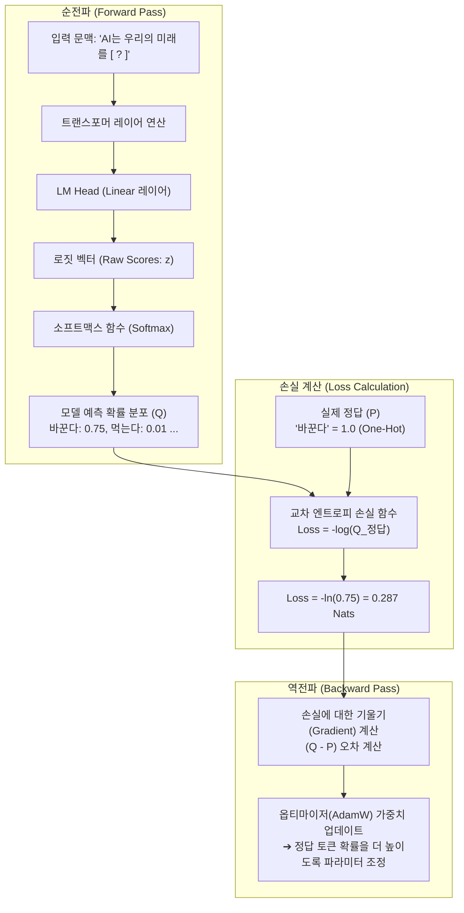

# 05. [심화] 교차 엔트로피(Cross-Entropy)와 모델 손실(Loss)의 수학적·정보이론적 원리

## 📌 핵심 요약
> **교차 엔트로피(Cross-Entropy, $H(P, Q)$)를 "모델의 손실(Loss)"이라고 부르는 이유는, 실제 정답 데이터의 분포($P$)와 모델이 예측한 확률 분포($Q$) 사이의 괴리(오차)를 정량화한 '벌점(Penalty)'이기 때문입니다. 수학적으로 교차 엔트로피는 `[데이터 고유의 한계 엔트로피 $H(P)$] + [모델의 예측 오차 $D_{KL}(P \parallel Q)$]`로 분해되며, 손실을 최소화하는 최적화 과정은 모델의 예측 오차(KL 발산)를 0으로 만들어 실제 데이터 분포에 일치시키는 과정입니다.**

---

## 1. 교차 엔트로피가 손실(Loss)인 3대 핵심 이유

```
[ 교차 엔트로피 = 모델 손실(Loss)인 3가지 이유 ]

1. 딥러닝 관점 : 정답을 못 맞힐수록 기하급수적으로 큰 벌점을 주는 음의 로그 우도(NLL) 함수다.
2. 수학적 관점 : [데이터 고유 엔트로피] + [모델의 오차(KL Divergence)]로 분해되어 오차 그 자체를 측정한다.
3. 정보이론 관점: 모델의 무지(부정확한 예측)로 인해 낭비되는 추가 통신 비트(비용)를 뜻한다.
```

---

## 2. 딥러닝 최적화 관점: 음의 로그 우도(NLL)와 벌점 시스템

언어 모델은 문맥이 주어졌을 때 **실제 다음에 올 정답 단어의 확률을 100%(1.0)로 예측**하도록 학습됩니다.

### ① 원-핫(One-Hot) 정답 벡터와 수식의 단순화
실제 학습 데이터에서 다음 단어 $y$는 단 하나의 정답 토큰만 확률 $1$이고 나머지는 모두 $0$인 원-핫 벡터 분포 $P$를 가집니다:
$$P(x) = \begin{cases} 1 & \text{if } x = \text{정답 토큰 } y \\ 0 & \text{otherwise} \end{cases}$$

이 $P(x)$를 교차 엔트로피 공식에 대입하면 정답 토큰 이외의 모든 항($0 \times \log Q(x)$)이 사라지고, **정답 토큰에 대한 음의 로그 우도(Negative Log-Likelihood, NLL)**만 남습니다:

$$H(P, Q) = -\sum_{x} P(x) \log Q(x) = -\log Q(y)$$

### ② 정답 확률에 따른 손실값(벌점) 비교

| 모델의 정답 예측 확률 $Q(y)$ | 모델의 확신 수준 | 교차 엔트로피 손실 ($-\ln Q(y)$) | 패널티 강도 |
| :--- | :--- | :---: | :--- |
| **`1.00` (100%)** | 완벽한 정답 확신 | **`0.00`** | 오차 없음 (Loss = 0) |
| **`0.90` (90%)** | 높은 정답 확신 | **`0.10`** | 매우 미미한 손실 |
| **`0.50` (50%)** | 반신반의하는 상태 | **`0.69`** | 완만한 손실 발생 |
| **`0.10` (10%)** | 거의 틀리게 예측 | **`2.30`** | 큰 손실 발생 |
| **`0.01` (1%)** | 완전히 엉뚱한 단어 확신 | **`4.60`** | 강력한 징벌적 손실 |
| **`0.00...` ($\to 0$)** | 정답 확률을 0으로 배제 | **`+∞`** | 무한대의 폭탄 손실 |

> 💡 **왜 손실인가?**  
> 모델이 정답 단어의 확률을 조금이라도 낮게 주면 손실(Loss)이 급격히 치솟아 경사하강법(Gradient Descent)이 모델의 가중치를 정답 확률을 높이는 방향으로 강력하게 밀어붙이기 때문입니다.

---

## 3. 수학적 관점: 데이터 고유 엔트로피와 KL 발산 분해

교차 엔트로피는 정보이론적으로 **"데이터 자체의 본질적 불확실성"**과 **"모델이 부족해서 생기는 오차"**의 합으로 정확히 분해됩니다.

$$H(P, Q) = H(P) + D_{KL}(P \parallel Q)$$

### ① $H(P)$: 데이터 고유의 엔트로피 (물리적 한계치)
* 언어와 데이터 자체에 내재된 본질적인 불확실성입니다.
* 아무리 똑똑한 초지능 AI가 등장하더라도 이 값 이하로는 손실을 낮출 수 없는 **'물리적 이론 한계선(Lower Bound)'**입니다.

### ② $D_{KL}(P \parallel Q)$: 쿨백-라이블러 발산 (모델의 예측 오차)
* 실제 정답 분포 $P$와 모델이 흉내 낸 예측 분포 $Q$ 사이의 통계적 거리(차이)를 측정합니다.
* **$D_{KL}(P \parallel Q) \ge 0$** (항상 0 이상)이며, **모델이 완벽하게 학습하여 $Q = P$가 될 때만 정확히 `0`**이 됩니다.

```
[ 교차 엔트로피의 구성 요소 분해 ]

 H(P, Q)  =       H(P)        +      D_KL(P || Q)
(전체 손실)   (줄일 수 없는 한계)     (모델의 무지로 인한 순수 오차)
                   │                        │
                   ▼                        ▼
              상수 (Constant)       학습을 통해 0으로 줄여야 할 대상!
```

> 🎯 **결론:**  
> $H(P)$는 고정된 상수이므로, **교차 엔트로피 $H(P, Q)$를 최소화하는 것은 곧 모델의 순수 오차인 KL 발산($D_{KL}$)을 0으로 수렴시키는 것과 수학적으로 완벽히 동치**입니다.

---

## 4. 정보이론 관점: "무지로 인해 낭비되는 비트 비용"

정보이론의 창시자 클로드 섀넌(Claude Shannon)의 관점에서, 엔트로피는 **데이터를 효율적으로 압축하여 전송하는 데 필요한 평균 비트(Bits) 수**입니다.

* **최적의 상황 ($P$를 완전히 알 때):**
  * 자주 나오는 단어에는 짧은 비트를, 드물게 나오는 단어에는 긴 비트를 배정(허프만 코딩 / 섀넌 코딩)하면 **평균 $H(P)$ 비트**만으로 텍스트를 완벽하게 전송할 수 있습니다.
* **모델 $Q$를 사용할 때:**
  * 실제로는 드물게 나오는 단어를 모델이 자주 나온다고 잘못 예측($Q$)하여 잘못된 압축 코드를 짜면, 데이터를 표현하는 데 **평균 $H(P, Q)$ 비트**가 필요해집니다.
* **손실(Loss)의 의미:**
  * $H(P, Q) - H(P) = D_{KL}(P \parallel Q) > 0$
  * 즉, **"모델의 부정확한 예측 때문에 낭비된 추가 비트(용량/비용)"**가 바로 손실입니다.

---

## 5. 언어 모델 훈련에서의 손실 계산 파이프라인

신경망에서 입력 토큰이 주어졌을 때 교차 엔트로피 손실이 계산되어 역전파(Backpropagation)되는 전체 흐름입니다:



---

## 6. 단위의 차이: Bits vs Nats와 프레임워크 구현

| 구분 | **Bits (정보이론 단위)** | **Nats (딥러닝 프레임워크 단위)** |
| :--- | :--- | :--- |
| **로그 밑수** | $\log_2$ (밑이 2인 로그) | $\ln$ (자연로그, 밑이 $e$) |
| **주요 사용처** | 정보이론 논문, 압축률 벤치마크 (BPB/BPC) | PyTorch, TensorFlow (`CrossEntropyLoss`) |
| **사용 이유** | 컴퓨터의 2진수(0과 1) 체계와 직결됨 | 자연로그의 미분($\frac{d}{dx}\ln x = \frac{1}{x}$)이 깔끔하여 역전파 연산에 최적 |
| **환산 공식** | $1 \text{ Nat} = \frac{1}{\ln 2} \approx 1.4427 \text{ Bits}$ | $1 \text{ Bit} = \ln 2 \approx 0.6931 \text{ Nats}$ |

> 💻 **PyTorch 구현 팁 (`nn.CrossEntropyLoss`):**  
> PyTorch의 `nn.CrossEntropyLoss()`는 내부적으로 `LogSoftmax`와 `NLLLoss`를 하나로 합쳐서 계산합니다. 소프트맥스를 거친 후 로그를 취하면 소수점 언더플로우가 발생하기 때문에, 수치적 안정성을 위해 **Log-Sum-Exp 트릭**을 사용하여 로짓에서 직접 손실을 계산합니다.

---

## 🔗 연관 문서
* [[00-ch03-overview|00. Chapter 3 전체 개요 및 목차]]
* [[01-challenges-and-language-modeling-metrics|01. 평가의 난제와 언어 모델링 지표 (PPL, Loss, BPB)]]
* [[chapter-qa/ch02-foundation-models-qa/09-logits-and-softmax-deep-dive|Ch02-09. [심화] 로짓(Logits)과 소프트맥스(Softmax)의 동작 원리]]
