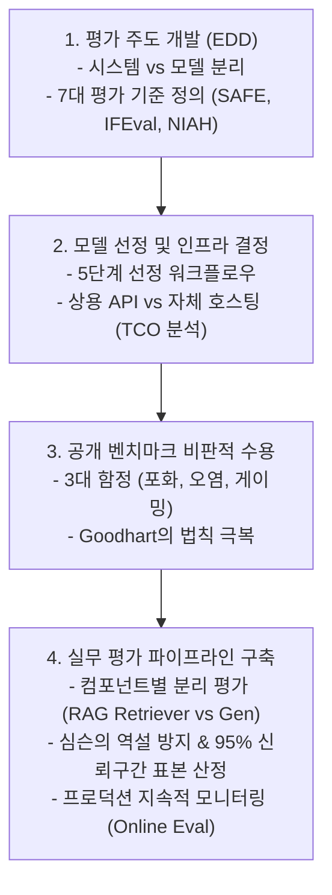

# Chapter 4: Evaluate AI Systems (AI 시스템 평가 및 선정)

> **교재:** *AI Engineering: Building Applications with Foundation Models* (Chip Huyen 저)  
> **범위:** Chapter 4 (Evaluation-Driven Development, Evaluation Criteria, Model Selection, APIs vs Self-Hosting, Public Benchmarks, Evaluation Pipeline Design) (pp. 159–210)

---

## 🗺️ 개념 지도 및 목차

| 번호 | 문서명 | 핵심 주제 | 주요 키워드 |
| :---: | :--- | :--- | :--- |
| **01** | [[01-evaluation-driven-development-and-criteria\|01. 평가 주도 개발(EDD)과 7대 평가 기준]] | 시스템 vs 모델 평가, EDD 원리, 환각(SAFE), 정렬/안전성, 지시 이행(IFEval), 컨텍스트(NIAH), 지연시간/비용 (pp. 159-178) | `EDD`, `System-Level`, `SAFE`, `TruthfulQA`, `IFEval`, `NIAH`, `TTFT`, `ITL`, `TPS` |
| **02** | [[02-model-selection-and-apis-vs-self-hosting\|02. 모델 선정 워크플로우와 API vs 자체 호스팅]] | 모델 선정 5단계 파이프라인, 추론 아키텍처(Runtime/Engine), 상용 API vs 자체 호스팅 TCO 분석 (pp. 179-190) | `Model Selection`, `Inference Engine`, `vLLM`, `Self-Hosting`, `API vs Self-Host`, `TCO` |
| **03** | [[03-navigating-public-benchmarks-and-pitfalls\|03. 공개 벤치마크 탐색과 3대 함정]] | 벤치마크 상관관계, 3대 함정(포화 Saturation, 데이터 오염 Contamination, 벤치마크 게이밍 Gaming), 멀티모달 평가 (pp. 191-199) | `Open LLM Leaderboard`, `Saturation`, `Contamination`, `Goodhart's Law`, `Format Sensitivity` |
| **04** | [[04-designing-evaluation-pipeline-and-sample-size\|04. 실무 평가 파이프라인 설계와 표본 크기 산정]] | 파이프라인 4단계, RAG 컴포넌트별 평가, 심슨의 역설(Simpson's Paradox), 95% 신뢰구간 표본 크기 산정 (pp. 200-210) | `Evaluation Pipeline`, `RAG Triad`, `Simpson's Paradox`, `Sample Size`, `Continuous Eval` |

---

## 💡 한눈에 꿰뚫는 핵심 흐름

