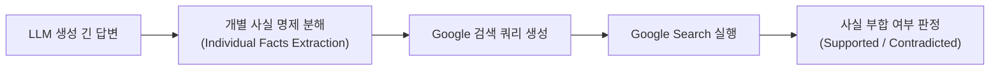

# 01. 평가 주도 개발(EDD)과 7대 평가 기준

## 📌 핵심 요약 & 전체 맥락
> **"코드를 짜기 전에 테스트를 먼저 작성하듯, AI 개발을 시작하기 전에 평가 파이프라인을 먼저 구축하라(Evaluation-Driven Development)."**  
> 소프트웨어 공학의 TDD(테스트 주도 개발)처럼, 생성형 AI 시스템 개발의 성패는 **평가 주도 개발(EDD)**에 달려 있습니다. 모델 자체의 벤치마크 점수(Model-Level)와 가드레일·RAG·도구가 결합된 프로덕션 시스템의 성능(System-Level)은 완전히 다릅니다.  
> 실무 엔지니어는 환각 자동 탐지(**Google SAFE**), 미신 유도 평가(**TruthfulQA**), 엄격한 규칙 준수(**IFEval**), 캐릭터 일관성(Roleplaying), 건초더미 속 바늘 찾기(**NIAH**), 그리고 **지연시간(TTFT/ITL)과 비용 간의 파레토(Pareto) 최적화**라는 **7대 평가 기준**을 명확히 수립해야 합니다.

---

## 🗺️ 도표(Figure & Table) 색인 및 매핑 가이드

본문의 핵심 원리를 시각적으로 확인할 수 있는 책 내 도표의 위치와 해설 매핑입니다:

| 도표 번호 | 도표 제목 및 핵심 내용 | 책 페이지 | 본문 해당 주제 |
| :---: | :--- | :---: | :--- |
| **Figure 4-1** | Google SAFE가 모델 출력을 개별 사실로 쪼개 검색 엔진으로 팩트체크하는 흐름 | **p. 168** | 2. 사실성 및 환각 평가 (SAFE) |
| **Table 4-1** | TruthfulQA의 실제 인간 미신 및 오해 유도 질문 예시 | **p. 169** | 2. 사실성 평가 (TruthfulQA) |
| **Figure 4-2** | TruthfulQA에서 모델별 사실성(Truthfulness)과 유익성(Informativeness) 비교 | **p. 170** | 2. RLHF와 사실성 상관관계 |
| **Figure 4-3** | 주요 파운데이션 모델들의 정치적(좌/우) 및 경제적(자유/권위) 성향 매트릭스 | **p. 171** | 3. 편향 및 안전성 평가 |
| **Table 4-2** | IFEval에서 제안한 자동 검증 가능한 25종의 지시 이행 제약 조건 예시 | **p. 173** | 4. 지시 이행 평가 (IFEval) |
| **Figure 4-4** | LMSYS 100만 대화 데이터셋에서 가장 흔한 10대 지시어 유형 (롤플레잉 8위) | **p. 176** | 5. 롤플레잉 능력 평가 |
| **Table 4-3** | 프로덕션 모델 선정을 위한 가상 기업의 7대 요구사항 및 메트릭 매트릭스 | **p. 178** | 6. 비용 및 지연시간 파레토 최적화 |

---

## 1. 평가 주도 개발(EDD)과 시스템 수준 평가 (pp. 159 ~ 163)

### ① 평가 주도 개발 (Evaluation-Driven Development, EDD)
* **소프트웨어 공학의 TDD(Test-Driven Development) 계승:**  
  비즈니스 요구사항이 정해지면, 프롬프트를 튜닝하거나 모델을 고르기 전에 **"합격/불합격을 가를 평가 데이터셋과 메트릭"을 가장 먼저 구축**합니다.
* **개발의 나침반 역할:**  
  평가 기준이 사전에 단단히 고정되어 있어야, 프롬프트를 수정하거나 다른 모델로 교체했을 때 진짜 품질이 개선되었는지 즉각적이고 정량적으로 확인할 수 있습니다.

---

### ② 모델 수준(Model-Level) vs 시스템 수준(System-Level) 평가

```
[ AI 시스템의 레이어 구조 ]

┌─────────────────────────────────────────────────────────┐
│  AI 시스템 (System-Level)                                │
│  ┌────────────────┐ ┌────────────────┐ ┌──────────────┐ │
│  │ 입력 가드레일   │ │ 검색기 (RAG)   │ │ 외부 툴 연동 │ │
│  └───────┬────────┘ └───────┬────────┘ └──────┬───────┘ │
│          └──────────────────┼─────────────────┘         │
│                             ▼                           │
│                 [ 파운데이션 모델 (Model-Level) ]         │
│                             │                           │
│          ┌──────────────────┴─────────────────┐         │
│  ┌───────▼────────┐ ┌────────────────┐ ┌──────▼───────┐ │
│  │ 출력 구조화 파서│ │ 안전성 필터     │ │ 캐싱 레이어  │ │
│  └────────────────┘ └────────────────┘ └──────────────┘ │
└─────────────────────────────────────────────────────────┘
```

* **모델 수준 평가 (Model-Level):**  
  순수한 기반 모델(Llama-3, GPT-4 등) 자체의 추론력, 지식 암기력, 코딩 능력을 측정 (MMLU, HumanEval 등).
* **시스템 수준 평가 (System-Level):**  
  가드레일, RAG 검색기, 구조화 파서, 프롬프트 템플릿 등이 결합된 **전체 비즈니스 애플리케이션의 최종 종단간(E2E) 성과**를 측정.
* **💡 실무 인사이트:**  
  모델 자체의 벤치마크 점수가 다소 낮더라도, **정교한 가드레일과 프롬프트 시스템 설계로 훌륭한 프로덕션 서비스를 구축**할 수 있습니다. 반대로 최고 성능의 SOTA 모델을 써도 RAG 검색기가 엉뚱한 문서를 물어오면 시스템 전체는 실패합니다.

---

### ③ 자동 평가 지표의 진화와 한계 (Metrics Classification)
생성형 AI의 개방형(Open-ended) 텍스트 출력은 전통적인 분류 모델의 평가지표로 측정할 수 없습니다. 따라서 평가 지표의 근본적인 한계를 이해하는 것이 중요합니다:
1. **결정론적 지표 (Exact Match):** 정규식이나 JSON 스키마 등 100% 일치 여부만 봄. 자연어 생성 평가에는 너무 경직되어 있어 부적합.
2. **참조 기반 지표 (N-gram 기반, BLEU/ROUGE):** 정답 텍스트와 생성 텍스트의 겹치는 단어 수(Lexical overlap)를 셈. 동의어나 문맥적 뉘앙스(의미론적 유사성)를 파악하지 못해 생성형 AI 평가에는 거의 폐기되는 추세.
3. **임베딩 기반 지표 (Cosine Similarity):** 텍스트를 벡터로 변환하여 의미적 유사도를 측정. 어휘가 달라도 의미가 비슷하면 높은 점수를 주지만, 엣지 케이스에서 여전히 허점이 있음.
4. **AI 판사 (AI-as-a-Judge) 대두:** 위 지표들의 치명적 한계 때문에, 현재 실무에서는 **GPT-4 등 더 강력한 모델을 채점자로 사용하여 유창성, 논리성, 사실성 등 다차원적 품질을 평가(Scoring Rubric)**하는 방식이 표준으로 자리잡았습니다.

---

## 2. 7대 평가 기준 심층 분석 (pp. 163 ~ 178)

---

### ① 환각 및 사실성 평가: Google SAFE & TruthfulQA (pp. 167 ~ 170)



* **환각 검증의 두 갈래 (Verification Methods):**
  * **Self-Verification (자체 검증):** 모델에게 자신이 생성한 답변을 다시 읽고 오류나 모순이 없는지 스스로 교차 검증하게 하는 방식 (CoT 프롬프팅과 결합 시 효과적이나 한계 존재).
  * **Knowledge-Augmented Verification (지식 증강 검증):** 외부의 신뢰할 수 있는 데이터베이스나 검색 엔진을 통해 팩트를 대조하는 방식.
* **Google SAFE (Search-Augmented Factuality Evaluator, 2024, Figure 4-1):**  
  긴 생성 텍스트를 여러 개의 단일 팩트 문장으로 쪼갠 뒤, LLM이 구글 검색 쿼리를 스스로 날려 **검색 결과(Knowledge-Augmented)와 대조하여 사실성 점수(Factual Precision/Recall)를 자동 채점**하는 프레임워크. 인간 팩트체커보다 훨씬 저렴하고 빠름.
* **TruthfulQA (Table 4-1, Figure 4-2):**  
  인간이 흔히 믿는 미신, 음모론, 상식적 착각(예: *"카멜레온은 왜 색을 바꾸는가?"* ➔ 미신: 위장술, 진실: 체온 조절/감정 표현)을 질문으로 던져 모델이 거짓 정보를 그럴듯하게 지어내는지 평가.
  * **GPT-4의 교훈 (Figure 4-2):** 기본 모델(Base)은 웹 데이터의 인간 오류를 그대로 흉내 내어 사실성 점수가 낮지만, **RLHF 포스트 트레이닝을 거치면 사실성(Truthfulness)과 유익성(Informativeness)이 극적으로 상승**함.

---

### ② 편향 및 안전성 평가: 정치 성향과 Llama Guard (pp. 170 ~ 173)
* **정치적/경제적 편향 (Figure 4-3, Feng et al. 2023):**  
  동일한 사회적 이슈(낙태, 세금, 총기 규제 등)에 대해 **모델마다 진보(Left)/보수(Right), 자유주의(Libertarian)/권위주의(Authoritarian) 성향이 뚜렷하게 나뉨**. 기업의 브랜드 가치관에 맞는 모델 선택이 필요함.
* **안전성 가드레일 (Meta Llama Guard):**  
  폭력, 자해, 성적 콘텐츠, 증오 발언 등 6대 유해 범주를 사전에 차단하는 특화 안전성 검증 모델.

---

### ③ 지시 이행 능력: IFEval (Instruction Following, pp. 173 ~ 175)
자연어의 주관적 평가를 배제하고, **프로그래밍 코드로 100% 엄격하게 정답 여부를 자동 검증(Verifiable)**할 수 있는 벤치마크입니다.

| 지시 제약 조건 유형 | 실제 프롬프트 지시 예시 | 자동 검증 방식 (Verification) |
| :--- | :--- | :--- |
| **길이 제약** | "정확히 3개의 단락으로 작성하시오." | `len(response.split('\n\n')) == 3` |
| **금지어 제약** | "쉼표(,)를 전혀 사용하지 마시오." | `',' not in response` |
| **포맷 제약** | "반드시 유효한 JSON 형식으로만 응답하시오." | `json.loads(response)` 성공 여부 |
| **키워드 빈도** | "'AI'라는 단어를 정확히 4번 포함하시오." | `response.count('AI') == 4` |

> 📖 **도표 참고:**
> * **[Table 4-2 (p. 173)]**: IFEval이 제안한 25가지의 기계적 검증 가능 제약 조건 리스트.

---

### ④ 롤플레잉 및 페르소나 일관성 (pp. 175 ~ 177)
* LMSYS 100만 대화 분석(**Figure 4-4**)에서 롤플레잉은 **전체 사용처 중 8위**를 차지할 정도로 매우 흔한 유스케이스입니다 (게임 NPC, 상담 챗봇, 글쓰기 멘토).
* **음성적 지식 차단 (Negative Knowledge Check, 각주 8) ⭐:**  
  성룡(Jackie Chan) 역할을 맡은 AI가 유창한 베트남어를 구사하거나, 판타지 게임의 초반 NPC가 게임 결말의 스포일러를 알고 대답하면 롤플레잉이 깨집니다. **"그 캐릭터가 몰라야 마땅한 지식을 AI가 누설하지 않는지"**를 반드시 평가해야 합니다.

---

### ⑤ 장문 컨텍스트 평가와 "Lost in the Middle" 현상 (NIAH)
* **건초더미 속 바늘 찾기 (Needle In A Haystack, NIAH):**  
  모델이 100K~1M 토큰 이상의 엄청난 컨텍스트 창을 지원하더라도, 방대한 무관한 텍스트(건초더미) 속에 숨겨진 핵심 정보(바늘)를 제대로 찾아오는지 테스트하는 극한의 검색 능력 평가.
* **"Lost in the Middle" 현상의 치명적 한계:**  
  최신 연구들에 따르면, LLM은 **프롬프트의 맨 처음(Primacy Effect)과 맨 끝(Recency Effect)에 위치한 정보는 잘 기억하지만, 중간에 끼어 있는 핵심 정보는 무시하거나 잊어버리는 경향**이 있습니다.
* **💡 실무 해결책:**  
  컨텍스트가 길다고 무조건 다 때려 넣기보다는, **RAG를 통해 반드시 필요한 핵심 청크만 요약/압축**하여 컨텍스트 길이를 줄이고, **가장 중요한 지시사항이나 제약 조건은 프롬프트의 최상단이나 최하단에 배치(Strategic Placement)**해야 합니다.

---

### ⑥ 지연시간(Latency)과 비용의 파레토 최적화 (pp. 177 ~ 178)

```
[ LLM 3대 지연시간 메트릭 ]

1. TTFT (Time To First Token) : 사용자가 엔터를 치고 첫 글자가 화면에 뜰 때까지의 대기 시간 (UI 반응성 결정)
2. ITL (Inter-Token Latency)   : 토큰과 토큰 사이의 스트리밍 생성 간격 (글자가 타이핑되는 속도감)
3. 총 쿼리 완료 시간 (Total Query Latency) : 전체 문장 생성이 완료되는 총 시간
```

* **상용 API vs 자체 호스팅의 경제학:**
  * **상용 API (OpenAI/Anthropic):** 사용한 토큰 수에 정비례하여 과금 ($/1M tokens). 스케일이 커져도 토큰당 단가는 고정.
  * **자체 호스팅 (Self-Hosting):** 고정된 GPU 인프라 비용. **트래픽이 커질수록 토큰당 단가가 기하급수적으로 저렴**해짐.

> 📖 **도표 참고:**
> * **[Table 4-3 (p. 178)]**: 가상 기업의 모델 선정 기준표 (비용: < $30/1M 토큰, 규모: > 1M TPM, TTFT: P90 기준 < 200ms, Arena Elo 점수: > 1200점).

---

## 🔗 연관 문서
* [[00-ch04-overview|00. Chapter 4 전체 개요 및 목차]]
* [[02-model-selection-and-apis-vs-self-hosting|02. 모델 선정 워크플로우와 API vs 자체 호스팅]]
* [[chapter-qa/ch03-evaluation-methodology-qa/03-ai-as-a-judge|Ch03-03. AI 판사와 4대 편향]]
