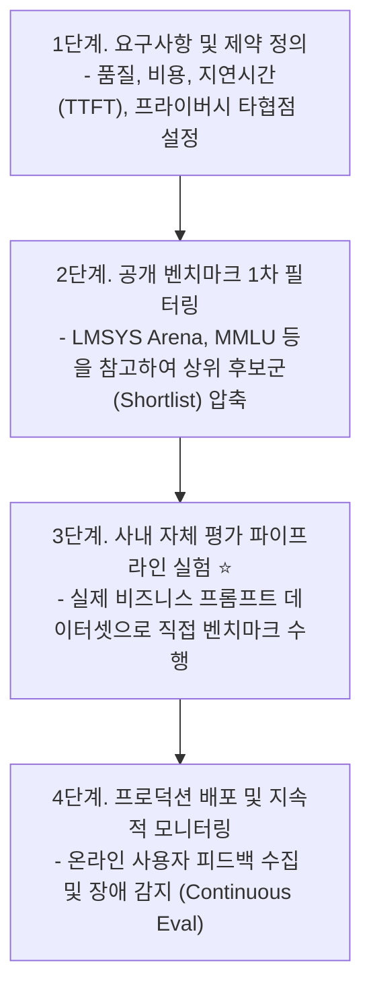

# 02. 모델 선정 워크플로우와 상용 API vs 자체 호스팅 의사결정

## 📌 핵심 요약 & 전체 맥락
> **"만들 것인가, 살 것인가(Build vs Buy)?"**  
> 파운데이션 모델 애플리케이션 개발에서 가장 먼저 마주하는 핵심 의사결정은 **OpenAI·Anthropic 같은 상용 모델 API를 쓸 것인가, 아니면 Llama·Mistral 같은 오픈소스 모델을 자체 호스팅(Self-Hosting)할 것인가**입니다.  
> 상용 API는 즉시 사용 가능한 강력한 성능과 툴 호출(Function Calling)을 제공하지만, **삼성전자의 ChatGPT 사내 기밀 유출 사고**처럼 데이터 프라이버시 위험과 과도한 검열, 그리고 사용량에 비례해 폭증하는 토큰 비용을 수반합니다.  
> 반면 자체 호스팅은 **완벽한 데이터 통제력과 대규모 트래픽에서의 압도적인 비용 절감(TCO)**을 보장하지만, 분산 추론 엔진 최적화와 인프라 운영이라는 막대한 엔지니어링 비용이 요구됩니다.

---

## 🗺️ 도표(Figure & Table) 색인 및 매핑 가이드

본문의 핵심 원리를 시각적으로 확인할 수 있는 책 내 도표의 위치와 해설 매핑입니다:

| 도표 번호 | 도표 제목 및 핵심 내용 | 책 페이지 | 본문 해당 주제 |
| :---: | :--- | :---: | :--- |
| **Figure 4-5** | 모델 선정을 위한 4단계 평가 워크플로우 (요구사항 ➔ 공개 벤치마크 ➔ 사내 평가 ➔ 모니터링) | **p. 180** | 1. 모델 선정 4단계 워크플로우 |
| **Figure 4-6** | 클라이언트-API-추론 서비스(Inference Service)-GPU 하드웨어 계층 구조도 | **p. 183** | 2. 모델 추론 아키텍처 |
| **Figure 4-7** | MMLU 벤치마크에서 오픈소스 모델과 상용 폐쇄형 모델 간의 성능 격차 축소 추세 | **p. 187** | 3. 성능 격차와 경제적 유인 |
| **Figure 4-8** | a16z 2024 조사: 기업들이 오픈소스 모델을 도입하는 핵심 이유 (1위: 통제력/커스터마이징) | **p. 189** | 3. 통제력과 과도한 검열 극복 |
| **Table 4-4** | 상용 모델 API vs 자체 호스팅 모델의 5대 영역별 장단점 비교 총정리 | **p. 190** | 3. 종합 의사결정 매트릭스 |

---

## 1. 모델 선정 4단계 워크플로우 (pp. 179 ~ 181)

기업이 수많은 파운데이션 모델 중에서 자사 애플리케이션에 가장 적합한 모델을 고르는 표준화된 4단계 프로세스입니다:



> 💡 **반복적(Iterative) 피드백 루프:**  
> 처음에는 비용 절감을 위해 오픈소스 자체 호스팅을 계획했더라도, 3단계 사내 평가에서 추론 능력이 부족하다고 판단되면 상용 API로 선회할 수 있으며, 반대로 트래픽이 폭증하면 자체 호스팅으로 전환할 수 있습니다.

---

## 2. 오픈소스(Open Source) vs 오픈 가중치(Open Weight)의 진실 (pp. 181 ~ 183)

### ① 오픈 가중치(Open Weight) vs 완전한 오픈 모델(Open Model)
* **오픈 가중치 (Open Weight):** 가중치 파라미터만 공개하고 **사전 학습 데이터셋은 비공개**로 숨긴 모델 (예: Meta Llama 3, Mistral 7B).
* **완전한 오픈 모델 (Fully Open Model):** 가중치뿐만 아니라 **학습 데이터셋, 데이터 정제 코드, 훈련 스크립트까지 전체 공개**하여 완전한 감사(Audit)와 재학습이 가능한 모델 (예: Allen AI의 OLMo).

---

### ② 모델 도입 전 필수 라이선스 3대 질문
1. **상업적 이용이 허용되는가?** (초기 Llama 1은 비상업용 라이선스로 연구용으로만 제한되었음).
2. **MAU 규모 제약이 있는가?** (Llama 2/3 커뮤니티 라이선스는 **월간 활성 사용자 7억 명(700M MAU)을 초과**하는 대기업은 Meta의 별도 승인을 요구함).
3. **모델의 출력으로 다른 모델을 학습(Distillation)시킬 수 있는가? ⭐**
   * OpenAI 이용약관은 **"ChatGPT의 출력을 이용해 다른 AI 모델을 훈련하거나 모방(Distillation)하는 행위를 엄격히 금지"**함.
   * 반면 합성 데이터(Synthetic Data)를 생성해 소형 모델을 훈련시키려면 이를 허용하는 라이선스(Apache 2.0 등)를 확인해야 함.

---

## 3. 상용 API vs 자체 호스팅 7대 축 의사결정 (pp. 184 ~ 190)

```
[ 상용 API vs 자체 호스팅 7대 비교 축 ]

1. 데이터 프라이버시 (Data Privacy)   : 기밀 데이터 외부 전송 허용 여부
2. 데이터 계보 및 저작권 (IP Risk)     : 저작권 소송 시 법적 면책(Indemnification) 지원 여부
3. 성능 (Performance)                : SOTA 최고 성능 독점 여부
4. 기능성 및 로그확률 (Functionality) : Function Calling 지원 vs Logprobs/내부 레이어 접근
5. 비용 구조 (TCO)                   : 토큰당 과금 vs 고정 인프라/엔지니어링 인건비
6. 통제력 및 검열 (Control & Censorship): 과도한 안전성 거절 극복 및 잠수함 패치 방지
7. 온디바이스 배포 (On-Device)        : 오프라인 환경 및 로컬 엣지 실행
```

---

### ① 데이터 프라이버시: 삼성전자 ChatGPT 유출 사건 (p. 184)
* **삼성전자 사고 사례 (2023년 5월):** 엔지니어들이 반도체 소스 코드와 회의록을 ChatGPT에 입력했다가 사내 기밀이 외부 서버로 전송되는 사고가 발생하여, 삼성은 사내 ChatGPT 사용을 전면 금지함.
* **학습 데이터 암기 유출 위험:** Hugging Face의 StarCoder 모델 연구에 따르면, 모델이 **훈련 데이터의 8%를 글자 그대로 암기(Memorization)**하고 있어 프롬프트를 통해 사내 비밀이나 개인정보가 외부 사용자에게 유출될 위험이 존재함.

---

### ② 저작권과 법적 책임: 면책 조항 (Indemnification, p. 185)
* 오픈소스 모델은 데이터 출처가 불분명하여 저작권 소송이 걸릴 경우 개발사가 법적 책임을 전혀 져주지 않음.
* 반면 Microsoft(Azure), Google(GCP), OpenAI 같은 상용 클라우드 공급업체는 기업 고객 계약에 **IP 침해 소송 비용을 대신 물어주는 '저작권 면책 조항(Copyright Indemnification)'**을 제공함.

---

### ③ 성능과 오픈소스의 경제적 한계 (Figure 4-7, p. 187)
* 오픈소스 모델이 빠르게 발전하고 있으나, **수천억 원의 훈련 비용을 투자한 최강의 모델(SOTA)은 경제적 보상을 위해 폐쇄형 상용 API로만 독점 제공**되는 유인 구조가 존재함.

> 📖 **도표 참고:**
> * **[Figure 4-7 (p. 187)]**: MMLU 벤치마크에서 오픈소스 모델(Llama 시리즈)이 상용 모델(GPT-4 등)을 맹추격하며 점수 격차를 좁혀가는 추세 그래프.

---

### ④ 통제력과 과도한 검열(Over-Censoring)의 덫: Convai 사례 (p. 189)
* 상용 모델은 소송 방지를 위해 지나치게 방어적인 안전성 가드레일을 둠.
* **3D AI 캐릭터 기업 Convai의 일화:** 3D 게임 안에서 물건을 집어 들 수 있는 NPC 캐릭터를 만들었으나, 상용 AI가 자꾸 *"저는 신체 능력이 없는 언어 모델입니다"*라며 거절하여 결국 **오픈소스 모델을 자체 파인튜닝하여 해결**함.
* **잠수함 패치(Silent Updates):** 상용 API는 사전 공지 없이 모델을 업데이트하여, 기존에 잘 동작하던 프롬프트가 갑자기 망가지는 문제가 발생할 수 있음.

> 📖 **도표 참고:**
> * **[Figure 4-8 (p. 189)]**: a16z 2024 연구에서 기업들이 오픈소스 모델을 선택하는 압도적 1위 이유가 **'통제권 확보(Control)'와 '맞춤형 커스터마이징(Customizability)'**임을 보여주는 설문 차트.

---

### ⑤ 비용 구조 분석: API 비용 vs 엔지니어링 TCO (p. 188)

```
[ 트래픽 규모에 따른 비용 곡선 ]

비용 ($)
▲
│              / 상용 API (토큰당 과금으로 사용량 비례 폭증)
│             /
│  ──────────/──────────────── 자체 호스팅 고정비 (GPU 인프라 + 엔지니어 인건비)
│           /
│          /
└─────────┴─────────────────────▶ 트래픽 규모 (Tokens / Day)
       (손익분기점 Crossover Point)
```

* **소규모 / 초기 스타트업:** 인프라 엔지니어를 고용할 필요가 없는 **상용 API가 압도적으로 유리**.
* **일 수십억 토큰 이상의 대규모 엔터프라이즈:** 고정 GPU 클러스터를 구축하여 운영하는 **자체 호스팅이 토큰당 단가를 수분의 1로 절감**.

---

### ⑥ 기능성(Functionality)과 내부 가중치/Logprobs 접근
* 상용 API는 텍스트 생성과 도구 호출(Function Calling)에 최적화되어 있어 편의성이 뛰어나지만, 모델의 **정확한 토큰 확률 분포(Logprobs), 내부 레이어 상태, 가중치(Weights)에 대한 접근을 제한**하는 경우가 많습니다.
* 디버깅을 고도화하거나, 딥러닝 기반의 세밀한 확률 분석이 필요한 연구 수준의 기능성을 요구한다면 모든 통제권이 열려있는 자체 호스팅 모델이 필수적입니다.

---

### ⑦ 온디바이스(On-Device) 및 엣지(Edge) 배포
* 애플리케이션이 **인터넷 연결이 단절된 오프라인 환경(Air-gapped)**에서 동작해야 하거나, 프라이버시가 극도로 중요한 모바일 스마트폰, 자율주행차 등의 엣지 기기에서 실시간으로 구동되어야 한다면 클라우드 상용 API는 원천적으로 사용할 수 없습니다.
* 이 경우 수십억 개 이하의 파라미터를 가진 소형 오픈소스 모델(SLM)을 극도로 양자화(Quantization)하여 **기기 내부에 직접 탑재(On-Device)**하는 것이 유일한 해결책입니다.

---

### 📊 상용 API vs 자체 호스팅 종합 비교 (Table 4-4)

| 비교 축 | 상용 모델 API (OpenAI, Anthropic 등) | 오픈소스 자체 호스팅 (Llama, Mistral 등) |
| :--- | :--- | :--- |
| **데이터 보안** | 외부 서버로 데이터 전송 (기밀 유출 리스크) | **데이터가 사내 VPC 외부로 일체 나가지 않음** |
| **저작권 보호** | **클라우드 제공자의 법적 면책 조항 지원** | 법적 분쟁 시 기업이 모든 소송 위험 부담 |
| **성능 수준** | **당대 최고의 SOTA 성능 독점 제공** | 상용 최고 모델 대비 약간의 성능 격차 존재 |
| **기능 및 유연성** | Function Calling, JSON 모드 기본 제공 <br>(단, Logprobs 및 내부 가중치 접근 제한) | **Logprobs, 중간 레이어, 가중치 완전 접근 가능** |
| **비용 구조** | 사용량 비례 변동비 (대규모 시 비용 폭증) | **GPU 인프라 고정비 + 인프라 엔지니어링 인건비** |
| **파인튜닝** | 제공자가 허용한 일부 방식(LoRA 등)만 가능 | **Full Fine-Tuning, 양자화(AWQ), 프루닝 자유** |

---

## 🔗 연관 문서
* [[00-ch04-overview|00. Chapter 4 전체 개요 및 목차]]
* [[01-evaluation-driven-development-and-criteria|01. 평가 주도 개발(EDD)과 7대 평가 기준]]
* [[03-navigating-public-benchmarks-and-pitfalls|03. 공개 벤치마크 탐색과 3대 함정]]
