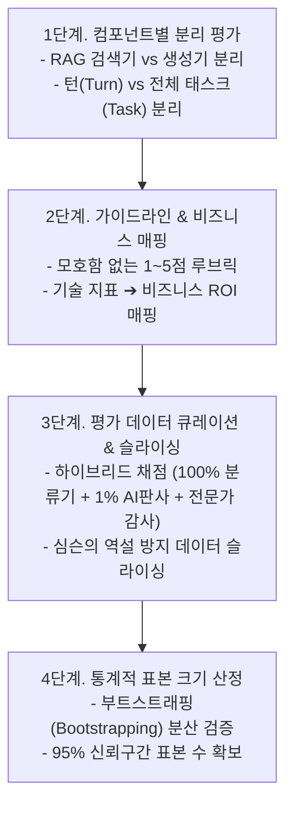

# 04. 실무 평가 파이프라인 구축 4단계와 표본 크기 산정

## 📌 핵심 요약 & 전체 맥락
> **"믿을 수 있는 자체 평가 파이프라인이 없는 AI 개발은 눈을 가리고 운전하는 것과 같다."**  
> 공개 벤치마크의 오염과 한계를 극복하기 위해, 기업은 자사 비즈니스에 특화된 **독립적인 실무 평가 파이프라인 4단계**를 반드시 설계해야 합니다.  
> 시스템 전체를 뭉뚱그려 평가하지 않고 **RAG 검색기(Retriever)와 생성기(Generator)를 분리 평가**해야 하며, 전체 평균의 착시로 인해 서브그룹의 진실이 왜곡되는 **심슨의 역설(Simpson's Paradox)**을 방지하기 위해 데이터 슬라이싱(Data Slicing)을 수행해야 합니다.  
> 또한, 모델 간 3%의 성능 차이를 95% 신뢰도로 검증하려면 최소 1,000개의 표본이 필요하다는 **통계적 표본 크기 산정 법칙**을 준수해야 합니다.

---

## 🗺️ 도표(Figure & Table) 색인 및 매핑 가이드

본문의 핵심 원리를 시각적으로 확인할 수 있는 책 내 도표의 위치와 해설 매핑입니다:

| 도표 번호 | 도표 제목 및 핵심 내용 | 책 페이지 | 본문 해당 주제 |
| :---: | :--- | :---: | :--- |
| **Table 4-6** | 전체 평균과 부분 그룹의 결과가 정반대로 뒤집히는 심슨의 역설(Simpson's Paradox) 실증 데이터 | **p. 205** | 3. 데이터 슬라이싱과 심슨의 역설 |
| **Table 4-7** | 감지하려는 점수 차이(30%~1%)에 따라 95% 신뢰도를 확보하는 데 필요한 표본 크기 산정표 | **p. 207** | 4. 통계적 표본 크기 산정 법칙 |

---

## 1. 실무 평가 파이프라인 구축 4단계 프레임워크 (pp. 200 ~ 207)

---

### Step 1. 시스템의 모든 컴포넌트 분리 평가 (pp. 200 ~ 202)
* **종단간(E2E) 평가의 맹점:**  
  최종 결과물만 보고 "답변이 틀렸네"라고 0점을 주면, 정작 엔지니어는 어디를 고쳐야 할지 알 수 없습니다. RAG(검색 증강 생성) 시스템에서 답변이 틀리는 이유는 두 가지 중 하나입니다. **검색기(Retriever)가 엉뚱한 문서를 찾아왔거나**, 아니면 **생성기(Generator)가 올바른 문서를 받고도 헛소리(환각)를 한 경우**입니다.
* **친절한 분리 평가 가이드:**
  1. **RAG 파이프라인 분리:**
     * **검색기 평가:** "질문에 딱 맞는 핵심 문서를 상위 5개 안에 잘 가져왔는가?" (Hit Rate, MRR 지표 사용)
     * **생성기 평가:** "가져온 문서에 있는 내용만 바탕으로 거짓(환각) 없이 답변을 작성했는가?" (Faithfulness 지표 사용)
  2. **대화형 에이전트 분리:**
     * **턴 단위(Turn-based):** 한 번의 핑퐁 대화에서 챗봇의 문장이 자연스러운가?
     * **태스크 단위(Task-based):** 10번 대화하더라도 결국 "항공권 예매 완료"라는 최종 미션을 달성했는가? (아무리 말이 유창해도 예매에 실패하면 태스크 평가는 0점입니다).

---

### Step 2. 평가 가이드라인과 비즈니스 메트릭 매핑 (pp. 202 ~ 203)
* **모호함 없는 루브릭(Rubric) 작성하기:**  
  평가자에게 "답변이 유용한가요? 1~5점" 처럼 대충 기준을 주면 사람마다, AI 판사마다 점수가 널뛰기합니다. **구체적인 채점표(루브릭)**가 반드시 필요합니다.
  > **[ 1~5점 채점 루브릭 예시 ]**
  > * 1점: 질문과 완전히 무관하거나 유해한 답변
  > * 3점: 관련은 있으나 핵심 정보가 빠졌거나 사실 관계가 일부 틀린 답변
  > * 5점: 질문의 모든 의도를 파악하고, 사실에 기반하여 완벽하게 해결책을 제시한 답변
* **기술 지표를 돈(ROI)으로 환산하기:**
  경영진을 설득하려면 AI의 정확도가 비즈니스에 어떤 가치를 주는지 연결해야 합니다.
  * *"AI의 답변 사실성이 90%를 넘으면 ➔ 콜센터 상담원의 단순 문의 티켓 50%를 자동화하여 월 OOO만 원의 인건비를 절감할 수 있습니다."*

---

### Step 3. 하이브리드 평가 및 데이터 슬라이싱 (pp. 204 ~ 206)

#### ① 비용 최적화 하이브리드 평가 아키텍처
수백만 건의 대화를 모두 비싼 GPT-4나 더 비싼 인간 전문가에게 채점 맡길 수는 없습니다. 따라서 **비용 효율적인 3중 방어선**을 구축해야 합니다.
1. **소형 분류기 (매우 저렴):** 전체 트래픽(100%)을 실시간 감시하며 욕설, 포맷 오류 등 단순한 문제를 1차 필터링합니다.
2. **AI 판사 (중간 비용):** 전체 트래픽의 1~5%만 샘플링하여 GPT-4 등 강력한 모델이 복잡한 논리를 채점합니다.
3. **인간 전문가 (매우 비쌈):** LinkedIn의 사례처럼, 매일 500개 정도의 대화만 사내 전문가가 직접 눈으로 꼼꼼히 감사(Audit)하여 AI 판사가 엉뚱하게 채점하지 않는지 교정합니다.

#### ② 데이터 슬라이싱과 심슨의 역설 (Simpson's Paradox) ⭐
전체 평균 점수에만 의존하면, 특정 세부 집단에서 발생하는 치명적인 결함을 놓칠 수 있습니다. 이를 막기 위해 데이터를 **유료/무료 고객, 모바일/웹 사용자, 쉬운 쿼리/어려운 쿼리 등 여러 조각(Slice)으로 쪼개서 평가**해야 합니다.

| 모델 | 그룹 1 (쉬운 쿼리) | 그룹 2 (어려운 쿼리) | **전체 종합 (Overall)** |
| :---: | :---: | :---: | :---: |
| **Model A** | **93%** (81/87) | **73%** (192/263) | **78%** (273/350) ❌ 패배 |
| **Model B** | 87% (234/270) | 69% (55/80) | **83%** (289/350) 🏆 승리 |

> ⚠️ **심슨의 역설 해설 (Table 4-6 쉽게 이해하기):**  
> 언뜻 보면 전체 점수(83%)가 높은 **Model B**가 더 좋아 보입니다. 하지만 그룹별로 쪼개서 속사정을 보면 쉬운 문제(그룹 1)도, 어려운 문제(그룹 2)도 모두 **Model A**가 더 잘 풀었습니다! 
> 왜 이런 역설이 발생했을까요? **Model A는 하필 자기가 풀기 '어려운 쿼리'를 압도적으로 많이 배정받아서 전체 평균 점수가 깎인 억울한 상황**이기 때문입니다. 데이터를 쪼개보지 않고 평균만 믿었다면 훨씬 똑똑한 Model A를 탈락시키는 끔찍한 실수를 저질렀을 것입니다.

---

### Step 4. 통계적 표본 크기 산정 법칙 (pp. 206 ~ 207)
새 프롬프트를 적용했더니 점수가 2% 올랐습니다. 이게 진짜 똑똑해진 걸까요, 아니면 그냥 이번 시험 문제가 쉬워서 운이 좋았던 걸까요? 이를 수학적으로 증명하려면 **충분히 많은 시험 문제(표본 수)**가 필요합니다.

| 감지하려는 점수 차이 | 95% 신뢰도를 위한 최소 표본 수 | 설명 |
| :---: | :---: | :--- |
| **30% 차이** (압도적 변화) | **~10 개** | 고작 10문제만 풀어봐도 차이가 확 날 만큼 두 모델의 실력 격차가 큽니다. |
| **10% 차이** (명확한 개선) | **~100 개** | 보통 새로운 기술 도입 여부를 결정(PoC)할 때 진행하는 기본 테스트 수량입니다. |
| **3% 차이** (미세 최적화) | **~1,000 개** | 글로벌 표준 벤치마크들이 보통 1,000문제 이상으로 넉넉하게 구성되는 이유입니다. |
| **1% 차이** (정밀 튜닝) | **~10,000 개** | 구글이나 넷플릭스처럼 대규모 트래픽에서 미세한 A/B 테스트를 할 때 필요합니다. |

> 💡 **황금률칙:** 점수 차이를 미세하게 감지하려고 할수록(30% ➔ 10% ➔ 3%), 필요한 표본 수는 **기하급수적(10배씩)**으로 폭증합니다.

---

### Step 5. 평가 파이프라인 자체의 신뢰성 검증 (Evaluate your evaluation pipeline, pp. 207 ~ 208) ⭐
평가 시스템을 구축한 후에는, **"내 평가 시스템 자체가 믿을 만한가?"**를 반드시 검증해야 합니다.
1. **신호의 정확성 (Right Signals):** AI 판사가 더 높은 점수를 준 답변이 실제로 인간이 보기에도 더 좋은 답변인가? 비즈니스 성과와 연결되는가?
2. **신뢰성과 일관성 (Reliability):** 동일한 평가 파이프라인을 두 번 돌렸을 때 점수가 다르게 나오진 않는가? (AI 판사의 Temperature는 무조건 0으로 고정해야 함).
3. **메트릭 간 상관관계 (Correlation):** 두 평가지표가 완벽히 동일한 상관관계를 보인다면 하나는 제거하여 비용을 아끼고, 아예 상관관계가 없다면 지표 설계가 잘못되지 않았는지 의심해야 합니다.
4. **비용 및 지연시간 추가 폭:** 평가 파이프라인(예: SelfCheckGPT)이 메인 애플리케이션의 속도를 과도하게 늦추거나 비용을 폭증시키지 않는지 모니터링해야 합니다.

---

## 2. 지속적 평가(Continuous Evaluation)와 피드백 루프 (pp. 208 ~ 210)

서비스를 오픈한 이후에도 평가는 끝나지 않습니다. 실제 유저들의 반응을 보며 파이프라인을 24시간 내내 계속 개선해야 합니다.

* **명시적 피드백 (Explicit Feedback):**  
  유저가 직접 👍(좋아요), 👎(싫어요) 버튼을 누르거나 신고하는 것입니다. 신뢰도는 매우 높지만, 유저들이 귀찮아서 전체 트래픽의 1%도 누르지 않는다는 데이터 희소성 단점이 있습니다.
* **암묵적 피드백 (Implicit Feedback):**  
  유저가 아무 버튼을 누르지 않아도, 유저의 행동 패턴을 관찰하여 평가하는 것입니다. 
  * 예: 챗봇이 코드를 짜줬는데 유저가 **'복사(Copy) 버튼'**을 눌렀다면? ➔ 매우 유용한 답변으로 간주.
  * 예: 답변을 보자마자 3초 만에 **'재질문(Regenerate)'**을 눌렀다면? ➔ 쓰레기 답변으로 간주.
  이 방식은 엄청난 양의 평가 데이터를 자동으로 수집할 수 있게 해줍니다.

---

## 🔗 연관 문서
* [[00-ch04-overview|00. Chapter 4 전체 개요 및 목차]]
* [[01-evaluation-driven-development-and-criteria|01. 평가 주도 개발(EDD)과 7대 평가 기준]]
* [[02-model-selection-and-apis-vs-self-hosting|02. 모델 선정 워크플로우와 API vs 자체 호스팅]]
* [[03-navigating-public-benchmarks-and-pitfalls|03. 공개 벤치마크 탐색과 4대 함정]]
