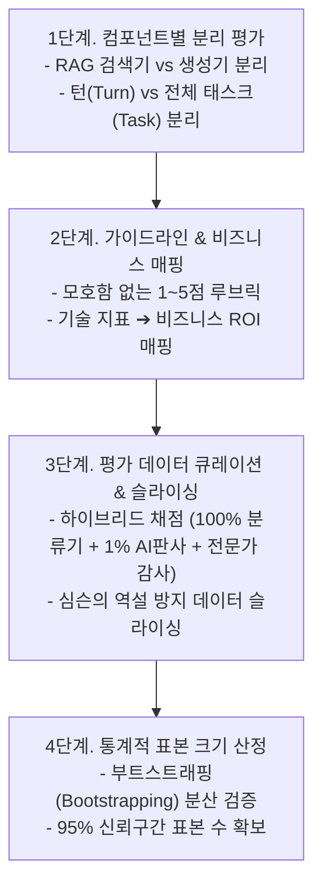

# 04. 실무 평가 파이프라인 구축 4단계와 표본 크기 산정

## 📌 핵심 요약 & 전체 맥락
> **"믿을 수 있는 자체 평가 파이프라인이 없는 AI 개발은 눈을 가리고 운전하는 것과 같다."**  
> 공개 벤치마크의 오염과 한계를 극복하기 위해, 기업은 자사 비즈니스에 특화된 **독립적인 실무 평가 파이프라인 4단계**를 반드시 설계해야 합니다.  
> 시스템 전체를 뭉뚱그려 평가하지 않고 **RAG 검색기(Retriever)와 생성기(Generator)를 분리 평가**해야 하며, 전체 평균의 착시로 인해 서브그룹의 진실이 왜곡되는 **심슨의 역설(Simpson's Paradox)**을 방지하기 위해 데이터 슬라이싱(Data Slicing)을 수행해야 합니다.  
> 또한, 모델 간 3%의 성능 차이를 95% 신뢰도로 검증하려면 최소 1,000개의 표본이 필요하다는 **통계적 표본 크기 산정 법칙**을 준수해야 합니다.

---

## 🗺️ 도표(Figure & Table) 색인 및 매핑 가이드

본문의 핵심 원리를 시각적으로 확인할 수 있는 책 내 도표의 위치와 해설 매핑입니다:

| 도표 번호 | 도표 제목 및 핵심 내용 | 책 페이지 | 본문 해당 주제 |
| :---: | :--- | :---: | :--- |
| **Table 4-6** | 전체 평균과 부분 그룹의 결과가 정반대로 뒤집히는 심슨의 역설(Simpson's Paradox) 실증 데이터 | **p. 205** | 3. 데이터 슬라이싱과 심슨의 역설 |
| **Table 4-7** | 감지하려는 점수 차이(30%~1%)에 따라 95% 신뢰도를 확보하는 데 필요한 표본 크기 산정표 | **p. 207** | 4. 통계적 표본 크기 산정 법칙 |

---

## 1. 실무 평가 파이프라인 구축 4단계 프레임워크 (pp. 200 ~ 207)



---

### Step 1. 시스템의 모든 컴포넌트 분리 평가 (pp. 200 ~ 202)
* **종단간(E2E) 평가의 맹점:**  
  전체 시스템의 최종 출력만 보고 채점하면, 결과가 나빴을 때 **"검색기가 엉뚱한 문서를 가져온 탓인지, LLM이 문서를 잘못 읽고 환각을 일으킨 탓인지"** 원인을 진단할 수 없습니다.
* **컴포넌트 분리 평가의 원칙:**
  1. **RAG 파이프라인 분리:**
     * **검색기(Retriever):** Hit Rate, MRR (질문에 필요한 문서를 잘 찾아왔는가?)
     * **생성기(Generator):** Faithfulness, Groundedness (가져온 문서를 바탕으로 거짓 없이 썼는가?)
  2. **대화형 에이전트 분리:**
     * **턴 단위(Turn-based):** 한 번의 주고받는 대화에서 문장이 자연스럽고 유용한가?
     * **태스크 단위(Task-based / Multi-turn):** 10번의 대화를 거쳐 사용자가 원래 달성하려던 최종 목표(예: 항공권 예약 완료)를 성공했는가?

---

### Step 2. 평가 가이드라인과 비즈니스 메트릭 매핑 (pp. 202 ~ 203)
* **모호함 없는 루브릭(Rubric):**  
  채점 기준이 모호하면 인간 검수자와 AI 판사 모두 점수가 흔들립니다. 1점부터 5점까지 구체적인 예시와 엣지 케이스 판단 기준을 문서화해야 합니다.
* **기술 메트릭 ➔ 비즈니스 ROI 연결:**
  * *"사실성 80% 달성 시 ➔ 고객센터 티켓 30% 자동화 가능 (일반 안내)"*
  * *"사실성 90% 달성 시 ➔ 고객센터 티켓 50% 자동화 가능 (환불 안내)"*
  * *"사실성 98% 달성 시 ➔ 고객센터 티켓 90% 자동화 가능 (계좌 결제 처리)"*
* **유용성 임계치 (Usefulness Threshold):** 최소 50%의 사실성을 넘기지 못하면 서비스 배포 자체가 불가능하다는 하한선을 설정.

---

### Step 3. 하이브리드 평가 및 데이터 슬라이싱 (pp. 204 ~ 206)

#### ① 비용 최적화 하이브리드 평가 아키텍처
* **계층형 검증:** 저렴한 소형 분류기로 전체 트래픽(100%)을 상시 감시하고, 고성능 AI 판사로 1%를 정밀 감사하며, **LinkedIn처럼 매일 500개 대화를 사내 인간 전문가가 직접 검수**하는 다층 방어선 구축.

#### ② 데이터 슬라이싱과 심슨의 역설 (Simpson's Paradox, Table 4-6) ⭐
전체 평균 데이터만 보면 보이지 않던 치명적 결함이 데이터를 세부 집단(유료 고객 vs 무료 고객, 모바일 vs 웹, 짧은 입력 vs 긴 입력)으로 쪼갰을 때 드러납니다.

| 모델 | 그룹 1 (쉬운 쿼리) | 그룹 2 (복잡한 쿼리) | **전체 종합 (Overall)** |
| :---: | :---: | :---: | :---: |
| **Model A** | **93%** (81/87) | **73%** (192/263) | **78%** (273/350) ❌ 패배 |
| **Model B** | 87% (234/270) | 69% (55/80) | **83%** (289/350) 🏆 승리 |

> ⚠️ **심슨의 역설 해설 (Table 4-6):**  
> 개별 그룹 1에서도 Model A가 이기고($93\% > 87\%$), 개별 그룹 2에서도 Model A가 이겼으나($73\% > 69\%$), **전체 합산에서는 엉뚱하게 Model B가 이기는 현상**이 발생합니다. Model A에게 훨씬 어려운 그룹 2의 데이터 비중이 높았기 때문입니다. **데이터 슬라이싱 없이 전체 평균만 보면 더 우수한 Model A를 버리는 치명적 오판**을 하게 됩니다.

---

### Step 4. 통계적 표본 크기 산정 법칙 (pp. 206 ~ 207)

새로운 프롬프트나 모델을 도입했을 때, 점수가 오른 것이 **단순한 우연(Noise)이 아니라 진짜 개선된 것임을 95% 신뢰도로 증명**하기 위해 필요한 최소 표본 수입니다:

| 감지하려는 점수 차이 ($\Delta$) | 95% 신뢰도를 위한 최소 표본 수 | 비고 |
| :---: | :---: | :--- |
| **30% 차이** (압도적 변화) | **~10 개** | 눈으로도 바로 구분 가능 |
| **10% 차이** (명확한 개선) | **~100 개** | 기본적인 PoC 검증 수준 |
| **3% 차이** (미세 최적화) | **~1,000 개** | 글로벌 표준 벤치마크 권장 크기 |
| **1% 차이** (정밀 튜닝) | **~10,000 개** | 대규모 프로덕션 A/B 테스트 |

> 💡 **표본 크기 확장 황금률 (Footnote 28):**  
> 감지하려는 점수 차이가 **3배 줄어들 때마다($30\% \to 10\% \to 3\%$), 필요한 표본 수는 10배씩 기하급수적으로 폭증**합니다 ($\because \sqrt{10} \approx 3.16$).

---

## 2. 지속적 평가(Continuous Evaluation)와 Chapter 4 종합 (pp. 208 ~ 210)

```
[ AI 시스템의 4단계 라이프사이클 평가 파이프라인 ]

1. 요구사항 정의  ──▶ 파레토 최적화 (품질 vs 비용 vs TTFT 지연시간)
2. 모델/인프라    ──▶ 상용 API vs 자체 호스팅 TCO 손익분기점 분석
3. 벤치마크 검증  ──▶ 오염된 공개 시험지 탈피, 사내 슬라이싱 데이터셋 구축
4. 프로덕션 운영  ──▶ 100% 소형 분류기 + 1% AI판사 + 전문가 감사 + 온라인 피드백 루프
```

* **온라인 피드백 플라이휠 (Explicit vs Implicit Feedback):**  
  프로덕션 단계에서는 사용자의 피드백을 실시간으로 수집하여 평가 파이프라인을 지속적으로 개선해야 합니다.
  * **명시적 피드백 (Explicit):** Thumbs up/down, 별점, 신고 버튼. (신뢰도는 높으나 전체 사용자의 1% 미만만 참여하여 데이터가 희소함).
  * **암묵적 피드백 (Implicit):** 페이지 체류 시간(Dwell time), 텍스트 복사하기, 코드 제안 수락(Acceptance), 재질문(Regeneration) 여부 등. (풍부한 데이터를 제공하며 모델의 실질적 유용성을 강력하게 대변함).
* **파이프라인 재현성 확보:** AI 판사를 쓸 때는 반드시 `temperature = 0`으로 고정하여 채점 변동성을 억제하고, 프롬프트 버전 및 루브릭 변경 이력을 철저히 트래킹해야 합니다.

---

## 🔗 연관 문서
* [[00-ch04-overview|00. Chapter 4 전체 개요 및 목차]]
* [[01-evaluation-driven-development-and-criteria|01. 평가 주도 개발(EDD)과 7대 평가 기준]]
* [[02-model-selection-and-apis-vs-self-hosting|02. 모델 선정 워크플로우와 API vs 자체 호스팅]]
* [[03-navigating-public-benchmarks-and-pitfalls|03. 공개 벤치마크 탐색과 3대 함정]]
