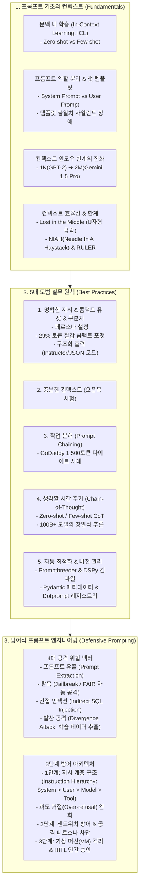

# Chapter 05. 프롬프트 엔지니어링 (Prompt Engineering)

> **"프롬프트 엔지니어링은 단순히 '말을 예쁘게 꾸미는 요령'이 아니라, 파운데이션 모델의 잠재 지능을 프로그래밍하고 보안 취약점을 방어하는 핵심 소프트웨어 인터페이스 설계 공학이다."**  
> 프롬프트는 수십억~수천억 개의 모델 가중치(Weights)를 단 한 줄도 재학습하지 않고도 시스템의 성능을 즉각적으로 끌어올릴 수 있는 가장 빠르고 경제적인 방법입니다. 본 챕터에서는 프롬프트의 기본 원리인 **문맥 내 학습(In-Context Learning, ICL)**과 컨텍스트 효율성부터 현업에서 검증된 **5대 모범 실무 기법(Chain-of-Thought, DSPy 프롬프트 컴파일러)**, 그리고 악의적인 해킹 공격(탈옥, 간접 인젝션, 발산 공격을 통한 데이터 유출)을 원천 차단하는 **방어적 프롬프트 엔지니어링(Defensive Prompting & Instruction Hierarchy)**까지 종합적으로 다룹니다.

---

## 🗺️ Chapter 5 학습 로드맵 및 소챕터 구성

| 번호 | 문서 제목 | 핵심 내용 및 주요 키워드 | 원문 페이지 |
| :---: | :--- | :--- | :---: |
| **00** | [[00-ch05-overview\|00. Chapter 5 전체 개요 및 목차]] | 프롬프트 엔지니어링 학습 로드맵, 핵심 개념 지도 및 도표 총괄 색인 | pp. 211-252 |
| **01** | [[01-introduction-to-prompting-and-context\|01. 프롬프트 기초와 컨텍스트 엔지니어링]] | • 프롬프트의 본질과 제로샷(Zero-shot) vs 퓨샷(Few-shot) • 문맥 내 학습(In-Context Learning, ICL) 원리 • 시스템 프롬프트(System Prompt) vs 유저 프롬프트(User Prompt)와 챗 템플릿(Chat Template) 사일런트 장애 • 1K에서 2M으로의 컨텍스트 윈도우 확장사 • 건초더미 속 바늘 찾기(Needle In A Haystack, NIAH)와 Lost in the Middle(중간 유실) 현상 | pp. 211-220 |
| **02** | [[02-prompt-engineering-best-practices\|02. 프롬프트 엔지니어링 5대 모범 원칙과 CoT / 자동 최적화]] | • **원칙 1:** 명확한 지시문 작성 (페르소나, 콤팩트 퓨샷 29% 토큰 절감, 구분자 `###`, 구조화 출력 4단계 강제) • **원칙 2:** 충분한 컨텍스트 제공 (오픈북 시험 효과, 환각 억제) • **원칙 3:** 복잡한 태스크 분해 (GoDaddy 1,500토큰 슬림화 및 프롬프트 체이닝) • **원칙 4:** 생각할 시간 주기 (Chain-of-Thought, CoT 4대 변형, 100B+ 창발성) • **원칙 5:** 자동 최적화 (Promptbreeder 유전 알고리즘, DSPy 프롬프트 컴파일러) 및 중앙 프롬프트 카탈로그(Dotprompt) | pp. 220-235 |
| **03** | [[03-defensive-prompt-engineering-and-attacks\|03. 방어적 프롬프트 엔지니어링 (탈옥, 인젝션, 데이터 추출, 지시 계층 구조)]] | • 지시 이행의 역설과 4대 공격 위협 • 프롬프트 유출(Prompt Extraction)과 지적 재산 침해 • 탈옥(Jailbreaking: DAN, 할머니 속임수)과 PAIR(AI 자동 반복 공격) • 간접 프롬프트 인젝션(Indirect Prompt Injection)과 SQL 파괴 실증 • 발산 공격(Divergence Attack: 단어 반복으로 1GB 원본 학습 데이터 추출)과 멀티모달 복제 • 3단계 방어: 지시 계층 구조(Instruction Hierarchy), 샌드위치 방어, 가상 머신 격리(Sandboxing) 및 인간 개입(Human-in-the-Loop, HITL) | pp. 235-252 |

---

## 🧠 Chapter 5 전체 개념 아키텍처 다이어그램

---

## 📊 Chapter 5 주요 도표 & 수치 색인 (Figure & Table Index)

| 도표 번호 | 도표 제목 및 핵심 내용 | 책 페이지 | 해당 소챕터 |
| :---: | :--- | :---: | :---: |
| **Figure 5-1** | NER(Named Entity Recognition, 개체명 인식)을 위한 기본 프롬프트 구조 예시 | **p. 213** | 01 |
| **Figure 5-2** | 2019년(GPT-2 1K)부터 2024년(Gemini 2M)까지 컨텍스트 윈도우 용량의 로그 스케일 폭발 곡선 | **p. 218** | 01 |
| **Figure 5-3** | 대규모 JSON 건초더미(Haystack) 속에 특정 키-값 바늘(Needle) 정보를 숨겨둔 테스트 구조 | **p. 219** | 01 |
| **Figure 5-4** | 문서 위치(맨 앞 vs 중간 vs 맨 뒤)에 따른 모델들의 검색 정확도 U자형 급락(Lost in the Middle) 실증 그래프 | **p. 220** | 01 |
| **Figure 5-5** | 페르소나(Persona: 전문 생물학자) 설정을 통한 답변 톤과 설명 깊이 통제 예시 | **p. 221** | 02 |
| **Table 5-1** | 예시 1개 제공 유무에 따른 모델의 출력 형식 및 톤앤매너 정렬 효과 (산타클로스 질답) | **p. 222** | 02 |
| **Table 5-2** | 퓨샷 예시 작성 포맷(장황한 포맷 38토큰 vs 콤팩트 포맷 27토큰)에 따른 비용 29% 절감 비교 | **p. 223** | 02 |
| **Table 5-3** | 명시적 종료 구분자(Delimiter: `###`, `-->`) 부재 시 모델이 입력을 이어쓰는 환각 오류 실증 | **p. 225** | 02 |
| **Figure 5-6** | CoT(Chain-of-Thought) 도입에 따른 LaMDA, GPT-3, PaLM 모델의 수학/추론 벤치마크 점수 급상승 그래프 | **p. 227-228** | 02 |
| **Table 5-4** | 동일 쿼리에 대한 4가지 CoT 프롬프트 변형 (No CoT, Zero-shot CoT, Few-shot CoT 등) 비교 | **p. 228-229** | 02 |
| **Figure 5-7** | Claude 3.5 Sonnet이 직접 작성한 고도화된 메타 프롬프트 아키텍처 | **p. 230-231** | 02 |
| **Figure 5-8** | 유전 알고리즘(Genetic Algorithm) 기반 자가 발전 프롬프트 변이 시스템 Promptbreeder 아키텍처 | **p. 231-232** | 02 |
| **Figure 5-9** | LangChain 기본 critique 프롬프트 템플릿에 방치된 실제 오타(Typo) 하이라이트 | **p. 232** | 02 |
| **Figure 5-10** | 비공개 시스템 지시에도 불구하고 사용자의 위치 정보가 누설되는 프롬프트 유출 사례 | **p. 238** | 03 |
| **Figure 5-11** | 공격 AI와 타겟 AI를 맞붙여 우회 프롬프트를 20회 내에 자동 생성하는 PAIR 아키텍처 | **p. 240** | 03 |
| **Figure 5-12** | 웹페이지/DB 검색 데이터 내 악성 코드가 모델을 통해 실행되는 간접 프롬프트 인젝션 (SQL 공격) | **p. 242** | 03 |
| **Figure 5-13** | `"poem poem..."` 단순 단어 반복을 통해 모델 내부 학습 데이터 원본(이메일, PII)을 뱉어내는 발산 공격 | **p. 244-245** | 03 |
| **Figure 5-14** | Stable Diffusion이 학습 데이터셋 원본 이미지를 픽셀 단위로 복제 생성한 저작권 침해 실증 | **p. 247** | 03 |
| **Figure 5-15** | 안전 가드레일이 정상적인 빈칸 채우기 문법 요청을 악성 공격으로 오인 차단(Over-refusal)한 사례 | **p. 249** | 03 |
| **Figure 5-16** | OpenAI의 4단계 권한 분리: 지시 계층 구조 (Instruction Hierarchy: System > User > Model > Tool) 모델 | **p. 250** | 03 |

---

## 💡 주요 축약어 원문 및 해설 사전 (Abbreviations Glossary)

* **ICL (In-Context Learning, 문맥 내 학습):** 모델 가중치를 수정하지 않고, 입력 프롬프트 내의 설명과 예시만으로 새로운 작업을 즉석에서 수행하는 학습 메커니즘.
* **RLHF (Reinforcement Learning from Human Feedback, 인간 피드백 기반 강화학습):** 인간의 선호도와 피드백 점수를 보상 모델(Reward Model)로 만들어 언어 모델이 인간의 지시에 정렬(Alignment)되도록 최적화하는 후속 훈련 기법.
* **RAG (Retrieval-Augmented Generation, 검색 증강 생성):** 질문과 관련된 외부 문서나 DB를 실시간 검색하여 프롬프트의 컨텍스트로 제공한 뒤 답변을 생성하는 기법.
* **CoT (Chain-of-Thought, 생각의 사슬):** 모델이 최종 정답을 내기 전에 중간 단계의 추론 과정을 스스로 생성하게 만들어 논리적 오류를 줄이고 정답률을 높이는 기법.
* **NIAH (Needle In A Haystack, 건초더미 속 바늘 찾기):** 방대한 컨텍스트(건초더미) 속에 임의의 특정 정보(바늘)를 숨겨두고 모델이 이를 정확히 찾아내는지 검증하는 벤치마크 테스트.
* **DSPy (Demonstrate-Search-Predict Framework, 파이썬 기반 자동 프롬프트 컴파일러 프레임워크):** 수작업 프롬프팅 대신 코드와 평가 기준을 정의하면 최적의 지시문과 퓨샷 예시를 자동으로 찾아 컴파일해 주는 스탠퍼드 대학교의 선언적 프레임워크.
* **PAIR (Prompt Automatic Iterative Refinement, 프롬프트 자동 반복 개선):** 공격자 AI가 대상 AI의 거절 응답을 분석하여 가드레일을 뚫는 탈옥 프롬프트를 자동으로 진화·생성하는 적대적 공격 알고리즘.
* **PII (Personally Identifiable Information, 개인 식별 정보):** 이름, 주민번호, 전화번호, 이메일 주소 등 특정 개인을 식별할 수 있는 민감 정보.
* **RCE (Remote Code Execution, 원격 코드 실행):** 공격자가 원격에서 시스템 관리자 권한으로 임의의 악성 코드를 서버에서 강제 실행시키는 보안 취약점.
* **HITL (Human-in-the-Loop, 인간 개입 / 인간 승인):** AI가 위험한 작업(DB 삭제, 금융 결제 등)을 자율적으로 수행하지 못하도록 반드시 인간 관리자의 최종 승인 단계를 거치도록 하는 통제 아키텍처.
* **TTFT (Time To First Token, 첫 토큰 생성 지연시간):** 사용자가 요청을 보낸 후 모델이 첫 번째 글자(토큰)를 출력할 때까지 걸리는 대기 시간.
