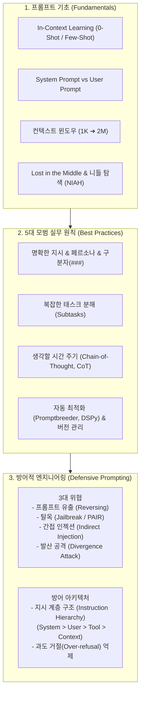

# Chapter 05. 프롬프트 엔지니어링 (Prompt Engineering)

> **"프롬프트 엔지니어링은 단순히 '말을 예쁘게 하는 법'이 아니라, 파운데이션 모델의 잠재력을 극대화하고 보안 취약점을 방어하는 핵심 소프트웨어 인터페이스 설계 공학이다."**  
> 프롬프트는 모델의 가중치를 단 한 줄도 수정하지 않고도 즉각적으로 성능을 극대화할 수 있는 가장 빠르고 경제적인 방법입니다. 본 챕터에서는 프롬프트의 기본 원리(In-Context Learning, 컨텍스트 효율성)부터 5대 모범 실무 기법(CoT, 프롬프트 최적화 도구), 그리고 해킹 공격(탈옥, 프롬프트 인젝션, 데이터 추출)을 막아내는 방어적 프롬프트 엔지니어링(Defensive Prompting)까지 종합적으로 다룹니다.

---

## 🗺️ Chapter 5 학습 로드맵 및 소챕터 구성

| 번호 | 문서 제목 | 핵심 내용 및 주요 키워드 | 원문 페이지 |
| :---: | :--- | :--- | :---: |
| **00** | [[00-ch05-overview\|00. Chapter 5 전체 개요 및 목차]] | 프롬프트 엔지니어링 학습 로드맵, 핵심 개념 지도 및 도표 총괄 색인 | pp. 211-252 |
| **01** | [[01-introduction-to-prompting-and-context\|01. 프롬프트 기초와 컨텍스트 엔지니어링 (In-Context Learning, Lost in the Middle)]] | 제로샷 vs 퓨샷(In-Context Learning), 시스템 vs 유저 프롬프트, 1K➔2M 컨텍스트 확장사, 니들 인 어 헤이스택(NIAH)과 Lost in the Middle 현상 (pp. 211-220) | `In-Context Learning`, `Zero-shot`, `Few-shot`, `System Prompt`, `Lost in the Middle`, `Context Efficiency` |
| **02** | [[02-prompt-engineering-best-practices\|02. 프롬프트 엔지니어링 5대 모범 원칙과 CoT / 자동 최적화]] | 명확한 지시(페르소나/구분자), 퓨샷 토큰 비용 최적화, 작업 분해, 생각의 사슬(CoT), 자동 프롬프트 생성(Promptbreeder, DSPy), 프롬프트 버전 관리 (pp. 220-235) | `Persona`, `Delimiters`, `Chain-of-Thought (CoT)`, `Promptbreeder`, `DSPy`, `Prompt Versioning` |
| **03** | [[03-defensive-prompt-engineering-and-attacks\|03. 방어적 프롬프트 엔지니어링 (탈옥, 인젝션, 데이터 추출, 지시 계층 구조)]] | 프롬프트 유출(역공학), 탈옥(PAIR 기법), 간접 프롬프트 인젝션, 발산 공격(Divergence Attack: 학습 데이터 추출), 방어 전략 및 지시 계층 구조(Instruction Hierarchy) (pp. 235-252) | `Prompt Injection`, `Jailbreaking`, `PAIR`, `Divergence Attack`, `Over-refusal`, `Instruction Hierarchy` |

---

## 🧠 Chapter 5 전체 개념 아키텍처 다이어그램

---

## 📊 Chapter 5 주요 도표 & 수치 색인

| 도표 번호 | 도표 제목 및 핵심 내용 | 책 페이지 | 해당 소챕터 |
| :---: | :--- | :---: | :---: |
| **Figure 5-1** | NER(개체명 인식)을 위한 기본 프롬프트 구조 예시 | **p. 213** | 01 |
| **Figure 5-2** | 2019년(1K)부터 2024년(2M)까지의 컨텍스트 윈도우 한계 폭발적 확장 추세 | **p. 218** | 01 |
| **Figure 5-3** | 대규모 건초더미(Haystack) 속에 바늘(Needle) 정보를 삽입하는 테스트 구조 | **p. 219** | 01 |
| **Figure 5-4** | 삽입 위치(문서 맨 앞 vs 중간 vs 맨 뒤)에 따른 검색 정확도 하락(Lost in the Middle) 그래프 | **p. 220** | 01 |
| **Figure 5-5** | 페르소나(Persona: 전문 생물학자) 설정을 통한 답변 톤과 깊이 통제 예시 | **p. 221** | 02 |
| **Table 5-1** | 예시 1개 제공 유무에 따른 모델의 출력 형식 정렬 효과 | **p. 222** | 02 |
| **Table 5-2** | 퓨샷 예시 포맷(JSON vs 콤팩트 텍스트)에 따른 토큰 비용 및 지연시간 절감 비교 | **p. 223** | 02 |
| **Table 5-3** | 명시적 구분자(Delimiter: `###`) 부재 시 모델이 입력을 이어쓰는 환각 오류 | **p. 225** | 02 |
| **Figure 5-6** | CoT 도입에 따른 LaMDA, GPT-3, PaLM 모델의 수학/추론 벤치마크 점수 급상승 | **p. 227** | 02 |
| **Table 5-4** | 동일 쿼리에 대한 4가지 CoT 프롬프트 변형 (Zero-shot CoT, Few-shot CoT 등) | **p. 228** | 02 |
| **Figure 5-7** | Claude 3.5 Sonnet이 작성한 메타 프롬프트 구조 | **p. 230** | 02 |
| **Figure 5-8** | 유전 알고리즘 기반 자가 발전 프롬프트 변이 시스템 Promptbreeder 아키텍처 | **p. 232** | 02 |
| **Figure 5-9** | LangChain 기본 프롬프트 템플릿에 방치된 오타(Typo) 하이라이트 | **p. 234** | 02 |
| **Figure 5-10** | 비공개 지시에도 불구하고 사용자의 위치 정보가 누설되는 프롬프트 유출 사례 | **p. 238** | 03 |
| **Figure 5-11** | 공격 AI와 방어 AI를 맞붙여 우회 프롬프트를 자동 생성하는 PAIR 아키텍처 | **p. 240** | 03 |
| **Figure 5-12** | 웹페이지/DB 검색 데이터 내 악성 코드가 모델을 통해 실행되는 프롬프트 인젝션 | **p. 242** | 03 |
| **Figure 5-13** | `"poem poem..."` 단순 반복을 통해 훈련 데이터 텍스트를 통째로 뱉어내는 발산 공격 | **p. 244** | 03 |
| **Figure 5-14** | Stable Diffusion이 학습 데이터를 원본 그대로 복제 생성한 실제 이미지 사례 | **p. 247** | 03 |
| **Figure 5-15** | 안전 가드레일이 정상적인 빈칸 채우기 요청을 오인 차단(Over-refusal)한 사례 | **p. 249** | 03 |
| **Figure 5-16** | OpenAI의 4단계 권한 분리: 지시 계층 구조 (Instruction Hierarchy) 모델 | **p. 250** | 03 |
