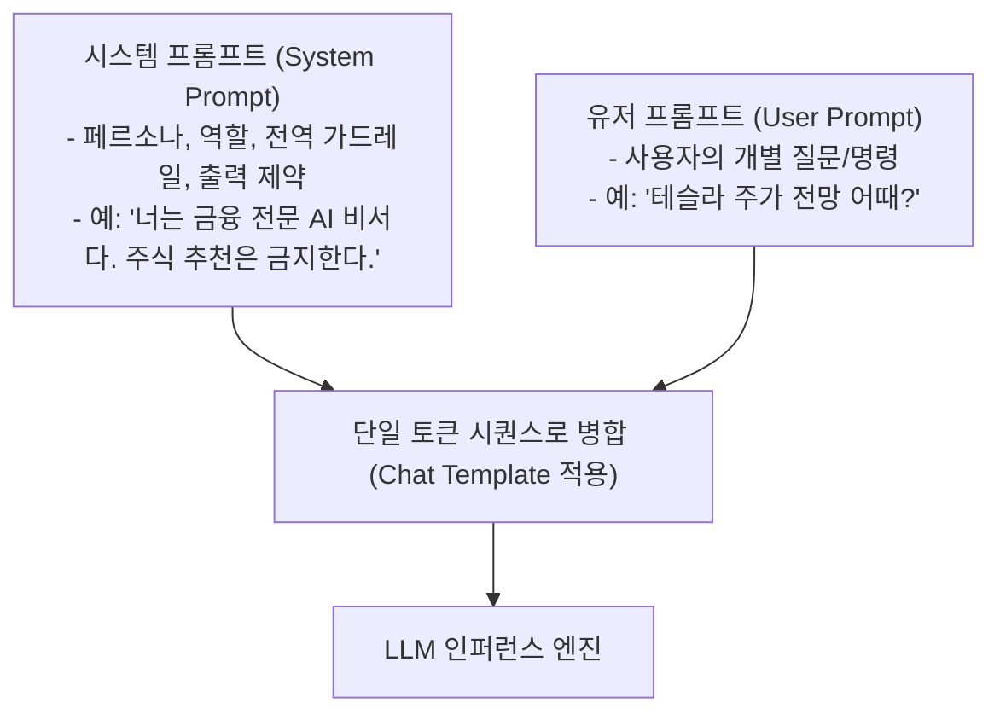

# 01. 프롬프트 기초와 컨텍스트 엔지니어링 (In-Context Learning, Lost in the Middle)

## 📌 핵심 요약 & 전체 맥락
> **"프롬프트(Prompt)는 파운데이션 모델의 가중치(Weights)를 단 한 줄도 수정하지 않고도 모델의 지능을 특정 태스크로 유도하는 가장 가볍고 강력한 프로그래밍 인터페이스입니다."**  
> 모델은 사전 훈련된 방대한 지식을 바탕으로, 프롬프트에 제공된 소수의 예시를 보고 새로운 작업을 즉석에서 학습하는 **문맥 내 학습(In-Context Learning, ICL)** 능력을 발휘합니다.  
> 시스템 프롬프트(System Prompt)는 모델의 행동 규칙과 보안 경계를 정하고, 유저 프롬프트(User Prompt)는 구체적 요청을 전달합니다. 이때 챗 템플릿(Chat Template)이 불일치하면 모델이 조용히 망가지는 **사일런트 장애(Silent Failure)**가 발생합니다.  
> 또한, 2019년 1K에서 2024년 2M으로 컨텍스트 윈도우가 2,000배 폭증했음에도 불구하고, 긴 문서의 중간에 위치한 정보를 제대로 찾지 못하는 **Lost in the Middle 현상**과 **건초더미 속 바늘 찾기(NIAH)**의 통계적 한계를 반드시 이해하고 프롬프트를 설계해야 합니다.

---

## 🗺️ 도표(Figure & Table) 색인 및 매핑 가이드

본문의 핵심 원리를 시각적으로 확인할 수 있는 책 내 도표의 위치와 해설 매핑입니다:

| 도표 번호 | 도표 제목 및 핵심 내용 | 책 페이지 | 본문 해당 주제 |
| :---: | :--- | :---: | :--- |
| **Figure 5-1** | NER(개체명 인식)을 위한 기본 프롬프트 구조 (지시문 + 원문) | **p. 213** | 1. 프롬프트란 무엇인가? |
| **Figure 5-2** | 2019년(GPT-2 1K)부터 2024년(Gemini 2M)까지 컨텍스트 윈도우 한계 폭발적 확장 추세 | **p. 218** | 4. 컨텍스트 길이의 폭발적 확장 |
| **Figure 5-3** | 대규모 JSON 건초더미(Haystack) 속에 특정 키-값 바늘(Needle)을 숨겨둔 프롬프트 예시 | **p. 219** | 4. 니들 인 어 헤이스택 (NIAH) |
| **Figure 5-4** | 문서 위치(1번째 vs 중간 vs 마지막)에 따른 모델들의 검색 정확도 U자형 급락 그래프 | **p. 219-220** | 4. Lost in the Middle 현상 |

---

## 1. 프롬프트 기초와 문맥 내 학습 (In-Context Learning, pp. 211 ~ 215)

### ① 왜 프롬프트 엔지니어링인가? (Why Prompting?)
파운데이션 모델을 특정 업무에 적용하는 방법은 크게 3가지(프롬프팅, RAG, 파인튜닝)가 있습니다. 그중 프롬프트 엔지니어링은:
1. **가중치 업데이트 불필요:** 비싼 GPU 학습 인프라 없이 텍스트 입력만으로 모델을 제어.
2. **초고속 피드백 루프:** 몇 초 만에 프롬프트를 고치고 결과를 검증할 수 있음.
3. **비개발자 친화성:** 도메인 전문가(의사, 변호사, 기획자)가 자연어로 직접 시스템을 튜닝 가능.

```
[ NER(개체명 인식)을 위한 기본 프롬프트 구조 (Figure 5-1, p. 213) ]

[ 지시문 (Instruction) ] : "다음 텍스트에서 모든 조직(Organization) 이름을 추출하시오."
[ 입력 데이터 (Context) ] : "Google과 DeepMind는 런던에서 새로운 연구를 발표했다."
[ 모델의 기대 출력 ]    : Google, DeepMind
```

---

### ② 제로샷(Zero-Shot) vs 퓨샷(Few-Shot)과 ICL 원리
* **문맥 내 학습 (In-Context Learning, ICL):**  
  모델의 내부 파라미터를 수정하지 않고, **입력 프롬프트 안에 주어진 맥락과 예시만 보고 즉석에서 패턴을 추론하여 정답을 맞히는 능력**입니다 (Brown et al., 2020).
* **제로샷 (Zero-Shot):** 예시 없이 태스크 지시문만 주는 방식 (*"이 문장을 프랑스어로 번역하라"*).
* **퓨샷 (Few-Shot):** 지시문과 함께 $K$개의 `(입력, 출력)` 모범 예시 쌍을 제공하는 방식.

```
[ Few-Shot 프롬프트의 3가지 핵심 이점 ]

1. 출력 형식 고정 : JSON, XML, 불릿포인트 등 원하는 포맷을 예시로 직접 보여줌으로써 파싱 에러 방지.
2. 엣지 케이스 명확화 : 모호한 지시(예: "중요한 키워드만 추출")에 대한 기준을 예시를 통해 구체화.
3. 톤앤매너 전이 : 친절한 말투, 간결한 단답형, 전문적인 비즈니스 톤 등 스타일을 즉각 복제.
```

---

## 2. 시스템 프롬프트 vs 유저 프롬프트와 챗 템플릿 (pp. 215 ~ 218)

### ① 시스템 프롬프트(System Prompt)와 유저 프롬프트(User Prompt)



* **시스템 프롬프트가 더 강력하게 작동하는 2가지 이유:**
  1. **위치적 우위:** 최종 결합 프롬프트의 맨 앞에 위치하므로 모델이 우선적으로 주목함.
  2. **지시 계층 구조 (Instruction Hierarchy) 정렬:** 최신 모델(GPT-4, Claude)은 포스트 트레이닝(RLHF)을 통해 **"유저 프롬프트보다 시스템 프롬프트의 명령을 최우선으로 복종하도록"** 안전 정렬되어 있음 (Wallace et al., 2024).

---

### ② 챗 템플릿(Chat Template) 불일치와 사일런트 장애 (Silent Failure) ⚠️
오픈소스 모델(Llama, Mistral)을 서빙할 때 각 모델 제조사마다 고유의 특수 토큰(Special Tokens) 포맷을 사용합니다:

* **ChatML 포맷 (OpenAI, Qwen 등):**
  ```text
  <|im_start|>system
  너는 유용한 AI 비서다.<|im_end|>
  <|im_start|>user
  안녕?<|im_end|>
  <|im_start|>assistant
  ```
* **Llama 포맷 (Meta):**
  ```text
  [INST] <<SYS>>
  너는 유용한 AI 비서다.
  <</SYS>>
  안녕? [/INST]
  ```

> ⚠️ **저자의 현장 경고 (각주 4, 5):**  
> *"라이브러리나 서빙 프레임워크가 모델 버전 업데이트에 맞춰 챗 템플릿을 갱신하지 않으면, 모델이 에러를 뿜으며 죽는 것이 아니라 **어설프게 말을 알아듣는 척하면서 성능이 조용히 곤두박질치는 사일런트 장애(Silent Failure)**가 발생한다. 반드시 최종 모델에 입력되는 원시 텍스트(Raw Prompt)를 `print()`로 찍어 템플릿 일치 여부를 검증하라."*

---

## 3. 컨텍스트 길이의 폭발적 확장과 한계 (pp. 218 ~ 220)

### ① 컨텍스트 윈도우의 2,000배 성장사 (Figure 5-2)

```
[ 컨텍스트 윈도우 용량 폭증 연표 (2019 ~ 2024) ]

• 2019년 02월 : GPT-2         ➔ 1,024 토큰 (1K)   [단편 수필 분량]
• 2020년 06월 : GPT-3         ➔ 2,048 토큰 (2K)
• 2022년 11월 : GPT-3.5       ➔ 4,096 토큰 (4K)
• 2023년 03월 : Claude-1      ➔ 9,000 토큰 (9K)
• 2023년 03월 : GPT-4         ➔ 32,768 토큰 (32K)
• 2023년 05월 : Claude-1.3    ➔ 100,000 토큰 (100K) [단행본 1권 분량, ~12만 단어]
• 2023년 11월 : GPT-4 Turbo   ➔ 128,000 토큰 (128K)
• 2024년 03월 : Claude-3      ➔ 200,000 토큰 (200K)
• 2024년 02월 : Gemini 1.5    ➔ 1,000,000 토큰 (1M)
• 2024년 05월 : Gemini 1.5 Pro➔ 2,000,000 토큰 (2M)  [위키피디아 2,000페이지 / PyTorch 전체 코드베이스]
```

> 📖 **도표 참고:**
> * **[Figure 5-2 (p. 218)]**: 2019년 1K에서 2024년 2M까지 로그 스케일로 폭발한 모델별 컨텍스트 길이 성장 곡선 그래프.

---

### ② Lost in the Middle 현상과 니들 인 어 헤이스택 (NIAH, Figures 5-3, 5-4) ⭐

아무리 모델의 컨텍스트 한계가 200만 토큰으로 늘어났다 하더라도, **"모든 위치의 토큰을 동등하게 기억하고 처리하는 것은 아닙니다."**


#### 1) 니들 인 어 헤이스택 (Needle In A Haystack, NIAH) 테스트 원리 (Figure 5-3)
* 수만 토큰에 달하는 방대한 문서(건초더미 Haystack) 속에, 무작위 UUID나 특정 사실(바늘 Needle)을 중간에 숨겨두고 모델에게 해당 값을 찾아내라고 질문합니다:
  * *예시: `{"9f4a92b9-5f69-4725-ba1e-403f08dea695": "703a7ce5-f17f-4e6d-b895-5836ba5ec71c"}`를 문서 중간에 삽입 후 쿼리.*

#### 2) Lost in the Middle 실증 연구 (Liu et al., 2023, Figure 5-4)
* **결과 분석:**  
  * 정보가 프롬프트의 **맨 앞(Beginning)**이나 **맨 뒤(End)**에 있을 때는 정확도가 높지만, **문서의 중간(Middle)에 위치할 때 정확도가 15~20%p 이상 급락하는 U자형 곡선**을 보임.
  * `claude-1.3`, `gpt-3.5-turbo`, `mpt-30b-instruct`, `longchat-13b` 등 조사 대상 전 모델에서 공통적으로 발생.

#### 3) 실무적 시사점과 컨텍스트 효율성 (Context Efficiency)
* **중요한 정보의 배치 원칙:** 가장 핵심적인 시스템 규칙과 질문(Query)은 **프롬프트의 맨 앞이나 맨 뒤에 배치**해야 합니다.
* **무분별한 롱 컨텍스트의 비용:** 컨텍스트가 길어질수록 첫 토큰 시간(TTFT 지연시간)이 늘어나고, 연산 비용이 증가하며, 중간 정보 유실 위험이 커집니다. 최신 벤치마크인 **RULER**(Hsieh et al., 2024) 등을 통해 자사 파이프라인의 롱 컨텍스트 처리 한계를 반드시 측정해야 합니다.

> 📖 **도표 참고:**
> * **[Figure 5-3 (p. 219)]**: Liu et al.(2023) 논문에서 사용한 JSON 포맷의 NIAH 테스트 프롬프트 구조.
> * **[Figure 5-4 (pp. 219-220)]**: 검색 문서 수가 10개(~2K), 20개(~4K), 30개(~6K)로 늘어남에 따라 정답 문서 위치별 검색 정확도가 U자형으로 무너지는 실증 그래프.

---

## 🔗 연관 문서
* [[00-ch05-overview|00. Chapter 5 전체 개요 및 목차]]
* [[02-prompt-engineering-best-practices|02. 프롬프트 엔지니어링 5대 모범 원칙과 CoT / 자동 최적화]]
* [[03-defensive-prompt-engineering-and-attacks|03. 방어적 프롬프트 엔지니어링]]
* [[chapter-qa/ch02-foundation-models-qa/09-context-window-and-needle-in-a-haystack|Ch02-09. 컨텍스트 윈도우와 Needle In A Haystack]]
