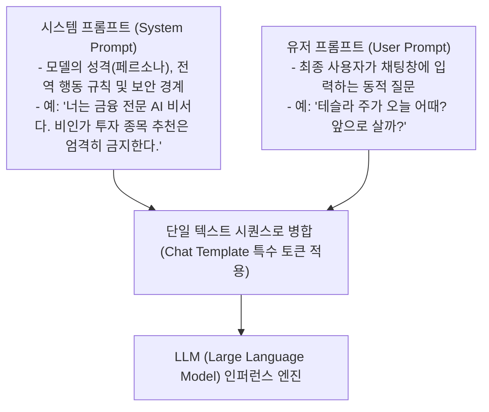
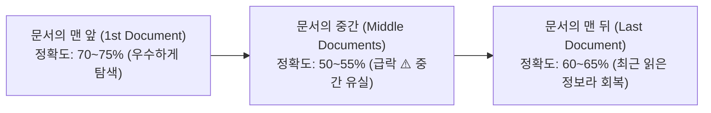

# 01. 프롬프트 기초와 컨텍스트 엔지니어링 (In-Context Learning, Lost in the Middle)

## 📌 핵심 요약 & 전체 맥락
> **"프롬프트(Prompt)는 파운데이션 모델의 수천억 개 가중치(Weights)를 단 한 줄도 재학습하지 않고도 모델의 지능을 특정 태스크로 이끌어내는 가장 가볍고 경제적인 소프트웨어 프로그래밍 인터페이스입니다."**  
> 모델은 방대한 사전 훈련 지식을 바탕으로, 프롬프트에 제공된 설명과 소수의 모범 예시를 보고 새로운 작업을 즉석에서 학습하는 **문맥 내 학습(In-Context Learning, ICL)** 능력을 발휘합니다.  
> 시스템 프롬프트(System Prompt)는 모델의 행동 규칙과 보안 경계를 정하고, 유저 프롬프트(User Prompt)는 사용자의 구체적 요청을 전달합니다. 이때 오픈소스 모델마다 다른 **챗 템플릿(Chat Template)**이 어긋나면 에러 로그 없이 조용히 모델 성능이 반토막 나는 **사일런트 장애(Silent Failure)**가 발생합니다.  
> 또한, 2019년 1K에서 2024년 2M으로 컨텍스트 윈도우가 2,000배 폭증했음에도 불구하고, 긴 문서의 중간에 위치한 정보를 검색하지 못하고 헤매는 **Lost in the Middle(중간 유실) 현상**과 **건초더미 속 바늘 찾기(Needle In A Haystack, NIAH)**의 통계적 한계를 반드시 이해하고 전략적으로 프롬프트를 설계해야 합니다.

---

## 🗺️ 도표(Figure & Table) 색인 및 매핑 가이드

본문의 핵심 원리를 시각적으로 확인할 수 있는 책 내 도표의 위치와 해설 매핑입니다:

| 도표 번호 | 도표 제목 및 핵심 내용 | 책 페이지 | 본문 해당 주제 |
| :---: | :--- | :---: | :--- |
| **Figure 5-1** | NER(개체명 인식)을 위한 기본 프롬프트 구조 (지시문 + 원문 컨텍스트) | **p. 213** | 1. 프롬프트 엔지니어링의 본질 |
| **Figure 5-2** | 2019년(GPT-2 1K)부터 2024년(Gemini 2M)까지 컨텍스트 윈도우 한계의 폭발적 확장 추세 | **p. 218** | 3. 컨텍스트 길이의 확장사 |
| **Figure 5-3** | 대규모 JSON 건초더미(Haystack) 속에 특정 키-값 바늘(Needle)을 숨겨둔 프롬프트 예시 | **p. 219** | 3. 니들 인 어 헤이스택 (NIAH) |
| **Figure 5-4** | 문서 위치(1번째 vs 중간 vs 마지막)에 따른 모델들의 검색 정확도 U자형 급락 그래프 | **p. 219-220** | 3. Lost in the Middle 현상 |

---

## 1. 프롬프트 기초와 문맥 내 학습 (In-Context Learning, pp. 211 ~ 215)

### ① 왜 프롬프트 엔지니어링인가? (Why Prompting?)

파운데이션 모델을 우리 회사의 특정 비즈니스 업무에 적응시키는 방법은 크게 **프롬프트 엔지니어링(Prompt Engineering)**, **RAG (Retrieval-Augmented Generation, 검색 증강 생성)**, 그리고 **파인튜닝 (Fine-Tuning, 미세조정)**의 3단계 사다리가 있습니다. 그중 프롬프트 엔지니어링은 AI 엔지니어링 파이프라인에서 가장 먼저 시도해야 할 필수 관문입니다:

1. **가중치 업데이트 불필요:**  
   수십 장의 고가 **GPU (Graphics Processing Unit, 그래픽 처리 장치)** 클러스터를 빌려 모델 가중치를 수정할 필요가 없으므로 인프라 비용이 획기적으로 절감됩니다.
2. **초고속 피드백 루프 (Iterative Feedback Loop):**  
   파인튜닝은 데이터셋을 정제하고 모델을 굽는 데 며칠~몇 주가 걸리지만, 프롬프트는 단 몇 초 만에 텍스트를 수정하고 결과를 즉시 비교 검증할 수 있습니다.
3. **비개발자 도메인 전문가 친화성:**  
   코딩을 모르는 의사, 변호사, 금융 애널리스트, 기획자도 일상 자연어로 모델의 동작 방식을 직접 튜닝하고 프로토타입을 제작할 수 있습니다.

```
[ NER(Named Entity Recognition, 개체명 인식)을 위한 기본 프롬프트 구조 (Figure 5-1, p. 213) ]

[ 지시문 (Instruction) ] : "다음 뉴스 기사에서 모든 조직(Organization) 및 기관 이름을 추출하시오."
[ 입력 데이터 (Context) ] : "Google과 DeepMind는 런던에서 차세대 멀티모달 모델을 발표했다."
[ 모델의 기대 출력 ]    : Google, DeepMind
```

---

### ② 제로샷(Zero-Shot) vs 퓨샷(Few-Shot)과 ICL 메커니즘

* **문맥 내 학습 (ICL, In-Context Learning, 문맥 내 학습):**  
  모델의 가중치 파라미터를 역전파(Backpropagation)로 업데이트하지 않고, **오직 입력 프롬프트(Context) 안에 주어진 지시사항과 몇 가지 모범 예시만 보고 즉석에서 패턴을 파악하여 정답을 맞히는 능력**입니다 (Brown et al., 2020).  
  마치 똑똑한 인턴사원에게 새로운 업무 매뉴얼과 이전 선배가 처리한 샘플 서류 2~3장을 보여주면, 인턴이 별도의 교육 연수 없이도 즉시 그 형식에 맞춰 새 보고서를 작성해 내는 것과 같습니다.

* **제로샷 프롬프팅 (Zero-Shot Prompting):**  
  모범 예시를 하나도 주지 않고, 지시문만 던져주는 방식입니다.  
  *예: "다음 영문 텍스트를 정중한 한국어 비즈니스 이메일로 번역하라: [본문]"*

* **퓨샷 프롬프팅 (Few-Shot Prompting):**  
  지시문과 함께 $K$개의 `(입력, 출력)` 예시 쌍(Shot)을 과외 선생님처럼 미리 프롬프트에 포함시키는 방식입니다.

```
[ Few-Shot 프롬프트가 프로덕션에서 강력한 3가지 이유 ]

1. 출력 형식 고정 (Formatting Anchor) : 
   JSON(JavaScript Object Notation, 자바스크립트 객체 표기법), XML, Markdown 불릿 등 원하는 구조를 예시로 보여주면, 모델이 엉뚱한 사족을 붙이지 않고 지정된 형식만 깔끔하게 출력합니다.
2. 엣지 케이스 및 모호성 해소 (Ambiguity Resolution) : 
   "핵심 키워드를 추출하라"처럼 사람마다 기준이 다른 지시도, 예시 2~3개를 통해 어디까지가 핵심 키워드인지 범위를 명확히 규정할 수 있습니다.
3. 톤앤매너 전이 (Tone & Style Transfer) : 
   친절한 상담원 말투, 법률 전문가 톤, 간결한 단답형 등 원하는 페르소나의 문체를 예시 그대로 복제(Mimicking)하게 만듭니다.
```

---

## 2. 시스템 프롬프트 vs 유저 프롬프트와 챗 템플릿 (pp. 215 ~ 218)

### ① 시스템 프롬프트(System Prompt)와 유저 프롬프트(User Prompt)

대화형 언어 모델 API(예: OpenAI GPT-4o, Anthropic Claude 3.5 Sonnet)는 프롬프트를 역할(Role)별로 분리하여 입력받습니다:



* **시스템 프롬프트가 사용자 입력보다 더 강력하게 동작하는 원리:**
  1. **물리적 위치 선점 (Positional Primacy):** 모든 대화 텍스트가 모델에 주입될 때 시스템 프롬프트가 **시퀀스의 맨 앞(Prefix)**에 위치하므로, 트랜스포머의 셀프 어텐션(Self-Attention) 메커니즘이 전체 대화 맥락의 기준점으로 가장 먼저 인식합니다.
  2. **지시 계층 구조 (Instruction Hierarchy) 사전 정렬:** 최신 파운데이션 모델들은 **RLHF (Reinforcement Learning from Human Feedback, 인간 피드백 기반 강화학습)** 후속 훈련을 거치며 **"일반 사용자의 지시보다 시스템 프롬프트의 전역 규칙을 최우선으로 따르도록"** 훈련되어 있습니다 (Wallace et al., 2024).

---

### ② 챗 템플릿(Chat Template) 불일치와 사일런트 장애 (Silent Failure) ⚠️

오픈소스 모델(Llama-3, Mistral, Qwen 등)을 직접 자체 서버에 서빙할 때, 모델마다 고유의 **특수 토큰(Special Tokens)**으로 구성된 챗 템플릿을 요구합니다:

* **ChatML (Chat Markup Language) 포맷 (OpenAI, Qwen 등):**
  ```text
  <|im_start|>system
  너는 고객을 친절하게 돕는 AI 상담원이다.<|im_end|>
  <|im_start|>user
  배송 조회가 안 돼요.<|im_end|>
  <|im_start|>assistant
  ```

* **Llama 포맷 (Meta Llama-2 / Llama-3):**
  ```text
  <|begin_of_text|><|start_header_id|>system<|end_header_id|>
  너는 고객을 친절하게 돕는 AI 상담원이다.<|eot_id|>
  <|start_header_id|>user<|end_header_id|>
  배송 조회가 안 돼요.<|eot_id|>
  <|start_header_id|>assistant<|end_header_id|>
  ```

> ⚠️ **현장 실무 경고: 사일런트 장애 (Silent Failure)의 위험성**  
> 마치 파이썬 인터프리터에 자바 문법을 섞어 넣는 것과 같습니다. 서빙 프레임워크나 래퍼 라이브러리가 챗 템플릿을 잘못 렌더링하면, **서버가 에러를 뿜으며 중단되는 것이 아니라 어설프게 말을 알아듣는 척하면서 응답 품질과 추론 능력이 조용히 곤두박질치는 '사일런트 장애'**가 발생합니다.  
> 시스템 로그에 아무런 에러가 찍히지 않으므로 디버깅이 극도로 어렵습니다. 따라서 모델을 배포할 때는 반드시 최종 토크나이저에 입력되는 원시 문자열(Raw Prompt)을 `print()`로 출력하여 모델 공식 규격과 100% 일치하는지 육안으로 확인해야 합니다.

---

## 3. 컨텍스트 길이의 폭발적 확장과 한계 (pp. 218 ~ 220)

### ① 컨텍스트 윈도우의 2,000배 성장사 (Figure 5-2)

파운데이션 모델이 한 번에 읽고 이해할 수 있는 텍스트의 양(Context Window)은 지난 5년간 기하급수적으로 폭증했습니다:

```
[ 컨텍스트 윈도우 용량 폭증 연표 (2019 ~ 2024) ]

• 2019년 02월 : GPT-2         ➔ 1,024 토큰 (1K)   [단편 수필 1장 분량]
• 2020년 06월 : GPT-3         ➔ 2,048 토큰 (2K)
• 2022년 11월 : GPT-3.5       ➔ 4,096 토큰 (4K)
• 2023년 03월 : Claude-1      ➔ 9,000 토큰 (9K)
• 2023년 03월 : GPT-4         ➔ 32,768 토큰 (32K)
• 2023년 05월 : Claude-1.3    ➔ 100,000 토큰 (100K) [단행본 1권 전체, 약 12만 단어]
• 2023년 11월 : GPT-4 Turbo   ➔ 128,000 토큰 (128K)
• 2024년 03월 : Claude-3      ➔ 200,000 토큰 (200K)
• 2024년 02월 : Gemini 1.5    ➔ 1,000,000 토큰 (1M) [반지의 제왕 3부작 원서 전체]
• 2024년 05월 : Gemini 1.5 Pro➔ 2,000,000 토큰 (2M) [위키피디아 2,000페이지 / 대규모 오픈소스 코드베이스 전체]
```

---

### ② Lost in the Middle 현상과 니들 인 어 헤이스택 (NIAH, Figures 5-3, 5-4) ⭐

모델의 컨텍스트 용량이 200만 토큰으로 늘어났다고 해서, **모델이 수십만 줄의 텍스트를 처음부터 끝까지 균일한 주의력으로 완벽하게 기억하는 것은 아닙니다.**



#### 1) 니들 인 어 헤이스택 (Needle In A Haystack, NIAH) 테스트 원리 (Figure 5-3)
* 수만~수십만 자에 달하는 방대한 텍스트(건초더미 Haystack) 속에, 전혀 맥락과 무관한 임의의 고유 키-값 쌍이나 **UUID (Universally Unique Identifier, 범용 고유 식별자)**(바늘 Needle)을 숨겨두고 모델에게 이를 추출하게 시키는 가혹한 벤치마크입니다.
* *예시: 10만 단어의 철학 문서 중간에 `{"9f4a92b9-5f69-4725-ba1e-403f08dea695": "703a7ce5-f17f-4e6d-b895-5836ba5ec71c"}`를 삽입한 뒤 해당 UUID 값을 질문.*

#### 2) Lost in the Middle 실증 연구 (Liu et al., 2023, Figure 5-4)
* **결과 분석:**  
  인간이 긴 책을 읽을 때 첫 챕터와 마지막 결말은 잘 기억하지만 중간 페이지는 흐릿해지는 것처럼, 트랜스포머 언어 모델 역시 **핵심 정보가 프롬프트 시퀀스의 중간에 위치할 때 검색 정확도가 15~20%p 이상 급락하는 끔찍한 U자형 곡선(U-shaped Curve)**을 보입니다. 이를 **Lost in the Middle(중간 유실) 현상**이라고 부릅니다.
* 이는 최신 모델을 막론하고 트랜스포머 어텐션 메커니즘의 근본적인 구조적 특성에서 비롯됩니다.

#### 3) 실무 엔지니어를 위한 컨텍스트 효율성 (Context Efficiency) 전략
* **배치 원칙 (Head-and-Tail Rule):**  
  "절대 어기면 안 되는 핵심 제약 조건"이나 "사용자의 최종 질문"은 절대 프롬프트 중간에 묻어두지 말고, **반드시 프롬프트의 맨 앞(Top)이나 맨 뒤(Bottom)에 배치**해야 합니다.
* **무분별한 롱 컨텍스트의 비용과 지연시간 트레이드오프:**  
  무조건 컨텍스트 윈도우에 많은 문서를 다 밀어 넣는 것은 비효율적입니다. 입력 토큰이 길어질수록 첫 글자를 뱉어내는 데 걸리는 **TTFT (Time To First Token, 첫 토큰 생성 지연시간)**가 초 단위로 지연되고, API 요금이 폭증하며, 정작 필요한 정보의 중간 유실 확률만 높아집니다.
* **RULER 벤치마크 (Hsieh et al., 2024):**  
  단순 단일 바늘 찾기(NIAH)는 최신 모델들이 과적합되어 쉽게 통과하므로, 여러 개의 바늘을 동시에 찾고 복합 추론을 수행하는 **RULER (Retrieval Under Long-context Evaluation for Realism)** 같은 현실적인 다차원 벤치마크로 자사 파이프라인의 유효 컨텍스트 한계를 사전 측정해야 합니다.

---

## 🔗 연관 문서
* [[00-ch05-overview|00. Chapter 5 전체 개요 및 목차]]
* [[02-prompt-engineering-best-practices|02. 프롬프트 엔지니어링 5대 모범 원칙과 CoT / 자동 최적화]]
* [[03-defensive-prompt-engineering-and-attacks|03. 방어적 프롬프트 엔지니어링]]
* [[chapter-qa/ch02-foundation-models-qa/09-context-window-and-needle-in-a-haystack|Ch02-09. 컨텍스트 윈도우와 Needle In A Haystack]]
