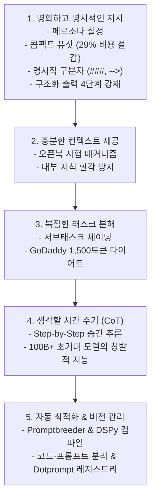

# 02. 프롬프트 엔지니어링 5대 모범 원칙과 CoT / 자동 최적화

## 📌 핵심 요약 & 전체 맥락
> **"프롬프트 엔지니어링의 본질은 '$300 팁을 줄게' 같은 임시변통 트릭이 아니라, 모델의 인지 메커니즘에 최적화된 구조적이고 체계적인 소통 원칙을 세우는 것입니다."**  
> 본 섹션에서는 OpenAI, Anthropic, Google, Meta 등 선도 AI 연구소들이 공식 권장하고 수많은 프로덕션 현장에서 검증된 **5대 모범 실무 원칙**을 체계적으로 다룹니다.  
> 명확한 페르소나 설정과 구분자(Delimiter), 토큰 비용을 29% 절감하는 퓨샷 포맷팅, 거대 모델의 추론 지능을 극대화하는 **생각의 사슬 (Chain-of-Thought, CoT)**, 그리고 DeepMind의 **Promptbreeder** 및 스탠퍼드의 **DSPy (Demonstrate-Search-Predict Framework)**를 활용한 프롬프트 자동 컴파일과 버전 관리 카탈로그 구축까지 엔지니어링 필수 기법을 완벽히 정리합니다.

---

## 🗺️ 도표(Figure & Table) 색인 및 매핑 가이드

본문의 핵심 원리를 시각적으로 확인할 수 있는 책 내 도표의 위치와 해설 매핑입니다:

| 도표 번호 | 도표 제목 및 핵심 내용 | 책 페이지 | 본문 해당 주제 |
| :---: | :--- | :---: | :--- |
| **Figure 5-5** | 페르소나(Persona: 전문 생물학자) 설정을 통한 답변 톤과 설명 깊이 통제 예시 | **p. 221** | 원칙 1. 명확하고 명시적인 지시문 작성 |
| **Table 5-1** | 예시 1개 제공 유무에 따른 모델의 출력 형식 및 톤앤매너 정렬 효과 (산타클로스 질답) | **p. 222** | 원칙 1. 예시 제공의 힘 |
| **Table 5-2** | 퓨샷 예시 작성 포맷(장황한 포맷 38토큰 vs 콤팩트 포맷 27토큰)에 따른 비용 절감 비교 | **p. 223** | 원칙 1. 퓨샷 토큰 비용 최적화 |
| **Table 5-3** | 명시적 구분자(`-->`) 부재 시 모델이 입력을 이어쓰는 환각 오류 실증 | **p. 225** | 원칙 1. 출력 형식 지정과 구분자 |
| **Figure 5-6** | CoT 도입에 따른 LaMDA, GPT-3, PaLM 모델의 수학/추론 벤치마크 점수 급상승 그래프 | **p. 227-228** | 원칙 4. 생각할 시간 주기 (CoT) |
| **Table 5-4** | 동일 쿼리에 대한 4가지 CoT 프롬프트 변형 (Zero-shot CoT, Few-shot CoT 등) 비교 | **p. 228-229** | 원칙 4. CoT 프롬프트 4가지 변형 |
| **Figure 5-7** | Claude 3.5 Sonnet이 직접 작성한 고도화된 메타 프롬프트 아키텍처 | **p. 230-231** | 원칙 5. 프롬프트 반복 개선 |
| **Figure 5-8** | 유전 알고리즘(Genetic Algorithm) 기반 자가 발전 프롬프트 변이 시스템 Promptbreeder 아키텍처 | **p. 231-232** | 원칙 5. 자동 프롬프트 최적화 |
| **Figure 5-9** | LangChain 기본 critique 프롬프트 템플릿에 방치된 실제 오타(Typo) 하이라이트 | **p. 232** | 원칙 5. 프롬프트 도구의 함정 |

---

## 1. 프롬프트 엔지니어링 5대 모범 실무 원칙 (pp. 220 ~ 230)



---

### 원칙 1. 명확하고 명시적인 지시문 작성 (Write Clear and Explicit Instructions, pp. 220 ~ 223)

#### ① 모호성 완전 제거 (Eliminate Ambiguity)
* 평가나 채점 기준을 내릴 때 단순히 "에세이를 평가하라"고 두루뭉술하게 지시하면 모델마다 주관적 기준이 달라집니다.
* **"1부터 5까지의 정수(Integer)로만 점수를 매기고, 4.5 같은 소수점은 절대 쓰지 마라. 각 점수의 기준은 다음과 같다: [루브릭 명시]"**와 같이 출력의 경계를 엄격히 규정해야 합니다.

#### ② 페르소나(Persona) 설정 (Figure 5-5)
* 모델에게 특정 전문 역할(전문 생물학자, 5세 유치원 교사, 10년 차 시니어 백엔드 아키텍트)을 부여하면, 모델의 내부 확률 분포가 해당 도메인의 전문 어휘, 설명의 깊이, 논리 전개 방식으로 강력하게 고정됩니다.

#### ③ 예시 제공의 힘 (Table 5-1)
* *"크리스마스에 산타가 진짜로 선물을 가져다줄까요?"*라는 아이의 순수한 질문에 대해, 예시가 없으면 모델은 *"산타클로스는 성 니콜라우스 전설에 기반한 가상의 인물입니다..."*라고 동심을 파괴하는 백과사전식 답변을 합니다.
* 하지만 치아 요정(Tooth Fairy)에 대한 따뜻한 응답 예시 1개를 퓨샷으로 넣어주면, 모델은 즉시 **동심을 지켜주는 다정하고 재치 있는 어조**로 응답 스타일을 전환합니다.

#### ④ 퓨샷 예시의 토큰 비용 최적화 (Table 5-2) ⭐
예시를 작성할 때 불필요한 라벨(`Input:`, `Output:`)을 제거하고 기호(`-->`)로 콤팩트하게 압축하면, 동일한 성능을 유지하면서도 **API (Application Programming Interface, 응용 프로그램 인터페이스)** 호출 비용과 지연시간을 획기적으로 줄일 수 있습니다:

| 예시 작성 포맷 | 실제 프롬프트 내용 | GPT-4 토큰 수 | 비용 절감 효과 |
| :--- | :--- | :---: | :---: |
| **장황한 포맷 (Verbose)** | `Input: chickpea` <br> `Output: edible` <br> `Input: box` <br> `Output: inedible` | **38 토큰** | 기준점 (0%) |
| **콤팩트 포맷 (Compact)** | `chickpea --> edible` <br> `box --> inedible` | **27 토큰** | **~29% 토큰 및 비용 절감 🚀** |

#### ⑤ 출력 형식 지정과 종료 구분자(Delimiter) (Table 5-3)
* 언어 모델은 사람처럼 "여기까지가 질문이고 여기서부터 답변이다"라고 스스로 눈치채지 못합니다.
* ⚠️ **구분자 부재 오류 (Table 5-3):**  
  `chicken`이라는 마지막 입력 단어 뒤에 화살표(`-->`)나 샵(`###`) 같은 **명시적 구분자(Delimiter)**를 붙여주지 않으면, 모델은 정답(`edible`)을 내놓는 대신 `chicken tacos --> edible`처럼 **입력 단어 뒤에 자기 마음대로 단어를 이어붙이는 자동완성 환각 오류**를 범합니다.

#### ⑥ 구조화된 출력(Structured Output)을 강제하는 4단계 엔지니어링 🛠️
다운스트림 소프트웨어와 연동하기 위해 완벽한 **JSON (JavaScript Object Notation, 자바스크립트 객체 표기법)**이나 **YAML (YAML Ain't Markup Language, 데이터 직렬화 양식)**을 뽑아내는 실무 4단계 방식:
1. **Band-aid (임시방편):** 프롬프트에 *"반드시 유효한 JSON 형식으로만 답해줘"*라고 텍스트로 애원하는 방식 (여전히 깨질 확률 높음).
2. **Post-processing (후처리 파싱):** 모델이 뱉은 자연어 문장에서 **Regex (Regular Expression, 정규 표현식)**를 돌려 `{ }` 중괄호 영역만 추출 (파싱 에러 빈발).
3. **Test-time compute (재시도 루프):** 파싱 에러 발생 시 에러 로그를 모델에게 다시 전달하며 "포맷이 틀렸으니 다시 고쳐라"고 재시도(Retry)시킴.
4. **Tooling (구조화 도구 강제 🏆):** 모델의 디코딩 과정에서 JSON 스키마를 벗어난 토큰 자체를 생성하지 못하도록 강제하는 OpenAI JSON Mode 또는 **`Instructor`**(Pydantic 스키마 기반 제약 생성 라이브러리)를 사용하는 현대적 표준 방식.

---

### 원칙 2. 충분한 컨텍스트 제공 (Provide Sufficient Context, pp. 223 ~ 224)

* **오픈북 시험 메커니즘:**  
  수험생에게 암기만으로 시험을 보게 하면 거짓말(환각)을 지어내기 쉽지만, 관련 참고 교재를 손에 쥐여주고 시험을 보게 하면 정답률이 비약적으로 상승합니다.
* 모델에게 필요한 지식(사내 규정집, 제품 카탈로그, 최근 고객 상담 내역)을 프롬프트 컨텍스트로 직접 주입하지 않으면, 모델은 불확실한 내부 기억(Parametric Memory)에 의존하여 **환각 (Hallucination)**을 일으킵니다.

---

### 원칙 3. 복잡한 작업을 단순한 서브태스크로 분해 (Break Complex Tasks Down, pp. 225 ~ 227)

* 수십 가지 복잡한 비즈니스 로직을 단 하나의 거대한 프롬프트에 모두 집어넣으면 모델이 규칙 간의 충돌로 인해 지침을 무시하기 시작합니다.
* **프롬프트 체이닝 (Prompt Chaining):**  
  작업을 논리적 단계별로 쪼개어 소형 프롬프트 여러 개를 파이프라인으로 연결합니다:
  * *1단계: 사용자 질의의 의도(Intent) 분류 (결제 문의, 기술 지원, 환불 요청 등)*
  * *2단계: 해당 의도 전용 서브 프롬프트를 호출하여 정밀 답변 생성*
* 💡 **GoDaddy (2024)의 프로덕션 성공 사례:**  
  고객지원 챗봇 프롬프트에 온갖 예외 규칙이 덕지덕지 붙어 **1,500토큰의 거대 프롬프트로 비대화**되자 정확도가 급락했습니다. 이를 의도 분류기 및 도메인별 서브 프롬프트로 모듈화하여 분해한 결과, **정확도가 대폭 상승하고 1회 호출당 토큰 비용도 크게 절감**되었습니다.

---

### 원칙 4. 모델에게 생각할 시간 주기 (Chain-of-Thought, CoT, pp. 227 ~ 229)

```
[ 생각의 사슬 (Chain-of-Thought, CoT)의 기본 메커니즘 ]

사용자 질문: "식당에 23명이 있고 9명이 나갔다가 4명이 들어왔다. 지금 몇 명인가?"

❌ 일반 프롬프트 : 곧바로 "18명" 출력 시도 ➔ 중간 연산 없이 단번에 맞히려다 오답 확률 증가
✅ CoT 프롬프트  : "차근차근 생각해보자. 23 - 9 = 14명이고, 여기에 4명을 더하면 14 + 4 = 18명이다. 따라서 18명."
                  ➔ 모델이 중간 추론 토큰들을 스스로 생성하면서 최종 정답 토큰의 확률을 수직 상승시킴!
```

#### ① CoT의 창발적 능력과 성능 향상 (Wei et al., 2022, Figure 5-6)
* 수학 연산, 논리 퍼즐, 다단계 추론 벤치마크(MAWPS, GSM8K)에서 모델의 정답률이 20%대에서 60~80% 이상으로 수직 상승합니다.
* 💡 **창발적 지능 (Emergent Ability):**  
  CoT 효과는 모델 파라미터가 1,000억 개(100B, 100 Billion) 이상인 **초거대 파운데이션 모델에서만 마법처럼 발현**됩니다. 매개변수가 작은 소형 모델은 "생각해보자"고 시켜도 논리적 사고력 자체가 부족하여 헛소리만 길게 늘어놓을 뿐입니다.
* **LinkedIn의 현장 발견:**  
  프로덕션 환경에서 모델에게 최종 답변 전 CoT를 통해 자체 검증 단계를 거치게 하면 환각 발생률이 눈에 띄게 감소합니다.

#### ② 4가지 CoT 프롬프트 변형 (Table 5-4)

| CoT 기법 | 프롬프트 작성 예시 | 특징 및 작동 메커니즘 |
| :--- | :--- | :--- |
| **1. 원본 쿼리 (No CoT)** | *"고양이와 개 중 어느 동물이 더 빠른가?"* | 중간 추론 없이 즉시 단답을 강요 |
| **2. Zero-shot CoT (A)** | *"...정답을 내기 전에 **단계별로 생각하라(Think step by step)**."* | 마법의 문구 하나로 모델의 자율 추론 토큰 유도 (Kojima et al., 2022) |
| **3. Zero-shot CoT (B)** | *"...정답을 제시하기 전에 **판단 근거를 먼저 설명하라(Explain your rationale)**."* | 논리적 근거(CoT)를 앞에 먼저 배치하여 결론의 정확도 제고 |
| **4. Step 지정 CoT** | *"...다음 단계에 따라 순서대로 답하라: <br>1. 가장 빠른 개 품종 최고 속도 확인 <br>2. 가장 빠른 고양이 품종 최고 속도 확인 <br>3. 둘을 비교하여 빠른 쪽 결정"* | 엔지니어가 추론 절차를 명시적으로 통제 |
| **5. Few-shot CoT** | `Q: 상어와 돌고래 중 누가 더 빠른가?` <br>`1. 청상아리 최고 속도 74km/h` <br>`2. 참돌고래 최고 속도 60km/h` <br>`3. 결론: 상어가 더 빠름.` <br>`Q: 고양이와 개 중 어느 동물이 더 빠른가?` | 완벽한 중간 추론 과정 모범 예시를 프롬프트에 주입 (Wei et al., 2022) |

> ⚠️ **CoT의 엔지니어링 트레이드오프:**  
> 모델이 중간 추론 문장을 길게 생성하므로 첫 글자 응답 시간인 **TTFT (Time To First Token, 첫 토큰 생성 지연시간)**와 전체 생성 시간(Latency)이 늘어나며, 출력 토큰 수 증가로 인해 API 비용이 증가합니다.

---

### 원칙 5. 프롬프트 반복 개선, 도구 활용 및 버전 관리 (pp. 229 ~ 235)

#### ① AI를 이용한 프롬프트 자동 최적화와 DSPy 패러다임 (Figures 5-7, 5-8)
* **메타 프롬프팅 (Meta-Prompting, Figure 5-7):**  
  엔지니어가 처음부터 프롬프트를 작성하지 않고, 성능이 가장 뛰어난 Claude 3.5 Sonnet 같은 최고 성능 모델에게 *"내가 이런 업무를 수행하는 AI 비서를 만들 건데, 최적의 시스템 프롬프트를 직접 작성해줘"*라고 지시하여 고도화된 초안을 얻는 기법입니다.
* **Promptbreeder (DeepMind, 2023, Figure 5-8):**  
  생물학의 유전 알고리즘(Genetic Algorithm) 원리를 적용하여, 수십 개의 프롬프트 돌연변이를 생성하고 벤치마크 평가를 통해 교배를 반복함으로써 가장 높은 점수를 획득한 1등 프롬프트만 진화시키는 자동 최적화 시스템입니다.
* 🚀 **DSPy (Demonstrate-Search-Predict Framework, 스탠퍼드 대학교):**  
  개발자가 프롬프트 문구를 수작업으로 수정하는 방식에서 벗어나, **프로그램의 로직과 평가 메트릭만 파이썬 코드로 선언하면 DSPy 컴파일러가 훈련 데이터를 바탕으로 가장 높은 점수를 내는 최적의 지시문과 퓨샷 예시를 자동으로 탐색·합성(컴파일)해 내는 최첨단 패러다임**입니다.

#### ② 프롬프트 도구의 함정과 주의사항 (Figure 5-9)
* **숨겨진 API 비용 폭증:**  
  프롬프트 자동 튜닝 도구가 10개 프롬프트 변형을 30개 평가 데이터셋에 돌리면, **단 한 번의 실행에 300회 이상의 백그라운드 API 호출이 발생**하여 예기치 못한 비용 폭탄을 맞을 수 있습니다.
* **프레임워크 자체의 결함 (Figure 5-9):**  
  LangChain 등의 오픈소스 기본 critique 프롬프트 템플릿에 실제 오타(Typo)나 비효율적인 문구가 방치되어 모델 성능을 갉아먹은 사례가 존재합니다.
* 💡 **Hamel Husain의 원칙:**  
  *"Show Me the Prompt" (프레임워크 뒤에 숨겨진 실제 최종 완성 프롬프트를 반드시 눈으로 직접 까보고 검증하라).*

---

## 2. 프롬프트 구성 및 체계적 버전 관리 (pp. 233 ~ 235)

프롬프트는 파이썬 소스 코드 내부에 문자열로 하드코딩하지 않고, **독립적인 소프트웨어 설정 자산으로 분리하여 관리**해야 합니다:

```
[ 코드와 프롬프트의 분리 아키텍처 ]

[ prompts.yaml 또는 prompt.json ] ────▶ [ application.py ]
- 프롬프트 원문 텍스트                   - 비즈니스 로직 및 제어 흐름
- 대상 모델 (GPT-4o, Claude 3.5 Sonnet)  - API 호출 및 예외 처리
- 샘플링 파라미터 (Temperature=0.0)      - 사용자 UI/UX 렌더링
- 입출력 Pydantic 스키마 정의
```

### ① Pydantic을 이용한 프롬프트 메타데이터 관리
```python
from pydantic import BaseModel
from datetime import datetime

class PromptTemplate(BaseModel):
    model_name: str
    date_created: datetime
    prompt_text: str
    application: str
    creator: str
    temperature: float = 0.0
    input_schema: dict
    output_schema: dict
```

### ② 전용 프롬프트 파일 포맷과 중앙 카탈로그 (Prompt Catalog)
* **전용 파일 포맷:** Google Firebase의 **Dotprompt (`.prompt`)**, Humanloop, Continue Dev 등.
* **중앙 프롬프트 카탈로그(Prompt Catalog / Registry)의 필요성:**  
  프롬프트를 Git 소스 코드와 함께 저장소에 묶어두면, 여러 서비스가 공용으로 쓰는 프롬프트가 수정되었을 때 **기존 버전을 안정적으로 유지하고 싶은 팀까지 강제로 업데이트되어 장애가 전파되는 문제**가 발생합니다. 별도의 프롬프트 레지스트리를 구축하여 각 서비스별로 특정 프롬프트 버전을 고정(Pinning)할 수 있어야 합니다.

---

## 🔗 연관 문서
* [[00-ch05-overview|00. Chapter 5 전체 개요 및 목차]]
* [[01-introduction-to-prompting-and-context|01. 프롬프트 기초와 컨텍스트 엔지니어링]]
* [[03-defensive-prompt-engineering-and-attacks|03. 방어적 프롬프트 엔지니어링]]
* [[chapter-qa/ch02-foundation-models-qa/08-sampling-and-probabilistic-nature|Ch02-08. 샘플링과 AI의 확률적 본성]]
