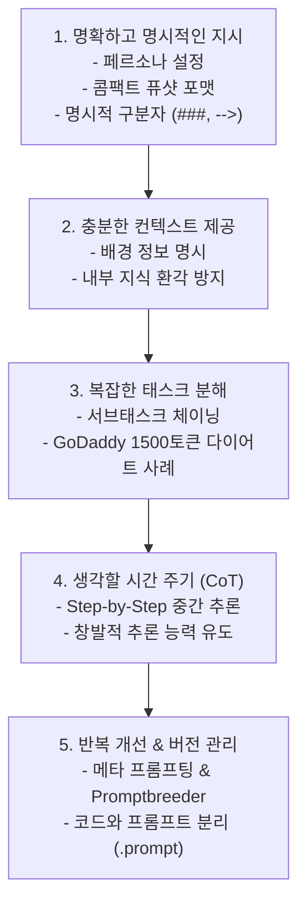

# 02. 프롬프트 엔지니어링 5대 모범 원칙과 CoT / 자동 최적화

## 📌 핵심 요약 & 전체 맥락
> **"프롬프트 엔지니어링의 본질은 '$300 팁을 줄게' 같은 임시변통 트릭이 아니라, 모델의 인지 메커니즘에 최적화된 구조적이고 체계적인 소통 원칙을 세우는 것입니다."**  
> 본 섹션에서는 OpenAI, Anthropic, Google, Meta가 공식 권장하고 수많은 프로덕션 현장에서 검증된 **5대 모범 실무 원칙**을 다룹니다.  
> 명확한 페르소나 설정과 구분자(Delimiter), 토큰 비용을 30% 이상 절감하는 퓨샷 포맷팅, 거대 모델의 추론력을 폭발시키는 **생각의 사슬(Chain-of-Thought, CoT)**, 그리고 DeepMind의 **Promptbreeder** 및 프롬프트 버전 관리 카탈로그 구축까지 엔지니어링 필수 기법을 완벽히 정리합니다.

---

## 🗺️ 도표(Figure & Table) 색인 및 매핑 가이드

본문의 핵심 원리를 시각적으로 확인할 수 있는 책 내 도표의 위치와 해설 매핑입니다:

| 도표 번호 | 도표 제목 및 핵심 내용 | 책 페이지 | 본문 해당 주제 |
| :---: | :--- | :---: | :--- |
| **Figure 5-5** | 페르소나(Persona: 전문 생물학자) 설정을 통한 답변 톤과 깊이 통제 예시 | **p. 221** | 1. 명확하고 명시적인 지시문 작성 |
| **Table 5-1** | 예시 1개 제공 유무에 따른 모델의 출력 형식 및 톤앤매너 정렬 효과 (산타클로스 질답) | **p. 222** | 1. 예시 제공의 힘 |
| **Table 5-2** | 퓨샷 예시 포맷(장황한 포맷 38토큰 vs 콤팩트 포맷 27토큰)에 따른 비용 절감 비교 | **p. 223** | 1. 퓨샷 토큰 비용 최적화 |
| **Table 5-3** | 명시적 구분자(`-->`) 부재 시 모델이 입력을 이어쓰는 환각 오류 실증 | **p. 225** | 1. 출력 형식 지정과 구분자 |
| **Figure 5-6** | CoT 도입에 따른 LaMDA, GPT-3, PaLM 모델의 수학/추론 벤치마크 점수 급상승 그래프 | **p. 227-228** | 4. 생각할 시간 주기 (CoT) |
| **Table 5-4** | 동일 쿼리에 대한 4가지 CoT 프롬프트 변형 (Zero-shot CoT, Few-shot CoT 등) 비교 | **p. 228-229** | 4. CoT 프롬프트 4가지 변형 |
| **Figure 5-7** | Claude 3.5 Sonnet이 직접 작성한 고도화된 메타 프롬프트 구조 | **p. 230-231** | 5. 프롬프트 반복 개선 |
| **Figure 5-8** | 유전 알고리즘 기반 자가 발전 프롬프트 변이 시스템 Promptbreeder 아키텍처 | **p. 231-232** | 5. 자동 프롬프트 최적화 |
| **Figure 5-9** | LangChain 기본 critique 프롬프트 템플릿에 방치된 실제 오타(Typo) 하이라이트 | **p. 232** | 5. 프롬프트 도구의 함정 |

---

## 1. 프롬프트 엔지니어링 5대 모범 실무 원칙 (pp. 220 ~ 230)



---

### 원칙 1. 명확하고 명시적인 지시문 작성 (pp. 220 ~ 223)

#### ① 모호성 완전 제거
* 채점 기준을 지시할 때 단순히 "에세이를 평가하라"고 하지 않고, **"1부터 5까지의 정수(Integer)로만 점수를 매기고 소수점(4.5)은 쓰지 마라"**와 같이 명확한 제약을 부여합니다.

#### ② 페르소나(Persona) 설정 (Figure 5-5)
* 모델에게 특정 역할(전문 생물학자, 5세 유치원 교사, 시니어 백엔드 엔지니어)을 부여하면 모델의 확률 분포가 해당 도메인의 어휘, 설명 깊이, 논리 구조로 강력하게 고정됩니다.

#### ③ 예시 제공의 힘 (Table 5-1)
* *"크리스마스에 산타가 선물을 줄까요?"*라는 아이의 질문에 대해, 예시가 없으면 모델은 *"산타는 가상의 인물입니다..."*라고 동심을 깨는 백과사전식 답변을 합니다. 하지만 치아 요정(Tooth fairy)에 대한 따뜻한 예시 1개를 퓨샷으로 넣어주면 모델은 즉시 **동심을 지켜주는 친절한 톤**으로 답변을 전환합니다.

#### ④ 퓨샷 예시의 토큰 비용 최적화 (Table 5-2) ⭐
예시를 작성할 때 장황한 수식어를 줄이면 동일한 성능을 유지하면서 API 비용과 지연시간을 크게 줄일 수 있습니다:

| 예시 작성 포맷 | 프롬프트 내용 | GPT-4 토큰 수 | 비용 절감 효과 |
| :--- | :--- | :---: | :---: |
| **장황한 포맷 (Verbose)** | `Input: chickpea` <br> `Output: edible` <br> `Input: box` <br> `Output: inedible` | **38 토큰** | 기준점 |
| **콤팩트 포맷 (Compact)** | `chickpea --> edible` <br> `box --> inedible` | **27 토큰** | **~29% 토큰 절감 🚀** |

#### ⑤ 출력 형식 지정과 종료 구분자 (Table 5-3)
* 언어 모델은 자신이 어디까지 읽었고 어디서부터 답변을 생성해야 하는지 스스로 구분하지 못합니다.
* ⚠️ **구분자 부재 오류 (Table 5-3):**  
  `chicken` 뒤에 화살표(`-->`) 같은 명시적 구분자를 주지 않으면, 모델은 답변(`edible`)을 내놓는 대신 `chicken tacos --> edible`처럼 **입력 단어를 마음대로 이어쓰는 환각 오류**를 범합니다.

#### ⑥ 구조화된 출력(Structured Output)을 강제하는 4단계 엔지니어링 🛠️
단순 텍스트가 아닌 어플리케이션 연동을 위한 완벽한 JSON/YAML 형식을 뽑아내기 위해, 실무에서는 다음 4가지 방식을 진화 단계별로 사용합니다:
1. **Band-aid (임시방편):** 프롬프트에 *"반드시 유효한 JSON 포맷으로만 출력하라"*고 명시적 지시.
2. **Post-processing (후처리):** 출력된 텍스트에서 정규식(Regex)이나 파서를 돌려 JSON 블록만 강제로 추출.
3. **Test-time compute (재시도 루프):** 파싱 에러가 발생하면 에러 로그를 모델에게 다시 던져주고 수정을 지시(Retry).
4. **Tooling (구조화 도구 강제):** OpenAI의 JSON 모드나 **`Instructor`**(Pydantic 스키마 강제), **`Guidance` / `Outlines`**(로짓 제어 및 문법 강제) 같은 최신 라이브러리를 사용하여 원천적으로 지정된 스키마 외의 토큰 생성을 차단.

---

### 원칙 2. 충분한 컨텍스트 제공 (pp. 223 ~ 224)
* 오픈북 시험처럼 관련 문서나 데이터를 프롬프트에 직접 포함해야 합니다.
* 모델에게 필요한 정보를 프롬프트로 주지 않으면, 모델은 불확실한 내부 기억(Internal Knowledge)에 의존하게 되어 **환각(Hallucination)**이 급격히 증가합니다.

---

### 원칙 3. 복잡한 작업을 단순한 서브태스크로 분해 (pp. 225 ~ 227)
* 하나의 거대한 프롬프트에 모든 규칙을 몰아넣지 않고, **작업을 쪼개어 단계별 프롬프트 체인(Prompt Chaining)**으로 구성합니다:
  * *1단계: 고객 질의 의도 분류 (Billing, Tech Support 등)*
  * *2단계: 해당 카테고리 전용 문제 해결 프롬프트 실행*
* 💡 **GoDaddy(2024)의 프로덕션 성공 사례:**  
  고객지원 챗봇 프롬프트가 온갖 엣지 케이스 추가로 인해 **1,500토큰으로 비대화**되자 성능이 저하되었습니다. 이를 하위 태스크별 소형 프롬프트로 분해한 결과, **정확도가 대폭 상승하고 전체 토큰 비용도 절감**되었습니다.

---

### 원칙 4. 모델에게 생각할 시간 주기 (Chain-of-Thought, CoT) (pp. 227 ~ 229)

```
[ 생각의 사슬 (Chain-of-Thought)의 기본 메커니즘 ]

사용자 질문: "식당에 23명이 있고 9명이 나갔다가 4명이 들어왔다. 지금 몇 명인가?"

❌ 일반 프롬프트 : 곧바로 "18명" 출력 시도 ➔ 연산 과정 없이 토큰 확률로 맞히려다 오답 확률 증가
✅ CoT 프롬프트  : "차근차근 생각해보자. 23 - 9 = 14명이고, 여기에 4명을 더하면 14 + 4 = 18명이다. 따라서 18명."
                  ➔ 중간 추론 토큰을 스스로 생성하면서 다음 정답 토큰의 확률을 비약적으로 높임!
```

#### ① CoT의 창발적 능력과 성능 향상 (Wei et al., 2022, Figure 5-6)
* 산술 및 다단계 추론 벤치마크(GSM8K, SVAMP, MAWPS)에서 LaMDA, GPT-3, PaLM 모델의 정답률이 20%대에서 60~80% 이상으로 수직 상승함.
* 💡 **창발적 능력 (Emergent Ability):** CoT는 **100B 이상의 대규모 파운데이션 모델**에서만 폭발적으로 작동하며, 8B 이하의 소형 모델에서는 큰 효과를 보지 못합니다.
* **LinkedIn의 발견:** CoT를 적용하면 복잡한 작업에서 모델의 환각이 크게 감소함.

#### ② 4가지 CoT 프롬프트 변형 (Table 5-4)

| CoT 기법 | 프롬프트 작성 예시 | 특징 및 작동 방식 |
| :--- | :--- | :--- |
| **1. 원본 쿼리 (No CoT)** | *"고양이와 개 중 어느 동물이 더 빠른가?"* | 생각할 시간 없이 즉시 단답 요구 |
| **2. Zero-shot CoT (A)** | *"...정답을 내기 전에 **단계별로 생각하라(Think step by step)**."* | 마법의 문구 하나로 자율 추론 유도 (Kojima et al., 2022) |
| **3. Zero-shot CoT (B)** | *"...정답을 제시하기 전에 **판단 근거를 먼저 설명하라(Explain your rationale)**."* | 논리적 설명(CoT)을 먼저 출력하도록 강제 |
| **4. Step 지정 CoT** | *"...다음 단계에 따라 답을 구하라: <br>1. 가장 빠른 개 품종 속도 확인 <br>2. 가장 빠른 고양이 품종 속도 확인 <br>3. 둘 중 빠른 쪽 결정"* | 엔지니어가 추론 절차를 명시적으로 통제 |
| **5. Few-shot CoT** | `Q: 상어와 돌고래 중 누가 더 빠른가?` <br>`1. 청상아리 최고 속도 74km/h` <br>`2. 참돌고래 최고 속도 60km/h` <br>`3. 결론: 상어가 더 빠름.` <br>`Q: 고양이와 개 중 어느 동물이 더 빠른가?` | 완벽한 추론 과정 모범 예시를 주입 |

> ⚠️ **CoT의 엔지니어링 트레이드오프:**  
> 중간 추론 텍스트가 늘어남에 따라 **첫 번째 토큰 생성 시간(TTFT)과 지연시간(Latency)이 증가**하고, 출력 토큰 수 증가로 인해 **API 호출 비용이 증가**합니다.

---

### 원칙 5. 프롬프트 반복 개선, 도구 활용 및 버전 관리 (pp. 229 ~ 235)

#### ① AI를 이용한 프롬프트 자동 최적화와 DSPy 패러다임 (Figure 5-8)
* **메타 프롬프팅 (Figure 5-7):** Claude 3.5 Sonnet이나 GPT-4에게 *"이 작업을 위한 최적의 프롬프트를 작성해줘"*라고 요청하여 프롬프트 초안을 자동 생성.
* **Promptbreeder (DeepMind, 2023, Figure 5-8):**  
  유전 알고리즘(Genetic Algorithm)을 응용하여 초기 프롬프트를 변이(Mutation)시키고, 평가셋에서 가장 점수가 높은 우수 프롬프트들을 자가 증식·진화시키는 전자동 프롬프트 최적화 프레임워크.
* 🚀 **DSPy (Programmatic Prompt Optimization):**  
  사람이 직접 프롬프트 문자열을 깎고 다듬는(Hand-written) 대신, 프로그램의 **논리적 흐름(파이프라인)과 평가지표만 파이썬 코드로 정의하면, DSPy 프레임워크가 훈련 데이터를 바탕으로 최적의 퓨샷 예시와 지시문을 모델 내부에서 자동으로 "컴파일(Compile)"하고 최적화**해주는 최신 엔지니어링 패러다임입니다.

#### ② 프롬프트 도구의 함정과 주의사항 (Figure 5-9)
* **숨겨진 API 비용 폭증:** 프롬프트 자동 튜닝 도구가 10개 프롬프트 변형을 30개 테스트 케이스에 돌리면 **한 번에 300회 이상의 보이지 않는 API 호출이 발생**하여 요금 폭탄을 맞을 수 있음.
* **프레임워크 자체의 결함 (Figure 5-9):** LangChain 등의 오픈소스 기본 critique 프롬프트에 실제 오타(Typo)나 잘못된 챗 템플릿이 방치된 사례가 존재함.
* 💡 **Hamel Husain의 원칙 (각주 11):** *"Show Me the Prompt" (프레임워크 뒤에 숨겨진 실제 최종 프롬프트를 반드시 눈으로 직접 확인하라).*

---

## 2. 프롬프트 구성 및 체계적 버전 관리 (pp. 233 ~ 235)

프롬프트를 파이썬 코드 안에 하드코딩하지 않고 **독립된 자산으로 분리하여 관리**해야 합니다:

```
[ 코드와 프롬프트의 분리 아키텍처 ]

[ prompts.py 또는 prompt.yaml ] ──▶ [ application.py ]
- 프롬프트 텍스트                   - 비즈니스 로직
- 대상 모델 (GPT-4o)               - API 호출 함수
- 샘플링 파라미터 (T=0.0)          - 예외 처리
- 입력/출력 JSON 스키마
```

### ① Pydantic을 이용한 프롬프트 메타데이터 관리
```python
from pydantic import BaseModel
from datetime import datetime

class PromptTemplate(BaseModel):
    model_name: str
    date_created: datetime
    prompt_text: str
    application: str
    creator: str
    temperature: float = 0.0
    input_schema: dict
    output_schema: dict
```

### ② 전용 프롬프트 파일 포맷과 중앙 카탈로그 (Prompt Catalog)
* **전용 파일 포맷:** Google Firebase의 **Dotprompt (`.prompt`)**, Humanloop, Continue Dev 등.
* **중앙 프롬프트 카탈로그(Prompt Catalog / Registry)의 필요성:**  
  프롬프트를 Git 저장소에 코드와 함께 넣으면, 여러 애플리케이션이 공유하는 프롬프트가 수정되었을 때 **구버전을 유지하고 싶은 팀까지 강제 업데이트되는 문제**가 발생합니다. 별도의 프롬프트 레지스트리를 구축하여 애플리케이션별로 특정 프롬프트 버전을 고정(Pinning)할 수 있어야 합니다.

---

## 🔗 연관 문서
* [[00-ch05-overview|00. Chapter 5 전체 개요 및 목차]]
* [[01-introduction-to-prompting-and-context|01. 프롬프트 기초와 컨텍스트 엔지니어링]]
* [[03-defensive-prompt-engineering-and-attacks|03. 방어적 프롬프트 엔지니어링]]
* [[chapter-qa/ch02-foundation-models-qa/08-sampling-and-probabilistic-nature|Ch02-08. 샘플링과 AI의 확률적 본성]]
