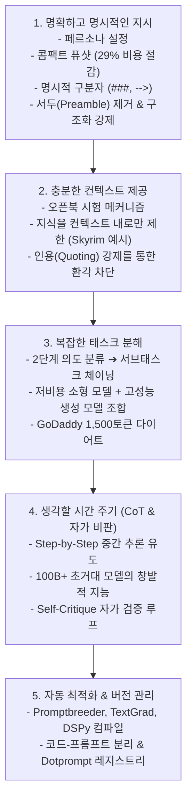
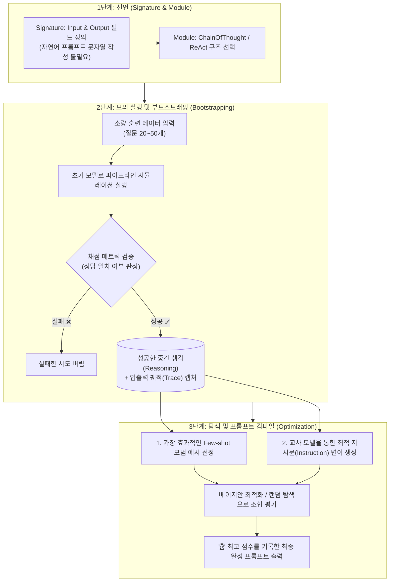

# 02. 프롬프트 엔지니어링 5대 모범 원칙과 CoT / 자동 최적화

## 📌 핵심 요약 & 전체 맥락
> **"프롬프트 엔지니어링의 본질은 '$300 팁을 줄게' 같은 임시변통 트릭이 아니라, 모델의 인지 메커니즘에 최적화된 구조적이고 체계적인 소통 원칙을 세우는 것입니다."**  
> 본 섹션에서는 OpenAI, Anthropic, Google, Meta 등 선도 AI 연구소들이 공식 권장하고 수많은 프로덕션 현장에서 검증된 **5대 모범 실무 원칙**을 체계적으로 다룹니다.  
> 명확한 페르소나 설정과 구분자(Delimiter), 토큰 비용을 29% 절감하는 퓨샷 포맷팅, 모델의 지식을 컨텍스트 내부로만 엄격히 제한하는 기법(Skyrim 예시), 복잡한 업무를 2단계로 분해하는 프롬프트 체이닝(OpenAI 및 GoDaddy 사례), 거대 모델의 추론 지능을 극대화하는 **생각의 사슬 (Chain-of-Thought, CoT)** 및 **자가 비판 (Self-Critique)**, 그리고 DeepMind의 **Promptbreeder**, Stanford의 **TextGrad / DSPy**를 활용한 프롬프트 자동 컴파일과 버전 관리 카탈로그 구축까지 엔지니어링 필수 기법을 완벽히 정리합니다.

---

## 🗺️ 도표(Figure & Table) 색인 및 매핑 가이드

본문의 핵심 원리를 시각적으로 확인할 수 있는 책 내 도표의 위치와 해설 매핑입니다:

| 도표 번호 | 도표 제목 및 핵심 내용 | 책 페이지 | 본문 해당 주제 |
| :---: | :--- | :---: | :--- |
| **Figure 5-5** | 페르소나(Persona: 전문 생물학자 vs 초등학교 1학년 교사) 설정을 통한 답변 톤과 설명 깊이 통제 예시 | **p. 221** | 원칙 1. 명확하고 명시적인 지시문 작성 |
| **Table 5-1** | 예시 1개 제공 유무에 따른 모델의 출력 형식 및 톤앤매너 정렬 효과 (산타클로스 질답) | **p. 222** | 원칙 1. 예시 제공의 힘 |
| **Table 5-2** | 퓨샷 예시 작성 포맷(장황한 포맷 38토큰 vs 콤팩트 포맷 27토큰)에 따른 비용 절감 비교 | **p. 223** | 원칙 1. 퓨샷 토큰 비용 최적화 |
| **Table 5-3** | 명시적 구분자(`-->`) 부재 시 모델이 입력을 이어쓰는 환각 오류 실증 | **p. 225** | 원칙 1. 출력 형식 지정과 구분자 |
| **Figure 5-6** | CoT 도입에 따른 LaMDA, GPT-3, PaLM 모델의 수학/추론 벤치마크(MAWPS, SVAMP, GSM8K) 점수 급상승 그래프 | **p. 227-228** | 원칙 4. 생각할 시간 주기 (CoT) |
| **Table 5-4** | 동일 쿼리에 대한 4가지 CoT 프롬프트 변형 (Zero-shot CoT, Step 지정 CoT, One-shot CoT) 비교 | **p. 228-229** | 원칙 4. CoT 프롬프트 4가지 변형 |
| **Figure 5-7** | Claude 3.5 Sonnet이 직접 작성한 고도화된 메타 프롬프트 아키텍처 | **p. 230-231** | 원칙 5. 프롬프트 반복 개선 |
| **Figure 5-8** | 유전 알고리즘(Genetic Algorithm) 기반 자가 발전 프롬프트 변이 시스템 Promptbreeder 아키텍처 | **p. 231-232** | 원칙 5. 자동 프롬프트 최적화 |
| **Figure 5-9** | LangChain 기본 critique 프롬프트 템플릿에 방치된 실제 오타(Typo) 하이라이트 | **p. 232** | 원칙 5. 프롬프트 도구의 함정 |

---

## 1. 프롬프트 엔지니어링 5대 모범 실무 원칙 (pp. 220 ~ 230)



---

### 원칙 1. 명확하고 명시적인 지시문 작성 (Write Clear and Explicit Instructions, pp. 220 ~ 223)

#### ① 모호성 완전 제거 (Eliminate Ambiguity)
* 평가나 채점 기준을 내릴 때 단순히 "에세이를 평가하라"고 두루뭉술하게 지시하면 모델마다 주관적 기준이 달라집니다.
* 점수 범위(1~5점인지 1~10점인지), 불확실할 때의 동작("모름"을 출력할지 최선의 추측을 할지)을 명시해야 합니다.
* *책 속 실무 사례:* 만약 모델이 `4.5` 같은 소수점 점수를 출력하는데 정수 점수만 필요하다면, 프롬프트에 **"1부터 5까지의 정수(Integer)로만 점수를 매기고, 4.5 같은 소수점은 절대 쓰지 마라."**라고 명시적으로 수정해야 합니다.

#### ② 페르소나(Persona) 설정 (Figure 5-5)
* 모델에게 특정 전문 역할이나 관점을 부여하면, 모델의 내부 확률 분포가 해당 도메인의 전문 어휘, 설명의 깊이, 평가 잣대로 강력하게 고정됩니다.
* 📖 **책 속 실증 예시 (p. 221):**  
  > *"I like chickens. Chickens are fluffy and they give tasty eggs." (나는 닭을 좋아한다. 닭은 푹신하고 맛있는 계란을 준다.)*  
  * **기본 모델 (No Persona):** 일반적인 작문 기준을 적용하여 5점 만점에 **2점**을 부여.
  * **초등학교 1학년 교사 페르소나 주입 후:** *"초등학교 1학년 수준에 맞는 훌륭하고 귀여운 문장"*으로 판단하여 **4점**을 부여.

#### ③ 예시 제공의 힘 (Table 5-1)
* 모델에게 원하는 응답 톤앤매너를 단 몇 줄의 지시문으로 설명하기 어려울 때, **단 1개의 모범 예시(One-shot Example)**가 결정적인 나침반 역할을 합니다.
* 📖 **책 속 실증 예시 (산타클로스 질답, Table 5-1):**
  * **사용자 질문:** *"크리스마스에 산타가 진짜로 선물을 가져다줄까요?"*
  * **예시 없을 때 (Without Example):** *"산타클로스는 성 니콜라우스 전설에 기반한 가상의 인물이며, 부모들이 아이들에게 동심과 즐거움을 주기 위해..."* ➔ 동심을 파괴하는 딱딱한 백과사전식 답변.
  * **치아 요정(Tooth Fairy) 예시 1개 추가 시 (With Example):**  
    `Q: 이빨 요정은 진짜 있나요? A: 물론이지! 오늘 밤 베개 밑에 빠진 이를 넣어두렴. 요정이 찾아와 선물을 두고 갈지도 몰라.`  
    ➔ **모델 답변:** *"그럼, 당연하지! 산타는 일 년 내내 착하게 지낸 아이들에게 선물을 주는 걸 정말 좋아한단다. 쿠키를 준비해 두면 아침에 트리 밑에서 선물을 발견할 수 있을 거야!"* ➔ 완벽한 톤 정렬 성공.

#### ④ 퓨샷 예시의 토큰 비용 최적화 (Table 5-2) ⭐
예시를 작성할 때 불필요한 라벨(`Input:`, `Output:`)을 제거하고 화살표(`-->`) 같은 간결한 기호로 압축하면, 동일한 정확도를 유지하면서도 **API (Application Programming Interface, 응용 프로그램 인터페이스)** 호출 비용과 지연시간을 대폭 절감할 수 있습니다:

| 예시 작성 포맷 | 실제 프롬프트 내용 | GPT-4 토큰 수 | 비용 절감 효과 |
| :--- | :--- | :---: | :---: |
| **장황한 포맷 (Verbose)** | `Input: chickpea` <br> `Output: edible` <br> `Input: box` <br> `Output: inedible` <br> `Input: pizza` <br> `Output:` | **38 토큰** | 기준점 (0%) |
| **콤팩트 포맷 (Compact)** | `chickpea --> edible` <br> `box --> inedible` <br> `pizza -->` | **27 토큰** | **~29% 토큰 및 비용 절감 🚀** |

#### ⑤ 출력 형식 지정, 서두(Preamble) 제거 및 종료 구분자(Delimiter) (Table 5-3)
* **서두(Preamble) 제거:** 모델이 *"이 에세이의 내용을 검토한 결과, 제 점수는..."* 같은 불필요한 서두를 붙이지 않도록 **"서두나 인사말 없이 오직 결과만 출력하라"**고 명시합니다.
* **구분자(Delimiter)의 필수성:** 언어 모델은 스스로 "여기까지가 입력이고 여기서부터 출력이다"라는 경계를 알지 못합니다.
* ⚠️ **구분자 부재 오류 (Table 5-3):**  
  마지막 입력 단어 `chicken` 뒤에 화살표(`-->`)나 콜론(`:`) 같은 명시적 구분자를 붙이지 않으면, 모델은 분류 결과를 내놓는 대신 `chicken tacos --> edible`처럼 **입력 텍스트 뒤에 단어를 임의로 이어붙이는 자동완성 환각 오류**를 범합니다.

#### ⑥ 구조화된 출력(Structured Output)을 강제하는 4단계 엔지니어링 🛠️
다운스트림 소프트웨어와 연동하기 위해 완벽한 **JSON (JavaScript Object Notation, 자바스크립트 객체 표기법)**이나 **YAML (YAML Ain't Markup Language)**을 뽑아내는 실무 4단계 방식:
1. **Band-aid (임시방편):** 프롬프트에 *"반드시 유효한 JSON 형식으로만 답해줘"*라고 텍스트로 애원하는 방식 (여전히 깨질 확률 높음).
2. **Post-processing (후처리 파싱):** 모델이 뱉은 자연어 문장에서 **Regex (Regular Expression, 정규 표현식)**를 돌려 `{ }` 중괄호 영역만 추출 (파싱 에러 빈발).
3. **Test-time compute (재시도 루프):** 파싱 에러 발생 시 에러 로그를 모델에게 다시 전달하며 "포맷이 틀렸으니 다시 고쳐라"고 재시도(Retry)시킴.
4. **Tooling (구조화 도구 강제 🏆):** 모델의 디코딩 과정에서 JSON 스키마를 벗어난 토큰 자체를 생성하지 못하도록 문법 마스크를 씌우는 OpenAI JSON Mode, **`Instructor`**(Pydantic 기반), **`Outlines`**, **`Guidance`** 라이브러리를 사용하는 현대적 표준 방식.

---

### 원칙 2. 충분한 컨텍스트 제공과 지식 범위 제한 (Provide Sufficient Context, pp. 223 ~ 225)

* **오픈북 시험 메커니즘:**  
  수험생에게 암기만으로 시험을 보게 하면 거짓말(환각)을 지어내기 쉽지만, 관련 참고 교재를 손에 쥐여주고 시험을 보게 하면 정답률이 비약적으로 상승합니다.
* 필요한 지식을 프롬프트 컨텍스트로 직접 주입하지 않으면, 모델은 불확실한 내부 가중치 기억(Parametric Memory)에 의존하여 **환각 (Hallucination)**을 일으킵니다.

#### 🔒 모델의 지식을 오직 컨텍스트 내부로만 제한하는 방법 (How to Restrict Knowledge, pp. 224 ~ 225) ⭐
롤플레잉 게임이나 특정 사내 업무 시뮬레이션에서는 모델이 외부 세상의 지식을 말하지 못하게 막아야 합니다.
* 📖 **책 속 실증 예시 (스카이림 게임 캐릭터):**  
  > 게임 *스카이림(Skyrim)* 세계관의 경비병 NPC 역할을 맡은 AI에게 사용자가 *"너 스타벅스에서 제일 좋아하는 메뉴가 뭐야?"*라고 물었을 때, AI가 *"저는 아이스 아메리카노를 좋아합니다"*라고 답하면 게임의 몰입도가 완전히 깨집니다. 이 NPC는 스타벅스라는 현대 개념 자체를 몰라야 합니다.
* **엔지니어링 대응 3단계:**
  1. **명시적 지시와 거부 예시:** *"오직 제공된 컨텍스트에 기반해서만 답변하라"*고 지시하고, 모르는 질문을 받았을 때 *"스타벅스가 무엇인지 모른다"*고 답하는 Few-shot 거절 예시를 함께 제공.
  2. **원문 인용(Quoting) 강제:** 모델에게 **"답변을 작성할 때 반드시 제공된 텍스트의 어느 문장에서 근거를 가져왔는지 원문을 직접 인용(Quote)하라"**고 지시하면, 컨텍스트에 없는 내용을 지어내는 환각이 극적으로 억제됨.
  3. **한계점 인식:** 프롬프팅이나 파인튜닝만으로는 사전 학습 가중치에 들어있는 지식이 불시에 새어나오는 **지식 누출(Pre-training Data Leakage)**을 100% 완벽히 차단하기 어렵습니다. 가장 안전한 방법은 허용된 코퍼스로만 처음부터 사전 학습(Pre-train from scratch)하는 것이지만, 이는 비용과 데이터 부족으로 대부분의 기업에서 현실적으로 불가능합니다.

---

### 원칙 3. 복잡한 작업을 단순한 서브태스크로 분해 (Break Complex Tasks Down, pp. 225 ~ 227)

* 수십 가지 복잡한 비즈니스 로직을 단 하나의 거대한 프롬프트에 모두 집어넣으면 모델이 규칙 간의 충돌로 인해 지침을 무시하기 시작합니다.
* **프롬프트 체이닝 (Prompt Chaining):** 복잡한 작업을 단계별로 쪼개어 소형 프롬프트 파이프라인으로 구축합니다.

#### 📖 OpenAI 고객지원 2단계 프롬프트 분해 실증 코드 (pp. 224 ~ 226)

```text
[ 1단계 : 의도 분류 프롬프트 (Intent Classification Prompt) ]
SYSTEM:
귀하는 고객 지원 문의를 분류하는 AI입니다. 
각 고객 문의를 1차 카테고리(Primary)와 2차 카테고리(Secondary)로 분류하여 JSON 형식으로 출력하시오.
- 1차 카테고리 목록: Billing(결제), Technical Support(기술 지원), Account Management(계정 관리), General Inquiry(일반 문의)
- 기술 지원의 2차 카테고리: Device Troubleshooting, Software Installation, Network Issue

출력 포맷: {"primary": "Technical Support", "secondary": "Device Troubleshooting"}
```

```text
[ 2단계 : 기술 지원 전용 서브 프롬프트 (Troubleshooting Sub-prompt) ]
SYSTEM:
귀하는 IT 하드웨어 문제 해결 전문가입니다. 
고객이 기기 연결 및 작동 문제를 겪고 있습니다. 다음 단계에 따라 문제 해결을 안내하십시오:
1. 전원 케이블 및 네트워크 선이 정상적으로 연결되어 있는지 확인하도록 요청하십시오.
2. 기기 전원을 끄고 10초 대기 후 재부팅하도록 안내하십시오.
3. 문제가 지속될 경우 에러 코드 번호를 요청하십시오.
```

* **비용과 성능의 이중 이점:**  
  * 프롬프트를 2개로 나누면 API 호출이 2번 발생하지만, **작은 프롬프트는 입출력 토큰 수가 적어 총비용이 2배로 늘어나지 않습니다**.
  * 나아가 **1단계(의도 분류)에는 초저가 경량 모델(`GPT-4o-mini`, `Llama-3-8B`)을 쓰고, 2단계(정밀 문제 해결)에만 최고 성능 모델(`GPT-4o`, `Claude 3.5 Sonnet`)을 쓰는 모델 라우팅을 적용하여 전체 서빙 비용을 80% 이상 절감**할 수 있습니다.
* 💡 **GoDaddy (2024)의 프로덕션 성공 사례:**  
  고객지원 챗봇 프롬프트에 온갖 예외 규칙이 덕지덕지 붙어 **1,500토큰의 거대 프롬프트로 비대화**되자 정확도가 급락했습니다. 이를 의도 분류기 및 도메인별 서브 프롬프트로 모듈화하여 분해한 결과, **정확도가 대폭 상승하고 1회 호출당 토큰 비용도 크게 절감**되었습니다.

---

### 원칙 4. 모델에게 생각할 시간 주기 (Chain-of-Thought & Self-Critique, pp. 227 ~ 229)

```
[ 생각의 사슬 (Chain-of-Thought, CoT)의 기본 메커니즘 ]

사용자 질문: "식당에 23명이 있고 9명이 나갔다가 4명이 들어왔다. 지금 몇 명인가?"

❌ 일반 프롬프트 : 곧바로 "18명" 출력 시도 ➔ 중간 연산 없이 단번에 맞히려다 오답 확률 증가
✅ CoT 프롬프트  : "차근차근 생각해보자. 23 - 9 = 14명이고, 여기에 4명을 더하면 14 + 4 = 18명이다. 따라서 18명."
                  ➔ 모델이 중간 추론 토큰들을 스스로 생성하면서 최종 정답 토큰의 확률을 수직 상승시킴!
```

#### ① CoT의 창발적 능력과 성능 향상 (Wei et al., 2022, Figure 5-6)
* 수학 연산, 논리 퍼즐, 다단계 추론 벤치마크(MAWPS, SVAMP, GSM8K)에서 모델의 정답률이 20%대에서 60~80% 이상으로 수직 상승합니다.
* 💡 **창발적 지능 (Emergent Ability):**  
  CoT 효과는 모델 파라미터가 1,000억 개(100B, 100 Billion) 이상인 **초거대 파운데이션 모델에서만 마법처럼 발현**됩니다. 매개변수가 작은 소형 모델은 "생각해보자"고 시켜도 논리적 사고력 자체가 부족하여 헛소리만 길게 늘어놓을 뿐입니다.
* **LinkedIn의 현장 발견:**  
  프로덕션 환경에서 모델에게 최종 답변 전 CoT를 통해 자체 검증 단계를 거치게 하면 환각 발생률이 눈에 띄게 감소합니다.

#### ② 4가지 CoT 프롬프트 변형 (Table 5-4)

| CoT 기법 | 프롬프트 작성 예시 | 특징 및 작동 메커니즘 |
| :--- | :--- | :--- |
| **1. 원본 쿼리 (No CoT)** | *"고양이와 개 중 어느 동물이 더 빠른가?"* | 중간 추론 없이 즉시 단답을 강요 |
| **2. Zero-shot CoT (A)** | *"...정답을 내기 전에 **단계별로 생각하라(Think step by step)**."* | 마법의 문구 하나로 모델의 자율 추론 토큰 유도 (Kojima et al., 2022) |
| **3. Zero-shot CoT (B)** | *"...정답을 제시하기 전에 **판단 근거를 먼저 설명하라(Explain your rationale)**."* | 논리적 근거(CoT)를 앞에 먼저 배치하여 결론의 정확도 제고 |
| **4. Step 지정 CoT** | *"...다음 단계에 따라 순서대로 답하라: <br>1. 가장 빠른 개 품종 최고 속도 확인 <br>2. 가장 빠른 고양이 품종 최고 속도 확인 <br>3. 둘을 비교하여 빠른 쪽 결정"* | 엔지니어가 추론 절차를 명시적으로 통제 |
| **5. Few-shot / One-shot CoT** | `Q: 상어와 돌고래 중 누가 더 빠른가?` <br>`1. 청상아리 최고 속도 74km/h` <br>`2. 참돌고래 최고 속도 60km/h` <br>`3. 결론: 상어가 더 빠름.` <br>`Q: 고양이와 개 중 어느 동물이 더 빠른가?` | 완벽한 중간 추론 과정 모범 예시를 프롬프트에 주입 (Wei et al., 2022) |

#### ③ 자가 비판 (Self-Critique / Self-Eval, p. 229)
* 모델에게 답변을 생성하게 한 직후, **"방금 네가 작성한 답변에 사실 오류나 논리적 허점이 없는지 스스로 검토하고 수정하라"**고 지시하는 기법.
* ⚠️ **엔지니어링 트레이드오프:** CoT와 자가 비판은 중간 추론 토큰을 대량으로 생성하므로 첫 글자 응답 시간인 **TTFT (Time To First Token, 첫 토큰 생성 지연시간)**와 전체 생성 지연시간이 길어지며, 출력 토큰 수 증가로 API 비용이 늘어납니다.

---

### 원칙 5. 프롬프트 반복 개선, 도구 활용 및 버전 관리 (pp. 229 ~ 235)

#### ① 반복 개선 (Iterate on Your Prompts, p. 229)
* 프롬프트는 단번에 완성되지 않으며 모델과의 상호작용을 통해 점진적으로 다듬어집니다.
* 📖 **책 속 실증 예시 (비디오 게임 추천):**  
  > *"가장 훌륭한 비디오 게임을 하나 골라줘"*라고 질문하면, 모델은 *"개인마다 취향이 다르므로 단 하나의 게임을 최고로 꼽을 수는 없습니다..."*라고 회피성 답변을 내놓기 쉽습니다.  
  > ➔ 이를 확인한 후 프롬프트를 **"의견이 갈릴 수 있음을 감안하더라도, 반드시 단 하나의 게임을 선택하고 그 이유를 설명하라"**고 보강하여 원하는 답변을 강제합니다.
* **모델별 특성(Quirks):** 어떤 모델은 지시사항이 프롬프트 맨 앞에 올 때 잘 따르고, 어떤 모델은 맨 뒤에 올 때 더 집중합니다. 개발용 플레이그라운드(Playground)에서 여러 모델에 동일 프롬프트를 넣어보고 반응 차이를 비교해야 합니다.
* **전체 시스템 관점 평가:** 서브태스크 하나에서 점수가 올랐더라도 전체 시스템 파이프라인 관점에서 최종 사용자 만족도가 떨어질 수 있으므로, 항상 엔드투엔드(End-to-End) 평가를 병행해야 합니다.

#### ② AI를 이용한 프롬프트 자동 최적화와 DSPy / TextGrad (Figures 5-7, 5-8, pp. 230 ~ 231)
* **메타 프롬프팅 (Meta-Prompting, Figure 5-7):**  
  최고 성능 모델(Claude 3.5 Sonnet 등)에게 *"대학 에세이를 1~5점으로 채점하는 애플리케이션을 위한 간결하고 정확한 시스템 프롬프트를 작성해줘"*라고 지시하여 고품질 초안을 자동 생성.
* **Promptbreeder (DeepMind, 2023, Figure 5-8):**  
  유전 알고리즘(Genetic Algorithm)을 적용하여, 초기 프롬프트에서 변이(Mutation)를 생성하고 벤치마크 평가를 통해 가장 우수한 프롬프트를 계속 교배·진화시키는 시스템.
* **TextGrad (Stanford, 2024):** 텍스트 피드백을 수치적 그래디언트(Gradient)처럼 활용하여 프롬프트를 역전파 방식으로 자동 개선하는 프레임워크.
* 🚀 **DSPy (Demonstrate-Search-Predict Framework, 스탠퍼드 대학교):**  
  문구를 수작업으로 수정하는 대신, 파이썬 코드로 모듈 구조와 평가 메트릭을 정의하면 **DSPy 컴파일러가 최적의 지시문과 Few-shot 예시 조합을 자동으로 탐색·합성하는 최첨단 프롬프트 프로그래밍 패러다임**.

---

### 🧠 [심층 분석] DSPy의 핵심 작동 원리와 내부 메커니즘

DSPy의 본질은 **"딥러닝에서 경사하강법으로 신경망 가중치를 학습시키듯, 알고리즘을 통해 최적의 프롬프트(지시문과 퓨샷 예시)를 자동 탐색·합성하는 것"**입니다.

#### 1. 전통적 머신러닝(PyTorch)과 DSPy의 1:1 대응 원리

| 구분 | 전통적 딥러닝 (PyTorch) | DSPy 프롬프트 프로그래밍 |
| :--- | :--- | :--- |
| **기본 구성 단위** | 신경망 레이어 (`nn.Linear`, `nn.Conv2d`) | 추론 모듈 (`dspy.Predict`, `dspy.ChainOfThought`) |
| **최적화 대상** | 부동소수점 가중치 행렬 ($W, b$) | **프롬프트 텍스트 (System 지시문 + Few-shot 모범 예시)** |
| **손실/평가 함수** | 손실 함수 (`nn.CrossEntropyLoss`) | 채점 메트릭 (`validate_answer` / 정확도 / LLM 판사) |
| **최적화 도구** | 옵티마이저 (`torch.optim.Adam`) | 텔레프롬프터 / 컴파일러 (`BootstrapFewShot`, `MIPROv2`) |
| **학습 메커니즘** | 역전파로 오차를 줄이는 가중치 갱신 | **성공한 실행 궤적(Trace)을 수집하여 프롬프트 자동 합성** |

---

#### 2. DSPy 컴파일러의 3단계 작동 파이프라인



---

#### 3. 2대 핵심 옵티마이저 알고리즘의 동작 원리
1. **자가 부트스트래핑 (Bootstrapping Demonstrations: `BootstrapFewShot`):**  
   사람이 퓨샷 예시를 손수 적지 않고, 모델에게 문제를 풀게 한 뒤 **정답을 맞힌 성공적인 중간 추론 과정(Chain of Thought 트레이스)을 자동으로 가로채서(Capture) 최적의 Few-shot 예시 블록으로 조립**합니다.
2. **지시문 자동 제안 및 베이지안 탐색 (`MIPROv2` / `COPRO`):**  
   교사 LLM(Teacher Model)에게 작업 목적과 성공/실패 예시를 보여주고 *"학생 모델이 100점을 맞을 수 있는 지시문(System Prompt) 후보 10개를 새로 작문하라"*고 지시한 뒤, **베이지안 최적화(Bayesian Optimization)**를 통해 가장 높은 점수를 획득한 지시문을 수학적으로 채택합니다.

---

##### 💻 [실제 구현 예시] DSPy를 활용한 프롬프트 자동 컴파일 파이썬 코드
DSPy는 문자열 조작 대신 **PyTorch와 유사한 클래스 구조(Signature ➔ Module ➔ Optimizer.compile)**를 사용하는 실제 동작하는 공식 라이브러리(`dspy-ai`)입니다:

```python
import os
import dspy

# 1. 언어 모델 설정 (OpenAI API 등)
lm = dspy.LM('openai/gpt-4o-mini', api_key=os.environ.get("OPENAI_API_KEY"))
dspy.settings.configure(lm=lm)

# 2. Signature (선언적 입출력 명세 정의)
class BasicQA(dspy.Signature):
    """주어진 문맥(Context)을 바탕으로 질문(Question)에 대해 간결하고 정확하게 답하시오."""
    context = dspy.InputField(desc="참고할 배경 지식/문서")
    question = dspy.InputField(desc="사용자의 질문")
    answer = dspy.OutputField(desc="1~2문장의 명확한 정답")

# 3. Module 정의 (ChainOfThought를 통한 중간 추론 자동 결합)
class RAGPipeline(dspy.Module):
    def __init__(self):
        super().__init__()
        self.generate_answer = dspy.ChainOfThought(BasicQA)
        
    def forward(self, context, question):
        return self.generate_answer(context=context, question=question)

# 4. 소량의 검증 데이터셋 (단 몇 개의 예시만으로도 최적화 가능)
trainset = [
    dspy.Example(
        context="파이썬은 1991년 귀도 반 로섬이 발표한 프로그래밍 언어이다.",
        question="파이썬을 만든 사람은 누구인가요?",
        answer="귀도 반 로섬"
    ).with_inputs('context', 'question'),
    dspy.Example(
        context="빛의 속도는 진공에서 초당 약 30만 km이다.",
        question="빛은 1초에 얼마나 이동하나요?",
        answer="약 30만 km"
    ).with_inputs('context', 'question')
]

# 5. 평가 메트릭 (정답 키워드가 포함되어 있는지 검증)
def validate_answer(example, pred, trace=None):
    return example.answer in pred.answer

# 6. 컴파일러(Optimizer)로 프롬프트 자동 최적화!
from dspy.teleprompt import BootstrapFewShot

optimizer = BootstrapFewShot(metric=validate_answer, max_bootstrapped_demos=2)
compiled_rag = optimizer.compile(student=RAGPipeline(), trainset=trainset)

# 7. 최적화된 프롬프트로 추론 수행
response = compiled_rag(
    context="대한민국의 수도는 서울이며, 인구는 약 940만 명이다.",
    question="대한민국의 수도는 어디인가요?"
)

print("=== 최종 답변 ===", response.answer)
print("=== 자동 생성된 추론 과정 ===", response.rationale)

# DSPy가 내부적으로 조립한 최종 프롬프트 전문 확인
# lm.inspect_history(n=1)
```

##### ❓ [심화 Q&A] 동일한 `InputField`인데 `context`와 `question` 변수를 어떻게 구분해서 매핑할까?
클래스 선언 시 `desc`만 다르고 호출하는 메서드가 `dspy.InputField()`로 완전히 동일한데도 런타임에 배경 지식과 사용자 질문이 정확히 구분되는 원리는 **3단계 메커니즘**에 있습니다:

1. **클래스 정의 시 (파이썬 메타클래스 변수명 감지):**  
   `BasicQA` 클래스가 파이썬 인터프리터에 의해 생성될 때, `dspy.Signature` 내부의 메타클래스(Metaclass)가 클래스 속성을 검사하여 **변수 이름 자체(`context`, `question`)를 슬롯의 고유 키(Key)로 자동 등록**하고 설명(`desc`)을 바인딩합니다 (Pydantic 및 Django ORM과 동일한 원리).
2. **함수 실행 시 (키워드 인자 `**kwargs` 매핑):**  
   `compiled_rag(context="...", question="...")` 형태로 호출할 때, 넘겨받은 키워드 인자의 키 이름(`context`, `question`)을 바탕으로 각각 일치하는 슬롯에 값을 1:1로 주입합니다.
3. **LLM 전송 시 (태그 기반 프롬프트 자동 조립):**  
   DSPy가 모델에게 보낼 때 다음과 같이 **각 필드의 이름과 설명을 명확한 라벨로 분리하여 최종 프롬프트 문자열로 자동 조립**하기 때문에 LLM도 두 입력을 완벽히 구분합니다:
   ```text
   Context: 참고할 배경 지식/문서
   Question: 사용자의 질문
   Reasoning: Let's think step by step in order to produce the answer.
   Answer: 1~2문장의 명확한 정답
   ---
   Context: 대한민국의 수도는 서울이며, 인구는 약 940만 명이다.
   Question: 대한민국의 수도는 어디인가요?
   Reasoning:
   ```

> 💡 **DSPy의 3대 실무적 장점:**
> 1. **결합 최적화 (Joint Optimization):** 검색 ➔ 요약 ➔ 답변 생성으로 이어지는 다단계 파이프라인의 프롬프트를 한 번에 End-to-End로 조화롭게 최적화.
> 2. **무마찰 모델 이식성 (Portability):** `GPT-4o`에서 `Llama-3-8B`로 모델을 바꿔도 사람이 프롬프트를 다시 쓰지 않고 `compile()`만 재실행하면 모델 맞춤형 프롬프트 완성.
> 3. **정량적 엔지니어링:** 주관적인 감이 아닌 검증 데이터셋의 점수(Metric)를 기반으로 검증된 최적 프롬프트만 프로덕션에 배포.

#### ③ 프롬프트 도구의 함정과 주의사항 (Figure 5-9, p. 232)
* **숨겨진 API 비용 폭증:** 프롬프트 자동 튜닝 도구가 10개 변형을 30개 평가 샘플에 돌리면 **단 한 번에 300회 이상의 백그라운드 API 호출**이 발생하여 비용 폭탄을 맞을 수 있습니다.
* **프레임워크 자체의 결함 (Figure 5-9):** LangChain 등의 오픈소스 기본 critique 프롬프트 템플릿에 실제 오타(Typo)나 잘못된 토큰 결합 로직이 방치되어 성능을 갉아먹은 사례가 존재합니다.
* 💡 **Hamel Husain의 원칙:** *"Show Me the Prompt" (도구 뒤에 숨겨진 실제 최종 완성 프롬프트 텍스트를 반드시 눈으로 직접 까보고 검증하라).*

---

## 2. 프롬프트 구성 및 체계적 버전 관리 (pp. 233 ~ 235)

프롬프트는 파이썬 소스 코드 내부에 문자열로 하드코딩하지 않고, **독립적인 소프트웨어 설정 자산으로 분리하여 관리**해야 합니다.

### ① 코드와 프롬프트의 분리 (Separation of Prompts and Code, p. 233)

```python
# file: prompts.py
GPT4O_ENTITY_EXTRACTION_PROMPT = """
당신은 금융 텍스트에서 기업명과 매출액을 추출하는 엔티티 추출 전문가입니다.
반드시 JSON 포맷으로 출력하십시오.
"""

# file: application.py
from prompts import GPT4O_ENTITY_EXTRACTION_PROMPT

def query_openai(model_name: str, user_prompt: str):
    completion = client.chat.completions.create(
        model=model_name,
        messages=[
            {"role": "system", "content": GPT4O_ENTITY_EXTRACTION_PROMPT},
            {"role": "user", "content": user_prompt}
        ]
    )
    return completion.choices[0].message.content
```

* **분리의 4대 장점 (Advantages):**
  1. **재사용성 (Reusability):** 여러 애플리케이션 서비스에서 동일한 프롬프트 자산을 공유.
  2. **독립적 테스트 (Testing):** 비즈니스 로직 코드와 프롬프트 문구를 분리하여 각각 단위 테스트 수행.
  3. **가독성 (Readability):** 지저분한 수천 자의 프롬프트 텍스트가 소스 코드를 어지럽히지 않음.
  4. **협업 용이성 (Collaboration):** 도메인 전문가(기획자, 의사, 변호사)가 파이썬 코드를 건드리지 않고 프롬프트 텍스트 파일만 직접 수정하여 협업 가능.

---

### ② Pydantic 메타데이터 모델 (p. 234)

```python
from pydantic import BaseModel
from datetime import datetime
from typing import Optional, Dict, Any

class PromptMetadata(BaseModel):
    model_name: str                        # 대상 모델 (예: 'gpt-4o', 'claude-3-5-sonnet')
    date_created: datetime                 # 생성 일시
    prompt_text: str                       # 실제 프롬프트 원문 템플릿
    application: str                       # 적용 서비스명 (예: 'customer-support-bot')
    creator: str                           # 작성자
    temperature: float = 0.0               # 권장 샘플링 온도
    top_p: float = 1.0                     # Top-p 파라미터
    model_endpoint_url: Optional[str]      # 프라이빗 엔드포인트 URL
    input_schema: Optional[Dict[str, Any]] # 입력 JSON 스키마
    output_schema: Optional[Dict[str, Any]]# 기대되는 구조화 출력 스키마
```

---

### ③ 전용 `.prompt` 파일 포맷과 Dotprompt 예시 (Firebase, p. 234)

```yaml
---
model: vertexai/gemini-1.5-flash
input:
  schema:
    theme: string
output:
  format: json
  schema:
    name: string
    price: integer
    ingredients(array): string
---
Generate a menu item that could be found at a {{theme}} themed restaurant.
```

---

### ④ 중앙 프롬프트 카탈로그(Prompt Catalog / Registry)의 필요성 (pp. 234 ~ 235)
* **Git 버전 관리의 한계:** 프롬프트 파일을 소스 코드 Git 저장소에 같이 묶어두면, 공용 프롬프트가 업데이트되었을 때 **기존 버전을 안정적으로 유지하고 싶은 팀까지 강제로 최신 프롬프트로 덮어써져 예기치 못한 장애가 전파**됩니다.
* **중앙 카탈로그 도입 시 이점:**  
  * 각 애플리케이션 팀이 특정 프롬프트 버전(예: `v1.2.0`)을 고정(Pinning)하여 사용 가능.
  * 모델별, 태스크별 프롬프트 전문 검색 및 메타데이터 필터링 지원.
  * 어떤 애플리케이션이 어떤 프롬프트 버전에 의존하고 있는지 의존성 그래프를 추적하고, 새 버전 출시 시 담당자에게 자동 알림 전송.

---

## 🔗 연관 문서
* [[00-ch05-overview|00. Chapter 5 전체 개요 및 목차]]
* [[01-introduction-to-prompting-and-context|01. 프롬프트 기초와 컨텍스트 엔지니어링]]
* [[03-defensive-prompt-engineering-and-attacks|03. 방어적 프롬프트 엔지니어링]]
* [[chapter-qa/ch02-foundation-models-qa/08-sampling-and-probabilistic-nature|Ch02-08. 샘플링과 AI의 확률적 본성]]
