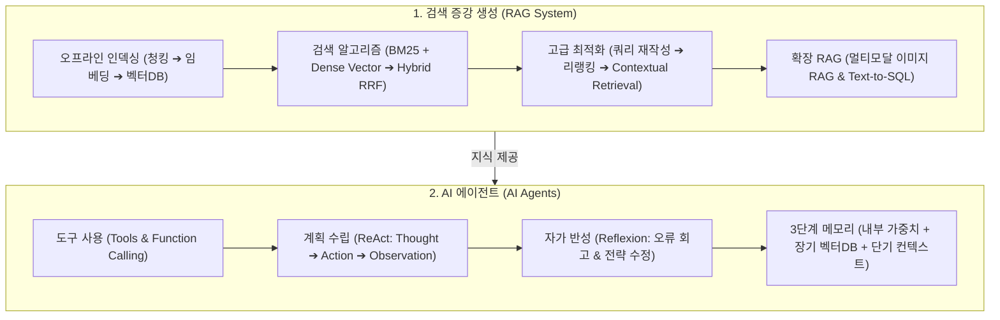

# Chapter 06. 검색 증강 생성(RAG)과 AI 에이전트 (RAG and Agents)

> **"파운데이션 모델이 '두뇌'라면, RAG는 '외장 기억 장치'이고 에이전트(Agent)는 '손과 발'이다."**  
> 정적이고 닫혀 있는 모델의 지식을 최신 외부 데이터베이스와 연결하는 **검색 증강 생성(Retrieval-Augmented Generation, RAG)**과, 외부 도구를 실행하고 스스로 계획을 세워 작업을 완수하는 **AI 에이전트(AI Agents)**는 현대 AI 엔지니어링의 양대 핵심 기둥입니다.  
> 본 챕터에서는 RAG의 기본 아키텍처(키워드 검색, 밀집 벡터 검색, 하이브리드 검색)부터 고급 최적화 기법(쿼리 재작성, Anthropic 문맥 기반 청킹, 멀티모달/표 RAG), 그리고 에이전트의 함수 호출(Function Calling), 계획 및 반성(ReAct, Reflexion), 3단계 메모리 계층 구조까지 실무 전반을 심층적으로 다룹니다.

---

## 🗺️ Chapter 6 학습 로드맵 및 소챕터 구성

| 번호 | 문서 제목 | 핵심 내용 및 주요 키워드 | 원문 페이지 |
| :---: | :--- | :--- | :---: |
| **00** | [[00-ch06-overview\|00. Chapter 6 전체 개요 및 목차]] | RAG & 에이전트 전체 로드맵, 개념 지도 및 도표 총괄 색인 | pp. 253-306 |
| **01** | [[01-rag-architecture-and-retrieval-algorithms\|01. RAG 아키텍처와 3대 검색 알고리즘 (BM25, 임베딩, 하이브리드)]] | Retrieve-then-Generate 패턴, 오프라인 인덱싱 vs 온라인 서빙 파이프라인, 역색인(Inverted Index), BM25 vs 밀집 벡터 검색, 상호 순위 융합(RRF) 하이브리드 검색 (pp. 253-267) | `RAG Architecture`, `Inverted Index`, `BM25`, `Dense Retrieval`, `Vector Search`, `Hybrid Search`, `RRF` |
| **02** | [[02-rag-optimization-and-multimodal-tabular\|02. RAG 검색 최적화와 멀티모달·정형 데이터(Text-to-SQL)]] | 쿼리 재작성(Query Rewriting), 크로스 인코더 리랭킹(Reranking), Anthropic 문맥 기반 청킹(Contextual Retrieval), 멀티모달 RAG, Text-to-SQL 표 데이터 RAG (pp. 267-275) | `Query Rewriting`, `Reranking`, `Contextual Retrieval`, `Multimodal RAG`, `Text-to-SQL`, `Tabular RAG` |
| **03** | [[03-ai-agents-tools-and-function-calling\|03. AI 에이전트 기초와 도구 활용 및 함수 호출 (Function Calling)]] | 에이전트 정의, SWE-agent 코딩 에이전트, 계획과 실행의 분리(Decoupling), 도구(Tools)와 함수 호출(Function Calling) 메커니즘, 스키마 정의 및 실행 보안 (pp. 275-285) | `AI Agent`, `SWE-agent`, `Function Calling`, `Tool Use`, `Decoupled Planning`, `Tool Security` |
| **04** | [[04-agent-planning-reflection-memory-and-eval\|04. 에이전트 계획 수립, 자가 반성(ReAct, Reflexion)과 메모리 계층]] | 계획 수립 제어 흐름(순차/병렬/루프), ReAct(이유-행동-관찰), Reflexion 자가 반성 루프, 도구 전이 트리, 3단계 메모리 계층(내부 지식/장기 기억/단기 메모리), 에이전트 실패 모드 및 평가 (pp. 285-306) | `ReAct`, `Reflexion`, `Self-Reflection`, `Tool Transition Tree`, `Agent Memory`, `Short-term Memory`, `Long-term Memory` |

---

## 🧠 Chapter 6 전체 개념 아키텍처 다이어그램

---

## 📊 Chapter 6 주요 도표 & 수치 색인

| 도표 번호 | 도표 제목 및 핵심 내용 | 책 페이지 | 해당 소챕터 |
| :---: | :--- | :---: | :---: |
| **Figure 6-1** | 전통적인 Retrieve-then-Generate 아키텍처 흐름도 | **p. 254** | 01 |
| **Figure 6-2** | RAG 전체 파이프라인 (오프라인 인덱싱 vs 온라인 검색-생성) 아키텍처 | **p. 256** | 01 |
| **Table 6-1** | 단어별 문서 위치를 매핑하는 역색인(Inverted Index) 구조 예시표 | **p. 259** | 01 |
| **Figure 6-3** | 쿼리와 문서 청크를 고차원 임베딩 공간에서 코사인 유사도로 매칭하는 시맨틱 검색 | **p. 263** | 01 |
| **Table 6-2** | 키워드 검색(BM25) vs 의미론적 검색(Dense) vs 하이브리드 검색 속도/비용/정확도 종합 비교표 | **p. 266** | 01 |
| **Figure 6-4** | 대화 이력을 고려하여 독립적인 검색 쿼리로 재작성(Query Rewriting)하는 ChatGPT 예시 | **p. 268** | 02 |
| **Figure 6-5** | 각 청크 앞에 문서 전체 맥락을 요약한 서두를 부착하는 Anthropic Contextual Retrieval | **p. 272** | 02 |
| **Figure 6-6** | 텍스트와 제품 이미지를 결합하여 시각적 답변을 생성하는 멀티모달 RAG 파이프라인 | **p. 273** | 02 |
| **Table 6-3** | 이커머스 쇼핑몰의 Sales 주문 데이터베이스 테이블 구조 | **p. 274** | 02 |
| **Figure 6-7** | 자연어 질문을 SQL로 변환하여 정형 데이터를 조회·증강하는 Text-to-SQL RAG 흐름도 | **p. 275** | 02 |
| **Figure 6-8** | 소프트웨어 엔지니어링 에이전트 SWE-agent의 터미널/코드베이스 상호작용 환경 | **p. 277** | 03 |
| **Figure 6-9** | 계획 수립(Planning)과 도구 실행(Execution)을 분리하여 검증된 계획만 실행하는 아키텍처 | **p. 280** | 03 |
| **Figure 6-10** | 모델이 정의된 도구 스키마를 보고 함수 호출 인수를 생성하는 Function Calling 의사코드 | **p. 283** | 03 |
| **Figure 6-11** | 에이전트 실행 제어 흐름 4가지 (순차, 병렬 분기, 조건부 분기, 반복 루프) | **p. 287** | 04 |
| **Figure 6-12** | 이유(Thought) ➔ 행동(Action) ➔ 관찰(Observation) 사이클로 문제를 푸는 ReAct 에이전트 | **p. 291** | 04 |
| **Figure 6-13** | 이전 시도의 실패 원인을 회고하고 기억에 저장하여 재도전하는 Reflexion 에이전트 | **p. 293** | 04 |
| **Figure 6-14** | 모델별(GPT-4 vs Claude) 및 태스크별 도구 사용 빈도와 패턴 차이 그래프 | **p. 296** | 04 |
| **Figure 6-15** | 도구 A 실행 후 도구 B를 호출할 확률을 전이 확률로 모델링한 도구 전이 트리 (Markov Tree) | **p. 298** | 04 |
| **Figure 6-16** | 에이전트 3단계 메모리 계층 구조 (1. 모델 내부 지식, 2. 장기 외장 메모리, 3. 단기 작업 기억) | **p. 301** | 04 |

---

## 💡 주요 축약어 원문 및 해설 사전 (Abbreviations Glossary)

* **RAG (Retrieval-Augmented Generation, 검색 증강 생성):** 외부 데이터베이스나 문서에서 질문과 관련된 지식을 검색(Retrieve)하여 프롬프트에 주입(Augment)한 뒤 답변을 생성(Generate)하는 아키텍처.
* **BM25 (Best Matching 25, 단어 빈도 및 문서 길이 기반 키워드 랭킹 알고리즘):** TF-IDF를 발전시켜 단어 포화도(Saturation)와 문서 길이 정규화를 적용한 현대 키워드 검색의 표준 알고리즘.
* **TF-IDF (Term Frequency-Inverse Document Frequency, 단어 빈도-역문서 빈도):** 특정 문서 내 단어 출현 빈도와 전체 코퍼스 내 희귀도를 곱해 단어의 중요도를 평가하는 통계적 가중치.
* **HNSW (Hierarchical Navigable Small World, 계층적 탐색 소세계):** 고차원 벡터 공간에서 고속으로 최근접 이웃을 찾기 위해 고속도로-국도-골목길 다층 그래프를 형성하는 표준 벡터 인덱싱 알고리즘.
* **ANN (Approximate Nearest Neighbor, 근사 최근접 이웃 탐색):** 100% 전수조사 대신 허용 가능한 오차 내에서 수백 배 빠르게 유사 벡터를 찾아내는 검색 기법.
* **RRF (Reciprocal Rank Fusion, 상호 순위 융합):** 점수 척도가 서로 다른 다중 검색기(예: BM25 + Dense Vector)의 결과 순위를 공정하게 결합하는 표준 앙상블 알고리즘 ($k=60$).
* **HyDE (Hypothetical Document Embeddings, 가상 문서 임베딩):** 질문에 대한 이상적인 가상 답안을 모델이 먼저 지어내게 한 뒤, 그 가상 문서의 임베딩으로 실제 문서를 검색하는 기법.
* **ReAct (Reason + Act, 추론과 행동의 결합 프레임워크):** 생각(Thought) ➔ 도구 행동(Action) ➔ 환경 관찰(Observation) 사이클을 반복하여 과업을 해결하는 에이전트 작동 원리.
* **Reflexion (자가 반성 루프):** 실패한 시도의 실행 궤적을 스스로 비판 회고(Critique)하고 오답 노트를 단기/장기 메모리에 저장해 다음 시도의 성공률을 높이는 에이전트 프레임워크.
* **SWE-agent (Software Engineering Agent, 소프트웨어 엔지니어링 에이전트):** GitHub 이슈를 읽고 터미널과 코드베이스를 자율 탐색하여 버그를 수정하고 테스트를 통과시키는 오픈소스 AI 코딩 에이전트.
* **ACI (Agent-Computer Interface, 에이전트-컴퓨터 인터페이스):** LLM 에이전트가 파일 탐색, 코드 수정, 명령 실행을 효율적으로 수행하도록 설계된 전용 도구 인터페이스.
* **MCTS (Monte Carlo Tree Search, 몬테카를로 트리 탐색):** 수많은 미래의 경우의 수를 확률적으로 시뮬레이션하고 평가하여 최적의 경로를 찾아내는 트리 탐색 알고리즘.
* **HITL (Human-in-the-Loop, 인간 개입 / 인간 승인):** 위험한 작업(DB 삭제, 금융 결제 등) 실행 전 사람 관리자의 최종 승인을 요구하는 안전 통제 체계.
* **SQL (Structured Query Language, 구조화 질의어):** 관계형 데이터베이스의 데이터를 조회, 수정, 삭제하기 위한 표준 컴퓨터 프로그래밍 언어.
