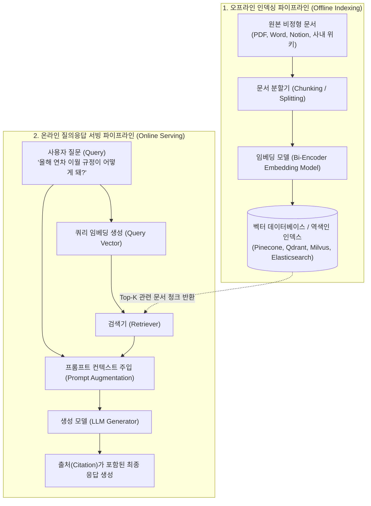
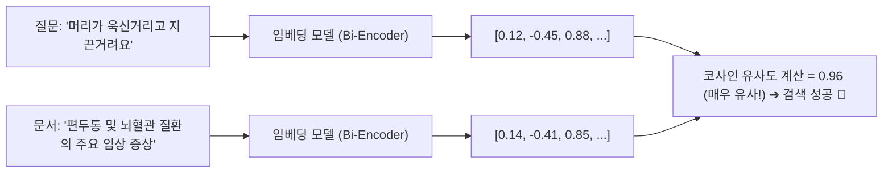
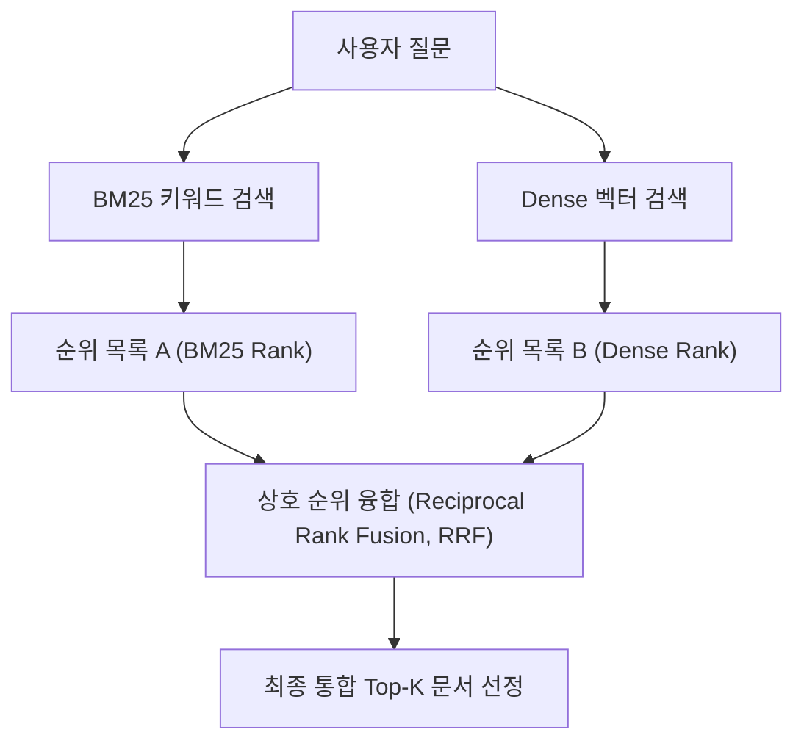

# 01. RAG 아키텍처와 3대 검색 알고리즘 (BM25, 임베딩, 하이브리드)

## 📌 핵심 요약 & 전체 맥락
> **"파운데이션 모델이 '두뇌'라면, RAG (Retrieval-Augmented Generation, 검색 증강 생성)는 '기억상실증에 걸린 천재에게 쥐어주는 최신 오픈북 시험지'입니다."**  
> 아무리 똑똑한 파운데이션 모델이라도 사전 훈련을 마친 시점(Knowledge Cutoff) 이후의 최신 정보나, 보안이 걸려있는 사내 비공개 데이터는 알지 못하며, 억지로 답변하려다 치명적인 환각(Hallucination)을 일으킵니다.  
> 이를 해결하기 위해 사용자의 질문을 받으면 외부 데이터베이스에서 관련 문서를 먼저 **검색 (Retrieve)**해 온 뒤, 그 문서를 프롬프트에 주입(증강, **Augment**)하여 **생성 (Generate)**하게 만드는 **RAG 아키텍처**가 현대 생성형 AI의 표준으로 자리 잡았습니다.  
> 본 문서에서는 **오프라인 인덱싱과 온라인 서빙 파이프라인의 이중 구조**, 단어 일치 중심의 **역색인(Inverted Index)과 BM25 알고리즘**, 의미론적 문맥을 파악하는 **밀집 벡터 검색(Dense Semantic Search & HNSW)**, 그리고 두 기법의 장점을 수학적으로 결합한 **상호 순위 융합(Reciprocal Rank Fusion, RRF) 하이브리드 검색**을 심층적으로 다룹니다.

---

## 🗺️ 도표(Figure & Table) 색인 및 매핑 가이드

본문의 핵심 원리를 시각적으로 확인할 수 있는 책 내 도표의 위치와 해설 매핑입니다:

| 도표 번호 | 도표 제목 및 핵심 내용 | 책 페이지 | 본문 해당 주제 |
| :---: | :--- | :---: | :--- |
| **Figure 6-1** | 전통적인 Retrieve-then-Generate (검색 후 생성) 기본 패턴 다이어그램 | **p. 254** | 1. RAG란 무엇이며 왜 필요한가? |
| **Figure 6-2** | 외부 메모리, 검색기(Retriever), 생성기(Generator)로 구성된 RAG 기본 아키텍처 | **p. 256** | 2. RAG 파이프라인의 이중 구조 |
| **Table 6-1** | 단어(Term)별로 문서 ID 목록을 매핑한 역색인(Inverted Index) 구조 예시표 | **p. 259** | 3. 키워드 기반 검색 (BM25) |
| **Figure 6-3** | 텍스트 청킹 ➔ 임베딩 ➔ 벡터DB 저장 및 쿼리 임베딩 검색의 전체 흐름도 | **p. 261-263** | 4. 임베딩 기반 밀집 벡터 검색 |
| **Table 6-2** | 키워드 검색 vs 임베딩 기반 검색의 속도, 성능, 비용(TCO) 종합 비교표 | **p. 266** | 4. 검색 방식 비교 및 트레이드오프 |

---

## 1. RAG의 본질과 4대 핵심 가치 (pp. 253 ~ 255)

```
[ RAG (Retrieval-Augmented Generation, 검색 증강 생성)의 4대 핵심 가치 ]

1. 최신 동적 지식 즉시 반영 : 수십억 원이 드는 모델 재학습(Fine-Tuning) 없이, 실시간 뉴스/주가/사내 규정을 즉시 두뇌에 꽂아줌
2. 사내 비공개 데이터 보안 보호 : 사내 위키, 노션, 고객 DB를 외부 LLM 업체의 학습 데이터로 유출시키지 않고 내부에서만 안전하게 활용
3. 환각 (Hallucination) 억제 : "내가 제공한 문서 컨텍스트 안에서만 대답하라"는 가드레일을 쳐서 모델의 근거 없는 허위 답변 원천 차단
4. 출처 추적 및 감사 가능성 (Auditability) : 답변 말미에 "[출처 1: 2024년 3분기 실적보고서 15페이지]" 링크를 제공하여 답변 신뢰성 극대화
```

* **탄생 배경 (Lewis et al., 2020, Figure 6-1):**  
  Meta AI 연구진이 제안한 RAG 논문에서 모델은 **"문서에 기반한 생성기(Document-grounded Generator)"**로 정의되었으며, 검색기(Retriever)와 생성기(Generator)를 결합하여 오픈 도메인 질의응답 성능을 극대화했습니다.
* 💡 **Anthropic의 실무 팁 (각주 p. 256):**  
  *"사내 지식 베이스 전체가 200,000 토큰(약 500페이지) 미만이라면, 복잡한 벡터 DB와 RAG 시스템을 구축하는 대신 전체 문서를 Claude 3.5 Sonnet의 롱 컨텍스트 프롬프트에 직접 통째로 넣는 것이 구현 속도와 정확도 면에서 훨씬 우수할 수 있다."*

---

## 2. RAG 파이프라인의 이중 구조 (Figure 6-2, p. 256)

RAG 시스템은 **배치(Batch)로 사전에 문서를 처리하는 오프라인 단계**와, **사용자 요청 시 실시간으로 동작하는 온라인 단계**로 명확히 분리됩니다:



---

## 3. 3대 검색 알고리즘 심층 비교 및 원리 (pp. 257 ~ 267)

---

### ① 키워드 기반 검색과 역색인 (Term-based: BM25, pp. 257 ~ 260)

* **역색인 (Inverted Index, Table 6-1):**  
  책의 맨 뒤에 있는 '색인(Index)'처럼, 모든 단어(Term)를 키(Key)로 하고 해당 단어가 등장하는 `문서 ID(DocID), 출현 빈도(TF), 단어 위치`를 값으로 저장하는 초고속 검색 자료구조입니다.

| 단어 (Term) | 출현 문서 목록 (Posting List: DocID & Frequency) |
| :--- | :--- |
| **`AI`** | Doc 1 (freq: 3), Doc 2 (freq: 1), Doc 3 (freq: 5) |
| **`model`** | Doc 1 (freq: 2), Doc 3 (freq: 1) |
| **`engineering`** | Doc 2 (freq: 4), Doc 3 (freq: 2) |

* **BM25 (Best Matching 25) 키워드 검색 알고리즘의 3대 핵심 기제:**
  1. **단어 빈도 (TF, Term Frequency):** 검색한 단어가 문서에 자주 등장할수록 점수를 높여줍니다. 단, 스팸 문서 방지를 위해 점수가 무한정 치솟지 않도록 포화도 곡선($k_1$ 파라미터)을 적용합니다.
  2. **역문서 빈도 (IDF, Inverse Document Frequency):** `"the"`, `"그리고"`처럼 모든 문서에 흔하게 등장하는 단어는 가중치를 0에 가깝게 낮추고, `"Transformer"`, `"CVE-2024-1234"`처럼 희귀한 전문 용어에는 막대한 가산점을 부여합니다.
  3. **문서 길이 정규화 (Document Length Normalization, $b$ 파라미터):** 쓸데없이 길이가 길어서 우연히 단어가 많이 걸린 긴 문서에는 페널티를 주고, 짧고 간결하게 핵심 단어를 담은 문서에 가산점을 줍니다.

* **장단점:**
  * ✅ **장점:** 고유명사, 쇼핑몰 제품 일련번호(SKU), 사람 이름, 에러 코드 등 **글자가 정확히 일치해야 하는 렉시컬(Lexical) 검색**에서 압도적이며, 별도의 GPU 없이 **CPU (Central Processing Unit)**만으로 밀리초 단위로 초고속 실행됩니다.
  * ❌ **단점 (어휘 불일치 문제, Vocabulary Mismatch):** 단어의 의미적 유사성을 모릅니다. 사용자가 *"심근경색"*이라고 검색하면, 뜻이 완전히 동일한 *"심장마비"* 문서를 전혀 찾아내지 못합니다.

---

### ② 임베딩 기반 밀집 벡터 검색 (Dense Semantic Retrieval, pp. 260 ~ 264, Figure 6-3)

* **동작 원리:**  
  텍스트를 수백~수천 차원의 연속적인 부동소수점 벡터(Vector)로 변환한 뒤, **코사인 유사도(Cosine Similarity)**나 내적(Dot Product)을 계산하여 글자가 달라도 맥락과 의미가 통하는 문서를 찾아냅니다.



#### 🚀 근사 최근접 이웃 (ANN, Approximate Nearest Neighbor) 인덱싱 기법
수억 개의 문서 벡터가 저장된 공간에서 내 질문 벡터와 가장 가까운 문서를 찾기 위해 모든 벡터와의 거리를 일일이 계산하는 완전 탐색(Exhaustive Search)은 너무 느립니다. 따라서 **"약간의 정확도 손실을 감수하고 100배 이상 빠르게 유사 벡터를 찾자"**는 타협안이 ANN 알고리즘입니다:

1. **HNSW (Hierarchical Navigable Small World, 계층적 탐색 소세계):**  
   고속도로(상위 듬성듬성한 계층) ➔ 국도(중간 계층) ➔ 골목길(최하위 촘촘한 계층)로 이어지는 다층 그래프를 형성합니다. 상위 층에서 성큼성큼 건너뛰며 유사 영역을 찾은 뒤 하위 층으로 내려가 정밀 탐색합니다. **현존 최고 수준의 검색 속도와 정확도(Recall)**를 제공하지만, **인덱스 구축 시간이 길고 고용량 RAM (Random Access Memory) 소모량이 매우 크다**는 비용적 한계가 있습니다.
2. **IVF (Inverted File Index, 역파일 색인):** 벡터 공간을 Voronoi 다이어그램으로 수천 개의 군집(Centroid)으로 나누고, 질문이 속한 인접 군집 내부의 벡터들만 빠르게 탐색하는 기법.
3. **LSH (Locality-Sensitive Hashing, 위치 민감 해싱):** 유사한 벡터일수록 동일한 해시 버킷(Bucket)에 충돌하도록 특수 해시 함수를 적용하는 기법.

---

### ③ 키워드 검색 vs 시맨틱 검색 종합 비교 (Table 6-2)

| 비교 항목 | 키워드 검색 (BM25) | 임베딩 기반 밀집 벡터 검색 (Dense) |
| :--- | :--- | :--- |
| **질의 속도 (Query Speed)** | ⚡ **압도적으로 빠름** (수 밀리초 이내) | 🐢 쿼리 임베딩 모델 호출 및 벡터 인덱스 탐색으로 상대적으로 느림 |
| **검색 품질 (Performance)** | • 도메인 튜닝 없이도 초기 성능 우수 <br>• 동의어 및 문맥적 뉘앙스 파악 불가 | • 자연어 질문의 추상적 의도를 정확히 포착 <br>• 고유명사, 숫자, 에러코드 검색 시 엉뚱한 결과 반환 위험 |
| **인프라 비용 (TCO)** | 💰 **매우 저렴함** (CPU 기반, 디스크 저장) | 💸 **매우 비쌈** (임베딩 API 요금, 고용량 RAM 필요 - **전체 서빙 비용의 20~50% 점유**) |

---

### ④ 하이브리드 검색과 상호 순위 융합 (Hybrid Search & RRF, pp. 266 ~ 267) ⭐

실무 프로덕션에서는 **BM25(키워드 정확성)와 Dense Vector(문맥 의미 이해)를 결합한 하이브리드 검색 (Hybrid Search)**이 표준 아키텍처로 사용됩니다.



#### 📐 상호 순위 융합 (RRF, Reciprocal Rank Fusion) 수학 공식
BM25의 점수(0~50)와 코사인 유사도(0.0~1.0)는 점수 스케일이 완전히 다르므로 단순히 점수를 더할 수 없습니다. 따라서 **각 검색기가 매긴 '등수(Rank)'만을 기반으로 공정하게 점수를 합산**합니다:

$$\text{RRF Score}(D) = \sum_{i=1}^n \frac{1}{k + r_i(D)}$$

* $n$: 결합할 검색기의 개수 (예: BM25 + Dense = 2개)
* $r_i(D)$: $i$번째 검색기에서 문서 $D$가 차지한 **1-based 등수** (1위면 $r=1$, 5위면 $r=5$)
* $k$: 하위 순위 문서의 영향력을 조절하고 분모가 0이 되는 것을 방지하는 평활화 상수 (산업 표준 기본값: **$k = 60$**)

---

## 🔗 연관 문서
* [[00-ch06-overview|00. Chapter 6 전체 개요 및 목차]]
* [[02-rag-optimization-and-multimodal-tabular|02. RAG 검색 최적화와 멀티모달·정형 데이터]]
* [[03-ai-agents-tools-and-function-calling|03. AI 에이전트 기초와 도구 활용 및 함수 호출]]
* [[chapter-qa/ch03-evaluation-methodology-qa/02-exact-and-semantic-evaluation|Ch03-02. 정확한 평가와 유사도 지표]]
