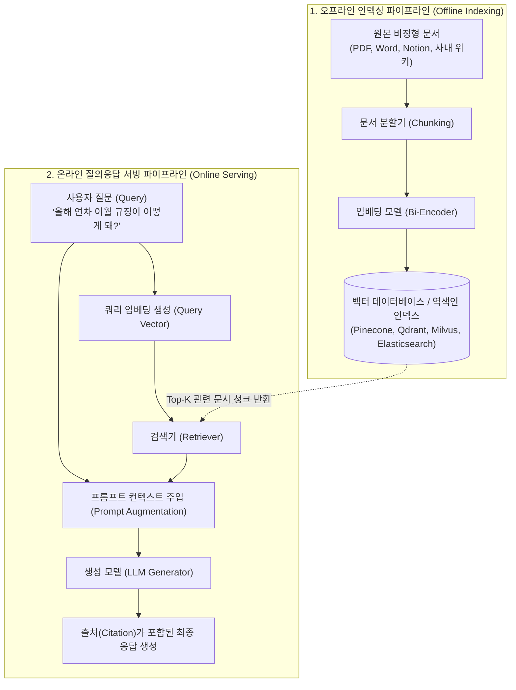
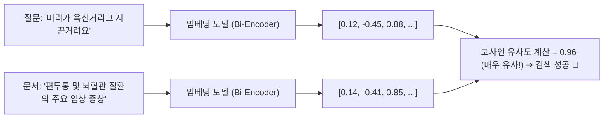
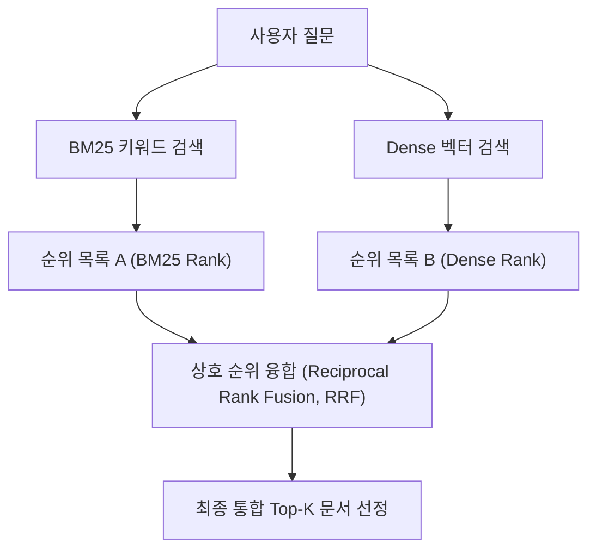

# 01. RAG 아키텍처와 3대 검색 알고리즘 (BM25, 임베딩, 하이브리드)

## 📌 핵심 요약 & 전체 맥락
> **"파운데이션 모델이 '두뇌'라면, RAG (Retrieval-Augmented Generation, 검색 증강 생성)는 '기억상실증에 걸린 천재에게 쥐어주는 최신 오픈북 시험지'입니다."**  
> 아무리 매개변수가 큰 파운데이션 모델이라도 사전 훈련을 마친 시점(Knowledge Cutoff) 이후의 최신 정보나 사내 비공개 데이터는 알지 못하며, 억지로 답변하려다 치명적인 환각(Hallucination)을 일으킵니다.  
> 전통적 머신러닝에서 피처 엔지니어링(Feature Engineering)이 모델에 필요한 정보를 가공해 주입했듯, 파운데이션 모델 시대에는 **컨텍스트 엔지니어링 (Context Construction)**이 그 역할을 대신하며, 그 핵심 기술이 바로 **RAG**입니다.  
> 본 문서에서는 RAG의 탄생 배경과 **롱 컨텍스트 모델이 발전해도 RAG가 절대 사라지지 않는 이유**, 단어 일치 중심의 **역색인(Inverted Index)과 TF-IDF / BM25 알고리즘**, 의미론적 문맥을 파악하는 **밀집 벡터 검색과 4대 ANN 색인(HNSW, IVF, PQ, LSH)**, 그리고 이를 수학적으로 결합한 **상호 순위 융합(Reciprocal Rank Fusion, RRF) 하이브리드 검색**을 완벽하게 정리합니다.

---

## 🗺️ 도표(Figure & Table) 색인 및 매핑 가이드

본문의 핵심 원리를 시각적으로 확인할 수 있는 책 내 도표의 위치와 해설 매핑입니다:

| 도표 번호 | 도표 제목 및 핵심 내용 | 책 페이지 | 본문 해당 주제 |
| :---: | :--- | :---: | :--- |
| **Figure 6-1** | 2017년 최초의 Retrieve-then-Generate (문서 검색 후 읽기) 패턴 다이어그램 | **p. 254** | 1. RAG의 탄생과 본질 |
| **Figure 6-2** | 외부 메모리, 검색기(Retriever), 생성기(Generator)로 구성된 RAG 기본 아키텍처 | **p. 256** | 2. RAG 아키텍처와 파이프라인 |
| **Table 6-1** | 단어(Term)별로 문서 ID와 출현 빈도를 매핑한 역색인(Inverted Index) 구조 예시표 | **p. 259** | 3. 키워드 기반 검색 (BM25) |
| **Figure 6-3** | 텍스트 청킹 ➔ 임베딩 ➔ 벡터DB 저장 및 쿼리 임베딩 검색의 전체 흐름도 | **p. 261-263** | 4. 임베딩 기반 밀집 벡터 검색 |
| **Table 6-2** | 키워드 검색 vs 임베딩 기반 검색의 속도, 성능, 비용(TCO) 종합 비교표 | **p. 265-266** | 5. 검색 방식 비교 및 트레이드오프 |

---

## 1. RAG의 본질과 핵심 동기 (pp. 253 ~ 256)

### ① 역사적 배경과 핵심 가치
* **Retrieve-then-Generate 패턴의 탄생 (Chen et al., 2017, Figure 6-1):**  
  위키피디아에서 질문과 관련된 5개 페이지를 먼저 검색한 뒤, LSTM (Long Short-Term Memory) 기반 리더(Reader) 모델이 문서를 읽고 답변을 생성하는 방식으로 시작되었습니다.
* **RAG 용어의 공식 제안 (Lewis et al., Meta AI, 2020):**  
  모든 지식을 모델의 가중치에 직접 집어넣을 수 없는 **지식 집약적 NLP 태스크(Knowledge-Intensive NLP Tasks)**를 해결하기 위해 제안되었으며, 관련 지식을 주입함으로써 **상세한 응답 생성과 환각(Hallucination) 감소**를 동시에 달성했습니다.
* 💡 **비유: 피처 엔지니어링의 진화**  
  > *"전통적 머신러닝에서 모델에 필요한 정보를 가공해 주던 **피처 엔지니어링(Feature Engineering)**이, 파운데이션 모델 시대에는 각 질문에 꼭 맞는 문맥을 조립하는 **컨텍스트 엔지니어링(Context Construction / RAG)**으로 진화한 것입니다."*

---

### ② 롱 컨텍스트(Long Context) 시대에도 RAG가 필수적인 2가지 이유 (p. 255)

많은 사람들이 "LLM의 컨텍스트 창이 100만~200만 토큰으로 늘어나면 RAG는 쓸모없어질 것"이라고 예측하지만, 책에서는 **2가지 명확한 이유로 RAG가 영원히 필수적**이라고 단언합니다:

```
[ 롱 컨텍스트 모델 시대에도 RAG가 사라지지 않는 2가지 이유 ]

1. 데이터 증가 속도가 컨텍스트 창의 확장 속도를 항상 앞지른다 (파킨슨의 법칙) :
   - 기업과 인류의 데이터는 매일 기하급수적으로 쌓이며, 아무리 창이 커져도 모든 사내 문서를 통째로 프롬프트에 넣을 수는 없음.

2. 컨텍스트 효율성 (Context Efficiency) 및 비용/지연시간 한계 :
   - 프롬프트가 길어질수록 모델은 중간에 위치한 정보를 놓치는 'Lost in the Middle' 주의력 분산 오류를 범함.
   - 1회 질의마다 수십만 토큰을 전송하면 API 비용이 폭증하고 첫 토큰 지연시간(TTFT)이 심각하게 늘어남.
   - RAG는 가장 관련된 핵심 청크만 골라 넣어주므로 비용을 극적으로 낮추고 성능을 극대화함.
```

* 💡 **Anthropic의 실무 지침 (각주 p. 256):**  
  사내 지식 베이스 전체가 **200,000 토큰(약 500페이지) 미만**이라면, 복잡한 벡터 DB를 구축하기보다 전체 문서를 Claude 3.5 Sonnet 프롬프트에 통째로 넣는 것이 구현 속도와 정확도 면에서 더 나을 수 있습니다.

---

## 2. RAG 아키텍처와 파이프라인 (pp. 256 ~ 257)

RAG 시스템은 **오프라인 데이터 가공 단계**와 **온라인 실시간 서빙 단계**로 나뉩니다:



---

## 3. 희소 vs 밀집 및 용어 체계 (Sparse vs Dense Retrieval, pp. 257 ~ 258)

| 분류 체계 | 표현 방식 | 대표 알고리즘 및 특징 |
| :--- | :--- | :--- |
| **희소 검색 (Sparse)** | 대부분의 값이 0인 거대 벡터 (One-hot 표현) | 단어 사전 크기만큼의 차원을 가지며, 정확한 키워드 일치 탐색 |
| **밀집 검색 (Dense)** | 대부분의 값이 0이 아닌 연속적 부동소수점 벡터 | 768~1536차원의 압축된 의미 벡터, 코사인 유사도 기반 탐색 |
| ⚠️ **SPLADE의 분류 모호성** | **희소 임베딩 (Sparse Embedding)** | BERT 임베딩에 L1 정규화를 걸어 대부분의 값을 0으로 만든 기법 (Formal et al., 2021). 원리는 딥러닝 임베딩이지만 표현이 희소 벡터임 ➔ 따라서 본 책에서는 '희소/밀집' 대신 **'단어 기반(Term-based) vs 임베딩 기반(Embedding-based)'**으로 분류 |

---

## 4. 3대 검색 알고리즘 심층 비교 및 원리 (pp. 258 ~ 267)

---

### ① 단어 기반 검색과 역색인 (Term-based: BM25, pp. 258 ~ 260)

#### 1) 역색인 (Inverted Index, Table 6-1)
단어를 키(Key)로 하고, 해당 단어가 등장하는 `(문서 번호, 출현 빈도)`를 값으로 저장하는 초고속 검색 자료구조:

| 단어 (Term) | 문서 수 (Doc Count) | 포스팅 리스트: (문서 ID, 출현 빈도 TF) |
| :--- | :---: | :--- |
| **`banana`** | 2 | `(10, 3)`, `(5, 2)` |
| **`machine`** | 4 | `(1, 5)`, `(10, 1)`, `(38, 9)`, `(42, 5)` |
| **`learning`** | 3 | `(1, 5)`, `(38, 7)`, `(42, 5)` |

#### 2) TF-IDF 수학 공식
$$\text{IDF}(t) = \log \frac{N}{C(t)}$$
$$\text{Score}_{\text{TF-IDF}}(D, Q) = \sum_{t \in Q} \text{IDF}(t) \times f(t, D)$$
* $N$: 전체 문서 수, $C(t)$: 단어 $t$를 포함하는 문서 수, $f(t, D)$: 문서 $D$ 내 단어 $t$의 출현 빈도(TF)

#### 3) Okapi BM25 알고리즘의 개선점 (Robertson et al., 1980s)
* **단어 빈도 포화도 ($k_1$ 파라미터):** 특정 단어가 문서에 100번 반복된다고 해서 점수가 100배로 치솟지 않도록 로그 형태의 포화 한계선 설정.
* **문서 길이 정규화 ($b$ 파라미터):** 우연히 길이가 길어서 단어가 많이 들어간 장문 문서에 페널티를 부여하고, 짧고 명확하게 핵심 단어를 포함한 문서에 가산점 부여.
* 💬 **Perplexity CEO (Aravind Srinivas):**  
  > *"BM25나 풀텍스트 검색을 진정으로 뛰어넘는 검색기를 만드는 것은 대단히 어렵다."*

---

### ② 임베딩 기반 밀집 벡터 검색 (Embedding-based Semantic Retrieval, pp. 260 ~ 264, Figure 6-3)

텍스트를 의미론적 연속 공간의 벡터로 변환하여 **코사인 유사도(Cosine Similarity)**나 내적(Dot Product)을 통해 문맥상 가장 가까운 문서를 탐색합니다:



---

### 🚀 4대 근사 최근접 이웃 (ANN, Approximate Nearest Neighbor) 인덱싱 기법 (pp. 262 ~ 264)

수억 개의 벡터 전체를 전수 조사(Exact k-NN)하는 것은 너무 느리기 때문에, 약간의 정확도를 타협하고 검색 속도를 수백 배 끌어올리는 **ANN 알고리즘**을 사용합니다:

```
[ 4대 주요 ANN 벡터 인덱싱 알고리즘 비교 ]

1. HNSW (Hierarchical Navigable Small World, Malkov & Yashunin, 2016) 🏆 :
   - 고속도로(상위 성긴 그래프) ➔ 국도(중간 계층) ➔ 골목길(최하위 밀집 그래프)로 이어지는 다층 스킵 리스트 그래프 구조.
   - 현존 최고 수준의 재현율(Recall)과 초고속 쿼리 속도 제공. 단, 인덱스 생성 시간과 RAM 소모량이 매우 큼.

2. IVF (Inverted File Index, Sivic & Zisserman, 2003) :
   - K-means 클러스터링으로 벡터 공간을 수천 개의 군집(Centroid)으로 분할 (군집당 100~10,000개 벡터).
   - 쿼리 벡터와 가장 가까운 몇 개의 군집 내부의 벡터들만 선별적으로 탐색하여 탐색 공간 대폭 축소.

3. PQ (Product Quantization, Jégou et al., 2011) ⭐ :
   - 고차원 벡터(예: 1024차원)를 여러 개의 저차원 서브벡터(예: 128차원 8개)로 쪼갠 뒤 코드북(Codebook)의 대표 인덱스로 압축 양자화.
   - 메모리 사용량을 1/8~1/16 수준으로 극적으로 줄이고 벡터 간 거리 연산 속도를 대폭 가속. (IVF와 결합된 IVF-PQ가 산업계 표준).

4. LSH (Locality-Sensitive Hashing, Indyk & Motwani, 1999) :
   - 유사한 벡터일수록 동일한 해시 버킷(Bucket)에 충돌하도록 설계된 특수 해시 함수 사용. 인덱스 생성이 빠르지만 정확도가 다소 떨어짐.
```

* **주요 벡터 검색 라이브러리:** Meta의 **FAISS**, Google의 **ScaNN**, Spotify의 **Annoy**, 오픈소스 **Hnswlib**.

---

### ③ 키워드 검색 vs 시맨틱 검색 종합 비교 (Table 6-2)

| 비교 항목 | 단어 기반 검색 (BM25) | 임베딩 기반 시맨틱 검색 (Dense) |
| :--- | :--- | :--- |
| **질의 속도 (Query Speed)** | ⚡ **압도적으로 빠름** (수 밀리초 이내) | 🐢 쿼리 임베딩 생성 및 벡터 탐색으로 상대적으로 느림 |
| **초기 성능 (Performance)** | • 별도 튜닝 없이도 초기 성능 우수 <br>• 단어 모호성(동음이의어)에 취약 | • 자연어 의도와 문맥을 정확히 포착 <br>• 파인튜닝 시 BM25를 압도 가능 |
| **인프라 비용 (TCO)** | 💰 **매우 저렴함** (CPU 및 디스크 기반) | 💸 **매우 비쌈** (임베딩 API 비용, 고용량 RAM 필요 - **서빙 비용의 20~50% 점유**) |

---

### ④ ANN 4대 성능 평가 메트릭과 BEIR 벤치마크 (pp. 265 ~ 266)

ANN 알고리즘을 평가할 때 고려해야 하는 **4대 트레이드오프 지표** (ANN-Benchmarks):
1. **재현율 (Recall):** 실제 완전 탐색(Exact k-NN) 정답 중 ANN 알고리즘이 찾아낸 비율.
2. **초당 쿼리 처리량 (QPS, Queries Per Second):** 고트래픽 서비스 서빙 시 필수 지표.
3. **인덱스 빌드 시간 (Build Time):** 데이터가 자주 업데이트될 때 재색인 소요 시간.
4. **인덱스 크기 (Index Size):** 메모리(RAM) 및 디스크 차지 용량.

* 🌐 **BEIR (Benchmarking IR, Thakur et al., 2021):** 14개 산업 표준 검색 벤치마크 데이터셋에서 검색 시스템의 성능을 종합 측정하는 글로벌 표준 하네스.

---

### ⑤ 하이브리드 검색과 상호 순위 융합 (Hybrid Search & RRF, pp. 266 ~ 267) ⭐

프로덕션 환경에서는 BM25(키워드 정확성)와 Dense Vector(문맥 의미 이해)를 결합한 **하이브리드 검색 (Hybrid Search)**이 표준입니다.



#### 1) 하이브리드 검색의 2가지 결합 방식
* **순차 결합 (Sequential / 2-Stage Re-ranking):** 저렴한 BM25로 후보군 100개를 먼저 뽑은 뒤, 정밀한 벡터 검색/크로스 인코더로 상위 10개를 재정렬(Rerank). (예: *"X사 대상 최대 매출 책임자"* 질의 시 X사 관련 문서를 키워드로 거른 뒤 의미 검색).
* **병렬 앙상블 (Parallel Ensemble):** BM25와 Dense 검색을 동시에 실행한 뒤 순위를 융합.

#### 2) 상호 순위 융합 (RRF, Reciprocal Rank Fusion, Cormack et al., 2009) 수학 공식
BM25의 점수(0~50)와 코사인 유사도(0.0~1.0)는 점수 체계가 다르므로, **오직 각 검색기에서 매긴 '순위(Rank)'만을 기반으로 공정하게 점수를 합산**합니다:

$$\text{RRF Score}(D) = \sum_{i=1}^n \frac{1}{k + r_i(D)}$$

* $n$: 결합할 검색기의 수 (예: BM25 + Dense = 2)
* $r_i(D)$: $i$번째 검색기에서 문서 $D$가 차지한 **1-based 등수** (1위면 $r=1$, 3위면 $r=3$)
* $k$: 하위 순위 문서의 왜곡을 방지하고 분모 0을 방지하는 평활화 상수 (산업 표준 기본값: **$k = 60$**)

---

## 🔗 연관 문서
* [[00-ch06-overview|00. Chapter 6 전체 개요 및 목차]]
* [[02-rag-optimization-and-multimodal-tabular|02. RAG 검색 최적화와 멀티모달·정형 데이터]]
* [[03-ai-agents-tools-and-function-calling|03. AI 에이전트 기초와 도구 활용 및 함수 호출]]
* [[chapter-qa/ch03-evaluation-methodology-qa/02-exact-and-semantic-evaluation|Ch03-02. 정확한 평가와 유사도 지표]]
