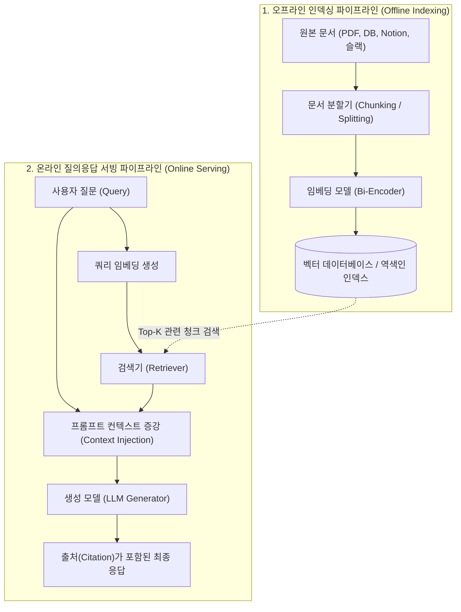
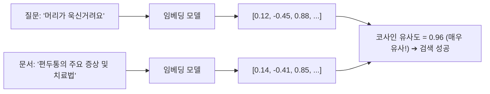
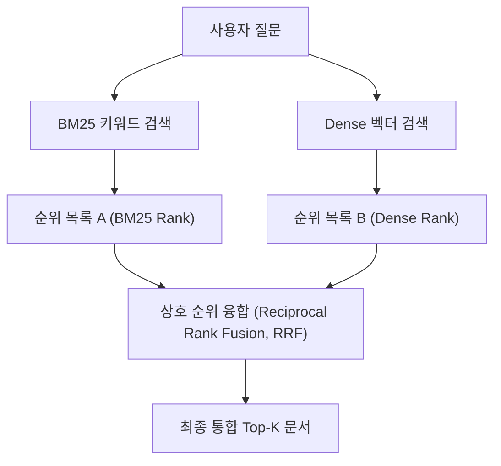

# 01. RAG 아키텍처와 3대 검색 알고리즘 (BM25, 임베딩, 하이브리드)

## 📌 핵심 요약 & 전체 맥락
> **"파운데이션 모델이 '두뇌'라면, RAG(검색 증강 생성)는 '오픈북 시험장의 참고 도서관'입니다."**  
> 파운데이션 모델은 학습 컷오프 이후의 최신 정보와 기업 내부의 비공개 데이터를 알지 못하며, 모르는 질문에 환각(Hallucination)을 일으킵니다.  
> 이를 해결하기 위해 사용자의 질문과 관련된 문서를 외부 데이터베이스에서 먼저 검색(Retrieve)한 뒤, 이를 프롬프트에 주입하여 답변을 생성(Generate)하는 **RAG 아키텍처**가 현대 AI 시스템의 표준으로 자리 잡았습니다.  
> 본 섹션에서는 **오프라인 인덱싱과 온라인 서빙 파이프라인**, 키워드 중심의 **역색인(Inverted Index)과 BM25**, 문맥의 의미를 파악하는 **밀집 벡터 검색(Dense Semantic Search & HNSW)**, 그리고 두 방식의 장점을 결합한 **상호 순위 융합(RRF) 기반 하이브리드 검색**을 완벽하게 정리합니다.

---

## 🗺️ 도표(Figure & Table) 색인 및 매핑 가이드

본문의 핵심 원리를 시각적으로 확인할 수 있는 책 내 도표의 위치와 해설 매핑입니다:

| 도표 번호 | 도표 제목 및 핵심 내용 | 책 페이지 | 본문 해당 주제 |
| :---: | :--- | :---: | :--- |
| **Figure 6-1** | 전통적인 Retrieve-then-Generate (검색 후 생성) 기본 패턴 다이어그램 | **p. 254** | 1. RAG란 무엇이며 왜 필요한가? |
| **Figure 6-2** | 외부 메모리, 검색기(Retriever), 생성기(Generator)로 구성된 RAG 기본 아키텍처 | **p. 256** | 2. RAG 파이프라인 아키텍처 |
| **Table 6-1** | 단어(Term)별로 문서 ID 목록을 매핑한 역색인(Inverted Index) 구조 예시표 | **p. 259** | 3. 키워드 기반 검색 (BM25) |
| **Figure 6-3** | 텍스트 청킹 ➔ 임베딩 ➔ 벡터DB 저장 및 쿼리 임베딩 검색의 전체 흐름도 | **p. 261-263** | 4. 임베딩 기반 밀집 벡터 검색 |
| **Table 6-2** | 키워드 검색 vs 임베딩 기반 검색의 속도, 성능, 비용(TCO) 종합 비교표 | **p. 266** | 4. 검색 방식 비교 및 트레이드오프 |

---

## 1. RAG의 본질과 4대 핵심 가치 (pp. 253 ~ 255)

```
[ RAG (Retrieval-Augmented Generation)의 4대 핵심 가치 ]

1. 최신 동적 지식 반영   : 수십억 원이 드는 모델 재학습 없이, 실시간 뉴스/주가/규정 즉시 반영
2. 비공개 사내 데이터 보호 : 사내 위키, 노션, 고객 DB를 외부 모델 학습 데이터로 유출하지 않고 활용
3. 환각(Hallucination) 억제 : 검색된 근거 문서(Grounding Context) 범위 내에서만 답변하도록 강제
4. 출처 추적 및 감사(Audit) : 답변에 인용된 원본 문서의 페이지/링크(Citation)를 제공하여 신뢰성 확보
```

* **탄생 배경 (Lewis et al., 2020, Figure 6-1):**  
  Meta AI 연구진이 발표한 RAG 논문에서 모델은 **"문서에 기반한 생성기(Document-grounded Generator)"**로 정의되었으며, 검색기와 생성기를 결합하여 오픈 도메인 질의응답 성능을 극대화했습니다.
* 💡 **Anthropic의 팁 (각주 p. 256):**  
  *"사내 지식 베이스 전체가 200,000 토큰(약 500페이지) 미만이라면 복잡한 RAG 시스템을 구축할 필요 없이 전체 문서를 Claude 3의 롱 컨텍스트 프롬프트에 직접 통째로 넣는 것이 더 빠르고 정확할 수 있다."*

---

## 2. RAG 파이프라인의 이중 구조 (Figure 6-2, p. 256)



---

## 3. 3대 검색 알고리즘 비교 및 원리 (pp. 257 ~ 267)

---

### ① 키워드 기반 검색과 역색인 (Term-based: BM25, pp. 257 ~ 260)

* **역색인 (Inverted Index, Table 6-1):**  
  책 뒤의 '색인(Index)'처럼, 모든 단어(Term)를 키로 하고 해당 단어가 등장하는 `문서 ID(DocID), 출현 빈도, 위치`를 값으로 저장하는 초고속 검색 자료구조.

| 단어 (Term) | 출현 문서 목록 (Posting List) |
| :--- | :--- |
| **`AI`** | Doc 1, Doc 2, Doc 3 |
| **`model`** | Doc 1, Doc 3 |
| **`engineering`** | Doc 2, Doc 3 |

* **BM25 (Best Matching 25) 알고리즘의 3대 핵심 기제:**
  1. **단어 빈도 (TF, Term Frequency):** 단어가 문서 내에 자주 나올수록 가중치를 주되, 무한정 증가하지 않도록 **포화(Saturation) 곡선** 적용.
  2. **역문서 빈도 (IDF, Inverse Document Frequency):** `"the"`, `"is"`처럼 흔한 단어는 가중치를 0으로 낮추고, `"Transformer"`, `"오류코드 404"`처럼 희귀한 단어에 압도적 가중치 부여.
  3. **문서 길이 정규화 (Document Length Normalization):** 단어가 단순히 길어서 많이 출현한 장문 문서에 불이익(패널티)을 부여.

* **장단점:**
  * ✅ 고유명사, 제품 SKU 코드, 사람 이름, 에러 코드 검색에 압도적 정확도. 초고속 및 제로 임베딩 비용.
  * ❌ **어휘 불일치(Vocabulary Mismatch) 문제:** 동의어(*"심근경색"* vs *"심장마비"*)나 다의어(*"Apple" 사과 vs 기업*)를 구분하지 못함.

---

### ② 임베딩 기반 밀집 벡터 검색 (Dense Semantic Retrieval, pp. 260 ~ 264, Figure 6-3)

* **동작 원리:**  
  텍스트를 수천 차원의 의미 벡터(Vector)로 변환한 뒤, **코사인 유사도(Cosine Similarity)**를 계산하여 단어가 달라도 맥락이 통하는 문서를 찾아냅니다.



#### 🚀 근사 최근접 이웃 (ANN, Approximate Nearest Neighbor) 인덱싱 기법
수천만 개의 벡터를 전수조사($O(N)$)하면 너무 느리므로, 약간의 정확도를 희생하고 초고속으로 탐색하는 ANN 알고리즘을 사용합니다:
1. **HNSW (Hierarchical Navigable Small World, Malkov et al., 2016):**  
   다층 계층 그래프를 구축하여 고속 점프 탐색. **현존 최고 수준의 검색 정확도와 속도**를 자랑하지만, **인덱스 구축 시간이 오래 걸리고 메모리(RAM) 소모량이 매우 큼**.
2. **IVF (Inverted File Index):** 공간을 클러스터(Centroid)로 쪼개어 가장 가까운 군집 내에서만 탐색.
3. **LSH (Locality-Sensitive Hashing):** 비슷한 벡터끼리 같은 해시 버킷에 담아 초고속 조회.

---

### ③ 키워드 검색 vs 시맨틱 검색 종합 비교 (Table 6-2)

| 비교 항목 | 키워드 검색 (BM25) | 임베딩 기반 시맨틱 검색 (Dense) |
| :--- | :--- | :--- |
| **질의 속도 (Query Speed)** | ⚡ **압도적으로 빠름** (수 밀리초) | 🐢 쿼리 임베딩 생성 및 벡터 탐색으로 인해 상대적으로 느림 |
| **검색 품질 (Performance)** | • 초기 설정 시 즉각적이고 강력함 <br>• 단어 모호성에 취약함 | • 자연어 질문 의도를 정확히 포착 <br>• 도메인 파인튜닝 시 성능 극대화 |
| **인프라 비용 (Cost)** | 💰 **매우 저렴함** (CPU 기반) | 💸 **매우 비쌈** (임베딩 API, 고용량 RAM 벡터DB 인프라 - **전체 API 비용의 20~50% 점유**) |

---

### ④ 하이브리드 검색과 상호 순위 융합 (Hybrid Search & RRF, pp. 266 ~ 267) ⭐

실무 프로덕션에서는 **BM25(키워드 정확도)와 Dense Vector(문맥 의미 이해)를 결합한 하이브리드 검색**이 표준입니다.



#### 📐 상호 순위 융합 (RRF) 공식
서로 다른 검색기가 매긴 점수 스케일(BM25 점수 vs 코사인 유사도)이 다를 때, **'순위(Rank)'만을 기반으로 공정하게 점수를 합산**하는 알고리즘입니다:

$$\text{RRF Score}(D) = \sum_{i=1}^n \frac{1}{k + r_i(D)}$$

* $n$: 사용된 검색기의 개수 (예: BM25 + Dense = 2개)
* $r_i(D)$: $i$번째 검색기가 문서 $D$에 매긴 **1-based 순위** (1위면 $r=1$, 2위면 $r=2$)
* $k$: 하위 순위 문서의 영향력을 조절하고 분모가 0이 되는 것을 방지하는 평활화 상수 (글로벌 표준 기본값: **$k = 60$**)

---

## 🔗 연관 문서
* [[00-ch06-overview|00. Chapter 6 전체 개요 및 목차]]
* [[02-rag-optimization-and-multimodal-tabular|02. RAG 검색 최적화와 멀티모달·정형 데이터]]
* [[03-ai-agents-tools-and-function-calling|03. AI 에이전트 기초와 도구 활용 및 함수 호출]]
* [[chapter-qa/ch03-evaluation-methodology-qa/02-exact-and-semantic-evaluation|Ch03-02. 정확한 평가와 유사도 지표]]
