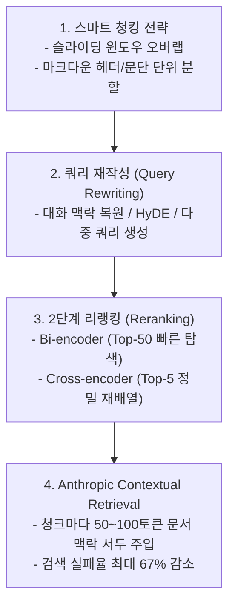

# 02. RAG 검색 최적화와 멀티모달·정형 데이터(Text-to-SQL)

## 📌 핵심 요약 & 전체 맥락
> **"단순히 문서를 글자 수대로 자르고 벡터 DB에 넣는 초보적 RAG만으로는 복잡한 프로덕션 비즈니스 질문을 해결할 수 없습니다."**  
> 사용자의 모호하고 대화형인 질문을 명확한 검색어로 탈바꿈시키는 **쿼리 재작성 (Query Rewriting)**, 1차로 뽑힌 문서 후보 수십 개의 정밀도를 극대화하는 **2단계 크로스 인코더 리랭킹 (Cross-Encoder Reranking)**, 그리고 청크마다 원본 문서 전체의 맥락 서두를 덧붙여 검색 실패율을 49~67%까지 낮추는 Anthropic의 **문맥 기반 청킹 (Contextual Retrieval)**이 최신 RAG 엔지니어링의 핵심 최적화 기법입니다.  
> 나아가 텍스트뿐만 아니라 제품 이미지나 다이어그램을 함께 검색해 시각적 답변을 생성하는 **멀티모달 RAG (Multimodal RAG)**와, 자연어를 정밀한 SQL 쿼리로 변환해 관계형 데이터베이스를 직접 조회하는 **정형 데이터 RAG (Text-to-SQL)**로 RAG 시스템의 지평이 확장되고 있습니다.

---

## 🗺️ 도표(Figure & Table) 색인 및 매핑 가이드

본문의 핵심 원리를 시각적으로 확인할 수 있는 책 내 도표의 위치와 해설 매핑입니다:

| 도표 번호 | 도표 제목 및 핵심 내용 | 책 페이지 | 본문 해당 주제 |
| :---: | :--- | :---: | :--- |
| **Figure 6-4** | 이전 대화 맥락을 파악하여 독립적인 단일 검색어로 재작성(Query Rewriting)하는 ChatGPT 화면 | **p. 268** | 1. 쿼리 재작성 (Query Rewriting) |
| **Figure 6-5** | Anthropic이 각 청크 앞에 문서 전체 요약 맥락(50~100토큰)을 부착하는 Contextual Retrieval 구조 | **p. 271-272** | 1. Anthropic 문맥 기반 청킹 |
| **Figure 6-6** | 질문을 받아 텍스트와 Pixar 영화 'Up'의 집 이미지를 함께 검색해 답변하는 멀티모달 RAG 파이프라인 | **p. 273** | 2. 멀티모달 RAG |
| **Table 6-3** | 이커머스 쇼핑몰 Kitty Vogue의 `Sales` 주문 데이터베이스 테이블 구조 | **p. 274** | 3. 정형 데이터 RAG (Text-to-SQL) |
| **Figure 6-7** | 자연어 질문 ➔ Text-to-SQL 변환 ➔ SQL 실행 ➔ 집계 결과로 최종 답변을 생성하는 흐름도 | **p. 274-275** | 3. Text-to-SQL 실행 워크플로우 |

---

## 1. RAG 4대 고급 검색 최적화 전략 (pp. 267 ~ 272)



---

### ① 전략 1. 스마트 청킹 전략 (Chunking Strategies)
* **청크 크기(Chunk Size)의 트레이드오프:**
  * **작은 청크 (100~200 토큰):** 정답이 위치한 핀포인트 검색 정확도는 높지만, 앞뒤 문맥이 잘려 "누가 무엇을 했는지" 주어와 배경을 잃어버리는 **문맥 상실(Context Loss)**이 발생합니다.
  * **큰 청크 (1,000+ 토큰):** 문맥은 풍부하지만 질문과 직접 관련된 핵심 정보가 긴 텍스트 속에서 희석되고, 불필요한 토큰으로 인해 LLM API 비용과 지연시간이 증가합니다.
* **실무적 해결책:**  
  * **슬라이딩 윈도우 (Sliding Window, 중첩 분할):** 앞 조각의 마지막 50~100단어를 다음 조각의 시작 부분에 겹치게(Overlap) 분할하여 문장이 잘리는 경계면 손실을 방지합니다.
  * **구조 기반 분할 (Structural Chunking):** 무조건 글자 수로 자르지 않고, 마크다운 제목(`#`, `##`), HTML 태그, 혹은 논문의 섹션 단위로 문맥의 의미 덩어리를 보존하며 분할합니다.

---

### ② 전략 2. 쿼리 재작성 (Query Rewriting, Figure 6-4)
사용자의 대화형 질문은 검색기에 넣기에 불완전하거나 지시대명사(그것, 그 사람 등)가 섞여 있습니다.

1. **대화 맥락 복원 (Query Reformulation, Figure 6-4):**  
   사용자가 이전 대화에서 아이폰을 이야기하다가 *"배터리 수명은 어때?"*라고 질문하면, 검색기는 누구의 배터리인지 모릅니다. 따라서 모델이 과거 대화 히스토리를 분석하여 **"아이폰 15 프로의 공식 배터리 사용 시간 및 수명"**이라는 자립적인 검색 쿼리로 자동 재작성합니다.
2. **HyDE (Hypothetical Document Embeddings, 가상 문서 임베딩):**  
   질문 키워드로 직접 검색하는 대신, LLM에게 **"이 질문에 대한 가상의 완벽한 모범 답변을 먼저 지어내봐!"**라고 지시한 뒤, 생성된 가상 답변의 임베딩 벡터로 실제 데이터베이스의 문서를 검색하는 기법입니다. 질문과 답변 간의 어휘 불일치를 해결하는 데 매우 효과적입니다.
3. **다중 쿼리 확장 (Multi-Query Expansion):**  
   하나의 복잡한 질문을 3~5개의 서로 다른 관점의 하위 검색 쿼리로 쪼개어 병렬로 검색한 뒤 결과를 합산합니다.

---

### ③ 전략 3. 2단계 리랭킹 (Two-Stage Retrieval & Reranking)
속도와 정확도를 모두 극대화하기 위해 **Bi-Encoder**와 **Cross-Encoder**를 계층적으로 결합합니다:

```
[ 2단계 검색-리랭킹 파이프라인 ]

1단계 : Bi-Encoder 벡터 검색   ──▶ 수백만 개 문서 중 상위 50개(Top-50) 후보 초고속 추출 (수 밀리초)
2단계 : Cross-Encoder 리랭커  ──▶ 50개 후보에 대해 (Query, Doc) 풀 어텐션을 계산해 상위 5개(Top-5) 정밀 선별
```

* **1단계 Bi-Encoder (1차 서류 심사):** 쿼리와 문서를 각각 독립적으로 임베딩하여 고속으로 유사 후보를 추립니다.
* **2단계 Cross-Encoder (최종 심층 면접):** 쿼리와 문서 텍스트를 하나의 시퀀스로 결합하여 트랜스포머의 모든 셀프 어텐션 레이어를 통과시킵니다. 미리 임베딩을 캐싱할 수 없어 연산량이 크지만, **단어 간의 정밀한 상호작용을 파악하여 검색 정밀도(Precision)를 극대화**합니다.

---

### ④ 전략 4. Anthropic Contextual Retrieval (Figure 6-5) 🏆

긴 문서를 잘게 쪼갰을 때 발생하는 **문맥 실종 문제**를 해결하기 위해 Anthropic(2024)이 제안한 혁신적인 방법입니다:

```text
[ Anthropic 문맥 주입 시스템 프롬프트 (Anthropic, 2024) ]

<document>
{{전체_원본_문서}}
</document>
다음은 위 전체 문서에서 추출한 청크 조각입니다:
<chunk>
{{청크_텍스트}}
</chunk>
이 청크가 전체 문서의 어느 위치에서 어떤 맥락을 다루고 있는지 50~100토큰 내외의 짧고 명확한 상황 맥락(Context)을 작성하시오.
```

```
[ 문맥이 보강된 최종 인덱싱 청크 예시 ]

[ 주입된 상황 맥락 (50~100 토큰) ] : "이 문단은 ACME Corp의 2023년 연례 재무보고서(10-K) 중 북미 하드웨어 매출 실적에 관한 내용입니다."
[ 원본 청크 내용 ]                 : "해당 분기 매출은 전년 동기 대비 3% 성장하여 500억 달러를 기록했습니다."
```

* **성능 향상 (Figure 6-5):**  
  청크 맨 앞에 문서의 전역 맥락을 덧붙여 임베딩 및 역색인을 생성하면, **검색 실패율이 49% 감소**하며, 리랭킹(Reranking) 기술과 결합 시 **실패율이 67%까지 급감**합니다.

---

## 2. 텍스트를 넘어선 확장 RAG (pp. 273 ~ 275)

---

### ① 멀티모달 RAG (Multimodal RAG, Figure 6-6)
* 텍스트 문서뿐만 아니라 도면, 설계도, 차트, 제품 사진을 벡터화하여 멀티모달 LLM(GPT-4o, Claude 3.5 Sonnet)에 이미지와 텍스트를 함께 컨텍스트로 전달합니다.
* *예시 (Figure 6-6):*  
  질문: *"픽사 애니메이션 영화 'Up'에 나오는 주인공의 집 색상은 무엇인가?"*  
  ➔ 검색기가 영화 속 풍선 달린 집 이미지를 검색해 전달 ➔ 모델이 이미지를 시각적으로 판독하여 *"노란색 외벽과 파란색 지붕, 분홍색 창틀로 칠해져 있습니다"*라고 정확히 답변.

---

### ② 정형 데이터 RAG와 Text-to-SQL (Table 6-3, Figure 6-7) ⭐

관계형 데이터베이스(**RDB, Relational Database**)의 정형 표(Tabular) 데이터는 비정형 텍스트 임베딩 방식으로는 통계 연산(`SUM`, `AVG`, `GROUP BY`)을 수행할 수 없습니다. 따라서 **자연어 질문을 AI가 SQL (Structured Query Language, 구조화 질의어)로 변환하여 데이터베이스를 직접 실행(Text-to-SQL)**합니다.

```
[ Kitty Vogue 쇼핑몰 Sales 주문 테이블 (Table 6-3, p. 274) ]
- 컬럼: Order ID, Timestamp, Product ID, Product name, Price/unit ($), Units, Total
- 예시: 'Fruity Fedora' 모자, 단가 $18, 수량 1개
```


---

## 🔗 연관 문서
* [[00-ch06-overview|00. Chapter 6 전체 개요 및 목차]]
* [[01-rag-architecture-and-retrieval-algorithms|01. RAG 아키텍처와 3대 검색 알고리즘]]
* [[03-ai-agents-tools-and-function-calling|03. AI 에이전트 기초와 도구 활용 및 함수 호출]]
* [[chapter-qa/ch05-prompt-engineering-qa/01-introduction-to-prompting-and-context|Ch05-01. 프롬프트 기초와 컨텍스트 엔지니어링]]
