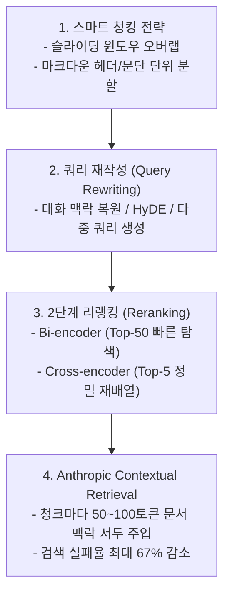
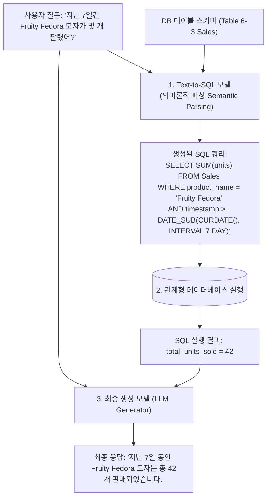

# 02. RAG 검색 최적화와 멀티모달·정형 데이터(Text-to-SQL)

## 📌 핵심 요약 & 전체 맥락
> **"단순히 문서를 자르고 벡터 DB에 넣는 기본 RAG만으로는 프로덕션의 복잡한 질문을 해결할 수 없습니다."**  
> 사용자의 모호하고 대화형인 질문을 명확한 검색어로 바꾸는 **쿼리 재작성(Query Rewriting)**, 1차로 뽑힌 문서 후보의 정밀도를 극대화하는 **크로스 인코더 리랭킹(Cross-Encoder Reranking)**, 그리고 청크마다 원본 문서 전체의 맥락 서두를 덧붙여 검색 실패율을 49~67%까지 낮추는 Anthropic의 **문맥 기반 청킹(Contextual Retrieval)**이 최신 RAG 엔지니어링의 핵심 최적화 기법입니다.  
> 나아가 텍스트뿐만 아니라 제품 이미지를 검색해 시각적 답변을 생성하는 **멀티모달 RAG(Multimodal RAG)**와 자연어를 정밀한 SQL 쿼리로 변환해 관계형 데이터베이스를 조회하는 **정형 데이터 RAG(Text-to-SQL)**로 RAG의 지평이 확장되고 있습니다.

---

## 🗺️ 도표(Figure & Table) 색인 및 매핑 가이드

본문의 핵심 원리를 시각적으로 확인할 수 있는 책 내 도표의 위치와 해설 매핑입니다:

| 도표 번호 | 도표 제목 및 핵심 내용 | 책 페이지 | 본문 해당 주제 |
| :---: | :--- | :---: | :--- |
| **Figure 6-4** | 이전 대화 맥락을 파악하여 독립적인 단일 검색어로 재작성(Query Rewriting)하는 ChatGPT 화면 | **p. 268** | 1. 쿼리 재작성 (Query Rewriting) |
| **Figure 6-5** | Anthropic이 각 청크 앞에 문서 전체 요약 맥락(50~100토큰)을 부착하는 Contextual Retrieval 구조 | **p. 271-272** | 1. Anthropic 문맥 기반 청킹 |
| **Figure 6-6** | 질문을 받아 텍스트와 Pixar 영화 'Up'의 집 이미지를 함께 검색해 답변하는 멀티모달 RAG 파이프라인 | **p. 273** | 2. 멀티모달 RAG |
| **Table 6-3** | 이커머스 쇼핑몰 Kitty Vogue의 `Sales` 주문 데이터베이스 테이블 구조 | **p. 274** | 3. 정형 데이터 RAG (Text-to-SQL) |
| **Figure 6-7** | 자연어 질문 ➔ Text-to-SQL 변환 ➔ SQL 실행 ➔ 집계 결과로 최종 답변을 생성하는 흐름도 | **p. 274-275** | 3. Text-to-SQL 실행 워크플로우 |

---

## 1. RAG 4대 고급 검색 최적화 전략 (pp. 267 ~ 272)



---

### ① 전략 1. 스마트 청킹 전략 (Chunking Strategies)
* **청크 크기(Chunk Size)의 딜레마:**
  * **작은 청크 (100~200 토큰):** 임베딩의 의미 집중도(Precision)는 높으나, 문맥이 뚝 끊겨 전체 의미를 상실함.
  * **큰 청크 (1,000+ 토큰):** 전체 맥락은 보존되지만 구체적인 핵심 사실이 희석되고 LLM 프롬프트 토큰을 낭비함.
* **해결책:**  
  * **슬라이딩 윈도우 (Sliding Window):** 500토큰 청크마다 50~100토큰의 중첩(Overlap)을 두어 문장 절단 방지.
  * **구조 기반 분할:** 마크다운 제목(`#`, `##`), 단락(Paragraph), 또는 의미론적 경계 기준 분할.

---

### ② 전략 2. 쿼리 재작성 (Query Rewriting, Figure 6-4)
사용자의 대화형 질문은 검색기에 넣기에 불완전한 경우가 많습니다 (예: *"배터리는 어때?"*).

1. **대화 맥락 복원 (Query Reformulation, Figure 6-4):**  
   이전 대화 이력을 바탕으로 독립 실행 가능한 검색 쿼리(*"아이폰 15 프로의 배터리 사용 시간 및 수명"*)로 재작성.
2. **HyDE (Hypothetical Document Embeddings):**  
   질문만으로 검색하지 않고, LLM이 **'가상의 모범 답변 초안(Mock Answer)'을 먼저 생성한 뒤 그 초안의 임베딩으로 실제 문서를 검색**하는 기법.
3. **다중 쿼리 확장 (Multi-Query Generation):**  
   하나의 질문을 3~5개의 서로 다른 관점의 유의어 검색어로 분기하여 검색 후 결과 결합.

---

### ③ 전략 3. 2단계 리랭킹 (Two-Stage Retrieval & Reranking)
속도와 정확도를 모두 잡기 위해 **Bi-Encoder**와 **Cross-Encoder**를 계층적으로 배치합니다:

```
[ 2단계 검색-리랭킹 파이프라인 ]

1단계 : Bi-Encoder 벡터 검색   ──▶ 수백만 개 문서 중 상위 50개(Top-50) 후보 초고속 추출
2단계 : Cross-Encoder 리랭커  ──▶ 50개 후보에 대해 (Query, Doc) 풀 어텐션을 계산해 상위 5개(Top-5) 정밀 선별
```

* **Bi-Encoder:** 쿼리와 문서를 따로 임베딩하여 사전 인덱싱 가능 (초고속).
* **Cross-Encoder:** 쿼리와 문서를 한꺼번에 모델에 넣어 토큰 간 상호작용을 계산하므로 사전 인덱싱은 불가능하지만 **검색 정확도(NDCG / Precision)가 비약적으로 향상**됨.

---

### ④ 전략 4. Anthropic Contextual Retrieval (Figure 6-5) 🏆

문서가 쪼개지면 개별 청크는 *"그 회사의 3분기 매출은 3% 성장했다"*처럼 **"그 회사"가 어디인지 알 수 없는 문맥 상실 문제**를 겪습니다.

```text
[ Anthropic이 제안한 문맥 주입 시스템 프롬프트 (Anthropic, 2024) ]

<document>
{{WHOLE_DOCUMENT}}
</document>
Here is the chunk we want to situate within the whole document:
<chunk>
{{CHUNK_CONTENT}}
</chunk>
Please give a short succinct context to situate this chunk within the overall document 
for the purposes of improving search retrieval of the chunk. 
Answer only with the succinct context and nothing else.
```

```
[ 문맥이 보강된 최종 인덱싱 청크 ]

[ 주입된 문맥 (50~100 토큰) ] : "이 청크는 ACME Corp의 2023년 연례 10-K 보고서 중 하드웨어 매출 부문에 대한 내용입니다."
[ 원본 청크 내용 ]            : "그 회사의 3분기 매출은 전년 동기 대비 3% 성장했습니다."
```

* **압도적 성능 개선 (Figure 6-5):**  
  청크 앞에 50~100토큰의 문서 상황 맥락을 붙여 임베딩 및 BM25 인덱싱을 수행하면, **검색 실패율이 단독으로 49% 감소**하며, BM25 + Embeddings + Reranking과 결합 시 **검색 실패율이 최대 67%까지 급감**합니다.

---

## 2. 텍스트를 넘어선 확장 RAG (pp. 273 ~ 275)

---

### ① 멀티모달 RAG (Multimodal RAG, Figure 6-6)
* 텍스트 문서뿐만 아니라 이미지, 도면, 차트, 비디오를 검색하여 멀티모달 LLM(GPT-4o, Claude 3.5 Sonnet)의 프롬프트에 이미지 URL이나 텐서를 직접 주입합니다.
* *예시 (Figure 6-6):*  
  질문: *"픽사 애니메이션 영화 'Up'에 나오는 집의 색상은 무엇인가?"*  
  ➔ 검색기가 'Up'의 풍선 집 이미지를 검색하여 컨텍스트로 전달 ➔ 멀티모달 LLM이 이미지를 시각적으로 판독하여 *"노란색, 파란색, 분홍색 등으로 칠해져 있습니다"*라고 정확히 답변.

---

### ② 정형 데이터 RAG와 Text-to-SQL (Table 6-3, Figure 6-7) ⭐

비정형 텍스트와 달리, 쇼핑몰의 주문 내역이나 금융 거래 같은 **관계형 데이터베이스(RDB)의 표(Tabular) 데이터**는 벡터 검색이 아닌 **SQL 쿼리 실행**을 통해 증강해야 합니다.

```
[ Kitty Vogue 쇼핑몰 Sales 주문 테이블 (Table 6-3, p. 274) ]
- 컬럼: Order ID, Timestamp, Product ID, Product name, Price/unit ($), Units, Total
- 예시: 'Fruity Fedora' 모자, 단가 $18, 수량 1개
```



* **대규모 DB 스키마 처리:** 데이터베이스에 테이블이 수백 개 있어 프롬프트에 다 들어가지 않을 경우, **질문과 관련된 테이블을 먼저 골라내는 중간 테이블 검색(Table Retrieval) 단계**를 선행 배치합니다.

---

## 🔗 연관 문서
* [[00-ch06-overview|00. Chapter 6 전체 개요 및 목차]]
* [[01-rag-architecture-and-retrieval-algorithms|01. RAG 아키텍처와 3대 검색 알고리즘]]
* [[03-ai-agents-tools-and-function-calling|03. AI 에이전트 기초와 도구 활용 및 함수 호출]]
* [[chapter-qa/ch05-prompt-engineering-qa/01-introduction-to-prompting-and-context|Ch05-01. 프롬프트 기초와 컨텍스트 엔지니어링]]
