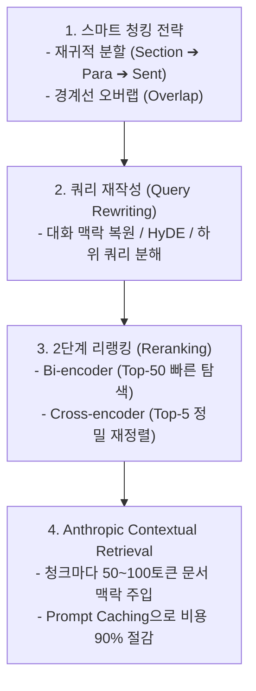
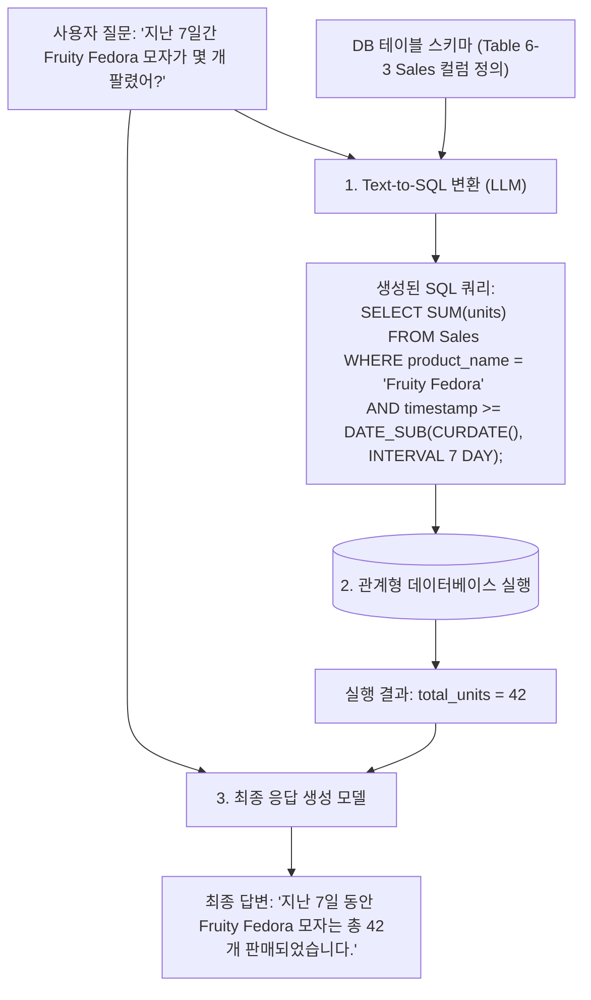

# 02. RAG 검색 최적화와 멀티모달·정형 데이터(Text-to-SQL)

## 📌 핵심 요약 & 전체 맥락
> **"단순히 문서를 글자 수대로 자르고 벡터 DB에 넣는 초보적 RAG만으로는 복잡한 프로덕션 비즈니스 질문을 해결할 수 없습니다."**  
> 검색 품질을 비약적으로 끌어올리기 위해서는 **4대 검색 최적화 전략**이 필수적입니다:  
> 1) 문맥의 의미 단위를 보존하는 **스마트 청킹 전략 (재귀적 분할 & 슬라이딩 오버랩)**  
> 2) 모호한 사용자 질문을 독립적 검색어로 정규화·확장하는 **쿼리 재작성 (Query Rewriting)**  
> 3) Bi-Encoder의 빠른 속도와 Cross-Encoder의 정밀도를 결합한 **2단계 리랭킹 (Two-Stage Reranking)**  
> 4) 청크마다 문서 전체의 맥락 서두를 덧붙여 검색 실패율을 49~67%까지 낮추는 Anthropic의 **문맥 기반 검색 (Contextual Retrieval)과 프롬프트 캐싱 (Prompt Caching)**  
> 나아가 텍스트를 넘어 도면과 사진을 시각적으로 검색·판독하는 **멀티모달 RAG (Multimodal RAG)**와, 관계형 데이터베이스의 집계 질의(`SUM`, `AVG`)를 수행하기 위한 **정형 데이터 RAG (Text-to-SQL)** 아키텍처를 상세히 정리합니다.

---

## 🗺️ 도표(Figure & Table) 색인 및 매핑 가이드

본문의 핵심 원리를 시각적으로 확인할 수 있는 책 내 도표의 위치와 해설 매핑입니다:

| 도표 번호 | 도표 제목 및 핵심 내용 | 책 페이지 | 본문 해당 주제 |
| :---: | :--- | :---: | :--- |
| **Figure 6-4** | 이전 대화 맥락을 파악하여 독립적인 단일 검색어로 재작성(Query Rewriting)하는 생성 모델 흐름도 | **p. 268-270** | 1. 쿼리 재작성 (Query Rewriting) |
| **Figure 6-5** | Anthropic이 각 청크 앞에 문서 전체 요약 맥락(50~100토큰)을 부착하는 Contextual Retrieval 구조 | **p. 271-272** | 1. Anthropic 문맥 기반 청킹 |
| **Figure 6-6** | 질문을 받아 텍스트와 Pixar 영화 'Up'의 집 이미지를 함께 검색해 답변하는 멀티모달 RAG 파이프라인 | **p. 273** | 2. 멀티모달 RAG |
| **Table 6-3** | 이커머스 쇼핑몰 Kitty Vogue의 `Sales` 주문 데이터베이스 테이블 구조 | **p. 274** | 3. 정형 데이터 RAG (Text-to-SQL) |
| **Figure 6-7** | 자연어 질문 ➔ Text-to-SQL 변환 ➔ DB 실행 ➔ 집계 결과로 최종 답변을 생성하는 흐름도 | **p. 274-275** | 3. Text-to-SQL 실행 워크플로우 |

---

## 1. RAG 4대 고급 검색 최적화 전략 (pp. 267 ~ 273)



---

### ① 전략 1. 스마트 청킹 전략 (Chunking Strategies, pp. 268 ~ 269)

문서를 어떻게 쪼개느냐에 따라 검색 성능이 완전히 갈립니다:

#### 1) 분할 단위와 크기의 트레이드오프
* **문자/단어/문장/문단 고정 분할:** 예컨대 2,048자 또는 512단어 단위로 일정하게 분할.
* **작은 청크 (100~200 토큰):** 질문과의 매칭 정확도는 높으나, 주어와 배경 맥락이 잘려 나가는 **문맥 상실(Context Loss)** 발생.
* **큰 청크 (1,000+ 토큰):** 문맥은 풍부하지만 질문과 직접 관련된 핵심 정보가 희석되고, 불필요한 토큰으로 인해 LLM API 비용과 지연시간(TTFT) 증가.

#### 2) 경계면 손실과 중첩 분할 (Overlap)
* 📖 **책 속 실증 예시 (p. 268):**  
  > *"I left my wife a note" (나는 아내에게 쪽지를 남겼다)*라는 문장을 중첩 없이 자르다가 **"I left my wife" (나는 아내를 떠났다/이혼했다)**와 **"a note" (쪽지)**로 쪼개지면, 두 청크 모두 원문의 핵심 의미를 완전히 왜곡 파괴합니다.
* **해결책:** 청크 크기가 2,048자라면 **앞 청크의 마지막 20~50자를 다음 청크의 앞부분과 겹치게(Overlap)** 분할하여 경계면 정보 유실을 방지합니다.

#### 3) 재귀적 분할 (Recursive Chunking) & 도메인 맞춤 분할
* **재귀적 분할:** 큰 단위(Section)로 먼저 자르고, 크기가 초과하면 문단(Paragraph), 그래도 크면 문장(Sentence) 단위로 점점 세분화하여 의미적 결합을 보존.
* **도메인 특화 분할:** 프로그래밍 언어별 AST 파서(Python, JS 함수/클래스 단위 분할), Q&A 문서(질문-답변 쌍 단위 분할), 중국어/영어 토크나이저 맞춤 분할.
* **토크나이저 기반 분할:** 다운스트림 생성 모델(Llama 3 등)의 토크나이저를 기준으로 청킹하면 모델 처리가 매끄러워지지만, **생성 모델을 교체할 때 모든 데이터를 다시 인덱싱해야 하는 유지보수 단점**이 존재합니다.

---

### ② 전략 2. 쿼리 재작성 (Query Rewriting, pp. 270 ~ 271, Figure 6-4)

사용자의 질문은 대화형이거나 모호한 경우가 많아 검색기에서 올바른 문서를 찾기 어렵습니다:

1. **대화 맥락 및 지시대명사 복원 (Identity / Pronoun Resolution, Figure 6-4):**  
   사용자가 이전 대화에서 *"아이폰 15 프로"*를 이야기하다가 *"배터리 수명은 어때?"*라고 물으면, 모델이 대화 히스토리를 분석하여 **"아이폰 15 프로의 공식 배터리 수명 및 사용 시간"**이라는 독립적 검색어로 자동 정규화.
2. **하위 쿼리 분해 (Sub-query Decomposition):**  
   *"2023년 애플과 마이크로소프트의 매출을 비교해줘"*와 같은 복합 질의를 **`[쿼리 1: 2023년 애플 매출]`**과 **`[쿼리 2: 2023년 마이크로소프트 매출]`**로 쪼개어 병렬 검색 후 취합.
3. **HyDE (Hypothetical Document Embeddings, 가상 문서 임베딩):**  
   질문 키워드로 직접 검색하는 대신, LLM에게 가상의 모범 답변을 먼저 작성하게 한 뒤 그 답변의 임베딩 벡터로 문서를 검색하여 어휘 불일치 해결.
4. **철자 교정 및 동의어 확장 (Spelling Correction & Synonym Expansion):**  
   오타를 수정하고 도메인 동의어를 추가하여 검색 범위 확장.

---

### ③ 전략 3. 2단계 리랭킹 (Two-Stage Retrieval & Reranking, pp. 269 ~ 270)

속도와 정확도를 모두 잡기 위해 **Bi-Encoder**와 **Cross-Encoder**를 계층적으로 결합합니다:

```
[ 2단계 검색-리랭킹 파이프라인 구조 ]

1단계 : Bi-Encoder 벡터 검색   ──▶ 수백만 개 문서 중 상위 50~100개(Top-50) 후보 초고속 추출 (수 밀리초)
2단계 : Cross-Encoder 리랭커  ──▶ 50개 후보에 대해 (Query, Doc) 풀 어텐션을 계산해 상위 5개(Top-5) 정밀 선별
```

* **Bi-Encoder (1단계):** 쿼리와 문서를 따로 임베딩하므로 문서 벡터를 미리 인덱싱할 수 있어 초고속 탐색이 가능하지만, 단어 간 상호작용(Cross-attention)을 보지 못합니다.
* **Cross-Encoder (2단계):** 쿼리와 문서를 한 문장으로 합쳐 트랜스포머 전체 레이어를 통과시킵니다. 미리 캐싱할 수 없어 연산량이 크지만, **단어 간의 미묘한 관계를 완벽히 포착하여 검색 정밀도(Precision)를 극대화**합니다 (예: Cohere Rerank, BGE Reranker, ColBERT).

---

### ④ 전략 4. Anthropic Contextual Retrieval (pp. 271 ~ 273, Figure 6-5) 🏆

문서를 작게 쪼개었을 때 발생하는 **문맥 실종 문제**를 해결하기 위해 Anthropic(2024)이 제안한 최신 표준 기법입니다:

```text
[ Anthropic 문맥 생성 프롬프트 템플릿 (Anthropic, 2024) ]

<document>
{{전체_원본_문서}}
</document>
다음은 위 전체 문서에서 추출한 청크 조각입니다:
<chunk>
{{청크_텍스트}}
</chunk>
이 청크가 전체 문서의 어느 위치에서 어떤 맥락을 다루고 있는지 50~100토큰 내외의 짧고 명확한 상황 맥락(Context)을 작성하시오.
```

```
[ 문맥이 보강된 최종 인덱싱 청크 예시 ]

[ 주입된 상황 맥락 (50~100 토큰) ] : "이 문단은 ACME Corp의 2023년 연례 재무보고서(10-K) 중 북미 하드웨어 매출 실적에 관한 내용입니다."
[ 원본 청크 내용 ]                 : "해당 분기 매출은 전년 동기 대비 3% 성장하여 500억 달러를 기록했습니다."
```

* **검색 실패율 극적 감소:**  
  * BM25 키워드 검색 실패율 **35% 감소**
  * 임베딩 기반 검색 실패율 **49% 감소**
  * 리랭킹(Reranking)과 결합 시 **검색 실패율 최대 67% 감소**
* 💡 **프롬프트 캐싱 (Prompt Caching)의 결정적 역할:**  
  모든 청크마다 거대한 전체 문서를 LLM에 넣어 문맥을 생성하면 API 비용이 천문학적으로 발생하지만, **프롬프트 캐싱 기술을 활용하여 원본 문서를 캐시에 올려둠으로써 문맥 생성 비용을 90% 이상 절감**하여 상용화에 성공했습니다.

---

## 2. 텍스트를 넘어선 확장 RAG (pp. 273 ~ 275)

---

### ① 멀티모달 RAG (Multimodal RAG, Figure 6-6)
* 텍스트 문서뿐만 아니라 도면, 설계도, 차트, 제품 사진을 벡터화하여 멀티모달 LLM(GPT-4o, Claude 3.5 Sonnet)에 이미지와 텍스트를 함께 전달합니다.
* 📖 **책 속 실증 예시 (Figure 6-6):**  
  질문: *"픽사 애니메이션 영화 'Up'에 나오는 주인공의 집 색상은 무엇인가?"*  
  ➔ 검색기가 영화 속 풍선 달린 집 이미지를 검색해 전달 ➔ 모델이 이미지를 시각적으로 판독하여 *"노란색 외벽과 파란색 지붕, 분홍색 창틀로 칠해져 있습니다"*라고 정확히 답변.

---

### ② 정형 데이터 RAG와 Text-to-SQL (Table 6-3, Figure 6-7) ⭐

관계형 데이터베이스(**RDB**)의 정형 표(Tabular) 데이터는 비정형 텍스트 임베딩 방식으로는 통계 연산(`SUM`, `AVG`, `COUNT`, `GROUP BY`)을 수행할 수 없습니다. 따라서 **자연어 질문을 SQL 쿼리로 변환하여 데이터베이스를 직접 실행(Text-to-SQL)**합니다.

```
[ Kitty Vogue 쇼핑몰 Sales 주문 테이블 구조 (Table 6-3, p. 274) ]
- 컬럼 구성: Order ID, Timestamp, Product ID, Product name, Price/unit ($), Units, Total
- 실증 데이터 예: 'Fruity Fedora' 모자, 단가 $18, 수량 1개
```



* **대규모 엔터프라이즈 DB 스키마 검색 (Hybrid Schema Retrieval):**  
  사내 DB에 수백~수천 개의 테이블이 존재하는 경우, 전체 스키마를 프롬프트에 넣을 수 없으므로 **질문과 관련된 테이블 스키마 정의서만 먼저 RAG로 검색한 뒤 SQL을 생성하는 하이브리드 파이프라인**을 구축합니다.

---

## 🔗 연관 문서
* [[00-ch06-overview|00. Chapter 6 전체 개요 및 목차]]
* [[01-rag-architecture-and-retrieval-algorithms|01. RAG 아키텍처와 3대 검색 알고리즘]]
* [[03-ai-agents-tools-and-function-calling|03. AI 에이전트 기초와 도구 활용 및 함수 호출]]
* [[chapter-qa/ch05-prompt-engineering-qa/01-introduction-to-prompting-and-context|Ch05-01. 프롬프트 기초와 컨텍스트 엔지니어링]]
