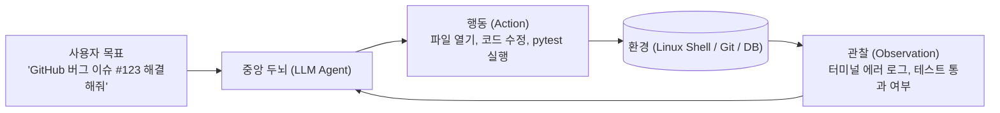
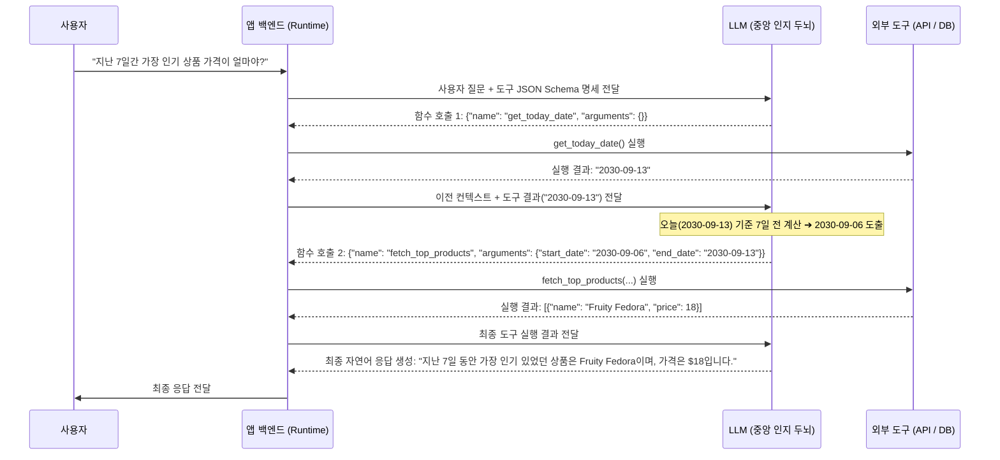

# 03. AI 에이전트 기초와 도구 활용 및 함수 호출 (Function Calling)

## 📌 핵심 요약 & 전체 맥락
> **"파운데이션 모델이 머릿속에서 생각만 하는 '철학자'라면, 도구(Tools)와 에이전트(Agents)는 직접 손발을 움직여 외부 세상을 변화시키는 '로봇 팔'을 달아주는 것입니다."**  
> AI 에이전트는 사용자의 고수준 목표(Goal)를 부여받으면 스스로 환경(Environment)을 관찰하고, 단계별 계획(Plan)을 수립하며, 외부 도구(**API, Python 샌드박스, SQL 데이터베이스 등**)를 자율적으로 호출하여 주어진 임무를 끝까지 완수하는 지능형 소프트웨어 시스템입니다 (예: 스스로 코딩 버그를 수정하는 **SWE-agent**).  
> 무분별한 도구 호출로 인한 무한 루프, 비싼 API 비용 탕진, 그리고 시스템 파괴를 방지하기 위해, **계획 수립(Planner)과 도구 실행(Executor)을 분리(Decoupling)하고 사전 검증(Evaluator)을 거치는 멀티 에이전트 아키텍처**를 구축해야 합니다.  
> 또한 얀 르쿤(Yann LeCun) 교수의 *"단순 자기회귀 언어 모델은 본질적으로 계획을 세울 수 없다"*는 비판과, 이를 극복하기 위한 **월드 모델(World Model) 및 상태 추적 MCTS (Monte Carlo Tree Search)**의 최신 이론을 심층적으로 다룹니다.

---

## 🗺️ 도표(Figure & Table) 색인 및 매핑 가이드

본문의 핵심 원리를 시각적으로 확인할 수 있는 책 내 도표의 위치와 해설 매핑입니다:

| 도표 번호 | 도표 제목 및 핵심 내용 | 책 페이지 | 본문 해당 주제 |
| :---: | :--- | :---: | :--- |
| **Figure 6-8** | 소프트웨어 엔지니어링 에이전트 SWE-agent가 터미널 환경에서 코드를 수정하고 테스트하는 구조 | **p. 277** | 1. AI 에이전트란 무엇인가? |
| **Figure 6-9** | 계획 수립(Planner) ➔ 검증(Evaluator) ➔ 실행(Executor)을 분리하여 검증된 계획만 실행하는 아키텍처 | **p. 280-283** | 3. 계획과 실행의 분리 (Decoupled Planning) |
| **Figure 6-10** | 이커머스 도구(날짜 조회, 상품 조회 등)를 활용하는 에이전트의 계획 수립 프롬프트 및 의사코드 | **p. 283-287** | 2. 도구 사용과 함수 호출 (Function Calling) |

---

## 1. AI 에이전트(Agent)의 정의와 핵심 구성 요소 (pp. 275 ~ 278)

```
[ AI 에이전트의 고전적 정의 (Russell & Norvig, 1995) ]
"센서(Sensors)를 통해 환경을 인식(Perceive)하고, 
 액추에이터(Actuators)를 통해 환경에 작용(Act)하는 합리적 주체."
```

* **파운데이션 모델 기반 에이전트 아키텍처:**  
  **LLM (Large Language Model, 거대 언어 모델)**이 중앙 인지 두뇌(Brain)가 되어 사용자의 지시를 해석하고, 어떤 도구를 어떤 인자(Arguments)로 호출할지 결정하는 액션을 지휘합니다.



* 🚀 **SWE-agent (Software Engineering Agent) 사례 연구 (Yang et al., 2024, Figure 6-8):**  
  * **환경:** 실제 Linux 터미널 및 Git 코드베이스 저장소.
  * **ACI (Agent-Computer Interface, 에이전트-컴퓨터 인터페이스):** 사람이 쓰는 복잡한 IDE 대신, LLM이 읽기 편하도록 화면을 100줄씩 페이지네이션하여 보여주는 파일 뷰어, 특정 줄 번호를 교체하는 파일 에디터, 디렉토리 탐색기를 전용 인터페이스로 제공하여 GitHub 실제 이슈를 자율적으로 해결.

---

## 2. 도구(Tools)와 함수 호출 (Function Calling, pp. 278 ~ 283)

### ① 도구(Tools)의 필요성과 분류
1. **읽기 전용 도구 (Read-only Actions):**  
   * **계산기 (Calculator):** LLM의 치명적 약점인 복잡한 사칙연산 환각을 100% 제거.
   * **웹 검색 및 날씨 API:** 모델의 지식 컷오프 이후의 실시간 최신 정보 조회.
2. **쓰기 및 실행 도구 (Write & Mutating Actions):**  
   * **이메일 발송 / 데이터베이스 수정 / 금융 송금:** 실제 외부 시스템의 상태를 영구적으로 변경하는 고위험 작업.
   * ⚠️ **보안 및 안전 통제:** 쓰기 도구 실행 전에는 반드시 **HITL (Human-in-the-Loop, 인간 개입 / 인간 최종 승인)** 가드레일이 필요합니다.

* 💡 **Chameleon 프레임워크 (Lu et al., 2023):**  
  GPT-4 단독 모델보다 13개 도구(웹 검색, 이미지 캡셔너, 텍스트 감지기 등)를 장착한 에이전트가 **ScienceQA 과학 질의응답에서 +11.37%p, TabMWP 표 수학 문제에서 +17.0%p의 정답률 향상**을 달성했습니다.

---

### ② 함수 호출 (Function Calling) 상세 실행 트레이스 (Figure 6-10, pp. 283 ~ 287) ⭐

함수 호출은 **자판기 버튼을 직접 누를 수 없는 사장님(LLM)이 비서(앱 백엔드 런타임)에게 "커피 뽑아와"라고 구조화된 JSON 주문서를 써서 넘겨주는 과정**입니다:

```
[ 사용자 질의: "지난 7일 동안 가장 많이 팔린 상품의 가격은 얼마인가요?" ]
사용 가능한 도구:
1. get_today_date() -> 오늘 날짜 문자열 반환
2. fetch_top_products(start_date, end_date) -> 해당 기간 최고 판매 상품 목록 반환
```



---

### ③ 에이전트의 도구로서의 RAG (Agentic RAG)
RAG는 독립된 고정 파이프라인으로 동작할 수도 있지만, 에이전트 아키텍처에서는 **에이전트가 쥐고 있는 수많은 도구 중 하나(A Tool in the Toolkit)**로 통합됩니다:
* **동적 검색 판단 (Dynamic Retrieval):** 에이전트는 사용자의 질문을 보고 사내 위키 RAG가 필요한지, 실시간 웹 검색이 필요한지, 아니면 도구 없이 상식으로 답할지 스스로 판단합니다.
* **다단계 RAG 연계:** 에이전트는 `정형 SQL RAG`로 고객 주문 번호를 조회한 뒤, 그 결과를 바탕으로 다시 `비정형 문서 RAG`를 호출해 해당 제품의 취소 규정 문서를 찾아내는 다단계 복합 추론을 수행합니다.

---

## 3. 계획과 실행의 분리 (Decoupled Planning, pp. 281 ~ 285) ⭐

### ① 무분별한 결합 실행의 치명적 위험 (Coupled Execution)
계획 수립과 실행을 분리하지 않고 모델이 즉흥적으로 도구를 실행하게 두면, **모델이 1,000단계의 엉뚱한 루프에 빠져 수 시간 동안 비싼 API 요금을 탕진하면서도 목표를 전혀 달성하지 못하는 참사**가 발생합니다.

---

### ② 3단계 분리 아키텍처 (Figure 6-9, p. 283)


* **병렬 계획 수립 (Parallel Planning):** 지연시간을 줄이기 위해 계획기(Planner)가 3~4개의 서로 다른 전략 후보를 동시에 생성하면, 검증기(Evaluator)가 안전성과 성공 확률을 따져 가장 최적의 계획 1개를 채택합니다.
* **사전 의도 분류기(Intent Classifier):** 시스템 범위를 벗어나거나 수행 불가능한 요청을 사전에 차단하여 불필요한 도구 오작동과 연산 비용 낭비를 방지합니다.

---

## 4. 파운데이션 모델은 정말로 계획을 세울 수 있는가? (pp. 284 ~ 285)

### 🥊 학계의 뜨거운 논쟁

| 입장 | 주요 학자 및 주장 | 핵심 근거 |
| :--- | :--- | :--- |
| **"LLM은 계획할 수 없다" ❌** | **Yann LeCun** (Meta 수석 AI 과학자, 2023) <br>**Subbarao Kambhampati** (2023) | • 자기회귀(Autoregressive) 토큰 예측기는 본질적으로 뒤로 되돌아가는 **백트래킹(Backtracking)과 트리 탐색 불가** <br>• 겉보기엔 그럴듯한 계획을 뱉지만 실제 실행 시 파탄남 |
| **"LLM은 계획할 수 있다" ✅** | **Hao et al.** (2023) <br>*(RAP: Reasoning via Planning)* | • 방대한 지식을 학습한 LLM은 각 행동에 따른 **결과 상태를 예측하는 '월드 모델(World Model)' 역할 수행 가능** <br>• 자가 반성 및 상태 추적 도구와 결합하면 강력한 탐색 플래너로 진화 |

* **엔지니어링 결론:**  
  언어 모델 단독으로는 완전한 계획에 한계가 있을 수 있지만, **MCTS (Monte Carlo Tree Search, 몬테카를로 트리 탐색)** 알고리즘 및 외부 상태 검증기와 결합하면 프로덕션에서 매우 안정적이고 강력하게 작동하는 자율 에이전트를 완성할 수 있습니다.

---

## 🔗 연관 문서
* [[00-ch06-overview|00. Chapter 6 전체 개요 및 목차]]
* [[01-rag-architecture-and-retrieval-algorithms|01. RAG 아키텍처와 3대 검색 알고리즘]]
* [[02-rag-optimization-and-multimodal-tabular|02. RAG 검색 최적화와 멀티모달·정형 데이터]]
* [[04-agent-planning-reflection-memory-and-eval|04. 에이전트 계획 수립, 자가 반성(ReAct, Reflexion)과 메모리 계층]]
