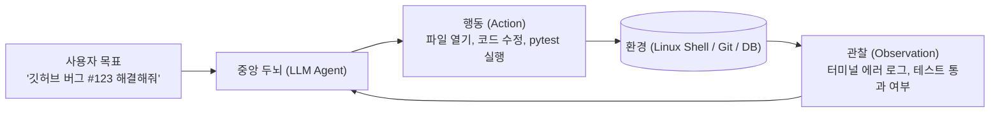
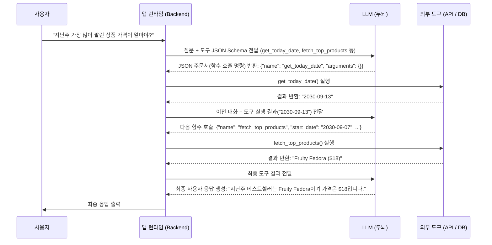
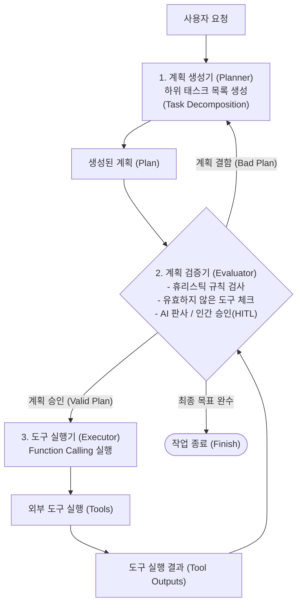

# 03. AI 에이전트 기초와 도구 활용 및 함수 호출 (Function Calling)

## 📌 핵심 요약 & 전체 맥락
> **"파운데이션 모델이 뇌(Brain) 안에서만 생각하는 '철학자'라면, 도구(Tools)와 에이전트(Agents)는 직접 손발을 움직여 현실 세계를 바꾸는 '로봇 팔'을 달아주는 것입니다."**  
> AI 에이전트는 사용자의 목표(Goal)를 듣고 스스로 상황(Environment)을 파악한 뒤, 계획(Plan)을 세우고 외부 도구(API(Application Programming Interface), Python 코드 실행, SQL DB 접근 등)를 자유자재로 사용하여 주어진 임무를 끝까지 자율 완수하는 똑똑한 비서입니다 (예: 스스로 코딩 버그를 고치는 SWE(Software Engineering)-agent).  
> 무분별한 도구 실행으로 인한 비용 폭증과 시스템 파괴를 방지하기 위해, **계획 수립(Planner)과 도구 실행(Executor)을 분리(Decoupling)하여 사전 검증(Evaluator)을 거치는 멀티 에이전트 아키텍처**를 설계해야 합니다.  
> 또한 얀 르쿤(Yann LeCun) 교수의 *"자기회귀 LLM은 본질적으로 계획을 세울 수 없다"*는 비판과, 이를 극복하기 위한 **월드 모델(World Model) 및 상태 추적(State-Tracking) 트리 탐색**의 최신 이론을 심층적으로 다룹니다.

---

## 🗺️ 도표(Figure & Table) 색인 및 매핑 가이드

본문의 핵심 원리를 시각적으로 확인할 수 있는 책 내 도표의 위치와 해설 매핑입니다:

| 도표 번호 | 도표 제목 및 핵심 내용 | 책 페이지 | 본문 해당 주제 |
| :---: | :--- | :---: | :--- |
| **Figure 6-8** | 소프트웨어 엔지니어링 에이전트 SWE-agent가 터미널 환경에서 코드를 수정하고 테스트하는 구조 | **p. 277** | 1. AI 에이전트란 무엇인가? |
| **Figure 6-9** | 계획 수립(Planner) ➔ 검증(Evaluator) ➔ 실행(Executor)을 분리하여 검증된 계획만 실행하는 아키텍처 | **p. 280-283** | 3. 계획과 실행의 분리 (Decoupled Planning) |
| **Figure 6-10** | 이커머스 도구(날짜 조회, 상품 조회 등)를 활용하는 에이전트의 계획 수립 프롬프트 및 의사코드 | **p. 283-287** | 2. 도구 사용과 함수 호출 (Function Calling) |

---

## 1. AI 에이전트(Agent)의 정의와 구성 요소 (pp. 275 ~ 278)

```
[ AI 에이전트의 고전적 정의 (Russell & Norvig, 1995) ]
"센서(Sensors)를 통해 환경을 인식(Perceive)하고, 
 액추에이터(Actuators)를 통해 환경에 작용(Act)하는 합리적 주체."
```

* **파운데이션 모델 기반 에이전트:**  
  LLM이 **중앙 인지 두뇌(Central Brain)**가 되어 자연어로 환경의 상태(Observations)를 해석하고, 어떤 도구를 어떤 인자(Arguments)로 호출할지 결정합니다.



* 🚀 **SWE-agent 사례 연구 (Yang et al., 2024, Figure 6-8):**  
  * **환경:** 실제 Linux 터미널, Git 저장소.
  * **에이전트-컴퓨터 인터페이스(ACI):** LLM이 읽기 편하도록 커스텀 파일 뷰어(페이지네이션 지원), 파일 특정 줄 수정, bash 명령어 실행 인터페이스를 제공하여 GitHub 이슈를 자율 해결.

---

## 2. 도구(Tools)와 함수 호출 (Function Calling, pp. 278 ~ 281)

### ① 도구(Tools)의 필요성과 분류
1. **읽기 전용 도구 (Read-only Actions):**  
   * **계산기(Calculator):** LLM의 치명적 약점인 정밀 사칙연산 환각을 100% 제거.
   * **웹 검색 / 날씨 API:** 실시간 최신 정보 조회.
2. **쓰기 및 실행 도구 (Write Actions):**  
   * **이메일 발송 / DB 수정 / 송금 실행:** 현실 세계의 데이터를 영구적으로 변경하는 고위험 작업.
   * ⚠️ **보안 경고:** 인턴에게 프로덕션 DB 삭제 권한을 주지 않듯, 에이전트의 쓰기 권한은 철저한 **인간 승인(Human-in-the-Loop)** 가드레일이 필요함.

* 💡 **Chameleon 프레임워크 (Lu et al., 2023):**  
  GPT-4 단독 모델보다 13개 도구(웹검색, 이미지 캡셔너, 텍스트 감지기 등)를 장착한 에이전트가 **ScienceQA 과학 질의응답에서 +11.37%p, TabMWP 표 수학 문제에서 +17%p의 정답률 향상**을 달성함.

---

### ② 함수 호출 (Function Calling) 메커니즘 (Figure 6-10)

함수 호출은 **자판기(API)의 버튼을 직접 누를 수 없는 사장님(LLM)이 비서(앱 런타임)에게 "커피 뽑아와"라고 아주 정확한 양식(JSON)의 주문서를 써서 넘겨주는 과정**과 같습니다.



---

### ③ 에이전트의 도구로서의 RAG (Agentic RAG) ⭐
RAG(검색 증강 생성)는 단독으로 쓰일 때는 고정된 '검색 후 생성' 파이프라인이지만, 에이전트 아키텍처 내에서는 **수많은 도구 중 하나(A tool in the agent's toolkit)**로 격상됩니다.
* **유연한 검색 (Dynamic Retrieval):** 에이전트는 사용자의 질문이 사내 지식 베이스 검색이 필요한지, 인터넷 검색이 필요한지 스스로 판단하여 RAG 도구를 호출합니다.
* **복합 도구 연계:** 에이전트는 `SQL DB 조회(정형 RAG)` 도구로 데이터를 뽑아낸 뒤, 그 결과를 바탕으로 다시 `문서 벡터 검색(비정형 RAG)` 도구를 호출하여 복합적인 통찰을 완성할 수 있습니다.

---

## 3. 계획과 실행의 분리 (Decoupled Planning, pp. 281 ~ 285) ⭐

### ① 무분별한 결합 실행의 치명적 위험 (Coupled Execution)
계획 수립과 실행을 분리하지 않고 프롬프트 하나에서 실시간으로 실행하게 두면, **모델이 1,000단계의 엉뚱한 루프에 빠져 수 시간 동안 비싼 API 요금을 탕진하면서도 목표를 전혀 달성하지 못하는 참사**가 발생합니다.

---

### ② 3단계 분리 아키텍처 (Figure 6-9, p. 283)



* **병렬 계획 수립 (Parallel Planning):** 지연시간(Latency)을 줄이기 위해 계획기(Planner)가 3~4개의 각기 다른 작전 후보를 동시에 짜오면, 검증기(Evaluator)가 꼼꼼히 따져보고 가장 안전하고 완벽한 작전 1개만 채택하여 실행합니다.
* **의도 분류기(Intent Classifier) 방패:** 아예 불가능하거나 범위를 벗어난 엉뚱한 요청을 사전에 차단하여, 비싼 서버 연산력(FLOPs) 낭비와 불필요한 도구 오작동을 막습니다.

---

## 4. 파운데이션 모델은 정말로 계획을 세울 수 있는가? (pp. 284 ~ 285)

### 🥊 학계의 뜨거운 논쟁

| 입장 | 주요 학자 및 주장 | 핵심 근거 |
| :--- | :--- | :--- |
| **"LLM은 계획할 수 없다" ❌** | **Yann LeCun** (Meta 수석 AI 과학자, 2023) <br>**Subbarao Kambhampati** (2023) | • 자기회귀(Autoregressive) 토큰 예측기는 본질적으로 뒤로 되돌아가는 **백트래킹(Backtracking)과 트리 탐색 불가** <br>• 겉보기엔 그럴듯한 계획을 뱉지만 실제 실행 시 파탄남 |
| **"LLM은 계획할 수 있다" ✅** | **Hao et al.** (2023) <br>*(Planning with World Model)* | • 방대한 인터넷 지식을 학습한 LLM은 각 행동에 따른 **결과 상태를 예측하는 '월드 모델(World Model)' 역할 수행 가능** <br>• 자가 반성 및 상태 추적 도구와 결합하면 강력한 탐색 플래너로 진화 |

* **엔지니어링 결론:**  
  LLM의 뇌 하나만 덜렁 놔두면 계획 수립에 한계가 있을 수 있습니다. 그러나 체스나 바둑 AI처럼 수천 개의 미래의 수를 앞서 탐색하는 **MCTS (Monte Carlo Tree Search, 몬테카를로 트리 탐색)** 알고리즘과 상태 검증기를 영리하게 결합하면, 실무에서 소름 돋을 정도로 완벽하게 작동하는 강력한 에이전트를 완성할 수 있습니다.

---

## 🔗 연관 문서
* [[00-ch06-overview|00. Chapter 6 전체 개요 및 목차]]
* [[01-rag-architecture-and-retrieval-algorithms|01. RAG 아키텍처와 3대 검색 알고리즘]]
* [[02-rag-optimization-and-multimodal-tabular|02. RAG 검색 최적화와 멀티모달·정형 데이터]]
* [[04-agent-planning-reflection-memory-and-eval|04. 에이전트 계획 수립, 자가 반성(ReAct, Reflexion)과 메모리 계층]]
