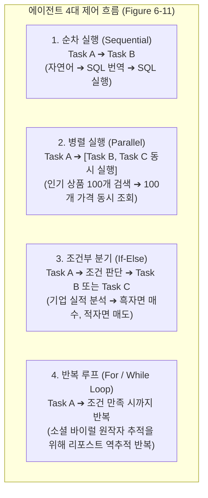
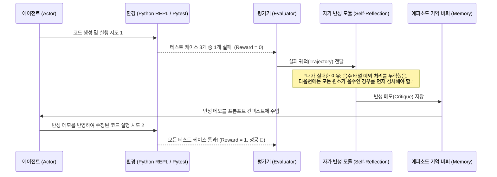
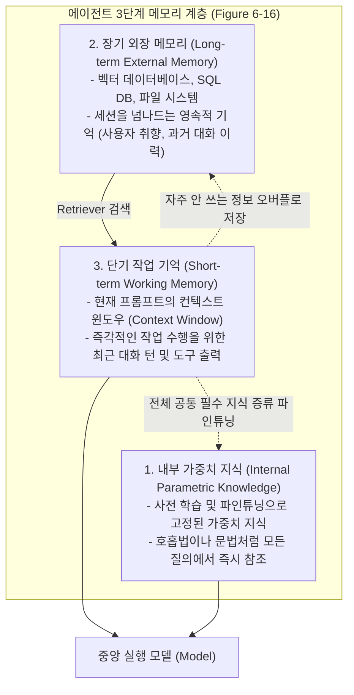

# 04. 에이전트 계획 수립, 자가 반성(ReAct, Reflexion)과 메모리 계층

## 📌 핵심 요약 & 전체 맥락
> **"단순한 지시 수행을 넘어, 스스로 생각하고(Reasoning), 행동하고(Acting), 실패로부터 반성(Reflexion)하며 기억(Memory)을 축적하는 것이 자율 에이전트의 완성입니다."**  
> 본 섹션에서는 에이전트가 복잡한 다단계 과업을 해결하기 위한 **4가지 실행 제어 흐름(순차, 병렬 분기, 조건문, 루프)**과, 생각과 행동을 실시간으로 교차 반복하는 **ReAct(Reason + Act)** 프레임워크를 분석합니다.  
> 나아가 실패한 시도의 궤적(Trajectory)을 언어로 비판 회고하여 다음 시도의 성공률을 수직 상승시키는 **Reflexion(자가 반성 루프)**, 다음 호출 도구를 마르코프 확률로 예측하는 **도구 전이 트리(Tool Transition Tree)**, 그리고 **3단계 메모리 계층 구조(내부 가중치 지식 ➔ 장기 외장 기억 ➔ 단기 작업 기억)**의 최적 관리 정책을 완벽하게 정리합니다.

---

## 🗺️ 도표(Figure & Table) 색인 및 매핑 가이드

본문의 핵심 원리를 시각적으로 확인할 수 있는 책 내 도표의 위치와 해설 매핑입니다:

| 도표 번호 | 도표 제목 및 핵심 내용 | 책 페이지 | 본문 해당 주제 |
| :---: | :--- | :---: | :--- |
| **Figure 6-11** | 순차(Sequential), 병렬(Parallel), 조건부(If), 반복(For loop) 4대 실행 제어 흐름 구조 | **p. 288-292** | 1. 에이전트 4대 제어 흐름 |
| **Figure 6-12** | HotpotQA 벤치마크에서 이유(Thought) ➔ 행동(Action) ➔ 관찰(Obs)을 반복해 답을 찾는 ReAct 에이전트 | **p. 291-294** | 2. ReAct 프레임워크 |
| **Figure 6-13** | 이전 시도의 실패 원인을 비판(Critique)하고 회고 메모리에 저장해 재도전하는 Reflexion 루프 | **p. 293-295** | 3. 자가 반성 (Reflexion) |
| **Figure 6-14** | 모델(GPT-4 vs Claude)과 작업 도메인에 따른 도구 호출 빈도 및 선호도 차이 분석 | **p. 296-297** | 4. 도구 사용 패턴 |
| **Figure 6-15** | 도구 A 실행 후 도구 B를 호출할 조건부 확률을 트리 형태로 모델링한 도구 전이 트리 (Lu et al., 2023) | **p. 298-299** | 4. 도구 전이 트리 (Markov Tree) |
| **Figure 6-16** | **3단계 메모리 계층 (1. 내부 지식, 2. 장기 외장 메모리, 3. 단기 작업 기억)** 아키텍처 | **p. 301-302** | 5. 에이전트 3단계 메모리 계층 |

---

## 1. 에이전트 실행 제어 흐름 4가지 (Control Flow, Figure 6-11, pp. 287 ~ 290)

복잡한 과업을 수행할 때 에이전트는 단순 일직선 실행을 넘어 다양한 프로그램 제어 구조를 생성합니다:



* **엔지니어링 시사점:**  
  * 여러 웹사이트를 긁어와야 할 때 순차 실행 대신 **병렬 실행(Parallel)**을 지원하는 에이전트 프레임워크를 사용하면 **사용자 체감 지연시간(Latency)을 비약적으로 단축**할 수 있습니다.

---

## 2. ReAct: 이유와 행동의 교차 프레임워크 (Yao et al., 2022, Figure 6-12) ⭐

머릿속으로 생각만 하느라 현실을 모르는 '몽상가(Chain-of-Thought)' 모델은 환각에 빠지기 쉽고, 앞뒤 안 가리고 행동부터 하는 '돌격대장(Act-only)' 모델은 목표를 잃고 맹목적으로 버튼만 누릅니다.  
이 둘을 융합한 **ReAct (Reason + Act, 추론과 행동의 결합)** 모델은 한 발짝 생각(Thought)하고, 한 발짝 행동(Act)한 뒤, 그 결과를 주변에서 관찰(Observation)하며 신중하게 탐험하는 방식입니다.

```
[ ReAct의 HotpotQA 문제 해결 실증 (Figure 6-12, p. 294) ]

질문: "Apple Remote 외에, Apple Remote가 원래 제어하도록 설계된 프로그램을 제어할 수 있는 다른 장치는?"

Thought 1: Apple Remote를 검색해서 이 리모컨이 원래 어떤 프로그램을 제어하도록 설계되었는지 찾자.
Act 1: Search[Apple Remote]
Obs 1: Apple Remote는 2005년 Apple이 출시했으며 원래 'Front Row' 미디어 센터 프로그램을 제어하도록 설계됨...

Thought 2: Front Row를 제어할 수 있는 다른 장치가 무엇인지 알아보기 위해 Front Row를 검색하자.
Act 2: Search[Front Row]
Obs 2: [Front Row] 검색 실패. 유사 검색어: 'Front Row (software)'

Thought 3: 검색 실패했으니 'Front Row (software)'로 다시 검색하자.
Act 3: Search[Front Row (software)]
Obs 3: Front Row는 단종된 소프트웨어로 Apple Remote 또는 키보드 기능 키(keyboard function keys)로 제어됨...

Thought 4: Front Row는 Apple Remote 또는 키보드 기능 키로 제어된다. 따라서 정답은 키보드 기능 키이다.
Act 4: Finish[keyboard function keys] ✅
```

---

## 3. Reflexion: 자가 반성과 언어적 강화학습 (Shinn et al., 2023, Figure 6-13)

에이전트가 코딩이나 복잡한 작업에서 실패했을 때, 무식하게 처음부터 다시 시작하는 대신 **"내가 방금 왜 틀렸지?"라며 오답 노트를 꼼꼼히 작성(Self-Critique)하여 머릿속에 저장하고 다음 시도에 반영하는 모범생의 학습법**입니다.



* **성능 향상:** 코딩 벤치마크(HumanEval)에서 단순히 코드를 고치라고 지시할 때보다, **오답 노트를 바탕으로 3~5회 반성(Reflexion)하며 재도전했을 때 정답률이 20~30%p 수직 상승**했습니다.

---

## 4. 도구 사용 패턴과 도구 전이 트리 (Lu et al., 2023, Figures 6-14, 6-15)

* **도구 전이 트리 (Tool Transition Tree, Figure 6-15):**  
  에이전트가 도구 $A$를 실행한 후 도구 $B$를 호출할 조건부 마르코프 확률 $P(B \mid A)$를 모델링한 트리 구조.
* **엔지니어링 활용:**  
  다음에 호출될 가능성이 높은 도구의 데이터를 **사전에 백그라운드 프리페칭(Pre-fetching)**하거나, 비효율적인 도구 호출 루프를 사전에 가지치기(Pruning)하여 지연시간을 단축.

---

## 5. 에이전트 3단계 메모리 계층 구조 (Figure 6-16, pp. 299 ~ 305) 🏆

에이전트가 단일 세션을 넘어 영속적인 비서로 작동하려면 인간의 기억 구조와 동일한 **3단계 메모리 계층**이 필요합니다:



---

### 🧹 단기 메모리 관리 전략 (Memory Management Policies, pp. 303 ~ 304)

컨텍스트 윈도우 한계를 극복하기 위한 3대 메모리 퇴출(Eviction) 기법:

1. **FIFO 슬라이딩 윈도우 (First-In, First-Out, 선입선출):**  
   새로운 대화가 들어오면 메모리 용량 확보를 위해 가장 오래된 앞쪽 대화부터 잘라버립니다.  
   ⚠️ **치명적 함정:** 대화 맨 처음에 정의된 **"이건 절대 하지 마!"라는 사용자의 핵심 목표와 규칙(System Prompt)이 가장 먼저 날아가 버리는 심각한 건망증**이 발생합니다.
2. **재귀적 대화 요약 (Recursive Summarization, Bae et al., 2022):**  
   오래된 대화들을 핵심 개체명(Entity)과 진행 상황을 담은 압축 요약문으로 변환하여 컨텍스트 상단에 유지.
3. **지능형 기억 병합 및 모순 해결 (Reflection-based Merge, Liu et al., 2023):**  
   새로운 정보가 들어왔을 때 모델 스스로 반성하여, **기존 메모리에 단순히 추가할지, 병합할지, 아니면 오래되고 모순된 구 정보를 덮어쓸지(Overwrite) 능동 판단**.

---

## 6. 에이전트 평가 프레임워크 (Agent Evaluation) ⭐

단일 턴(Single-turn) 질의응답 시스템인 기본 RAG와 달리, 에이전트는 도구를 여러 번 호출하고 상태를 변화시키며 장기적인 목표를 달성해야 합니다. 따라서 기존의 정확도(Accuracy) 지표만으로는 에이전트를 제대로 평가할 수 없습니다.

* **에이전트 궤적 평가 (Trajectory Evaluation):**  
  최종 결과물만 채점하는 것이 아니라, 에이전트가 목표 달성을 위해 거쳐간 **중간 추론 단계(Thought)와 도구 호출 내역(Tool Calls)**이 합리적인지 평가합니다.
* **주요 평가 지표:**
  1. **도구 선택 정확도 (Tool Selection Accuracy):** 올바른 도구를 적절한 타이밍에 호출했는가?
  2. **인자 추출 정확도 (Argument Extraction):** 도구 호출 시 필수 파라미터(예: 날짜, ID)를 정확히 넘겨주었는가?
  3. **복구 능력 (Recovery Rate):** 도구 실행 중 에러가 발생했을 때 멈추지 않고 자가 수정(Self-Correction)을 통해 목표를 완수했는가?
* **실무 시사점:** 에이전트 평가는 필연적으로 상태(State) 추적이 필요하므로, 위험한 도구 호출을 차단하는 모의 실행 환경(Sandbox)과 각 스텝별 로그를 캡처하는 전문 평가 파이프라인 구축이 필수적입니다.

---

## 🔗 연관 문서
* [[00-ch06-overview|00. Chapter 6 전체 개요 및 목차]]
* [[01-rag-architecture-and-retrieval-algorithms|01. RAG 아키텍처와 3대 검색 알고리즘]]
* [[02-rag-optimization-and-multimodal-tabular|02. RAG 검색 최적화와 멀티모달·정형 데이터]]
* [[03-ai-agents-tools-and-function-calling|03. AI 에이전트 기초와 도구 활용 및 함수 호출]]
* [[chapter-qa/ch05-prompt-engineering-qa/02-prompt-engineering-best-practices|Ch05-02. 프롬프트 엔지니어링 5대 모범 원칙과 CoT]]
