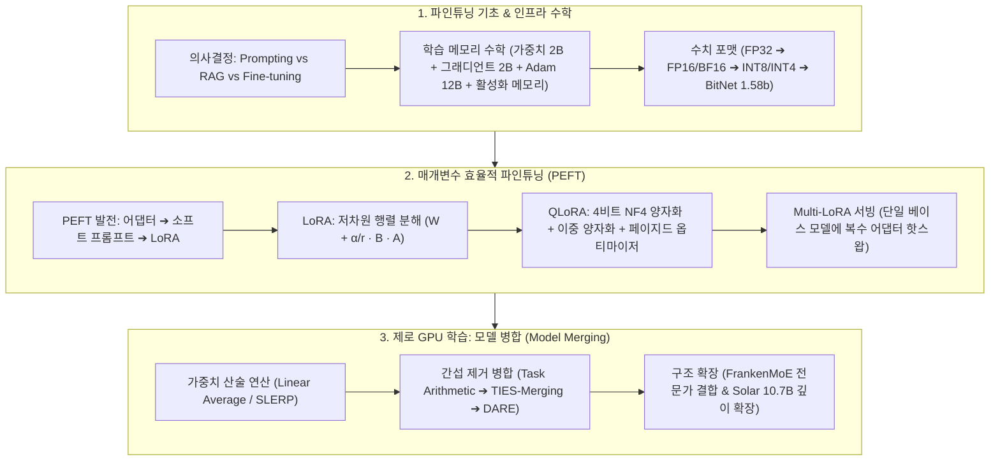

# Chapter 07. 파인튜닝과 매개변수 효율적 학습, 모델 병합 (Fine-Tuning)

> **"프롬프트 엔지니어링과 RAG가 모델에게 '무엇을 말할지(What)' 알려준다면, 파인튜닝은 모델이 '어떻게 행동하고 생각할지(How)' 두뇌 자체를 영구적으로 재구성하는 작업이다."**  
> 기본 파운데이션 모델을 특정 도메인(의료, 금융, 코딩)과 기업 고유의 스타일/포맷에 맞추기 위해 가중치를 업데이트하는 **파인튜닝(Fine-Tuning)**은 고성능 AI 시스템 구축의 핵심 단계입니다.  
> 본 챕터에서는 **프롬프팅 vs RAG vs 파인튜닝의 엔지니어링 의사결정 프레임워크**부터, 학습 메모리를 지배하는 **활성화 메모리(Activations)와 수치 정밀도(FP16, BF16, BitNet 1.58-bit)**, 거대 모델을 단 한 장의 GPU로 튜닝하는 **LoRA 및 QLoRA (PEFT)**, 그리고 별도의 GPU 학습 없이 가중치 연산만으로 여러 전문가 모델을 합치는 최신 **모델 병합(Model Merging: SLERP, TIES, DARE, FrankenMoE, Solar-10.7B)** 기법까지 파인튜닝의 모든 것을 심층적으로 다룹니다.

---

## 🗺️ Chapter 7 학습 로드맵 및 소챕터 구성

| 번호 | 문서 제목 | 핵심 내용 및 주요 키워드 | 원문 페이지 |
| :---: | :--- | :--- | :---: |
| **00** | [[00-ch07-overview\|00. Chapter 7 전체 개요 및 목차]] | 파인튜닝 & 모델 병합 전체 로드맵, 개념 지도 및 도표 총괄 색인 | pp. 307-358 |
| **01** | [[01-finetuning-foundations-and-decision-framework\|01. 파인튜닝 기초와 엔지니어링 의사결정 프레임워크]] | 파인튜닝 목적, Code Llama 구축 파이프라인(Figure 7-1), 범용 vs 특화 모델 비교(Table 7-1), 프롬프팅 vs RAG vs 파인튜닝 3대 비교 및 하이브리드 의사결정 흐름도 (pp. 307-315) | `Code Llama`, `Task Specialization`, `Format Steering`, `RAG vs Fine-tuning`, `Decision Framework` |
| **02** | [[02-memory-math-and-quantization\|02. 학습 메모리 수학과 수치 정밀도 및 양자화 (FP16, BF16, BitNet)]] | 역전파 계산 그래프(Figure 7-4), 4대 학습 메모리(가중치, 그래디언트, 옵티마이저, 활성화 메모리 Figure 7-5), 부동소수점 포맷(FP32, FP16, BF16 Figure 7-6 & Table 7-3), BitNet 1.58비트 삼진 모델 (pp. 315-324) | `Activation Memory`, `Backpropagation`, `Optimizer States`, `FP16`, `BF16`, `Quantization`, `BitNet 1.58b` |
| **03** | [[03-peft-lora-and-qlora\|03. 매개변수 효율적 파인튜닝(PEFT)과 LoRA / QLoRA 서빙]] | 완전 파인튜닝의 한계, 어댑터(Houlsby Figure 7-8), 소프트 프롬프트(Figure 7-9), LoRA 저차원 분해 수학($W + \frac{\alpha}{r}BA$ Figure 7-11), 멀티 LoRA 서빙(Figure 7-12 & Table 7-6), QLoRA 4비트 NF4 양자화 (pp. 324-342) | `PEFT`, `LoRA`, `Low-Rank Decomposition`, `Multi-LoRA Serving`, `QLoRA`, `NF4`, `Double Quantization` |
| **04** | [[04-model-merging-and-weight-arithmetic\|04. 모델 병합(Model Merging)과 가중치 산술 연산]] | 앙상블 vs 모델 병합(Figure 7-13), 선형 가중치 평균(Figure 7-15), 구면 선형 보간(SLERP Figure 7-16), 태스크 산술 & TIES-Merging / DARE 가지치기(Figure 7-17), FrankenMoE 업스케일링(Figure 7-18), 깊이 확장(Solar-10.7B Figure 7-19), LoRA 어댑터 병합 (pp. 342-358) | `Model Merging`, `SLERP`, `Task Arithmetic`, `TIES-Merging`, `DARE`, `FrankenMoE`, `Depthwise Scaling` |

---

## 🧠 Chapter 7 전체 개념 아키텍처 다이어그램

---

## 📊 Chapter 7 주요 도표 & 수치 색인

| 도표 번호 | 도표 제목 및 핵심 내용 | 책 페이지 | 해당 소챕터 |
| :---: | :--- | :---: | :--- :
| **Figure 7-1** | Code Llama 파인튜닝 파이프라인 (Llama 2 ➔ Code ➔ Python / Instruct) | **p. 308** | 01 |
| **Table 7-1** | 범용 모델 GPT-4 vs 금융 특화 모델(FinGPT, BloombergGPT) FPB/FiQA 벤치마크 비교표 | **p. 310** | 01 |
| **Figure 7-2** | 파인튜닝을 통해 장황한 퓨샷 프롬프트를 콤팩트한 프롬프트로 단축하는 토큰 절감 효과 | **p. 312** | 01 |
| **Table 7-2** | 최신 시사 질문 질의응답에서 RAG(검색)가 파인튜닝을 압도하는 정확도 비교표 | **p. 313** | 01 |
| **Figure 7-3** | 프롬프팅 ➔ RAG ➔ 파인튜닝으로 이어지는 최적 애플리케이션 개발 흐름도 | **p. 314** | 01 |
| **Figure 7-4** | 순전파(Forward) 및 가중치 업데이트 역전파(Backward) 계산 그래프 | **p. 316** | 02 |
| **Figure 7-5** | 배치 크기와 시퀀스 길이에 따라 가중치 메모리를 압도하는 활성화 메모리(Activations) 비중 | **p. 318** | 02 |
| **Figure 7-6** | 부호(Sign), 지수부(Exponent), 가수부(Fraction)로 구성된 FP32, FP16, BF16, INT8 비트 포맷 | **p. 320** | 02 |
| **Table 7-3** | FP32 값을 FP16, BF16, INT8로 변환할 때 발생하는 수치 오차 및 반올림 실증표 | **p. 321** | 02 |
| **Table 7-4** | BitNet b1.58 (1.58비트 삼진 {-1,0,1}) 모델과 Llama 2 16비트 모델의 성능 및 메모리 비교표 | **p. 324** | 02 |
| **Figure 7-7** | 학습 파라미터 수에 따른 부분 파인튜닝과 완전 파인튜닝의 성능 격차 곡선 | **p. 325** | 03 |
| **Figure 7-8** | BERT 트랜스포머 레이어 사이에 삽입되는 Houlsby 어댑터(Adapter) 모듈 구조 | **p. 326** | 03 |
| **Figure 7-9** | 하드 프롬프트 앞에 학습 가능한 가상 임베딩 벡터를 덧붙이는 소프트 프롬프트 (Prompt Tuning) | **p. 328** | 03 |
| **Figure 7-10** | PEFT 기법별 Hugging Face 이슈 수 비교 (LoRA가 압도적 1위) | **p. 329** | 03 |
| **Figure 7-11** | 원본 고정 가중치 $W$에 저차원 행렬 곱 $B \times A$를 더하는 LoRA 아키텍처 다이어그램 | **p. 331** | 03 |
| **Table 7-5** | 18M 학습 파라미터 제약 하에서 LoRA vs 어댑터 vs 완전 파인튜닝 GLUE 성능 비교표 | **p. 333** | 03 |
| **Figure 7-12** | 단일 베이스 가중치를 공유하고 요청마다 LoRA 어댑터를 전환하는 Multi-LoRA 서빙 구조 | **p. 334** | 03 |
| **Table 7-6** | 7B 베이스 모델 가중치(14GB) 대비 LoRA 어댑터 가중치(70MB) 메모리 극소 비중 비교표 | **p. 336** | 03 |
| **Table 7-7** | QLoRA 기반 Guanaco 65B 모델과 ChatGPT/GPT-4의 Vicuna 벤치마크 Elo 레이팅 비교표 | **p. 338** | 03 |
| **Figure 7-13** | 인퍼런스 비용이 배가되는 앙상블(Ensemble) vs 단일 모델로 합치는 모델 병합(Model Merging) 비교 | **p. 343** | 04 |
| **Figure 7-14** | 모델 병합 3대 접근법 (가중치 합산/평균, 레이어 깊이 스태킹, 라우터 기반 MoE 결합) | **p. 345** | 04 |
| **Figure 7-15** | 동일한 구조의 두 모델 레이어 가중치를 단순 산술 평균하는 선형 결합 구조 | **p. 346** | 04 |
| **Figure 7-16** | 고차원 초구면 상에서 두 벡터의 최단 호를 따라 각도를 보간하는 SLERP 기하학적 원리 | **p. 347** | 04 |
| **Figure 7-17** | 태스크 벡터의 하위 80%를 제거(가지치기)해도 성능이 유지되는 TIES-Merging/DARE 곡선 | **p. 349** | 04 |
| **Figure 7-18** | 복수의 파인튜닝 모델을 전문가(Experts)로 묶고 라우터를 붙여 MoE로 변환하는 FrankenMoE | **p. 351** | 04 |
| **Figure 7-19** | 32개 레이어를 중첩 연결하여 48개 레이어로 확장하는 Depthwise Scaling (Solar-10.7B) | **p. 353** | 04 |
| **Figure 7-20** | 서로 다른 LoRA 어댑터 행렬을 결합하여 랭크 $r_1 + r_2$의 통합 어댑터를 만드는 LoRA 병합 | **p. 355** | 04 |
