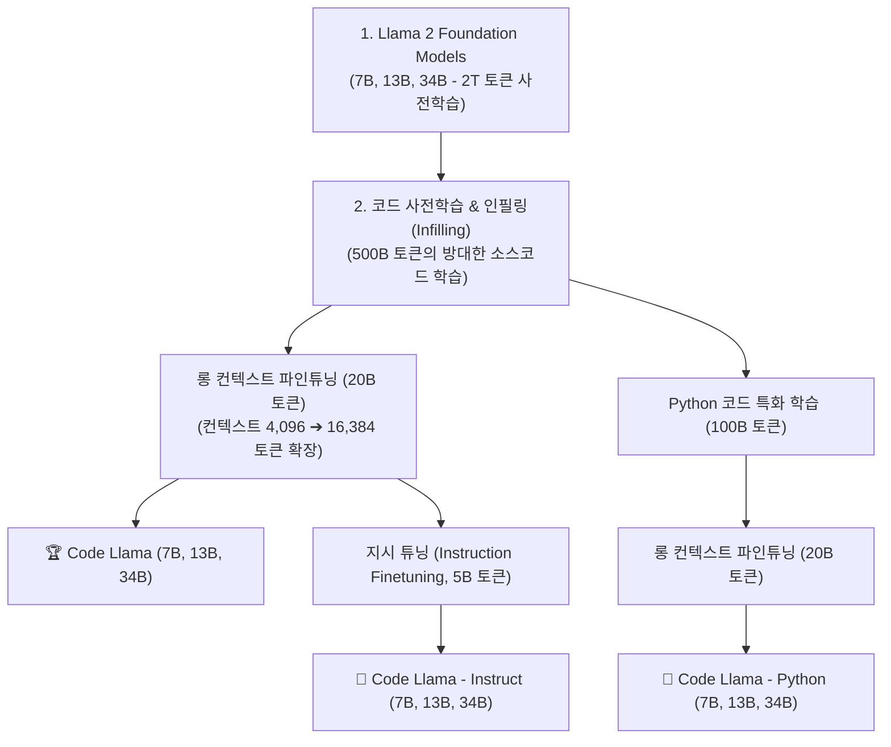

# 01. 파인튜닝 기초와 엔지니어링 의사결정 프레임워크

## 📌 핵심 요약 & 전체 맥락
> **"파인튜닝(Fine-Tuning)은 '형식과 행동 양식(Form & Behavior)'을 교정하는 것이고, RAG (Retrieval-Augmented Generation, 검색 증강 생성)는 '사실과 지식(Facts & Knowledge)'을 공급하는 것입니다."**  
> 파인튜닝은 사전 학습된 파운데이션 모델의 가중치(Weights)를 특정 도메인 데이터나 태스크 예시로 추가 학습시켜 모델의 행동, 전문 어휘, 응답 톤, 출력 문법(JSON/SQL)을 영구적으로 체화시키는 기법입니다 (Code Llama 파이프라인).  
> 130만 GPU 연산 시간을 쏟아부은 금융 특화 모델 BloombergGPT가 출시 당월 범용 모델인 GPT-4-0314에 완패한 실증 사례는 **"좁은 도메인 특화 모델보다 프론티어 범용 모델의 스케일링이 더 빠르다"**는 냉혹한 교훈을 줍니다.  
> 본 섹션에서는 파인튜닝의 본질적 가치, 파인튜닝으로 인해 다른 일반 성능이 저하되는 **얼라인먼트 택스(Alignment Tax / 파국적 망각)**, 그리고 **프롬프팅 ➔ RAG ➔ 파인튜닝으로 이어지는 엔지니어링 4분면 의사결정 프레임워크**를 완벽히 정리합니다.

---

## 🗺️ 도표(Figure & Table) 색인 및 매핑 가이드

본문의 핵심 원리를 시각적으로 확인할 수 있는 책 내 도표의 위치와 해설 매핑입니다:

| 도표 번호 | 도표 제목 및 핵심 내용 | 책 페이지 | 본문 해당 주제 |
| :---: | :--- | :---: | :--- |
| **Figure 7-1** | Llama 2 기본 모델로부터 Code Llama 및 Python/Instruct 모델로 확장되는 3단계 파인튜닝 파이프라인 | **p. 308-311** | 1. 파인튜닝이란 무엇인가? |
| **Table 7-1** | 범용 모델 GPT-4-0314 vs 금융 특화 모델 BloombergGPT의 금융 벤치마크(FiQA, ConvFinQA) 비교표 | **p. 310-315** | 2. 범용 모델 vs 도메인 특화 모델의 함정 |
| **Figure 7-2** | 수천 토큰의 퓨샷 예시 프롬프트를 파인튜닝으로 대체하여 입력 토큰 비용을 대폭 줄이는 효과 | **p. 312-315** | 3. 파인튜닝의 3대 핵심 동기 |
| **Table 7-2** | 최신 시사 질의응답에서 RAG가 파인튜닝 단독 모델을 압도하는 정확도 비교표 (Ovadia et al., 2024) | **p. 313-317** | 4. RAG vs 파인튜닝 실증 비교 |
| **Figure 7-3** | **컨텍스트 최적화(RAG) 축과 행동 최적화(파인튜닝) 축으로 구성된 애플리케이션 진화 4분면** | **p. 314-318** | 5. 엔지니어링 의사결정 흐름도 |

---

## 1. 파인튜닝의 본질과 Code Llama 구축 사례 (pp. 307 ~ 311)

* **전이 학습 (Transfer Learning):**  
  수조 개의 인터넷 코퍼스로 일반 상식을 배운 기반 모델에, 수천~수만 개의 정밀한 도메인 데이터셋을 학습시켜 **표본 효율성(Sample Efficiency)**을 극대화하는 기법입니다.
* 💡 **InstructGPT 논문 (OpenAI, 2022)의 통찰:**  
  *"파인튜닝은 모델에 무에서 유를 창조하듯 완전히 새로운 능력을 주입하기보다는, 사전 학습 단계에서 모델이 이미 습득했으나 프롬프팅만으로는 꺼내기 힘들었던 잠재 능력을 깨우는 '잠금 해제(Unlocking)' 과정이다."*



---

## 2. 범용 모델 vs 도메인 특화 모델의 함정 (Table 7-1, pp. 310 ~ 315)

많은 엔지니어들이 *"우리 비즈니스는 금융/의료/법률이라 특수하므로 반드시 자체 모델을 파인튜닝하거나 처음부터 학습해야 한다"*고 생각합니다.  
하지만 **BloombergGPT의 교훈**은 이 믿음이 틀릴 수 있음을 명백히 보여줍니다:

* **BloombergGPT (2023년 3월):** 500억(50B) 파라미터 금융 전용 모델. A100 **GPU (Graphics Processing Unit, 그래픽 처리 장치)** **130만 시간**, 연산 비용만 **130만~260만 달러(약 20~35억 원)** 투입.
* **GPT-4-0314 (2023년 3월 출시):** 일반 범용 파운데이션 모델.

| 금융 벤치마크 평가 | GPT-4-0314 (Zero-shot) | BloombergGPT (특화 모델) | 비고 |
| :--- | :---: | :---: | :--- |
| **FiQA 감성 분석 (Weighted F1)** | **87.15** | 75.07 | GPT-4의 압승 🚀 |
| **ConvFinQA 금융 대화형 QA (Accuracy)** | **76.48%** | 43.41% | **GPT-4가 약 1.8배 높은 정확도!** |

> ⚠️ **시사점:** 프론티어 범용 모델의 성능 향상 속도가 너무 빨라, 수십억 원을 들여 구축한 특화 모델이 출시 당일 범용 모델에 추월당할 수 있습니다. 자체 파인튜닝에 뛰어들기 전에 최신 오픈/상용 모델의 기본 성능을 철저히 벤치마킹해야 합니다.

---

## 3. 파인튜닝을 적용해야 하는 3대 핵심 동기 (pp. 311 ~ 315)

```
[ 파인튜닝의 3대 핵심 동기 ]

1. 응답 형식 및 문법 제어 (Format Steering) : JSON, YAML, 정밀 SQL 사투리 출력 100% 준수
2. 도메인 어휘 및 톤 고정 (Tone & Style)    : 의료 차트 작성 스타일, 특정 기업의 고객지원 페르소나 체화
3. 비용 및 지연시간 최적화 (Token Economy)   : 50-shot 긴 프롬프트를 Zero-shot 짧은 프롬프트로 대체 (Figure 7-2)
```

* ⚠️ **얼라인먼트 택스 (Alignment Tax)와 파국적 망각 (Catastrophic Forgetting):**  
  모델을 '주문 취소' 작업에 맞춰 과도하게 파인튜닝하면 주문 취소 성능은 올라가지만, 기존에 잘하던 **'상품 추천'이나 '일반 논리 추론' 능력이 급격히 망가지는 부작용**이 발생할 수 있습니다.

---

## 4. RAG vs 파인튜닝 실증 비교: "지식은 RAG, 태도는 파인튜닝" (Table 7-2)

최신 시사/지식 질의응답에서 RAG와 파인튜닝의 성능 비교 (Ovadia et al., 2024, Table 7-2):

| 모델 | 기본 모델 (Base) | 기본 모델 + RAG | 파인튜닝 단독 (FT-reg) | 파인튜닝 + RAG (FT-reg + RAG) |
| :--- | :---: | :---: | :---: | :---: |
| **Mistral-7B** | 0.481 | **0.875 🚀** | 0.504 | 0.810 |
| **Llama 2-7B** | 0.353 | **0.585 🚀** | 0.219 | 0.326 |
| **Orca 2-7B** | 0.456 | **0.876 🚀** | 0.511 | 0.820 |

* **결론 (p. 317):**  
  **"In short, finetuning is for form, and RAG is for facts."**  
  새로운 사실과 동적 데이터는 파인튜닝 가중치 주입보다 **RAG가 압도적으로 정확하며 환각이 적습니다**.

---

## 5. 엔지니어링 의사결정 프레임워크 (Figure 7-3, p. 318) ⭐

```mermaid
quadrantChart
    title 프롬프팅 vs RAG vs 파인튜닝 진화 4분면 (Figure 7-3)
    x-axis 행동 최적화 (Behavior Optimization) --> 높음 (Fine-tuning)
    y-axis 문맥 최적화 (Context Optimization) --> 높음 (RAG)
    quadrant-1 RAG + 파인튜닝 (최상위 엔터프라이즈)
    quadrant-2 RAG (검색 기반 최신 지식 증강)
    quadrant-3 기본 프롬프팅 (Zero-shot / Few-shot)
    quadrant-4 파인튜닝 (형식 및 톤 특화)
    "1. 단순 프롬프트": [0.15, 0.20]
    "2. 퓨샷 프롬프트": [0.35, 0.35]
    "3. 단순 검색 (BM25)": [0.25, 0.65]
    "4. 고급 RAG (하이브리드)": [0.30, 0.85]
    "5. 포맷 파인튜닝": [0.80, 0.25]
    "6. RAG + 파인튜닝 통합": [0.75, 0.88]
```

```
[ AI 엔지니어의 올바른 실무 개발 순서 ]

1단계 : 프롬프트 엔지니어링으로 시작 (Zero-shot / Few-shot / CoT)
2단계 : 지식이 부족하거나 환각이 발생하면 ➔ RAG (BM25 ➔ 하이브리드) 도입
3단계 : 출력 포맷 불일치나 응답 톤 교정이 필요하면 ➔ 파인튜닝 (PEFT / LoRA) 수행
4단계 : 최상위 고난도 시스템 ➔ 파인튜닝된 전용 모델에 RAG를 결합 (Top-Right 완성)
```

---

## 🔗 연관 문서
* [[00-ch07-overview|00. Chapter 7 전체 개요 및 목차]]
* [[02-memory-math-and-quantization|02. 학습 메모리 수학과 수치 정밀도 및 양자화]]
* [[03-peft-lora-and-qlora|03. 매개변수 효율적 파인튜닝(PEFT)과 LoRA]]
* [[chapter-qa/ch06-rag-and-agents-qa/01-rag-architecture-and-retrieval-algorithms|Ch06-01. RAG 아키텍처와 3대 검색 알고리즘]]
