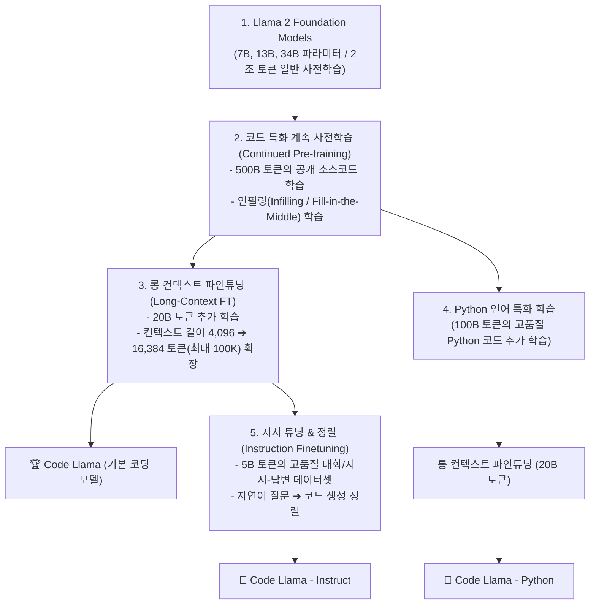

# 01. 파인튜닝 기초와 엔지니어링 의사결정 프레임워크

## 📌 핵심 요약 & 전체 맥락
> **"파인튜닝(Fine-Tuning)은 '형식과 행동 양식(Form & Behavior)'을 교정하는 것이고, RAG (Retrieval-Augmented Generation, 검색 증강 생성)는 '사실과 지식(Facts & Knowledge)'을 공급하는 것입니다."**  
> 파인튜닝은 사전 학습된 파운데이션 모델의 가중치(Weights)를 특정 도메인 데이터나 태스크 예시로 추가 학습시켜 모델의 행동, 전문 어휘, 응답 톤, 출력 문법(JSON/SQL)을 영구적으로 체화시키는 기법입니다 (Code Llama 파이프라인).  
> 130만 GPU 연산 시간을 쏟아부은 금융 특화 모델 BloombergGPT가 출시 당월 범용 모델인 GPT-4-0314에 완패한 실증 사례는 **"좁은 도메인 특화 모델보다 프론티어 범용 모델의 스케일링이 더 빠르다"**는 냉혹한 교훈을 줍니다.  
> 본 섹션에서는 파인튜닝의 본질적 가치, 파인튜닝으로 인해 다른 일반 성능이 저하되는 **얼라인먼트 택스(Alignment Tax / 파국적 망각)**, 그리고 **프롬프팅 ➔ RAG ➔ 파인튜닝으로 이어지는 엔지니어링 4분면 의사결정 프레임워크**를 완벽히 정리합니다.

---

## 🗺️ 도표(Figure & Table) 색인 및 매핑 가이드

본문의 핵심 원리를 시각적으로 확인할 수 있는 책 내 도표의 위치와 해설 매핑입니다:

| 도표 번호 | 도표 제목 및 핵심 내용 | 책 페이지 | 본문 해당 주제 |
| :---: | :--- | :---: | :--- |
| **Figure 7-1** | Llama 2 기본 모델로부터 Code Llama 및 Python/Instruct 모델로 확장되는 3단계 파인튜닝 파이프라인 | **pp. 308-311** | 1. 파인튜닝의 본질과 Code Llama 구축 사례 |
| **Table 7-1** | 범용 모델 GPT-4-0314 vs 금융 특화 모델 BloombergGPT의 금융 벤치마크(FiQA, ConvFinQA) 비교표 | **pp. 310-315** | 2. 범용 모델 vs 도메인 특화 모델의 함정 |
| **Figure 7-2** | 수천 토큰의 퓨샷 예시 프롬프트를 파인튜닝으로 대체하여 입력 토큰 비용을 대폭 줄이는 효과 | **pp. 312-315** | 3. 파인튜닝을 적용해야 하는 3대 핵심 동기 |
| **Table 7-2** | 최신 시사 질의응답에서 RAG가 파인튜닝 단독 모델을 압도하는 정확도 비교표 (Ovadia et al., 2024) | **pp. 313-317** | 4. RAG vs 파인튜닝 실증 비교 |
| **Figure 7-3** | **컨텍스트 최적화(RAG) 축과 행동 최적화(파인튜닝) 축으로 구성된 애플리케이션 진화 4분면** | **pp. 314-318** | 5. 엔지니어링 의사결정 프레임워크 |

---

## 1. 파인튜닝의 본질과 Code Llama 구축 사례 (pp. 307 ~ 311)

### ① 전이 학습(Transfer Learning)과 파인튜닝의 정의
* **전이 학습 (Transfer Learning):** 수조 개의 일반 인터넷 코퍼스로 사전 훈련(Pre-training)된 파운데이션 모델의 풍부한 언어 표현력을 바탕으로, 수천~수만 개의 정밀한 태스크 특화 데이터셋을 학습시켜 **표본 효율성(Sample Efficiency)**을 극대화하는 기법입니다.
* 💡 **InstructGPT 논문 (Ouyang et al., OpenAI, 2022)의 통찰:**  
  > *"파인튜닝은 모델에 무에서 유를 창조하듯 완전히 새로운 능력을 주입하기보다는, 사전 학습 단계에서 모델이 이미 습득했으나 프롬프팅만으로는 일관되게 꺼내기 힘들었던 잠재 능력을 깨우는 '잠금 해제(Unlocking)' 과정이다."*

---

### ② Code Llama 다단계 파인튜닝 파이프라인 (Rozière et al., 2024, Figure 7-1)

Meta의 Code Llama는 기본 범용 모델(Llama 2)을 단계별 목적에 맞춰 정밀하게 파인튜닝하여 세계 최고 수준의 코딩 전용 모델 군을 구축한 대표적 엔지니어링 표준 사례입니다:



1. **코드 특화 계속 사전학습 (500B 토큰):**  
   일반 웹 텍스트로 학습된 Llama 2에 5000억 개의 소스코드 토큰을 추가 학습시키며, 코드 중간 빈칸을 채우는 **인필링(Fill-in-the-Middle, FIM)** 목적 함수를 적용해 IDE 코드 완성 능력을 극대화했습니다.
2. **롱 컨텍스트 파인튜닝 (20B 토큰):**  
   어텐션 위치 임베딩(RoPE)의 기본 주파수(Base Frequency)를 조정하여 컨텍스트 윈도우를 4,096에서 16,384 토큰으로 확장함으로써 대규모 저장소(Repository-level) 코드를 한 번에 분석할 수 있도록 개선했습니다.
3. **Python 특화 및 지시 튜닝 (Instruct):**  
   Python 코드만 100B 토큰 추가 학습시킨 `Code Llama - Python`과, 자연어 지시를 정확히 코드로 변환하도록 5B 토큰의 대화 데이터를 학습시킨 `Code Llama - Instruct`로 세분화했습니다.

---

## 2. 범용 모델 vs 도메인 특화 모델의 함정 (Table 7-1, pp. 310 ~ 315)

많은 엔지니어들과 기업들이 *"우리 비즈니스는 금융/의료/법률 도메인이므로, 일반 범용 모델은 쓸 수 없고 반드시 수십억 원을 들여 도메인 특화 모델을 바닥부터 만들거나 파인튜닝해야 한다"*고 생각합니다.  
하지만 **BloombergGPT의 실증 사례**는 이 믿음이 매우 위험할 수 있음을 보여줍니다:

### ① BloombergGPT vs GPT-4 벤치마크 실증 비교 (2023년 3월)

* **BloombergGPT:** 500억(50B) 파라미터 규모의 금융 전용 모델. 금융 뉴스, 보고서, 증권 데이터 등 방대한 독점 금융 코퍼스로 학습.
  * 소모 연산 자원: **NVIDIA A100 GPU 130만 시간**
  * 예상 학습 비용: **130만 ~ 260만 달러 (한화 약 20억 ~ 35억 원)**
* **GPT-4-0314:** 금융 데이터만을 위해 특별히 학습되지 않은 초대형 범용 파운데이션 모델.

| 금융 벤치마크 평가 지표 | GPT-4-0314 (Zero-shot) | BloombergGPT (50B 특화 모델) | 결과 비교 |
| :--- | :---: | :---: | :--- |
| **FiQA 감성 분석 (Weighted F1 점수)** | **87.15** | 75.07 | GPT-4의 압승 🚀 |
| **ConvFinQA 금융 수치 대화 QA (정확도)** | **76.48%** | 43.41% | **GPT-4가 약 1.8배 높은 정확도!** |
| **FPB 금융 감성 분석 (Weighted F1)** | **86.44** | 82.80 | GPT-4 우세 |

```
[ 엔지니어가 반드시 기억해야 할 BloombergGPT의 교훈 ]

1. 파운데이션 모델의 스케일링 속도는 도메인 특화 모델의 학습 속도보다 훨씬 빠릅니다.
2. 30억 원을 들여 구축한 자체 특화 모델이, 출시 당일 공개된 최신 범용 프론티어 모델의 Zero-shot 프롬프팅에 추월당할 수 있습니다.
3. 자체 파인튜닝에 돌입하기 전에 반드시 최신 범용 모델(GPT-4, Claude 3.5, Llama 3)의 기본 성능을 철저히 베이스라인으로 벤치마킹해야 합니다.
```

---

## 3. 파인튜닝을 적용해야 하는 3대 핵심 동기 (pp. 311 ~ 315)

```
[ 파인튜닝의 3대 핵심 동기 ]

1. 응답 형식 및 문법 제어 (Format Steering) : JSON 스키마, 특수 SQL 사투리, YAML 100% 준수
2. 도메인 어휘 및 톤 고정 (Tone & Style)    : 의료 차트 작성 스타일, 특정 기업의 고객지원 페르소나 체화
3. 비용 및 지연시간 최적화 (Token Economy)   : 50-shot 장황한 프롬프트를 0-shot 짧은 프롬프트로 단축 (Figure 7-2)
```

### ① 1. 응답 형식 및 문법 제어 (Format Steering)
* 프롬프트에 아무리 "JSON 형식으로만 답해"라고 적어도, 프론티어 모델조차 간혹 서두(`Here is the JSON:`)나 마크다운 백틱을 붙여 파싱 오류를 냅니다.
* 특정 기업 고유의 복잡한 중첩 JSON 스키마나 내부 DSL(Domain-Specific Language) 문법은 수천 개의 정밀한 파인튜닝 데이터셋을 통해 모델의 가중치 자체에 출력 형식을 100% 강제할 수 있습니다.

### ② 2. 도메인 어휘 및 톤앤매너 고정 (Tone and Style)
* 금융 규제 준수 문서 작성, 의료 전자의무기록(EMR) 요약, 특정 브랜드의 시니컬하거나 친절한 페르소나 등 **말투와 스타일**은 매번 프롬프트로 장황하게 설명하기보다 파인튜닝으로 모델의 뇌리에 각인시키는 것이 훨씬 자연스럽습니다.

### ③ 3. 비용 및 지연시간 최적화 (Token Economy & Latency, Figure 7-2)
* 모델에게 원하는 출력을 얻기 위해 매번 50개의 예시(50-shot)가 담긴 **3,000토큰 프롬프트**를 전송하면, API 비용이 폭증하고 첫 토큰 지연시간(TTFT)이 심각하게 늘어납니다.
* 파인튜닝을 통해 예시들을 모델의 가중치로 흡수시키면, **단 50토큰의 Zero-shot 프롬프트**만으로도 50-shot과 동일하거나 더 나은 결과를 얻을 수 있어 운영 비용과 대기 시간을 극적으로 낮출 수 있습니다.

---

### ④ ⚠️ 얼라인먼트 택스(Alignment Tax)와 파국적 망각(Catastrophic Forgetting)

파인튜닝이 만능은 아닙니다. 특정 태스크에 맞춰 모델 가중치를 무리하게 업데이트하면 필연적으로 대가를 치르게 됩니다:

* **파국적 망각 (Catastrophic Forgetting):**  
  모델을 '고객사 주문 취소 처리' 작업에 맞춰 과도하게 파인튜닝하면 주문 취소는 완벽하게 수행하지만, 기존 베이스 모델이 잘하던 **'상품 추천', '다국어 번역', '논리적 추론' 능력이 완전히 망가지는 현상**이 발생합니다.
* **얼라인먼트 택스 (Alignment Tax):**  
  안전 가이드라인 준수나 특정 포맷 정렬을 위해 추가 학습을 거치면서, 모델의 창의성이나 복잡한 코딩/수학 문제 해결 능력이 기존보다 저하되는 현상입니다.

---

## 4. RAG vs 파인튜닝 실증 비교: "지식은 RAG, 태도는 파인튜닝" (Table 7-2, pp. 313 ~ 317)

최신 시사/지식 질의응답 태스크에서 RAG와 파인튜닝의 성능을 비교한 연구 (Ovadia et al., 2024, Table 7-2):

| 모델 | 기본 모델 (Base) | 기본 모델 + RAG | 파인튜닝 단독 (FT-reg) | 파인튜닝 + RAG (FT + RAG) |
| :--- | :---: | :---: | :---: | :---: |
| **Mistral-7B** | 0.481 | **0.875 🚀** | 0.504 | 0.810 |
| **Llama 2-7B** | 0.353 | **0.585 🚀** | 0.219 (망각 발생!) | 0.326 |
| **Orca 2-7B** | 0.456 | **0.876 🚀** | 0.511 | 0.820 |

```
[ 핵심 통찰 (p. 317) ]

"In short, finetuning is for form, and RAG is for facts."
(요약하자면, 파인튜닝은 '형식'을 위한 것이고, RAG는 '사실'을 위한 것이다.)
```

1. **지식 주입의 한계:** 새로운 사실과 동적 데이터를 모델 가중치에 억지로 주입하려 하면(FT-reg), 정확도가 거의 오르지 않거나 오히려 Llama 2처럼 기존 지식과 충돌하여 정확도가 0.353에서 0.219로 추락합니다.
2. **RAG의 압도적 우위:** RAG를 결합하는 순간 모델 종류와 상관없이 정확도가 0.87+ 수준으로 폭등합니다. 외부 지식 공급과 환각 방지에는 RAG가 정답입니다.

---

## 5. 엔지니어링 의사결정 프레임워크 (Figure 7-3, p. 318) ⭐

```mermaid
quadrantChart
    title 프롬프팅 vs RAG vs 파인튜닝 진화 4분면 (Figure 7-3)
    x-axis 행동 최적화 (Behavior Optimization) --> 높음 (Fine-tuning)
    y-axis 문맥 최적화 (Context Optimization) --> 높음 (RAG)
    quadrant-1 RAG + 파인튜닝 (최상위 엔터프라이즈 하이브리드)
    quadrant-2 RAG (검색 기반 최신 지식 및 사실 증강)
    quadrant-3 기본 프롬프팅 (Zero-shot / Few-shot / CoT)
    quadrant-4 파인튜닝 (형식, 문법, 톤앤매너 체화)
    "1. 단순 프롬프트": [0.15, 0.20]
    "2. 퓨샷 프롬프트": [0.35, 0.35]
    "3. 키워드/밀집 RAG": [0.25, 0.70]
    "4. 하이브리드 RAG": [0.30, 0.88]
    "5. 포맷/스타일 LoRA": [0.80, 0.25]
    "6. RAG + LoRA 결합": [0.78, 0.88]
```

### AI 엔지니어의 올바른 실무 개발 4단계 순서

```
[ 4단계 실무 개발 의사결정 로드맵 ]

1단계 : 프롬프트 엔지니어링으로 시작 (Zero-shot ➔ Few-shot ➔ CoT)
        - 모델의 기본 잠재 지능과 한계를 가장 저렴하고 빠르게 테스트.

2단계 : 최신 지식이 부족하거나 환각(Hallucination)이 발생하면 ➔ RAG 도입
        - 벡터 DB 인덱싱 및 하이브리드 검색으로 사실(Fact)을 주입.

3단계 : 출력 포맷 불일치(JSON 에러), 응답 톤 교정, 프롬프트 비용 절감이 필요하면 ➔ 파인튜닝 (LoRA/PEFT)
        - 수천 개의 고품질 지시 데이터셋으로 행동 양식(Form)을 교정.

4단계 : 최상위 엔터프라이즈 프로덕션 ➔ 파인튜닝 모델에 RAG를 결합 (하이브리드 완성)
        - 기업 고유의 말투와 엄격한 포맷을 장착한 전용 모델이 최신 사내 지식을 검색하여 완벽한 응답 생성.
```

---

## 6. 엔지니어링 심화 Q&A

### Q1. 파인튜닝을 하면 모델의 환각(Hallucination)을 완전히 없앨 수 있나요?
**아닙니다.** 오히려 파인튜닝 데이터셋에 잘못된 사실이나 일관성 없는 정보가 포함되어 있으면 모델이 잘못된 지식을 맹신하여 환각이 더 정교하고 그럴듯해질 수 있습니다. 사실적 정확도(Factuality)를 높이고 출처(Citation)를 검증하려면 반드시 RAG를 병행해야 합니다.

### Q2. 파인튜닝을 진행할 때 파국적 망각(Catastrophic Forgetting)을 완화하는 실무적 방법은 무엇인가요?
1. **일반 데이터 혼합 (Data Replay / Mixing):** 특화 데이터셋 학습 시, 일반 상식 데이터나 다국어/코딩 데이터를 일정 비율(10~20%) 섞어서 함께 학습시킵니다.
2. **PEFT (LoRA) 활용:** 사전 학습된 원본 가중치 $W_0$를 완전히 고정(Freeze)하고 작은 어댑터만 학습시키면 원본 모델의 지식 파괴를 최소화할 수 있습니다.
3. **정규화 손실 (Regularization):** 원본 모델 출력 분포와 파인튜닝 모델 출력 분포 사이의 KL 발산(KL Divergence)을 페널티로 부여하여 기존 지식에서 너무 멀어지지 않도록 제어합니다.

---

## 🔗 연관 문서
* [[00-ch07-overview|00. Chapter 7 전체 개요 및 목차]]
* [[02-memory-math-and-quantization|02. 학습 메모리 수학과 수치 정밀도 및 양자화]]
* [[03-peft-lora-and-qlora|03. 매개변수 효율적 파인튜닝(PEFT)과 LoRA / QLoRA]]
* [[05-finetuning-tactics-and-hyperparameters|05. 파인튜닝 실무 전술과 하이퍼파라미터 최적화]]
* [[chapter-qa/ch06-rag-and-agents-qa/01-rag-architecture-and-retrieval-algorithms|Ch06-01. RAG 아키텍처와 3대 검색 알고리즘]]
