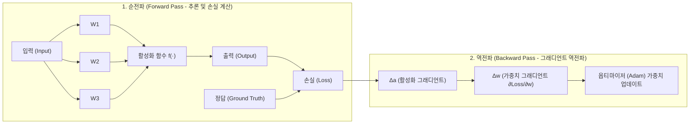
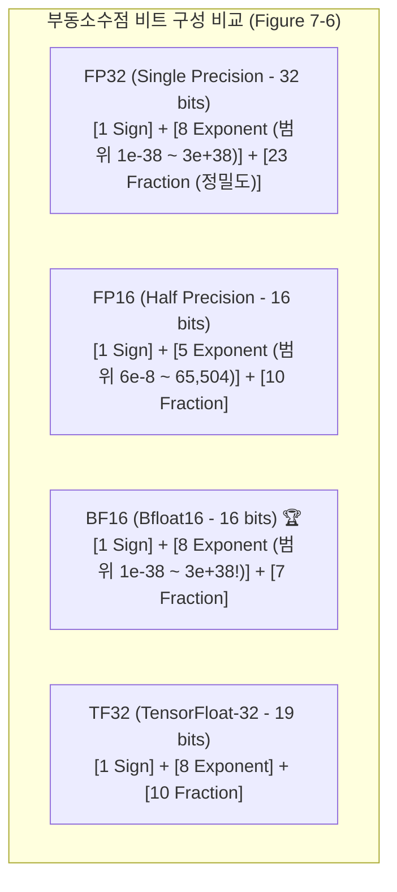

# 02. 학습 메모리 수학과 수치 정밀도 및 양자화 (FP16, BF16, BitNet)

## 📌 핵심 요약 & 전체 맥락
> **"파인튜닝의 성패는 GPU 메모리(VRAM)와의 치열한 수학적 싸움입니다."**  
> 단순히 모델 가중치를 로드하는 추론(Inference)과 달리, 모델을 학습(Training)할 때는 **역전파(Backward Pass) 계산을 위해 가중치 외에도 그래디언트(Gradients), 옵티마이저 상태(Adam Optimizer States), 그리고 배치와 시퀀스 길이에 비례해 폭발하는 활성화 메모리(Activations)**가 필요합니다. 13B 모델을 완전 파인튜닝하려면 가중치 26GB의 수 배에 달하는 200GB 이상의 VRAM이 필요합니다.  
> 본 섹션에서는 **추론 및 학습 메모리 정밀 계산 공식**, 활성화 메모리를 80% 절감하는 **그래디언트 체크포인팅**, 수치 오버플로를 방지하는 **부동소수점 포맷(FP32, FP16, BF16, TF32)의 비트 구조**, 그리고 행렬 곱셈을 덧셈 연산으로 대체하는 **BitNet 1.58비트 삼진 모델**을 완벽하게 정리합니다.

---

## 🗺️ 도표(Figure & Table) 색인 및 매핑 가이드

본문의 핵심 원리를 시각적으로 확인할 수 있는 책 내 도표의 위치와 해설 매핑입니다:

| 도표 번호 | 도표 제목 및 핵심 내용 | 책 페이지 | 본문 해당 주제 |
| :---: | :--- | :---: | :--- |
| **Figure 7-4** | 순전파(Forward) 및 오차 역전파(Backward)를 통한 가중치 그래디언트 업데이트 계산 그래프 | **p. 316-322** | 1. 역전파와 학습 가능 파라미터 |
| **Figure 7-5** | 모델 가중치 메모리를 압도하는 활성화 메모리(Activations) 비중과 그래디언트 체크포인팅 효과 (Korthikanti et al., 2022) | **p. 318-325** | 2. 학습 메모리 수학과 활성화 메모리 |
| **Figure 7-6** | 부호(Sign), 지수부(Range), 가수부(Precision) 비트 할당에 따른 FP32, FP16, BF16, TF32 포맷 비교 | **p. 320-327** | 3. 수치 표현 포맷과 정밀도 |
| **Table 7-3** | FP32 값을 FP16, BF16, TF32로 변환할 때 발생하는 수치 오차 및 FP16 오버플로(`INF`) 실증표 | **p. 321-327** | 3. 포맷별 오버플로/언더플로 오차 |
| **Table 7-4** | 1.58비트 삼진 $\{-1, 0, 1\}$ BitNet b1.58과 Llama 2 16비트 모델의 성능 및 메모리 비교표 | **p. 324** | 4. 극한의 양자화 (BitNet 1.58b) |

---

## 1. 역전파(Backpropagation)와 학습 파라미터 (Figure 7-4)

* **동결 파라미터 (Frozen Parameters):** 가중치를 업데이트하지 않으므로 그래디언트와 옵티마이저 상태 메모리가 일체 필요 없음.
* **학습 파라미터 (Trainable Parameters):** 역전파 시 각 파라미터마다 **그래디언트 1개 + 옵티마이저 상태 2개(Adam)**가 메모리에 유지되어야 함.

---

## 2. 하드웨어 메모리 수학 (Memory Math, pp. 317 ~ 324) ⭐

### ① 추론 메모리 계산 공식 (Inference Memory)
$$\text{Inference Memory} \approx N \times M \times 1.2$$
* $N$: 모델 파라미터 수 (예: 13B)
* $M$: 파라미터당 바이트 수 (16-bit FP16/BF16 = 2 Bytes, 8-bit INT8 = 1 Byte)
* $1.2$: 활성화 텐서 및 어텐션 KV 캐시(Key-Value Cache)를 위한 약 20%의 추가 오버헤드

> **예시 (13B 모델 16비트 추론):**  
> $13\text{B} \times 2\text{ Bytes} \times 1.2 = \mathbf{31.2\text{ GB}}$  
> *(➔ 24GB VRAM을 가진 RTX 3090/4090 1장에는 로드 불가, A100 40GB 이상 필요)*

---

### ② 학습 메모리 계산 공식 (Training Memory)
$$\text{Total Training Memory} = \text{Model Weights} + \text{Activations} + \text{Gradients} + \text{Optimizer States}$$

| 메모리 구성 요소 | 정밀도 / 상태 개수 | 13B 모델 (FP16/BF16 혼합 정밀도) |
| :--- | :--- | :---: |
| **1. 모델 가중치 (Weights)** | 16-bit (2 Bytes/param) | **26 GB** |
| **2. 그래디언트 (Gradients)** | 16-bit (2 Bytes/param) | **26 GB** |
| **3. 옵티마이저 상태 (Adam)** | • 1차 모멘텀 $m_t$ (FP32, 4 Bytes)  • 2차 분산 $v_t$ (FP32, 4 Bytes)  • 마스터 가중치 (FP32, 4 Bytes) | **156 GB**  *(13B $\times$ 12 Bytes)* |
| **고정 정적 메모리 소계** | 가중치 + 그래디언트 + Adam 상태 | **208 GB 🚨** |

---

### ③ 활성화 메모리의 폭발과 그래디언트 체크포인팅 (Figure 7-5)
* **활성화 메모리(Activations)의 역설:**  
  배치 크기와 시퀀스 길이가 길어지면 트랜스포머 레이어마다 역전파를 위해 저장해 두는 중간 텐서(활성화 값)가 **가중치 메모리의 2~3배(100GB 이상)로 폭증**합니다 (Figure 7-5 초록색 막대).
* 💡 **그래디언트 체크포인팅 (Gradient Checkpointing / Activation Recomputation):**  
  순전파 때 중간 활성화 값을 GPU 메모리에 보관하지 않고 버린 뒤, **역전파가 진행될 때 해당 레이어의 순전파를 즉석에서 다시 계산(Recomputation)**합니다.  
  ➔ **활성화 메모리를 70~80% 절감**하여 OOM(Out Of Memory)을 방지하지만, 계산량이 늘어나 학습 속도가 약 20% 느려지는 트레이드오프가 있습니다.

---

## 3. 수치 표현 포맷과 정밀도 오차 (Figure 7-6, Table 7-3)

컴퓨터 부동소수점 포맷: $\text{Value} = (-1)^{\text{Sign}} \times 2^{\text{Exponent} - \text{Bias}} \times (1 + \text{Fraction})$

### ⚠️ 포맷 변환 시 발생하는 치명적 오차 실증 (Table 7-3)

| 원본 FP32 값 | FP16 변환값 | BF16 변환값 | TF32 변환값 | 분석 및 특이사항 |
| :---: | :---: | :---: | :---: | :--- |
| `0.0123456789` | `0.012344360` | `0.0123291` | `0.012344360` | 가수부 절삭으로 인한 미세 정밀도 손실 |
| `1234.56789` | `1235.0` | `1232.0` | `1234.0` | 큰 수치에서의 반올림 오차 |
| **`123456.789`** | **`INF` (오버플로 🚨)** | **`123392.0`** | **`123456.0`** | **FP16의 최대 표현 범위(65,504) 초과로 무한대 발산!** |

* 💡 **왜 현대 LLM 학습은 FP16 대신 BF16을 사용하는가?**  
  FP16은 지수부가 5비트뿐이라 가중치나 그래디언트가 65,504를 넘어가면 즉시 `NaN / INF`로 모델이 붕괴합니다. **BF16은 지수부가 FP32와 동일한 8비트**여서 수치 오버플로가 일체 발생하지 않는 딥러닝 표준 포맷입니다.

---

## 4. 양자화 전략의 두 갈래와 극한의 양자화 (Table 7-4)

양자화(Quantization)는 메모리와 연산량을 줄이기 위해 FP16 같은 고정밀도 가중치를 INT8이나 4비트로 압축하는 기술입니다. 실무에서는 언제 양자화를 수행하느냐에 따라 두 가지 전략으로 나뉩니다:
1. **학습 후 양자화 (Post-Training Quantization, PTQ):**  
   가장 널리 쓰이는 방식으로, 완전히 학습이 끝난 모델의 가중치를 사후에 압축합니다. 구현이 매우 쉽고 코드를 거의 수정할 필요가 없지만, 압축 과정에서 발생하는 오차로 인해 성능이 약간 저하될 수 있습니다. (예: QLoRA의 NF4 양자화)
2. **양자화 인지 학습 (Quantization-Aware Training, QAT):**  
   학습 과정 중에 양자화 오차를 시뮬레이션하여 모델이 오차에 스스로 적응하도록 훈련합니다. 구현이 복잡하고 학습 비용이 증가하지만, 양자화 이후에도 원본 모델과 거의 동일한 최상의 추론 성능을 보장합니다.

### 🚀 극한의 양자화: BitNet 1.58비트 삼진 모델
* **BitNet b1.58 (Microsoft Research, 2024):**  
  모든 가중치 파라미터를 $\{-1, 0, 1\}$ 세 가지 값으로만 제한 ($\log_2(3) \approx 1.58\text{ bits}$).

| 모델 및 정밀도 | 상식 추론 (ARC / HellaSwag 등) | 메모리 소모량 (VRAM) | 에너지 연산 효율 |
| :--- | :---: | :---: | :---: |
| **Llama 2 (3.9B, 16-bit)** | 54.2% | 기준점 (7.8 GB) | 곱셈 연산(FP MAC) 필요 |
| **BitNet b1.58 (3.9B, 1.58-bit)** | **54.8% (동등 이상!)** | **~1.1 GB (약 85% 절감 🚀)** | **순수 정수 덧셈/뺄셈(Addition)만 수행** |

* **엔지니어링 혁신:**  
  부동소수점 행렬 곱셈을 완전히 제거하고 **덧셈과 부호 반전만으로 인퍼런스를 수행**하여, 디바이스의 발열과 전력 소모를 획기적으로 낮춥니다.

---

## 🔗 연관 문서
* [[00-ch07-overview|00. Chapter 7 전체 개요 및 목차]]
* [[01-finetuning-foundations-and-decision-framework|01. 파인튜닝 기초와 엔지니어링 의사결정 프레임워크]]
* [[03-peft-lora-and-qlora|03. 매개변수 효율적 파인튜닝(PEFT)과 LoRA]]
* [[04-model-merging-and-weight-arithmetic|04. 모델 병합과 가중치 산술 연산]]
