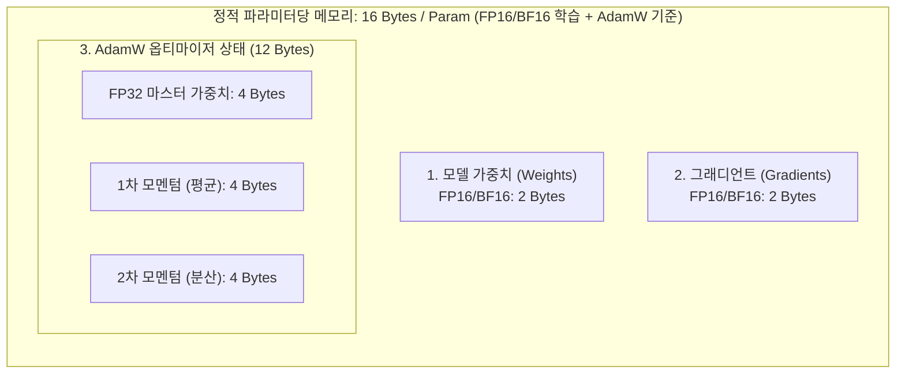

# 02. 학습 메모리 수학과 수치 정밀도 및 양자화 (FP16, BF16, BitNet)

## 📌 핵심 요약 & 전체 맥락
> **"파인튜닝에서 GPU 메모리가 터지는(OOM, Out Of Memory) 진짜 주범은 모델 가중치가 아니라 옵티마이저 상태(Optimizer States)와 순전파 활성화 메모리(Activations)에 있습니다."**  
> 70억 개(7B) 매개변수를 가진 모델을 16비트(2바이트)로 로드하면 추론용 가중치는 단 14GB에 불과하지만, AdamW 옵티마이저를 써서 학습을 시작하는 순간 **가중치(2B) + 그래디언트(2B) + 옵티마이저 상태(12B) = 매개변수당 최소 16바이트**가 필요하여 정적 상태 메모리만 112GB 이상의 GPU VRAM이 요구됩니다.  
> 여기에 배치 크기와 시퀀스 길이에 비례해 기하급수적으로 폭증하는 **활성화 메모리(Activations)**가 더해지면 단일 A100(80GB) GPU로도 7B 모델의 풀 파인튜닝이 불가능해집니다.  
> 본 섹션에서는 역전파(Backpropagation) 계산 그래프에 기반한 **4대 학습 메모리 수학 공식**, 활성화 메모리를 70% 이상 줄이는 **그래디언트 체크포인팅**, 지수부(Exponent)와 가수부(Fraction)로 분석하는 **부동소수점 포맷(FP32, FP16, BF16, FP8)**, 그리고 가중치를 $\{-1, 0, 1\}$ 삼진수로 압축해 곱셈 연산을 없앤 **BitNet b1.58**의 원리를 완벽히 정리합니다.

---

## 🗺️ 도표(Figure & Table) 색인 및 매핑 가이드

본문의 핵심 원리를 시각적으로 확인할 수 있는 책 내 도표의 위치와 해설 매핑입니다:

| 도표 번호 | 도표 제목 및 핵심 내용 | 책 페이지 | 본문 해당 주제 |
| :---: | :--- | :---: | :--- |
| **Figure 7-4** | 순전파(Forward) 시 활성화값을 저장하고 역전파(Backward) 시 체인 룰을 계산하는 그래프 | **p. 316** | 1. 파인튜닝 정적 메모리의 4대 구성 요소 |
| **Figure 7-5** | 배치 크기와 시퀀스 길이가 증가함에 따라 가중치 메모리를 압도하는 활성화 메모리 비중 | **p. 318** | 2. 활성화 메모리(Activations)의 병목 |
| **Figure 7-6** | 부호(Sign), 지수부(Exponent), 가수부(Fraction)로 구성된 FP32, FP16, BF16 비트 구조도 | **p. 320** | 3. 수치 정밀도와 부동소수점 포맷 |
| **Table 7-3** | 동일한 FP32 수치 값을 FP16, BF16, INT8로 변환할 때 발생하는 반올림 오차 비교표 | **p. 321** | 3. 포맷별 오차 및 수치 안정성 |
| **Table 7-4** | BitNet b1.58 삼진 모델과 Llama 2 16비트 모델의 연산 속도, 메모리 절감 및 벤치마크 비교표 | **p. 324** | 4. 초저비트 양자화와 BitNet b1.58 |

---

## 1. 파인튜닝 정적 메모리의 4대 구성 요소와 수학 공식 (pp. 315 ~ 318)

완전 파인튜닝(Full Fine-Tuning) 시 $N$개의 파라미터를 가진 모델을 학습할 때 소모되는 정적 GPU VRAM은 4가지 요소로 구성됩니다:



```
[ 완전 파인튜닝 시 파라미터당 정적 VRAM 소모량 세부 분해 ]

1. 모델 가중치 (Model Weights, 16-bit FP16/BF16) : 2 Bytes / Param
2. 그래디언트 (Gradients, 16-bit FP16/BF16)       : 2 Bytes / Param
3. 옵티마이저 상태 (Optimizer States, AdamW 32-bit):
   - FP32 가중치 마스터 카피 (Master Copy)       : 4 Bytes / Param
   - 1차 모멘텀 (Momentum / Moving Average)      : 4 Bytes / Param
   - 2차 모멘텀 (Variance / Squared Average)     : 4 Bytes / Param
   ──────────────────────────────────────────────────────────
   합계 (Static State Memory)                     : 16 Bytes / Param (최소 요구량)
```

$$\text{Static Memory (Bytes)} = N \times 16\text{ Bytes}$$

### 주요 파운데이션 모델 규모별 정적 학습 메모리 비교

| 모델 크기 ($N$) | 추론 메모리 (FP16 가중치) | 완전 파인튜닝 정적 메모리 ($16 \times N$) | 최소 필요 하드웨어 (Full FT 기준) |
| :--- | :---: | :---: | :--- |
| **1B (10억 개)** | 2 GB | **16 GB** | RTX 4090 (24GB) 1장 |
| **7B (70억 개)** | 14 GB | **112 GB** | A100 (80GB) 최소 2장 |
| **13B (130억 개)** | 26 GB | **208 GB** | A100 (80GB) 최소 4장 |
| **70B (700억 개)** | 140 GB | **1,120 GB (1.12 TB)** | A100/H100 (80GB) 최소 16장 |

> 💡 **왜 옵티마이저에 FP32 마스터 카피가 필요한가?**  
> 16비트 그래디언트는 숫자가 너무 작아 매 업데이트마다 가중치에 직접 더하면 언더플로(Underflow)로 인해 변화량이 0으로 잘려버립니다. 따라서 32비트 고정밀도 마스터 가중치에 누적 업데이트한 뒤 순전파 때만 16비트로 변환하여 사용합니다.

---

## 2. 활성화 메모리(Activations)의 병목과 그래디언트 체크포인팅 (Figure 7-5)

정적 가중치 메모리 외에, 학습 중 가장 치명적인 메모리 폭증의 원인은 **순전파(Forward Pass) 과정에서 다음 레이어로 전달되는 중간 텐서 값(활성화값)**입니다:


### ① 활성화 메모리 비례 공식 (Figure 7-5)
역전파 시 연쇄 법칙(Chain Rule)으로 편미분을 계산하기 위해 모든 레이어의 순전파 출력 텐서를 GPU VRAM에 유지해야 합니다:

$$\text{Activation Memory} \propto B \times S \times L \times H$$

* $B$: 배치 크기 (Batch Size)
* $S$: 시퀀스 / 컨텍스트 길이 (Sequence Length)
* $L$: 트랜스포머 레이어 수 (Number of Layers)
* $H$: 은닉 차원 크기 (Hidden Dimension)

* ⚠️ **컨텍스트 길이 확장의 파괴적 영향:**  
  시퀀스 길이 $S$가 4,096에서 32,768(32K)로 늘어나면 활성화 메모리는 **수십 GB에서 수백 GB 단위로 폭증**하여 가중치 메모리를 압도합니다 (Figure 7-5).

### ② 그래디언트 체크포인팅 (Gradient Checkpointing / Activation Recomputation)
* **작동 원리:** 모든 레이어의 활성화값을 VRAM에 다 저장하지 않고, 중간중간 체크포인트 레이어(예: 4레이어마다 1개)의 출력만 저장합니다. 역전파 시 필요한 활성화값은 체크포인트로부터 순전파를 즉석 재실행하여 복원합니다.
* **트레이드오프:**
  * **연산 시간:** 순전파를 한 번 더 실행하므로 학습 속도가 약 **20 ~ 30% 느려짐**.
  * **메모리 절감:** 활성화 메모리를 **70 ~ 80% 이상 극적으로 절감**하여 더 긴 컨텍스트와 큰 배치를 학습 가능하게 함.

---

## 3. 수치 정밀도와 부동소수점 포맷 (FP vs BF) (Figure 7-6, Table 7-3, pp. 319 ~ 322)

### 💡 용어 정의 및 어원 (FP와 BF의 의미)
* **FP (Floating Point, 부동소수점 / 浮動小數點):**
  * **"소수점(Point)이 고정되어 있지 않고 둥둥 떠다닌다(Floating)"**는 뜻입니다.
  * 소수점 위치가 고정된 고정소수점(Fixed Point, 예: `123.45`)과 달리, 과학적 표기법처럼 **$(-1)^{\text{부호}} \times (1 + \text{가수부}) \times 2^{\text{지수부}}$** 형태로 표현합니다.
  * 매우 작은 소수($10^{-45}$)부터 거대한 수($10^{38}$)까지 넓은 동적 범위(Dynamic Range)를 컴퓨터 비트 안에 효율적으로 담는 표준 방식입니다.
    * **FP32 (Single Precision):** 32비트 단정밀도 부동소수점 (기존 과학 연산 및 딥러닝 마스터 가중치 표준)
    * **FP16 (Half Precision):** 16비트 반정밀도 부동소수점 (메모리를 50% 절감하지만 표현 범위가 좁음)
    * **FP8 (8-bit Float):** 8비트 부동소수점 (최신 H100 등에서 추론 및 가속용)
* **BF (Bfloat16 / Brain Floating Point, 브레인 부동소수점):**
  * **Google Brain(구글 브레인)** 연구팀이 TPU v2/v3를 설계할 때 **딥러닝 학습에 최적화하여 고안한 16비트 부동소수점 포맷**입니다.
  * **탄생 배경:**  
    기존 **FP16은 지수부(Exponent)가 5비트**에 불과해 표현 가능한 최댓값이 약 **65,504**에 그칩니다. 딥러닝 학습 시 가중치와 그래디언트가 조금만 커져도 65,504를 초과해 `Inf`나 `NaN`이 터지는 오버플로(Overflow)가 발생했습니다.
  * **구글 브레인의 혁신:**  
    "딥러닝 신경망은 소수점 아래 정밀도(가수부)는 다소 낮아도 견디지만, 숫자의 크기 범위(지수부)가 좁으면 학습이 붕괴된다"는 점에 착안하여, **FP32의 8비트 지수부를 그대로 유지**하고 가수부만 7비트로 줄였습니다.
* **TF (TensorFloat / TF32, 텐서플로트):**
  * **NVIDIA**가 2020년 Ampere 아키텍처(A100 GPU)를 발표하면서 **텐서 코어(Tensor Core) 하드웨어 가속 전용으로 도입한 19비트 연산 포맷**입니다.
  * **탄생 배경과 목적:**  
    기존 딥러닝 코드(PyTorch 등)는 대부분 FP32로 작성되어 있어, 혼합 정밀도(FP16/BF16)로 변환하려면 코드를 수정하고 스케일링을 맞춰야 하는 번거로움이 있었습니다.
  * **NVIDIA의 해결책 (19비트 하이브리드):**  
    FP32의 넓은 표현 범위(**지수부 8비트**)와 FP16의 적당한 정밀도(**가수부 10비트**)를 결합한 총 **19비트($1+8+10$)** 포맷을 만들었습니다.
  * **특징 (연산 전용 모드):**  
    TF32는 메모리에 저장되는 데이터 타입이 아니라 **GPU 텐서 코어 내부에서 행렬 곱셈을 수행할 때 사용하는 하드웨어 모드**입니다. 사용자가 코드를 수정하지 않고 기존 `FP32` 코드를 그대로 실행해도, GPU가 내부에서 자동으로 TF32로 고속 계산하여 **FP32 대비 최대 5~8배 빠른 텐서 코어 가속**을 제공합니다.

```
[ 주요 부동소수점 비트 포맷 구조 (Figure 7-6) ]

• FP32 (32-bit Floating Point) : [ 부호 1비트 ] [ 지수부 8비트 ] [ 가수부 23비트 ] ➔ 초고정밀도 표준 (범위: 10^38)
• TF32 (19-bit TensorFloat)    : [ 부호 1비트 ] [ 지수부 8비트 ] [ 가수부 10비트 ] ➔ NVIDIA 텐서코어 19비트 자동 가속 (코드 수정 불필요) ⚡
• BF16 (Brain Floating Point)   : [ 부호 1비트 ] [ 지수부 8비트 ] [ 가수부 7비트 ]  ➔ FP32와 동일한 동적 범위(10^38) 확보! 🏆
• FP16 (16-bit Half-Precision)  : [ 부호 1비트 ] [ 지수부 5비트 ] [ 가수부 10비트 ] ➔ 지수부가 작아 오버플로 위험 (최댓값 65,504)
• FP8  (E4M3: Exponent 4, Mantissa 3) : [ 부호 1비트 ] [ 지수부 4비트 ] [ 가수부 3비트 ] ➔ 고정밀 추론용
• FP8  (E5M2: Exponent 5, Mantissa 2) : [ 부호 1비트 ] [ 지수부 5비트 ] [ 가수부 2비트 ] ➔ 그래디언트 학습용 (넓은 범위)
```

| 포맷 | 풀네임 (Full Name) | 총 비트 | 지수부 (Range) | 가수부 (Precision) | 최솟값/최댓값 범위 | 특징 및 실무 적용 |
| :--- | :--- | :---: | :---: | :---: | :---: | :--- |
| **FP32** | **F**loating **P**oint 32 (Single) | 32 bits | 8 bits | 23 bits | $1.4 \times 10^{-45} \sim 3.4 \times 10^{38}$ | 단정밀도 표준, 마스터 가중치 및 손실 계산에 사용 |
| **TF32** | **T**ensor**F**loat-32 (NVIDIA) | **19 bits** | 8 bits | 10 bits | $1.4 \times 10^{-45} \sim 3.4 \times 10^{38}$ | **NVIDIA Ampere/Hopper 텐서코어 가속 모드 ⚡** (FP32 코드 수정 없이 5~8배 가속) |
| **BF16** | **B**rain **F**loating Point 16 | 16 bits | 8 bits | 7 bits | $1.4 \times 10^{-45} \sim 3.4 \times 10^{38}$ | **현대 LLM 사전학습/파인튜닝의 표준 🏆** (Google Brain 개발, 뛰어난 수치적 안정성) |
| **FP16** | **F**loating **P**oint 16 (Half) | 16 bits | 5 bits | 10 bits | $5.9 \times 10^{-8} \sim 65,504$ | 지수부가 작아 그래디언트 폭주 시 `NaN`/발산 빈발, Loss Scaling 필수 |

---

## 4. 초저비트 양자화와 BitNet b1.58 (Table 7-4, pp. 322 ~ 325)

### ① 양자화(Quantization) 메커니즘
고정밀도(FP32/FP16) 가중치를 저비트(INT8, INT4) 정수 공간으로 선형 매핑(Linear Mapping)하여 메모리를 $1/2 \sim 1/4$로 압축합니다:

$$x_q = \text{round}\left(\frac{x}{S}\right) + Z, \quad x \approx S \times (x_q - Z)$$

* $S$ (Scale Factor): 부동소수점 범위를 정수 범위로 비례 축소하는 스케일링 계수.
* $Z$ (Zero Point): 부동소수점의 0을 표현하는 정수 오프셋.

* **사후 양자화 (PTQ, Post-Training Quantization):** 이미 학습 완료된 가중치를 변환 (간편하지만 4비트 이하에서 성능 저하 가능).
* **양자화 인식 훈련 (QAT, Quantization-Aware Training):** 순전파 시 양자화 오차를 시뮬레이션하며 역전파로 가중치를 보정하여 성능 저하 최소화.

### ② LLM 이상치(Outlier) 현상과 LLM.int8()
* LLM의 매개변수가 6.7B를 넘어가면 특정 활성화 차원에서 일반 값보다 100배 이상 큰 **이상치 특성(Outlier Features)**이 체계적으로 발생합니다.
* Dettmers et al. (2022)의 **LLM.int8()**은 이상치 상위 0.1% 채널은 FP16으로 고정밀 연산하고 나머지 99.9%는 INT8로 연산하여 8비트에서도 성능 손실 0%를 달성했습니다.

---

### ③ BitNet b1.58: 1.58비트 삼진 모델 (Microsoft, 2024, Table 7-4) 🚀

BitNet b1.58은 모든 가중치를 부동소수점이 아닌 **$\{-1, 0, 1\}$ 삼진수(Ternary, $\log_2 3 \approx 1.58\text{ bits}$)**로만 표현하는 혁신적인 차세대 아키텍처입니다:

```
[ BitNet b1.58 연산의 혁신 ]

• 기존 신경망 행렬 곱셈 : Y = W (FP16 부동소수점) × X (FP16) ➔ 고비용 부동소수점 곱셈기(Multiplier) 소모
• BitNet b1.58 행렬 곱셈 : Y = W {-1, 0, 1} × X (INT8)       ➔ 단순 정수 덧셈 및 뺄셈(Addition/Subtraction)만 수행!
```

| 벤치마크 및 지표 (Table 7-4) | Llama 2 (7B, 16-bit FP16) | BitNet b1.58 (7B, 1.58-bit) | 비고 |
| :--- | :---: | :---: | :--- |
| **모델 가중치 용량 (Memory)** | 14.0 GB | **2.6 GB (81% 절감!) 🚀** | 모바일/엣지 기기 탑재 가능 |
| **추론 지연시간 (Latency Speedup)** | 1.0x (기준) | **2.71x 가속** | 곱셈 연산 완전 제거 효과 |
| **에너지 소비량 (Energy Efficiency)** | 1.0x (기준) | **82% 절감** | 데이터센터 전력 비용 극적 감소 |
| **Zero-shot 언어 벤치마크 (ARC, GSM8K)** | 55.4 | **55.7 (동등 이상 성능!)** | 1.58비트임에도 성능 손실 없음 |

---

## 5. 엔지니어링 심화 Q&A

### Q1. 파인튜닝 시 FP16 대신 BF16을 사용해야 하는 이유는 무엇인가요?
FP16은 지수부(Exponent)가 5비트에 불과하여 표현 가능한 최댓값이 $65,504$입니다. 학습 중 손실(Loss)이나 그래디언트가 일시적으로 튀면 즉시 오버플로가 발생하여 가중치가 `NaN`으로 파괴됩니다.  
반면 BF16은 지수부가 FP32와 동일한 8비트이므로 최대 $3.4 \times 10^{38}$까지 표현 가능하여, 별도의 복잡한 Loss Scaling 없이도 수치적으로 매우 안정적인 학습을 보장합니다.

### Q2. 80GB GPU 1장으로 70B 모델을 학습할 수 없는 수학적 이유는 무엇인가요?
70B 모델은 파라미터당 16바이트의 정적 상태 메모리($70 \times 10^9 \times 16\text{ Bytes} \approx 1,120\text{ GB}$)가 필요합니다. 80GB GPU 1장은커녕 최소 16장의 80GB GPU를 FSDP나 ZeRO-3로 샤딩해야 정적 상태를 분할 적재할 수 있습니다.

---

## 🔗 연관 문서
* [[00-ch07-overview|00. Chapter 7 전체 개요 및 목차]]
* [[01-finetuning-foundations-and-decision-framework|01. 파인튜닝 기초와 엔지니어링 의사결정 프레임워크]]
* [[03-peft-lora-and-qlora|03. 매개변수 효율적 파인튜닝(PEFT)과 LoRA / QLoRA]]
* [[05-finetuning-tactics-and-hyperparameters|05. 파인튜닝 실무 전술과 하이퍼파라미터 최적화]]
* [[chapter-qa/ch09-inference-optimization-qa/01-inference-fundamentals-and-hardware-math|Ch09-01. 추론 기초, 루프라인 모델 및 하드웨어 수학]]
