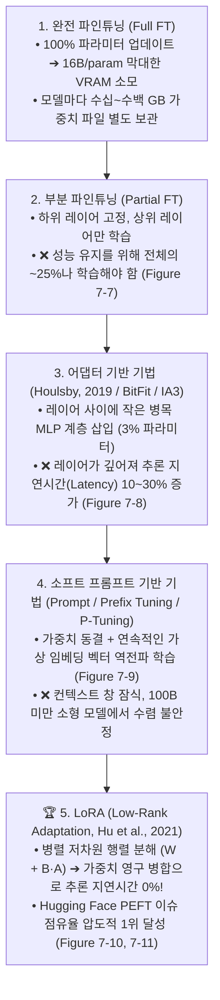
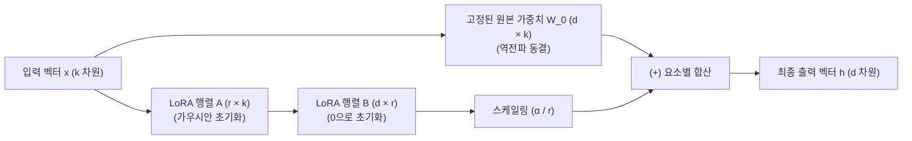
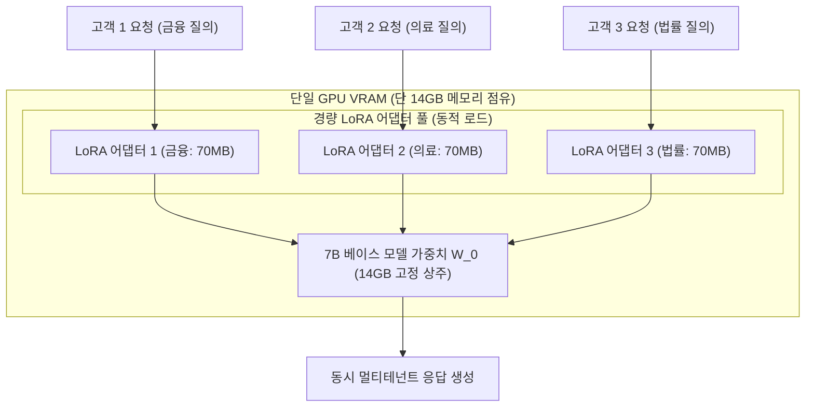
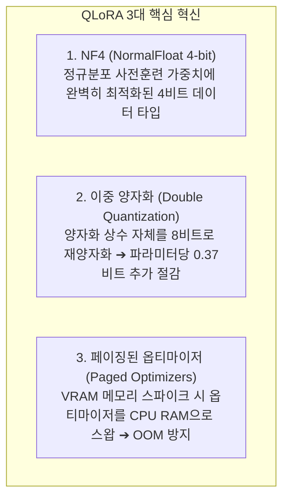

# 03. 매개변수 효율적 파인튜닝(PEFT)과 LoRA / QLoRA 서빙

## 📌 핵심 요약 & 전체 맥락
> **"모든 가중치를 다 고치려고 하지 마세요. 전체 매개변수의 0.1%만 살짝 비틀어도 100% 완전 파인튜닝과 똑같은 성능을 낼 수 있습니다."**  
> 파운데이션 모델의 매개변수가 수백억 개로 커짐에 따라 전체 가중치를 모두 업데이트하는 완전 파인튜닝(Full Fine-Tuning)은 천문학적인 GPU 메모리와 저장 공간을 요구합니다.  
> 이를 극복하기 위해 제안된 **PEFT (Parameter-Efficient Fine-Tuning, 매개변수 효율적 파인튜닝)**의 정점이 바로 **LoRA (Low-Rank Adaptation, 저순위 적응)**입니다. LoRA는 거대 행렬 $W$를 고정(Freeze)하고, 랭크 $r \ll d$인 두 개의 작은 저차원 행렬 곱($B \times A$)만 학습시켜 **학습 파라미터와 메모리를 99% 이상 절감**하며, 배포 시 가중치를 다시 합쳐 **추론 지연시간 오버헤드를 완벽히 0**으로 만듭니다.  
> 나아가 베이스 모델을 4비트 **NF4 (NormalFloat 4-bit)**로 양자화하고 이중 양자화(Double Quantization) 및 페이징된 메모리를 결합한 **QLoRA**를 통해, 단 한 장의 24GB 소비자용 GPU로 65B 거대 모델을 파인튜닝하는 실무 기법을 완벽히 정리합니다.

---

## 🗺️ 도표(Figure & Table) 색인 및 매핑 가이드

본문의 핵심 원리를 시각적으로 확인할 수 있는 책 내 도표의 위치와 해설 매핑입니다:

| 도표 번호 | 도표 제목 및 핵심 내용 | 책 페이지 | 본문 해당 주제 |
| :---: | :--- | :---: | :--- |
| **Figure 7-7** | 학습 파라미터 수에 따른 부분 파인튜닝과 완전 파인튜닝의 성능 격차 곡선 | **p. 325** | 1. PEFT의 등장 배경과 어댑터의 한계 |
| **Figure 7-8** | BERT 트랜스포머 레이어 사이에 삽입되는 Houlsby 어댑터(Adapter) 모듈 구조 | **p. 326** | 1. 초기 어댑터의 직렬 병목 한계 |
| **Figure 7-9** | 하드 프롬프트 앞에 학습 가능한 가상 임베딩 벡터를 덧붙이는 소프트 프롬프트 (Prompt Tuning) | **p. 328** | 1. 프롬프트 튜닝과 프리픽스 튜닝 |
| **Figure 7-10** | PEFT 기법별 Hugging Face 이슈 수 비교 (LoRA가 압도적 1위) | **p. 329** | 2. LoRA의 수학적 원리와 저차원 분해 |
| **Figure 7-11** | 원본 고정 가중치 $W_0$에 저차원 행렬 곱 $B \times A$를 병렬로 더하는 LoRA 아키텍처 다이어그램 | **p. 331** | 2. LoRA의 수학적 원리와 저차원 분해 |
| **Table 7-5** | 18M 학습 파라미터 제약 하에서 LoRA vs 어댑터 vs 완전 파인튜닝 GLUE 성능 비교표 | **p. 333** | 2. LoRA 성능 실증 및 파라미터 가이드 |
| **Figure 7-12** | 단일 베이스 가중치를 공유하고 요청마다 LoRA 어댑터를 전환하는 Multi-LoRA 서빙 구조 | **p. 334** | 3. Multi-LoRA 서빙 아키텍처 |
| **Table 7-6** | 7B 베이스 모델 가중치(14GB) 대비 LoRA 어댑터 가중치(70MB) 메모리 극소 비중 비교표 | **p. 336** | 3. Multi-LoRA 서빙 경제학 |
| **Table 7-7** | QLoRA 기반 Guanaco 65B 모델과 ChatGPT/GPT-4의 Vicuna 벤치마크 Elo 레이팅 비교표 | **p. 338** | 4. QLoRA 4비트 양자화 파인튜닝 |

---

## 1. PEFT의 진화: 부분 파인튜닝 ➔ 어댑터 ➔ 소프트 프롬프트 ➔ LoRA (pp. 324 ~ 329)

파운데이션 모델이 수십억~수천억 파라미터로 거대화되면서 모든 가중치를 업데이트하는 완전 파인튜닝(Full Fine-Tuning)은 막대한 VRAM 메모리($16\text{ Bytes/param}$)와 저장 공간을 요구하게 되었습니다. 이를 극복하기 위해 제안된 **PEFT(Parameter-Efficient Fine-Tuning, 매개변수 효율적 파인튜닝)**의 발전 흐름은 다음과 같습니다:



---

### ① 부분 파인튜닝(Partial Fine-Tuning)과 파라미터 비효율성 (Figure 7-7)
* **아이디어:** 신경망의 초기 레이어는 일반적인 언어 특징을 학습하고 출력에 가까운 상위 레이어는 태스크 특화 특징을 학습하므로, 하위 레이어를 고정(Freeze)하고 상위 1개 레이어만 학습.
* **치명적 한계 (Figure 7-7):**  
  Houlsby et al. (2019)의 BERT-Large GLUE 벤치마크 실험 결과, 부분 파인튜닝으로 완전 파인튜닝과 대등한 성능을 얻으려면 **전체 파라미터의 무려 25% 이상을 학습(Figure 7-7의 파란색 곡선)**시켜야 했습니다. 즉, 파라미터 절감 효율이 매우 떨어집니다.

---

### ② 어댑터 기반 기법 (Adapter-Based / Additive Methods, Figure 7-8)
* **Houlsby 직렬 어댑터 (Houlsby et al., 2019):**  
  트랜스포머의 어텐션 블록과 피드포워드(FFN) 블록 뒤에 작은 병목 구조의 다운/업프로젝션 MLP 모듈(어댑터)을 직렬로 삽입.
  * **성과:** 원본 가중치를 고정하고 어댑터 가중치(전체의 3%)만 학습시켜, **완전 파인튜닝 대비 0.4% 이내의 대등한 성능(Figure 7-7의 주황색 곡선)**을 달성.
  * **❌ 치명적 한계 (추론 지연시간 오버헤드):** 순전파 연산 경로에 새로운 레이어들이 물리적으로 추가되므로, **추론 지연시간(Inference Latency)이 10~30% 증가**하여 프로덕션 배포에 큰 부담이 됨.
* **주요 어댑터 변형 기법들:**
  * **BitFit (Zaken et al., 2021):** 가중치 행렬은 모두 고정하고 오직 편향(Bias) 벡터만 파인튜닝 (파라미터 0.1% 미만).
  * **IA3 (Liu et al., 2022):** 어텐션 및 FFN 내부 활성화 벡터에 학습 가능한 벡터를 요소별로 곱해 억제/증폭(Inhibiting/Amplifying). 멀티태스크 배치 서빙에 강점.
  * **LongLoRA (Chen et al., 2023):** 어텐션 패턴을 변형하여 초장문 컨텍스트 윈도우 확장에 특화된 LoRA 변형.

---

### ③ 소프트 프롬프트 기반 기법 (Soft Prompt-Based Tuning, Figure 7-9)
프롬프트 엔지니어링과 파인튜닝의 교차점으로, 모델의 모든 가중치를 완전히 고정한 채 **특수한 학습 가능 가상 토큰(Soft Prompts)**을 입력 문맥에 주입하여 역전파로 최적화합니다.

```
[ 하드 프롬프트 vs 소프트 프롬프트 비교 ]

• 하드 프롬프트 (Hard Prompts) : "다음 문장을 요약하라"처럼 사람이 읽을 수 있는 불연속적(Discrete) 단어 토큰. 정적이며 역전파로 수정 불가.
• 소프트 프롬프트 (Soft Prompts) : 사람이 읽을 수 없는 연속적인(Continuous) 고차원 임베딩 벡터. 역전파를 통해 특정 태스크에 맞게 미세 조정됨.
```

#### 소프트 프롬프트 3대 주요 기법 비교
1. **프롬프트 튜닝 (Prompt Tuning, Lester et al., 2021):**  
   입력 임베딩 레이어의 맨 앞에만 20~100개의 가상 소프트 토큰 벡터를 덧붙임 (가장 단순함).
2. **프리픽스 튜닝 (Prefix Tuning, Li & Liang, 2021):**  
   입력 레이어뿐만 아니라 **트랜스포머의 모든 레이어(Every Layer)**의 Key/Value 텐서 앞에 학습 가능한 프리픽스 벡터를 덧붙여 더 강력한 제어력 확보.
3. **P-Tuning (Liu et al., 2021):**  
   가상 프롬프트 임베딩 간의 상호작용을 위해 소형 프롬프트 인코더(LSTM / MLP)를 사용하여 소프트 프롬프트를 생성.
* ❌ **소프트 프롬프트의 한계:** 가상 토큰이 컨텍스트 창의 소중한 길이를 갉아먹으며, 100B 이상의 초대형 모델에서만 완전 파인튜닝에 근접하고 7B/13B 소형 모델에서는 성능 수렴이 불안정함.

---

### ④ PEFT 기법별 실제 인기 분포 (Figure 7-10)
저자(Chip Huyen)가 2024년 10월 Hugging Face 공식 `huggingface/peft` 레포지토리의 1,000개 이상 GitHub 이슈를 전수 분석한 결과:
* **LoRA가 압도적인 1위(전체의 70% 이상 점유)**를 차지하며 사실상 글로벌 표준으로 군림.
* 소프트 프롬프트(P-Tuning, Prefix Tuning, Prompt Tuning) 및 IA3가 그 뒤를 잇고 있음.

---

### ⑤ 💡 LoRA는 왜 가능한가? 낮은 고유 차원(Low Intrinsic Dimension) 이론 (p. 340)
* **근본적인 질문:** *"사전 학습에 수천억 개의 파라미터와 수조 개의 토큰이 필요했다면, 왜 파인튜닝은 고작 0.01%의 파라미터와 수천 개의 데이터만으로 가능한가?"*
* **고유 차원 이론 (Aghajanyan et al., 2020; Li et al., 2018):**  
  거대 언어 모델은 겉보기에 수백억 개의 파라미터를 가지고 있지만, **사전 학습(Pre-training) 과정을 거치면서 실제 작업 공간의 '고유 차원(Intrinsic Dimension)'이 극도로 압축**됩니다.
* 놀랍게도 **모델의 파라미터 크기가 클수록 사전 학습 후의 고유 차원은 오히려 더 낮아집니다.**  
  따라서 사전 학습이 잘된 모델일수록 랭크 $r=2 \sim 8$ 수준의 극소수 파라미터만으로도 새로운 태스크의 지시 정렬을 완벽하게 수행할 수 있습니다.
* **사전 학습에도 LoRA를 쓰지 않는 이유 (ReLoRA, GaLore):**  
  초기 사전 학습은 고유 차원을 압축하는 과정 자체이므로 풀 랭크(Full-Rank) 학습이 반드시 선행되어야 하며, 고유 차원이 충분히 압축된 이후에야 비로소 저차원 분해(LoRA)가 작동할 수 있습니다.

---

## 2. LoRA의 수학적 원리와 저차원 분해 (Figure 7-11, pp. 329 ~ 334)

트랜스포머의 사전 훈련된 가중치 행렬 $W_0 \in \mathbb{R}^{d \times k}$가 있을 때, 특정 도메인 파인튜닝에 의한 가중치 변화량 $\Delta W$는 **본질적으로 낮은 고유 랭크(Intrinsic Rank $r \ll \min(d, k)$)를 갖는다**는 가설에 기반합니다:

```
[ LoRA (Low-Rank Adaptation) 순전파 연산 구조 ]

출력 h = W_0 · x + ΔW · x
       = W_0 · x + (α / r) · (B · A) · x

• W_0 : 고정된(Frozen) 사전학습 가중치 (d × k 차원, 역전파 미적용)
• A   : 저차원 다운프로젝션 행렬 (r × k 차원, N(0, σ²) 가우시안 초기화)
• B   : 저차원 업프로젝션 행렬   (d × r 차원, 0으로 초기화 ➔ 초기 ΔW = 0)
• r   : LoRA 랭크 (보통 r = 8, 16, 32, 64 등 아주 작은 값)
• α   : 스케일링 하이퍼파라미터 (보통 α = 2r 로 설정)
```



### ① LoRA 초기화 및 스케일링 계수 ($\alpha / r$)의 중요성
* **초기화 트릭 ($B = 0$):** $B$를 0으로 초기화함으로써 학습 시작 시점($t=0$)에 $\Delta W = B \times A = 0$이 되어, 모델의 초기 출력이 사전 훈련된 원본 모델의 출력과 100% 동일하게 시작합니다.
* **스케일링 ($\frac{\alpha}{r}$):** 랭크 $r$을 8에서 16이나 32로 변경할 때마다 학습률(Learning Rate)을 다시 튜닝할 필요가 없도록 고안된 상수 스케일링 계수입니다 (일반적으로 $\alpha = 2r$ 또는 $\alpha = r$로 설정).

### ② 실무 LoRA 하이퍼파라미터 가이드
1. **랭크 $r$의 선택:**
   * 단순 포맷 변경/분류: $r = 8$
   * 복잡한 논리 추론/코딩: $r = 16 \sim 64$
2. **타겟 모듈 (Target Modules) 선정:**
   * **과거 방식:** 어텐션 투영 행렬($W_q, W_v$)에만 적용.
   * **현대 표준 (All Linear) 🏆:** 모든 선형 레이어($W_q, W_k, W_v, W_o$ 및 MLP의 $\text{gate\_proj}, \text{up\_proj}, \text{down\_proj}$) 전체에 적용 시 훨씬 높은 표현력과 성능을 달성합니다.

### ③ 추론 지연시간 0%의 비밀: 가중치 영구 병합 (Merge)
학습이 완료된 후 실무 서빙 시에는 저차원 행렬 곱을 별도로 연산할 필요 없이, 원본 가중치에 직접 더해 단일 행렬로 병합할 수 있습니다:

$$W_{\text{Final}} = W_0 + \frac{\alpha}{r} (B \times A)$$

병합된 가중치 $W_{\text{Final}}$은 원본 모델과 완벽히 동일한 구조이므로 **추론 오버헤드와 지연시간이 0%**입니다.

---

## 3. Multi-LoRA 서빙 아키텍처 (Figure 7-12, Table 7-6, pp. 334 ~ 337) ⭐

실무에서 고객사마다 다른 파인튜닝 모델 100개를 서빙할 때, 14GB짜리 7B 모델 100개를 독립 인스턴스로 띄우면 1.4TB의 GPU 메모리가 필요하여 엄청난 인프라 비용이 발생합니다.  
**Multi-LoRA 서빙**은 이를 극적으로 해결합니다:



* **메모리 절감 경제학 (Table 7-6):**
  * 7B 모델 가중치 = 14 GB (100% 비중)
  * $r=8$ LoRA 어댑터 가중치 = **단 70 MB (전체의 0.5% 미만!)**
* **핫 스와핑 (Hot-swapping & S-LoRA):**
  14GB 베이스 모델은 GPU VRAM에 딱 1개만 상주시키고, 사용자 요청 헤더에 따라 **70MB짜리 경량 LoRA 가중치만 RAM에서 GPU로 수 밀리초 만에 동적 스왑(S-LoRA, Punica, vLLM)**하여 단 1장의 GPU로 수백 개의 맞춤형 특화 서비스를 동시 서빙합니다.

---

## 4. QLoRA: 4비트 양자화 파인튜닝의 기적 (Dettmers et al., 2023, Table 7-7, pp. 337 ~ 342)

QLoRA는 3대 혁신을 통해 **단 1장의 24GB 소비자용 GPU(RTX 3090/4090)로 65B 거대 모델을 파인튜닝**할 수 있게 만든 혁명적 기술입니다:



### ① 1. NF4 (NormalFloat 4-bit)
* 신경망의 사전 훈련 가중치는 평균이 0이고 표준편차가 $\sigma$인 정규분포를 따릅니다.
* 일반 4비트 정수(INT4)는 균등 간격(Uniform)으로 숫자를 쪼개어 정규분포의 꼬리 부분에서 극심한 정보 손실이 발생합니다.
* NF4는 정규분포의 면적을 정확히 16개의 동일한 확률 구간(Quantiles)으로 나누어 **정보 이론적으로 양자화 손실을 0에 가깝게 최소화한 특수 부동소수점 포맷**입니다.

### ② 2. 이중 양자화 (Double Quantization, DQ)
* 가중치를 블록 단위(예: 64개 단위)로 양자화할 때마다 FP32 스케일 팩터(양자화 상수)가 생겨 파라미터당 0.5비트의 오버헤드가 발생합니다.
* 이중 양자화는 이 32비트 스케일 팩터 자체를 8비트로 한 번 더 양자화하여, **파라미터당 0.37비트(65B 모델 기준 약 3GB VRAM)를 추가 절감**합니다.

### ③ 3. 페이징된 옵티마이저 (Paged Optimizers)
* 학습 도중 긴 시퀀스가 들어와 활성화 메모리 스파이크가 칠 때, CUDA 통합 메모리(Unified Memory)를 활용하여 **비활성 AdamW 옵티마이저 상태를 GPU VRAM에서 CPU RAM으로 일시 페이징 아웃(Swap)**시켰다가 필요할 때 다시 불러와 OOM 크래시를 원천 차단합니다.

| 벤치마크 및 Elo 레이팅 (Table 7-7) | 모델 크기 및 양자화 | Vicuna 벤치마크 점수 | 상대 성능 비교 |
| :--- | :---: | :---: | :--- |
| **ChatGPT (GPT-3.5-Turbo)** | 175B+ | 100.0% | 기준 (100%) |
| **Guanaco (QLoRA 파인튜닝)** | **65B (4-bit NF4)** | **99.3%** | **ChatGPT의 99.3% 성능 달성! 🚀** |
| **Guanaco (QLoRA 파인튜닝)** | 33B (4-bit NF4) | 97.8% | 단 1장의 GPU로 학습 |
| **Vicuna-13B (Full FT)** | 13B (16-bit FP16) | 92.1% | 완전 파인튜닝 능가 |

---

## 5. 엔지니어링 심화 Q&A

### Q1. LoRA의 Rank $r$과 Alpha $\alpha$는 어떻게 설정해야 하나요?
실무 표준은 **$\alpha = 2r$** (예: $r=16, \alpha=32$)입니다.  
Alpha는 어댑터 출력의 가중 스케일링 계수이므로, 만약 학습 데이터가 매우 적고 특화된 도메인이라면 $\alpha$를 $r$보다 크게 설정하여 어댑터의 영향력을 강화할 수 있습니다.

### Q2. QLoRA로 학습한 4비트 모델을 다시 FP16으로 병합(Merge)하여 배포할 수 있나요?
**가능합니다.** QLoRA로 학습된 가중치는 4비트 베이스 가중치 $W_{\text{Base}}$와 16비트 LoRA 어댑터 가중치($B \times A$)로 구성되어 있습니다. 배포 시 4비트 가중치를 FP16/BF16으로 역양자화(Dequantize)한 뒤 LoRA 어댑터와 합산($W_0 + \frac{\alpha}{r}BA$)하면 고속 FP16 모델로 서빙할 수 있습니다.

---

## 🔗 연관 문서
* [[00-ch07-overview|00. Chapter 7 전체 개요 및 목차]]
* [[01-finetuning-foundations-and-decision-framework|01. 파인튜닝 기초와 엔지니어링 의사결정 프레임워크]]
* [[02-memory-math-and-quantization|02. 학습 메모리 수학과 수치 정밀도 및 양자화]]
* [[04-model-merging-and-weight-arithmetic|04. 모델 병합(Model Merging)과 가중치 산술 연산]]
* [[05-finetuning-tactics-and-hyperparameters|05. 파인튜닝 실무 전술과 하이퍼파라미터 최적화]]
* [[chapter-qa/ch09-inference-optimization-qa/01-inference-fundamentals-and-hardware-math|Ch09-01. 추론 기초, 루프라인 모델 및 하드웨어 수학]]
