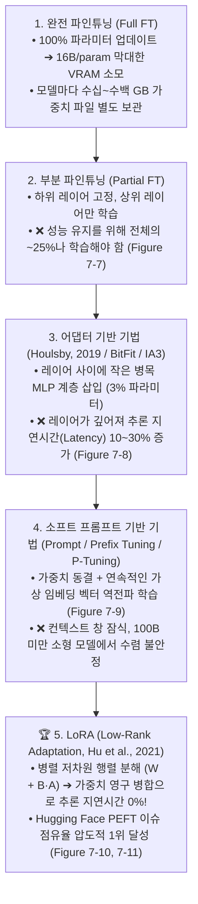
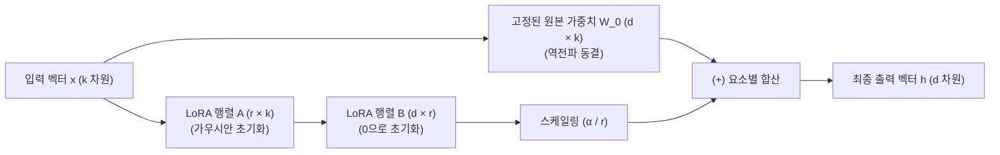
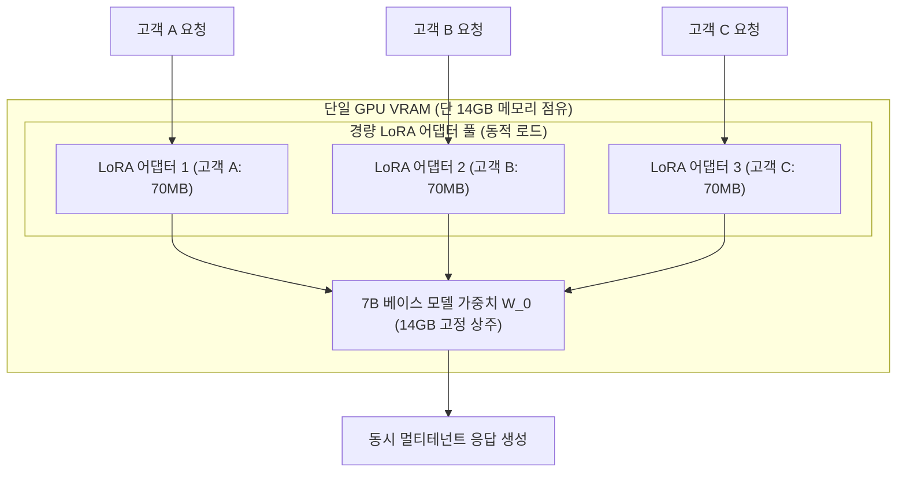
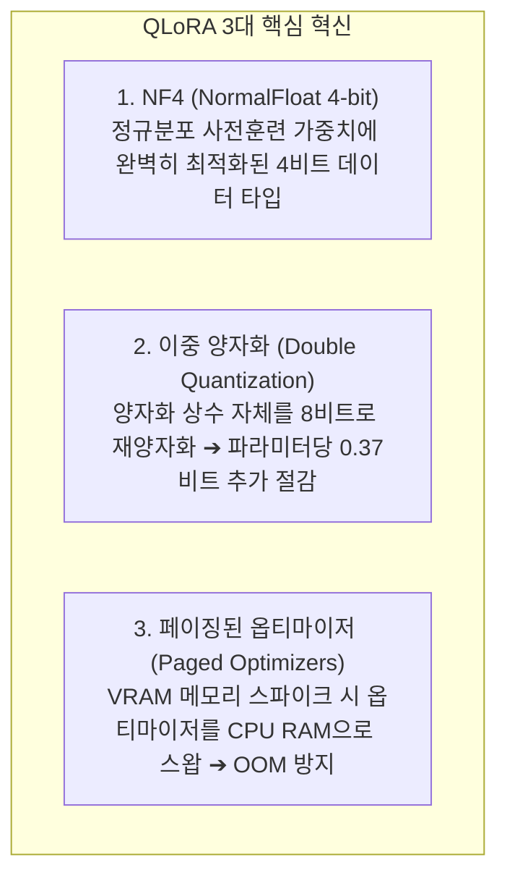

# 03. 매개변수 효율적 파인튜닝(PEFT)과 LoRA / QLoRA 서빙

## 📌 핵심 요약 & 전체 맥락
> **"모든 가중치를 다 고치려고 하지 마세요. 전체 매개변수의 0.1%만 살짝 비틀어도 100% 완전 파인튜닝과 똑같은 성능을 낼 수 있습니다."**  
> 파운데이션 모델의 매개변수가 수백억 개로 커짐에 따라 전체 가중치를 모두 업데이트하는 완전 파인튜닝(Full Fine-Tuning)은 천문학적인 GPU 메모리와 저장 공간을 요구합니다.  
> 이를 극복하기 위해 제안된 **PEFT (Parameter-Efficient Fine-Tuning, 매개변수 효율적 파인튜닝)**의 정점이 바로 **LoRA (Low-Rank Adaptation, 저순위 적응)**입니다. LoRA는 거대 행렬 $W$를 고정(Freeze)하고, 랭크 $r \ll d$인 두 개의 작은 저차원 행렬 곱($B \times A$)만 학습시켜 **학습 파라미터와 메모리를 99% 이상 절감**하며, 배포 시 가중치를 다시 합쳐 **추론 지연시간 오버헤드를 완벽히 0**으로 만듭니다.  
> 나아가 베이스 모델을 4비트 **NF4 (NormalFloat 4-bit)**로 양자화하고 이중 양자화(Double Quantization) 및 페이징된 메모리를 결합한 **QLoRA**를 통해, 단 한 장의 24GB 소비자용 GPU로 65B 거대 모델을 파인튜닝하는 실무 기법을 완벽히 정리합니다.

---

## 🗺️ 도표(Figure & Table) 색인 및 매핑 가이드

본문의 핵심 원리를 시각적으로 확인할 수 있는 책 내 도표의 위치와 해설 매핑입니다:

| 도표 번호 | 도표 제목 및 핵심 내용 | 책 페이지 | 본문 해당 주제 |
| :---: | :--- | :---: | :--- |
| **Figure 7-7** | 학습 파라미터 수에 따른 부분 파인튜닝과 완전 파인튜닝의 성능 격차 곡선 | **p. 325** | 1. PEFT의 등장 배경과 어댑터의 한계 |
| **Figure 7-8** | BERT 트랜스포머 레이어 사이에 삽입되는 Houlsby 어댑터(Adapter) 모듈 구조 | **p. 326** | 1. 초기 어댑터의 직렬 병목 한계 |
| **Figure 7-9** | 하드 프롬프트 앞에 학습 가능한 가상 임베딩 벡터를 덧붙이는 소프트 프롬프트 (Prompt Tuning) | **p. 328** | 1. 프롬프트 튜닝과 프리픽스 튜닝 |
| **Figure 7-10** | PEFT 기법별 Hugging Face 이슈 수 비교 (LoRA가 압도적 1위) | **p. 329** | 2. LoRA의 수학적 원리와 저차원 분해 |
| **Figure 7-11** | 원본 고정 가중치 $W_0$에 저차원 행렬 곱 $B \times A$를 병렬로 더하는 LoRA 아키텍처 다이어그램 | **p. 331** | 2. LoRA의 수학적 원리와 저차원 분해 |
| **Table 7-5** | 18M 학습 파라미터 제약 하에서 LoRA vs 어댑터 vs 완전 파인튜닝 GLUE 성능 비교표 | **p. 333** | 2. LoRA 성능 실증 및 파라미터 가이드 |
| **Figure 7-12** | 단일 베이스 가중치를 공유하고 요청마다 LoRA 어댑터를 전환하는 Multi-LoRA 서빙 구조 | **p. 334** | 3. Multi-LoRA 서빙 아키텍처 |
| **Table 7-6** | 7B 베이스 모델 가중치(14GB) 대비 LoRA 어댑터 가중치(70MB) 메모리 극소 비중 비교표 | **p. 336** | 3. Multi-LoRA 서빙 경제학 |
| **Table 7-7** | QLoRA 기반 Guanaco 65B 모델과 ChatGPT/GPT-4의 Vicuna 벤치마크 Elo 레이팅 비교표 | **p. 338** | 4. QLoRA 4비트 양자화 파인튜닝 |

---

## 1. PEFT의 진화: 부분 파인튜닝 ➔ 어댑터 ➔ 소프트 프롬프트 ➔ LoRA (pp. 324 ~ 329)

파운데이션 모델이 수십억~수천억 파라미터로 거대화되면서 모든 가중치를 업데이트하는 완전 파인튜닝(Full Fine-Tuning)은 막대한 VRAM 메모리($16\text{ Bytes/param}$)와 저장 공간을 요구하게 되었습니다. 이를 극복하기 위해 제안된 **PEFT(Parameter-Efficient Fine-Tuning, 매개변수 효율적 파인튜닝)**의 발전 흐름은 다음과 같습니다:



---

### ① 부분 파인튜닝(Partial Fine-Tuning)과 파라미터 비효율성 (Figure 7-7)
* **아이디어:** 신경망의 초기 레이어는 일반적인 언어 특징을 학습하고 출력에 가까운 상위 레이어는 태스크 특화 특징을 학습하므로, 하위 레이어를 고정(Freeze)하고 상위 1개 레이어만 학습.
* **치명적 한계 (Figure 7-7):**  
  Houlsby et al. (2019)의 BERT-Large GLUE 벤치마크 실험 결과, 부분 파인튜닝으로 완전 파인튜닝과 대등한 성능을 얻으려면 **전체 파라미터의 무려 25% 이상을 학습(Figure 7-7의 파란색 곡선)**시켜야 했습니다. 즉, 파라미터 절감 효율이 매우 떨어집니다.

---

### ② 어댑터 기반 기법 (Adapter-Based / Additive Methods, Figure 7-8)
* **Houlsby 직렬 어댑터 (Houlsby et al., 2019):**  
  트랜스포머의 어텐션 블록과 피드포워드(FFN) 블록 뒤에 작은 병목 구조의 다운/업프로젝션 MLP 모듈(어댑터)을 직렬로 삽입.
  * **성과:** 원본 가중치를 고정하고 어댑터 가중치(전체의 3%)만 학습시켜, **완전 파인튜닝 대비 0.4% 이내의 대등한 성능(Figure 7-7의 주황색 곡선)**을 달성.
  * **❌ 치명적 한계 (추론 지연시간 오버헤드):** 순전파 연산 경로에 새로운 레이어들이 물리적으로 추가되므로, **추론 지연시간(Inference Latency)이 10~30% 증가**하여 프로덕션 배포에 큰 부담이 됨.
* **주요 어댑터 변형 기법들:**
  * **BitFit (Zaken et al., 2021):** 가중치 행렬은 모두 고정하고 오직 편향(Bias) 벡터만 파인튜닝 (파라미터 0.1% 미만).
  * **IA3 (Liu et al., 2022):** 어텐션 및 FFN 내부 활성화 벡터에 학습 가능한 벡터를 요소별로 곱해 억제/증폭(Inhibiting/Amplifying). 멀티태스크 배치 서빙에 강점.
  * **LongLoRA (Chen et al., 2023):** 어텐션 패턴을 변형하여 초장문 컨텍스트 윈도우 확장에 특화된 LoRA 변형.

---

### ③ 소프트 프롬프트 기반 기법 (Soft Prompt-Based Tuning, Figure 7-9)
프롬프트 엔지니어링과 파인튜닝의 교차점으로, 모델의 모든 가중치를 완전히 고정한 채 **특수한 학습 가능 가상 토큰(Soft Prompts)**을 입력 문맥에 주입하여 역전파로 최적화합니다.

```
[ 하드 프롬프트 vs 소프트 프롬프트 비교 ]

• 하드 프롬프트 (Hard Prompts) : "다음 문장을 요약하라"처럼 사람이 읽을 수 있는 불연속적(Discrete) 단어 토큰. 정적이며 역전파로 수정 불가.
• 소프트 프롬프트 (Soft Prompts) : 사람이 읽을 수 없는 연속적인(Continuous) 고차원 임베딩 벡터. 역전파를 통해 특정 태스크에 맞게 미세 조정됨.
```

#### 소프트 프롬프트 3대 주요 기법 비교
1. **프롬프트 튜닝 (Prompt Tuning, Lester et al., 2021):**  
   입력 임베딩 레이어의 맨 앞에만 20~100개의 가상 소프트 토큰 벡터를 덧붙임 (가장 단순함).
2. **프리픽스 튜닝 (Prefix Tuning, Li & Liang, 2021):**  
   입력 레이어뿐만 아니라 **트랜스포머의 모든 레이어(Every Layer)**의 Key/Value 텐서 앞에 학습 가능한 프리픽스 벡터를 덧붙여 더 강력한 제어력 확보.
3. **P-Tuning (Liu et al., 2021):**  
   가상 프롬프트 임베딩 간의 상호작용을 위해 소형 프롬프트 인코더(LSTM / MLP)를 사용하여 소프트 프롬프트를 생성.
* ❌ **소프트 프롬프트의 한계:** 가상 토큰이 컨텍스트 창의 소중한 길이를 갉아먹으며, 100B 이상의 초대형 모델에서만 완전 파인튜닝에 근접하고 7B/13B 소형 모델에서는 성능 수렴이 불안정함.

---

### ④ PEFT 기법별 실제 인기 분포 (Figure 7-10)
저자(Chip Huyen)가 2024년 10월 Hugging Face 공식 `huggingface/peft` 레포지토리의 1,000개 이상 GitHub 이슈를 전수 분석한 결과:
* **LoRA가 압도적인 1위(전체의 70% 이상 점유)**를 차지하며 사실상 글로벌 표준으로 군림.
* 소프트 프롬프트(P-Tuning, Prefix Tuning, Prompt Tuning) 및 IA3가 그 뒤를 잇고 있음.

---

### ⑤ 💡 LoRA는 왜 가능한가? 낮은 고유 차원(Low Intrinsic Dimension) 이론 (p. 340) ⭐

* **근본적인 질문:** *"사전 학습에 수천억 개의 파라미터와 수조 개의 토큰이 필요했다면, 왜 파인튜닝은 고작 0.01%의 파라미터(LoRA)와 수천 개의 데이터만으로 가능한가?"*

---

#### 1. 💡 직관적 일상 비유: '백지 신입' vs '20년 차 베테랑'
* **사전 학습 전 (Random Initialization / 백지 신입사원):**
  * 언어도 모르고 세상 물정도 모르는 백지상태이므로, "영문 계약서 요약" 업무를 가르치려면 영어 단어, 문법, 법률 기초까지 **뇌의 모든 영역(수백억 개의 파라미터 축)을 하나하나 다 뜯어고쳐야** 겨우 배웁니다 ($d_{\text{intrinsic}} \approx D$).
* **사전 학습 완료 후 (Pre-trained LLM / 20년 차 베테랑 전문가):**
  * 수조 개의 문서를 읽어 이미 언어, 상식, 문법, 법률 개념을 99.9% 완벽히 통달한 최고급 전문가입니다.
  * 새로운 고객사 양식을 가르칠 때는 *"이번 보고서는 결론을 상단에 3줄 불릿포인트로 써줘"*라고 **단 한 마디의 지침(미세한 방향 전환 축 몇 개)**만 주면 완벽하게 수행합니다 ($d_{\text{intrinsic}} \ll D$).

---

#### 2. 📐 기하학적 정의: 외재적 차원 ($D$) vs 고유 차원 ($d$)
* **외재적 차원 (Extrinsic / Ambient Dimension, $D$):** 모델 가중치 행렬이 차지하는 겉보기 공간 크기 (예: LLaMA-70B라면 $D = 70,000,000,000$차원의 거대한 공간).
* **고유 차원 (Intrinsic Dimension, $d \ll D$):** 데이터를 실질적으로 설명하거나 특정 태스크(요약, 분류, SQL 변환 등)를 성공적으로 완수하는 데 필요한 **'최소한의 유효 자유도(Degrees of Freedom)'**.

```
[ 3차원 공간 속 2차원 종이와 고유 차원의 기하학적 비유 ]

• 외재적 차원 (D) = 3차원 (x, y, z 공간) ➔ 모델의 겉보기 파라미터 수 (수백억 개)
• 고유 차원 (d) = 2차원 (가로, 세로 축)  ➔ 작업을 푸는 데 필요한 진짜 자유도 (수만 개)

               z
               ▲
               │      ┌──────────────────────┐  <-- 3차원 공간에 떠 있는 
               │     ╱                      ╱       얇은 2차원 종이 (Manifold)
               │    ╱   개미는 x,y로만 이동  ╱       
               │   ┌──────────────────────┐╱        종이 위의 개미에게 필요한 
               └───┼──────────────────────► y       진짜 자유도는 단 2개!
                  ╱
                 ▼ x
```

---

#### 3. 🔬 사전 학습(Pre-training)이 고유 차원을 압축하는 원리
1. **사전 학습 진행 (압축기 / 다양체 정렬):**  
   수조 개의 텍스트를 학습하면서 트랜스포머는 언어의 문법, 의미적 상관관계, 추론 패턴을 거대한 고차원 공간 속에서 **'매끄러운 저차원 다양체(Low-Dimensional Manifold)'**로 고도로 정렬 및 압축합니다.
2. **LoRA 파인튜닝의 본질:**  
   이미 지식 지도(Manifold)가 구축되어 있으므로, 새로운 도메인 작업에 적응할 때는 **"매니폴드 위에서 방향 키를 살짝 꺾어주는 저차원 행렬 곱($B \times A$, 랭크 $r=2 \sim 8$)"**만 학습해도 100% 완전 파인튜닝과 똑같은 성능을 낼 수 있습니다.

---

#### 4. 📊 Aghajanyan et al. (2020)의 핵심 실증: 규모의 역설 (Scaling Paradox)
Facebook AI Research(Meta) 연구진이 RoBERTa, GPT 등을 무작위 부분 공간에 투영하여 완전 파인튜닝 성능의 90%를 달성하는 최소 고유 차원을 측정한 결과:

```
[ 모델 크기(D)가 커질수록 고유 차원(d)은 오히려 줄어든다! ]

   모델 체급 (파라미터 수 D)       파인튜닝에 필요한 고유 차원 (d)
   ─────────────────────────────────────────────────────────────
   작은 모델 (BERT-Base, 110M)   ➔    d ≈ 수만 차원
   중간 모델 (RoBERTa, 355M)     ➔    d ≈ 수천 차원
   거대 모델 (LLaMA / GPT-3, 175B)➔   d ≈ 수백~수천 차원 (극소수!) 📉
```

> 💡 **핵심 통찰 (규모의 역설):** 모델이 커질수록 사전 학습을 통해 내부 표현이 더 완벽하게 압축되기 때문에, **파라미터가 큰 모델일수록 LoRA 파인튜닝 시 더 작은 랭크($r=2 \sim 4$)만으로도 완전 파인튜닝과 100% 대등한 성능을 달성합니다.**

---

#### 5. ⚠️ 사전 학습에도 LoRA를 처음부터 쓰지 못하는 이유 (ReLoRA, GaLore)
초기 사전 학습은 고차원 공간에서 저차원 다양체로 압축해 나가는 과정 자체이므로 **반드시 풀 랭크(Full-Rank) 학습이 선행**되어야 하며, 고유 차원이 충분히 압축된 이후(사전 학습 완료 후)에야 비로소 LoRA와 같은 저차원 분해 기법이 정상 작동할 수 있습니다.

---

## 2. LoRA의 수학적 원리와 하이퍼파라미터 구성 (Figure 7-11, Table 7-5, pp. 338 ~ 343)

트랜스포머의 사전 훈련된 가중치 행렬 $W_0 \in \mathbb{R}^{d \times k}$가 있을 때, 특정 도메인 파인튜닝에 의한 가중치 변화량 $\Delta W$는 **본질적으로 낮은 고유 랭크(Intrinsic Rank $r \ll \min(d, k)$)를 갖는다**는 가설에 기반합니다:

```
[ LoRA (Low-Rank Adaptation) 순전파 연산 구조 ]

출력 h = W_0 · x + ΔW · x
       = W_0 · x + (α / r) · (B · A) · x

• W_0 : 고정된(Frozen) 사전학습 가중치 (d × k 차원, 역전파 미적용)
• A   : 저차원 다운프로젝션 행렬 (r × k 차원, N(0, σ²) 가우시안 초기화)
• B   : 저차원 업프로젝션 행렬   (d × r 차원, 0으로 초기화 ➔ 초기 ΔW = 0)
• r   : LoRA 랭크 (보통 r = 2, 4, 8, 16, 32, 64 등 아주 작은 값)
• α   : 스케일링 하이퍼파라미터 (어댑터 출력의 기여도 제어, 보통 α = 2r 또는 α = r)
```



---

### ① 저차원 행렬 분해의 직관적 원리 ($9 \times 9$ 행렬 예시, p. 340)
* $9 \times 9$ 원본 행렬은 **81개의 파라미터(Full-Rank)**를 가집니다.
* 이를 랭크 $r=1$인 두 개의 작은 행렬($9 \times 1$ 행렬 $B$, $1 \times 9$ 행렬 $A$)로 분해하면, 파라미터 수는 $9 + 9 = \mathbf{18\text{개}}$로 줄어들어 **파라미터가 4.5배(78%) 절감**됩니다.
* $4096 \times 4096$ 같은 거대 LLM 가중치 행렬(1,677만 개 파라미터)에 랭크 $r=8$을 적용하면, 파라미터 수는 $4096 \times 8 \times 2 = \mathbf{65,536\text{개}}$로 줄어들어 **파라미터가 256배(99.6%) 절감**됩니다!

---

### ② LoRA 초기화 및 스케일링 계수 ($\alpha / r$)의 중요성
* **초기화 트릭 ($B = 0$):** $B$를 0으로 초기화함으로써 학습 시작 시점($t=0$)에 $\Delta W = B \times A = 0$이 되어, 모델의 초기 출력이 사전 훈련된 원본 모델의 출력과 100% 동일하게 시작합니다.
* **스케일링 ($\frac{\alpha}{r}$):** 랭크 $r$을 8에서 16이나 32로 변경할 때마다 학습률(Learning Rate)을 다시 튜닝할 필요가 없도록 고안된 상수 스케일링 계수입니다 (일반적으로 $\alpha : r$ 비율은 $1:8 \sim 8:1$ 사이, 통상 $\alpha = 2r$ 설정).

---

### ③ 18M 고정 파라미터 제약 하의 최적 타겟 모듈 실험 (Hu et al., 2021, Table 7-5) ⭐
Hu et al. (2021)은 **GPT-3 175B** ($d_{\text{model}} = 12,288$, 96개 레이어)를 파인튜닝할 때, 전체 파라미터의 0.01%에 불과한 **18M(1,800만 개) 파라미터 고정 예산**을 두고 어떤 가중치에 LoRA를 적용해야 가장 성능이 높은지 실험했습니다:

```
[ GPT-3 175B의 18M LoRA 파라미터 계산 수학 (p. 342) ]

• 모델 스펙: 96개 트랜스포머 레이어, d_model = 12,288
• 4개 어텐션 행렬(Wq, Wk, Wv, Wo) 전체에 r = 2 적용 시:
  레이어당 학습 파라미터 = (12,288 × 2 + 2 × 12,288) × 4개 행렬 = 196,608개
  전체 모델 학습 파라미터 = 196,608 × 96개 레이어 = 18,874,368개 (약 18.8M, 전체의 0.01%!)
```

| 적용 대상 가중치 행렬 | 랭크 ($r$) | WikiSQL 정확도 ($\pm 0.5\%$) | MultiNLI 정확도 ($\pm 0.1\%$) | 분석 및 시사점 |
| :--- | :---: | :---: | :---: | :--- |
| **$W_q$ (Query 단독)** | $r = 8$ | 70.4% | 91.0% | 단일 행렬 적용 시 성능 한계 |
| **$W_k$ (Key 단독)** | $r = 8$ | 70.0% | 90.8% | Key 단독 적용은 가장 낮은 성능 |
| **$W_v$ (Value 단독)** | $r = 8$ | 73.0% | 91.0% | Value 적용이 Query보다 효과적 |
| **$W_o$ (Output 단독)** | $r = 8$ | 73.2% | 91.3% | 출력 프로젝션도 높은 효과 |
| **$W_q, W_k$ (2개 행렬)** | $r = 4$ | 71.4% | 91.3% | Query + Key 조합 |
| **$W_q, W_v$ (2개 행렬)** | $r = 4$ | **73.7%** | 91.3% | 2개만 고를 경우 **Query + Value가 최적!** |
| **$W_q, W_k, W_v, W_o$ (4개 전체) 🏆** | **$r = 2$** | **73.7%** | **91.7% 🚀** | **작은 랭크($r=2$)로 4개 전체에 분산 적용 시 최고 성능!** |

```
[ 핵심 실무 통찰 (Table 7-5 & Databricks 연구) ]

1. "큰 랭크(r=8)로 특정 행렬 하나만 파인튜닝하는 것보다, 작은 랭크(r=2)로 여러 행렬에 골고루 분산 적용하는 것이 훨씬 우수하다."
2. 2개 행렬만 선택해야 한다면 Query(Wq)와 Value(Wv) 조합이 가장 강력하다.
3. Databricks(Sooriyarachchi, 2023) 및 Fomenko et al. (2024)에 따르면, 어텐션뿐만 아니라 피드포워드(FFN) 레이어 전체(All Linear)에 LoRA를 적용했을 때 가장 극적인 성능 향상을 얻을 수 있다.
4. 랭크 r은 4~64 사이면 대부분 충분하며, r을 무작정 늘린다고 성능이 올라가지 않고 오히려 과적합(Overfitting)될 수 있다.
```

---

### ④ 추론 지연시간 0%의 비밀: 가중치 영구 병합 (Merge)
단일 파인튜닝 모델을 단독 서빙할 때는 별도의 행렬 곱 연산 없이 원본 가중치에 직접 더해 단일 행렬로 병합할 수 있습니다:

$$W_{\text{Final}} = W_0 + \frac{\alpha}{r} (B \times A)$$

병합된 가중치 $W_{\text{Final}}$은 원본 모델과 물리적 구조가 완전히 동일하므로 **추론 지연시간(Latency Overhead)이 0%**입니다.

---

## 3. Multi-LoRA 서빙 아키텍처 (Figure 7-12, Table 7-6, pp. 334 ~ 337) ⭐

서로 다른 100개의 고객사/태스크를 위해 100개의 파인튜닝 모델을 서빙해야 할 때, **Multi-LoRA 서빙**은 스토리지와 GPU 메모리를 획기적으로 절감합니다:



### ① 100개 모델 서빙 시 스토리지/메모리 수학 비교 (Table 7-6)
가중치 행렬 $W$가 $4096 \times 4096$ ($1,677\text{만 개} \approx 16.8\text{M}$ 파라미터)이고 LoRA 랭크 $r=8$ ($4096 \times 8 \times 2 = 65,536$ 파라미터)인 경우:

| 서빙 방식 | 100개 모델 저장 파라미터 수 | 실제 용량 비교 | 장단점 및 특징 |
| :--- | :---: | :---: | :--- |
| **방식 1: 완전 병합 모델 100개 보관** | $16.8\text{M} \times 100 = \mathbf{1.68\text{B}}$ | **100% (기준)** | 추론 지연시간 0%, 그러나 100개 거대 모델 VRAM 적재 불가능 |
| **방식 2: 베이스 1개 + LoRA 100개 분리 🏆** | $16.8\text{M} + (65,536 \times 100) = \mathbf{23.3\text{M}}$ | **1.38% (72배 절감!)** | 단 1장의 GPU로 100개 서비스 동시 서빙, 메모리 98.6% 절약 |

* **핫 스와핑 (Hot-swapping & S-LoRA):**  
  14GB 베이스 모델은 GPU VRAM에 고정 상주시키고, 요청이 들어올 때마다 **70MB짜리 경량 LoRA 가중치만 RAM에서 GPU로 수 밀리초 만에 동적 스왑(S-LoRA, Punica, vLLM)**하여 단 1장의 GPU로 수천 개의 맞춤형 어댑터를 실시간 서빙합니다.

---

## 4. QLoRA: 4비트 양자화 파인튜닝의 기적 (Dettmers et al., 2023, Table 7-7, pp. 337 ~ 342)

QLoRA는 3대 혁신을 통해 **단 1장의 24GB 소비자용 GPU(RTX 3090/4090)로 65B 거대 모델을 파인튜닝**할 수 있게 만든 혁명적 기술입니다:



### ① 1. NF4 (NormalFloat 4-bit)
* 신경망의 사전 훈련 가중치는 평균이 0이고 표준편차가 $\sigma$인 정규분포를 따릅니다.
* 일반 4비트 정수(INT4)는 균등 간격(Uniform)으로 숫자를 쪼개어 정규분포의 꼬리 부분에서 극심한 정보 손실이 발생합니다.
* NF4는 정규분포의 면적을 정확히 16개의 동일한 확률 구간(Quantiles)으로 나누어 **정보 이론적으로 양자화 손실을 0에 가깝게 최소화한 특수 부동소수점 포맷**입니다.

### ② 2. 이중 양자화 (Double Quantization, DQ)
* 가중치를 블록 단위(예: 64개 단위)로 양자화할 때마다 FP32 스케일 팩터(양자화 상수)가 생겨 파라미터당 0.5비트의 오버헤드가 발생합니다.
* 이중 양자화는 이 32비트 스케일 팩터 자체를 8비트로 한 번 더 양자화하여, **파라미터당 0.37비트(65B 모델 기준 약 3GB VRAM)를 추가 절감**합니다.

### ③ 3. 페이징된 옵티마이저 (Paged Optimizers)
* 학습 도중 긴 시퀀스가 들어와 활성화 메모리 스파이크가 칠 때, CUDA 통합 메모리(Unified Memory)를 활용하여 **비활성 AdamW 옵티마이저 상태를 GPU VRAM에서 CPU RAM으로 일시 페이징 아웃(Swap)**시켰다가 필요할 때 다시 불러와 OOM 크래시를 원천 차단합니다.

---

### ④ Guanaco 65B 벤치마크 및 Elo 레이팅 (Table 7-7)
Dettmers et al. (2023)은 단 1장의 48GB GPU에서 24시간 동안 OASST1 데이터셋 9,000개 예시로 LLaMA-65B를 QLoRA 학습시켜 **Guanaco-65B** 모델을 탄생시켰습니다:

| 모델 (Table 7-7) | 파라미터 및 정밀도 | 학습 하드웨어 | Vicuna 벤치마크 상대 점수 | 인간/GPT-4 평가 Elo 레이팅 |
| :--- | :---: | :---: | :---: | :---: |
| **GPT-4** | 비공개 초대형 | 슈퍼컴퓨터 | **100.0%** | **1,348 🏆** |
| **Guanaco-65B (QLoRA) 🚀** | **65B (4-bit NF4)** | **단 1장의 48GB GPU** | **99.3%** | **1,022** |
| **ChatGPT (GPT-3.5-Turbo)** | 175B+ | 대규모 클러스터 | 99.2% | 1,020 |
| **Guanaco-33B (QLoRA)** | 33B (4-bit NF4) | 1장의 24GB GPU | 97.8% | 992 |
| **Google Bard (2023)** | 비공개 대형 | TPU 클러스터 | 93.2% | 940 |
| **Vicuna-13B (Full FT)** | 13B (16-bit FP16) | 8장의 A100 GPU | 92.1% | 918 |
| **LLaMA-65B (Base Model)** | 65B (16-bit FP16) | - | 75.3% | 780 |

> 💡 **시사점:** 단 1장의 GPU와 4비트 양자화(QLoRA)로 학습한 Guanaco-65B가 **완전 16비트 파인튜닝된 Vicuna-13B(92.1%)와 Google Bard(93.2%)를 압도하고, ChatGPT(99.2%)와 사실상 대등한 99.3% 성능**을 달성했습니다.

---

## 5. 엔지니어링 심화 Q&A

### Q1. LoRA의 Rank $r$과 Alpha $\alpha$는 어떻게 설정해야 하나요?
실무 표준은 **$\alpha = 2r$** (예: $r=16, \alpha=32$)입니다.  
Alpha는 어댑터 출력의 가중 스케일링 계수이므로, 만약 학습 데이터가 매우 적고 특화된 도메인이라면 $\alpha$를 $r$보다 크게 설정하여 어댑터의 영향력을 강화할 수 있습니다.

### Q2. QLoRA로 학습한 4비트 모델을 다시 FP16으로 병합(Merge)하여 배포할 수 있나요?
**가능합니다.** QLoRA로 학습된 가중치는 4비트 베이스 가중치 $W_{\text{Base}}$와 16비트 LoRA 어댑터 가중치($B \times A$)로 구성되어 있습니다. 배포 시 4비트 가중치를 FP16/BF16으로 역양자화(Dequantize)한 뒤 LoRA 어댑터와 합산($W_0 + \frac{\alpha}{r}BA$)하면 고속 FP16 모델로 서빙할 수 있습니다.

### Q3. 거대 모델(70B/175B)일수록 왜 LoRA 파인튜닝 시 더 작은 랭크($r$)로도 잘 작동하나요? (고유 차원과 규모의 역설)
Meta AI의 고유 차원 연구(Aghajanyan et al., 2020)에 따르면, 사전 학습(Pre-training)은 고차원 공간 속에서 지식과 언어 구조를 정렬하는 강력한 압축 과정입니다.  
모델 체급이 클수록 사전 학습 데이터와 모델 용량이 방대하여 언어의 핵심 다양체(Manifold)가 훨씬 정교하게 압축되어 있습니다. 따라서 7B 소형 모델보다 70B/175B 초대형 모델이 다운스트림 태스크에 적응할 때 필요한 **유효 자유도(고유 차원, Intrinsic Dimension)가 오히려 더 작기 때문에**, $r=2 \sim 4$ 수준의 극소수 랭크만으로도 최상의 파인튜닝 성능을 낼 수 있습니다.

---

## 🔗 연관 문서
* [[00-ch07-overview|00. Chapter 7 전체 개요 및 목차]]
* [[01-finetuning-foundations-and-decision-framework|01. 파인튜닝 기초와 엔지니어링 의사결정 프레임워크]]
* [[02-memory-math-and-quantization|02. 학습 메모리 수학과 수치 정밀도 및 양자화]]
* [[04-model-merging-and-weight-arithmetic|04. 모델 병합(Model Merging)과 가중치 산술 연산]]
* [[05-finetuning-tactics-and-hyperparameters|05. 파인튜닝 실무 전술과 하이퍼파라미터 최적화]]
* [[chapter-qa/ch09-inference-optimization-qa/01-inference-fundamentals-and-hardware-math|Ch09-01. 추론 기초, 루프라인 모델 및 하드웨어 수학]]
