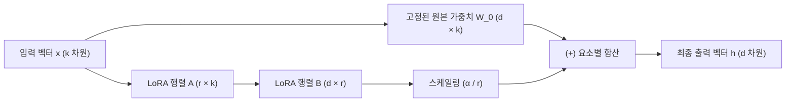

# 03. 매개변수 효율적 파인튜닝(PEFT)과 LoRA / QLoRA 서빙

## 📌 핵심 요약 & 전체 맥락
> **"모든 가중치를 다 고치려고 하지 마세요. 전체 매개변수의 0.1%만 살짝 비틀어도 100% 완전 파인튜닝과 똑같은 성능을 낼 수 있습니다."**  
> 파운데이션 모델의 매개변수가 수백억 개로 커짐에 따라 전체 가중치를 모두 업데이트하는 완전 파인튜닝(Full Fine-Tuning)은 천문학적인 GPU 메모리와 저장 공간을 요구합니다.  
> 이를 극복하기 위해 제안된 **PEFT (Parameter-Efficient Fine-Tuning, 매개변수 효율적 파인튜닝)**의 정점이 바로 **LoRA (Low-Rank Adaptation, 저순위 적응)**입니다. LoRA는 거대 행렬 $W$를 고정(Freeze)하고, 랭크 $r \ll d$인 두 개의 작은 저차원 행렬 곱($B \times A$)만 학습시켜 **학습 파라미터와 메모리를 99% 이상 절감**합니다.  
> 나아가 베이스 모델을 4비트 **NF4 (NormalFloat 4-bit)**로 양자화하고 이중 양자화(Double Quantization) 및 페이징된 메모리를 결합한 **QLoRA**를 통해, 단 한 장의 24GB 소비자용 GPU로 65B 거대 모델을 파인튜닝하는 실무 기법을 완벽히 정리합니다.

---

## 🗺️ 도표(Figure & Table) 색인 및 매핑 가이드

본문의 핵심 원리를 시각적으로 확인할 수 있는 책 내 도표의 위치와 해설 매핑입니다:

| 도표 번호 | 도표 제목 및 핵심 내용 | 책 페이지 | 본문 해당 주제 |
| :---: | :--- | :---: | :--- |
| **Figure 7-7** | 학습 파라미터 수에 따른 부분 파인튜닝과 완전 파인튜닝의 성능 격차 곡선 | **p. 325** | 1. PEFT의 등장 배경과 어댑터 |
| **Figure 7-8** | BERT 트랜스포머 레이어 사이에 삽입되는 Houlsby 어댑터(Adapter) 모듈 구조 | **p. 326** | 1. 초기 어댑터의 직렬 병목 한계 |
| **Figure 7-9** | 하드 프롬프트 앞에 학습 가능한 가상 임베딩 벡터를 덧붙이는 소프트 프롬프트 (Prompt Tuning) | **p. 328** | 1. 프롬프트 튜닝 |
| **Figure 7-10** | PEFT 기법별 Hugging Face 이슈 수 비교 (LoRA가 압도적 1위) | **p. 329** | 2. LoRA의 수학적 원리 |
| **Figure 7-11** | 원본 고정 가중치 $W$에 저차원 행렬 곱 $B \times A$를 더하는 LoRA 아키텍처 다이어그램 | **p. 331** | 2. LoRA의 수학적 원리 |
| **Table 7-5** | 18M 학습 파라미터 제약 하에서 LoRA vs 어댑터 vs 완전 파인튜닝 GLUE 성능 비교표 | **p. 333** | 2. LoRA 성능 실증 |
| **Figure 7-12** | 단일 베이스 가중치를 공유하고 요청마다 LoRA 어댑터를 전환하는 Multi-LoRA 서빙 구조 | **p. 334** | 3. Multi-LoRA 서빙 아키텍처 |
| **Table 7-6** | 7B 베이스 모델 가중치(14GB) 대비 LoRA 어댑터 가중치(70MB) 메모리 극소 비중 비교표 | **p. 336** | 3. Multi-LoRA 서빙 아키텍처 |
| **Table 7-7** | QLoRA 기반 Guanaco 65B 모델과 ChatGPT/GPT-4의 Vicuna 벤치마크 Elo 레이팅 비교표 | **p. 338** | 4. QLoRA 4비트 양자화 파인튜닝 |

---

## 1. PEFT의 진화: 어댑터 ➔ 소프트 프롬프트 ➔ LoRA (pp. 324 ~ 329)

1. **초기 Houlsby 어댑터 (Figure 7-8):**  
   트랜스포머 레이어 사이사이에 작은 병목 MLP(어댑터) 계층을 직렬(Series)로 끼워 넣음.  
   ❌ **한계:** 모델의 레이어 깊이가 깊어져 추론 지연시간(Latency)이 10~30% 늘어나는 **추론 병목(Inference Overhead)** 발생.
2. **소프트 프롬프트 / 프롬프트 튜닝 (Figure 7-9):**  
   가중치는 전혀 건드리지 않고, 입력 토큰 임베딩 앞에 학습 가능한 연속 벡터(가상 토큰 20~100개)를 덧붙여 역전파로 최적화.  
   ❌ **한계:** 컨텍스트 윈도우 길이를 갉아먹고, 100B 미만의 작은 모델에서는 성능이 잘 나오지 않음.
3. **LoRA (Low-Rank Adaptation, 2021 🏆):**  
   기존 가중치를 전혀 수정하지 않고, **가중치 옆에 병렬(Parallel)로 저차원 행렬을 덧붙인 뒤 나중에 수학적으로 병합(Merge)**하여 추론 지연시간 오버헤드를 완벽히 0으로 만듦.

---

## 2. LoRA의 수학적 원리와 저차원 분해 (Figure 7-11, pp. 329 ~ 334)

트랜스포머의 사전 훈련된 가중치 행렬 $W_0 \in \mathbb{R}^{d \times k}$가 있을 때, 파인튜닝에 의한 가중치 변화량 $\Delta W$는 **본질적으로 낮은 고유 랭크(Intrinsic Rank $r \ll \min(d, k)$)를 갖는다**는 가설에 기반합니다:

```
[ LoRA (Low-Rank Adaptation) 순전파 연산 구조 ]

출력 h = W_0 · x + ΔW · x
       = W_0 · x + (α / r) · (B · A) · x

• W_0 : 고정된(Frozen) 사전학습 가중치 (d × k 차원, 역전파 미적용)
• A   : 저차원 다운프로젝션 행렬 (r × k 차원, N(0, σ²) 가우시안 초기화)
• B   : 저차원 업프로젝션 행렬   (d × r 차원, 0으로 초기화 ➔ 초기 ΔW = 0)
• r   : LoRA 랭크 (보통 r = 8, 16, 32 등 아주 작은 값)
• α   : 스케일링 하이퍼파라미터 (보통 α = 2r 로 설정)
```



* **메모리 절감 효과 (Table 7-6):**  
  $4096 \times 4096$ 행렬의 매개변수는 약 1,677만 개이지만, $r=8$인 LoRA로 분해하면 $(4096 \times 8) + (8 \times 4096) \approx 6.5\text{만 개}$로 **학습 파라미터가 99.6% 감소**합니다.

---

## 3. Multi-LoRA 서빙 아키텍처 (Figure 7-12, Table 7-6, pp. 334 ~ 337) ⭐

실무에서 고객사마다 다른 파인튜닝 모델 100개를 서빙할 때, 14GB짜리 7B 모델 100개를 띄우면 1.4TB의 GPU 메모리가 필요하여 파산합니다.  
**Multi-LoRA 서빙**은 이를 극적으로 해결합니다:

```
[ Multi-LoRA 단일 GPU 통합 서빙 구조 ]

         ┌──▶ [ LoRA 어댑터 A (금융 특화: 70MB) ] ──▶ 금융 고객 응답
         │
[ 7B 베이스 모델 (14GB VRAM에 단 1개만 로드) ]
         │
         └──▶ [ LoRA 어댑터 B (의료 특화: 70MB) ] ──▶ 의료 고객 응답
```

* **핫 스와핑 (Hot-swapping):**  
  14GB 베이스 모델은 GPU VRAM에 딱 1개만 상주시키고, 사용자 요청 헤더에 따라 **70MB짜리 경량 LoRA 가중치만 RAM에서 GPU로 수 밀리초 만에 동적 스왑**하여 단 1장의 GPU로 수백 개의 맞춤형 특화 서비스를 동시 서빙합니다.

---

## 4. QLoRA: 4비트 양자화 파인튜닝의 기적 (Dettmers et al., 2023, Table 7-7, pp. 337 ~ 342)

QLoRA는 3대 혁신을 통해 **단 1장의 24GB 소비자용 GPU(RTX 3090/4090)로 65B 거대 모델을 파인튜닝**할 수 있게 만들었습니다:

1. **NF4 (NormalFloat 4-bit):**  
   정규분포를 따르는 신경망 가중치에 정보 이론적으로 가장 최적화된 4비트 부동소수점 데이터 타입.
2. **이중 양자화 (Double Quantization):**  
   양자화 시 발생하는 양자화 상수(Quantization Constant) 자체를 8비트로 한 번 더 양자화하여 파라미터당 0.37비트의 메모리를 추가 절감.
3. **페이징된 옵티마이저 (Paged Optimizers):**  
   순전파 도중 메모리 스파이크가 발생할 때, 활성화되지 않은 옵티마이저 상태를 **GPU VRAM에서 CPU RAM으로 자동으로 페이징(Swap) 아웃**시켜 OOM(Out of Memory) 크래시를 원천 방지.

---

## 🔗 연관 문서
* [[00-ch07-overview|00. Chapter 7 전체 개요 및 목차]]
* [[02-memory-math-and-quantization|02. 학습 메모리 수학과 수치 정밀도 및 양자화]]
* [[04-model-merging-and-weight-arithmetic|04. 모델 병합(Model Merging)과 가중치 산술 연산]]
* [[chapter-qa/ch09-inference-optimization-qa/01-inference-fundamentals-and-hardware-math|Ch09-01. 추론 기초, 루프라인 모델 및 하드웨어 수학]]
