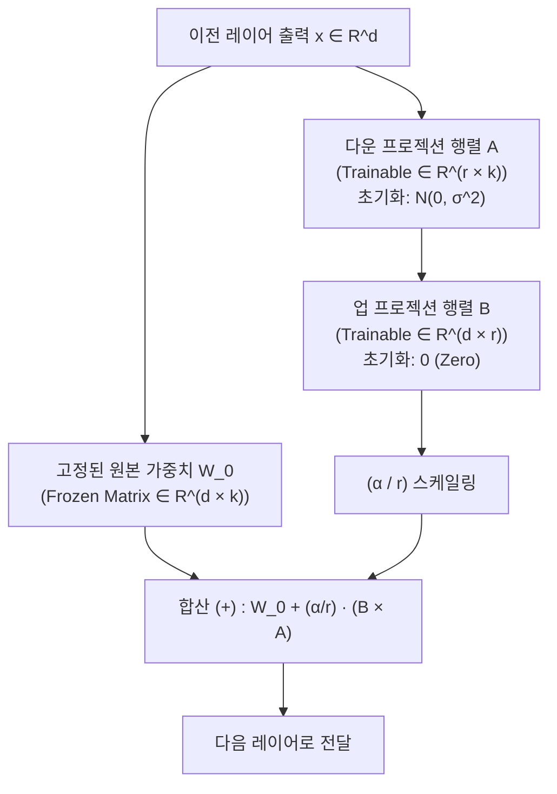
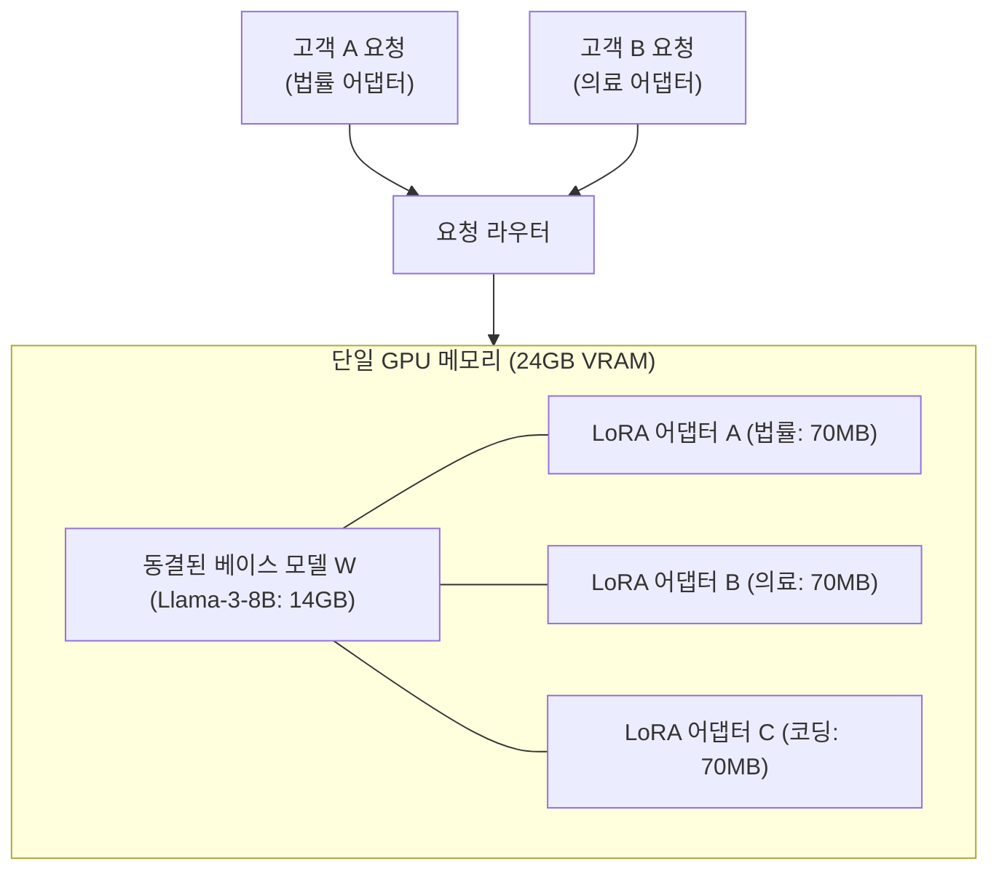

# 03. 매개변수 효율적 파인튜닝(PEFT)과 LoRA / QLoRA 서빙

## 📌 핵심 요약 & 전체 맥락
> **"전체 파라미터의 0.01%만 학습시켜 100% 완전 파인튜닝과 대등한 성능을 낸다."**  
> 70B 파운데이션 모델의 모든 가중치를 튜닝하는 완전 파인튜닝(Full Fine-Tuning)은 수백 GB의 VRAM과 거대한 체크포인트 용량을 요구하며 파국적 망각을 유발합니다.  
> 이를 극복하기 위해 제안된 **PEFT(매개변수 효율적 파인튜닝)**의 진화사(어댑터 ➔ 소프트 프롬프트 ➔ LoRA)를 분석하고, 사전 학습 모델의 고유 차원(Intrinsic Dimension)이 매우 낮다는 수학적 원리에 기반한 **LoRA 저차원 행렬 분해($W' = W_0 + \frac{\alpha}{r}BA$)**의 핵심 메커니즘을 규명합니다.  
> 또한 단일 베이스 가중치 위에 수백 개의 고객 맞춤형 어댑터를 핫스왑하는 **Multi-LoRA 서빙 아키텍처**와 65B 모델을 단 한 장의 GPU로 학습시키는 **QLoRA(4비트 NF4, 이중 양자화, 페이징 옵티마이저)**를 완벽하게 정리합니다.

---

## 🗺️ 도표(Figure & Table) 색인 및 매핑 가이드

본문의 핵심 원리를 시각적으로 확인할 수 있는 책 내 도표의 위치와 해설 매핑입니다:

| 도표 번호 | 도표 제목 및 핵심 내용 | 책 페이지 | 본문 해당 주제 |
| :---: | :--- | :---: | :--- |
| **Figure 7-7** | 학습 파라미터 수에 따른 부분 파인튜닝(Partial)과 완전 파인튜닝(Full)의 성능 격차 곡선 | **p. 325-335** | 1. PEFT의 등장 배경과 어댑터 |
| **Figure 7-8** | BERT 트랜스포머 레이어 사이에 병목 MLP를 삽입하는 Houlsby 어댑터 모듈 구조 | **p. 326-335** | 1. 어댑터(Adapter) 모듈과 추론 지연 |
| **Figure 7-9** | 입력 텍스트 앞에 학습 가능한 가상 토큰 임베딩을 배치하는 소프트 프롬프트 (Prompt Tuning) | **p. 328-336** | 1. 소프트 프롬프트 (Soft Prompts) |
| **Figure 7-10** | PEFT 기법별 Hugging Face 이슈 수 비교 (LoRA가 압도적인 개발자 채택률 1위) | **p. 329-337** | 2. LoRA의 대세화 |
| **Figure 7-11** | 원본 가중치 $W$를 고정하고 저차원 행렬 $A \times B$만 학습시키는 LoRA 분해 다이어그램 | **p. 331-339** | 2. LoRA의 수학적 원리 |
| **Table 7-5** | 18M 학습 파라미터 예산 하에서 LoRA 타겟 매트릭스($W_q, W_k, W_v, W_o$) 조합별 GLUE/MultiNLI 성능 비교표 | **p. 333-343** | 2. LoRA 하이퍼파라미터 최적화 |
| **Figure 7-12** | 단일 베이스 가중치 $W$를 공유하며 복수의 LoRA 어댑터($A_1B_1, A_2B_2$)를 동시 서빙하는 구조 | **p. 334-344** | 3. Multi-LoRA 서빙 아키텍처 |
| **Table 7-6** | 7B 베이스 모델 가중치(14GB) 대비 LoRA 어댑터 가중치(70MB) 메모리 극소 비중 비교표 | **p. 336-344** | 3. Multi-LoRA 스토리지 절감 |
| **Table 7-7** | QLoRA 기반 Guanaco 65B 모델과 ChatGPT/GPT-4의 Vicuna 벤치마크 Elo 레이팅 비교표 | **p. 338-348** | 4. QLoRA 4비트 양자화 파인튜닝 |

---

## 1. PEFT의 진화사: 어댑터에서 소프트 프롬프트까지 (pp. 324 ~ 330)


---

## 2. LoRA (Low-Rank Adaptation)의 수학적 원리 (Hu et al., 2021, Figure 7-11) ⭐



### ① 핵심 수식과 랭크 분해 (Low-Rank Factorization)
$$W' = W_0 + \Delta W = W_0 + \frac{\alpha}{r} (B \times A)$$

* $W_0 \in \mathbb{R}^{d \times k}$: 사전 학습된 **고정 가중치 (Frozen)**.
* $A \in \mathbb{R}^{r \times k}$: 가우시안 랜덤 정규분포로 초기화된 다운 프로젝션 행렬.
* $B \in \mathbb{R}^{d \times r}$: **0(Zero)으로 초기화**된 업 프로젝션 행렬 $\rightarrow$ **학습 시작 시점($t=0$)에 $\Delta W = 0$이 되어 베이스 모델의 출력을 완벽히 보존!**
* $r \ll \min(d, k)$: LoRA 랭크 (보통 $r = 4, 8, 16, 64$).
* $\alpha$: 가중치 업데이트 강도를 조절하는 상수 (보통 $\alpha = 2r$ 또는 $\alpha = 16$).

### ② 왜 LoRA가 작동하는가? (Intrinsic Dimension의 비밀, p. 340)
* 거대 언어 모델은 수십~수백억 개의 파라미터를 갖지만, 특정 도메인 작업에 필요한 **고유 차원(Intrinsic Dimension)은 극히 낮음 ($d_{\text{intrinsic}} \ll d_{\text{param}}$)**.
* 사전 학습 자체가 일종의 압축 알고리즘 역할을 하므로, **단 0.01%의 파라미터만 학습시켜도 100% 완전 파인튜닝과 99% 이상 대등한 성능**을 발휘합니다.

---

### ③ 타겟 매트릭스 최적 할당 (Table 7-5, p. 343)
1,800만(18M) 개 학습 파라미터 예산 하에서 GPT-3 175B 튜닝 실험:

| 타겟 어텐션 행렬 | 랭크 ($r$) | WikiSQL 정확도 | MultiNLI 정확도 |
| :--- | :---: | :---: | :---: |
| $W_q$ (쿼리 단독) | $r=8$ | 70.4% | 91.0% |
| $W_q, W_v$ (쿼리 + 밸류) | $r=4$ | **73.7%** | 91.3% |
| **$W_q, W_k, W_v, W_o$ (4개 전체)** | **$r=2$** | **73.7%** | **91.7% (최고 성능 🏆)** |

> 💡 **핵심 교훈:** 특정 행렬에 높은 랭크($r=8$)를 몰아주는 것보다, **모든 어텐션/MLP 행렬에 낮은 랭크($r=2$)를 골고루 적용하는 것**이 훨씬 우수한 일반화 성능을 냅니다.

---

## 3. Multi-LoRA 서빙 아키텍처와 스토리지 혁신 (Figure 7-12, Table 7-6)



### 💾 100개 맞춤형 고객 모델 운영 시 스토리지 비교 (p. 344)
* **방식 1 (100개 모델 각각 완전 병합):** $16.8\text{M} \times 100 = \mathbf{1.68\text{B 파라미터 (수백 GB)}}$
* **방식 2 (베이스 1개 + LoRA 어댑터 100개, Figure 7-12):** $16.8\text{M} + (65,536 \times 100) = \mathbf{23.3\text{M 파라미터 (약 98.6% 스토리지 절감 🚀)}}$

---

## 4. QLoRA: 4비트 양자화 파인튜닝 (Dettmers et al., 2023, Table 7-7)

**QLoRA(Quantized LoRA)**는 베이스 모델 가중치를 **4비트 NormalFloat (NF4)**로 압축하여 단 한 장의 48GB GPU에서 65B 파운데이션 모델을 튜닝하는 기적을 이루었습니다.

```
[ QLoRA의 3대 핵심 기술 혁신 ]

1. 4-bit NormalFloat (NF4) : 정규분포를 따르는 가중치에 정보이론적으로 최적화된 4비트 양자화
2. 이중 양자화 (Double Quantization) : 양자화 상수(Scale) 자체를 다시 8비트로 양자화해 파라미터당 0.37비트 절감
3. 페이징 옵티마이저 (Paged Optimizers) : 순간적인 그래디언트 메모리 스파이크를 CPU RAM으로 페이징해 OOM 방지
```

### 🏆 Guanaco 65B 모델 벤치마크 결과 (Table 7-7, p. 348)
Vicuna 벤치마크 상대 평가 Elo 레이팅:
* **GPT-4:** 100.0% (기준점)
* **Guanaco 65B (QLoRA 4-bit):** **99.3%** *(ChatGPT 97.2%를 상회!)*

---

## 🔗 연관 문서
* [[00-ch07-overview|00. Chapter 7 전체 개요 및 목차]]
* [[01-finetuning-foundations-and-decision-framework|01. 파인튜닝 기초와 엔지니어링 의사결정 프레임워크]]
* [[02-memory-math-and-quantization|02. 학습 메모리 수학과 수치 정밀도 및 양자화]]
* [[04-model-merging-and-weight-arithmetic|04. 모델 병합과 가중치 산술 연산]]
