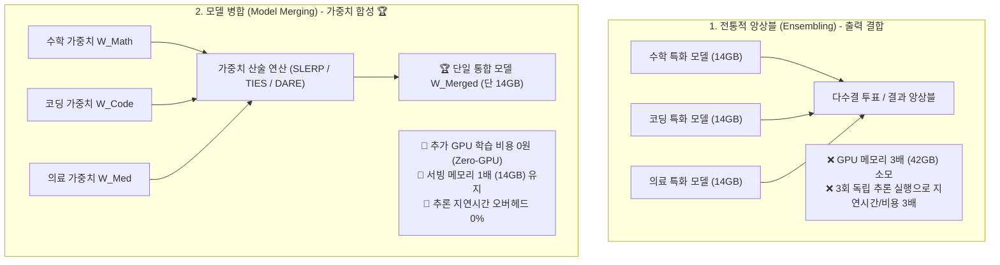
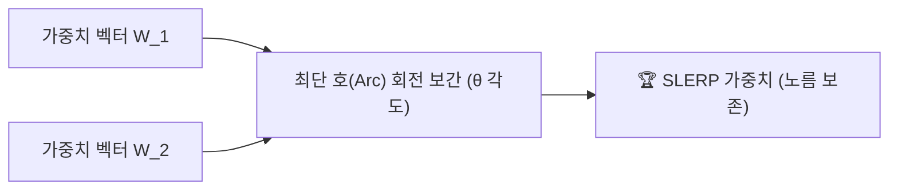
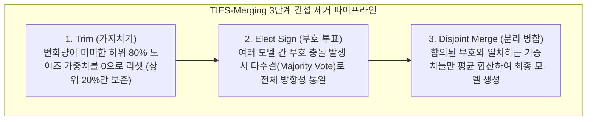
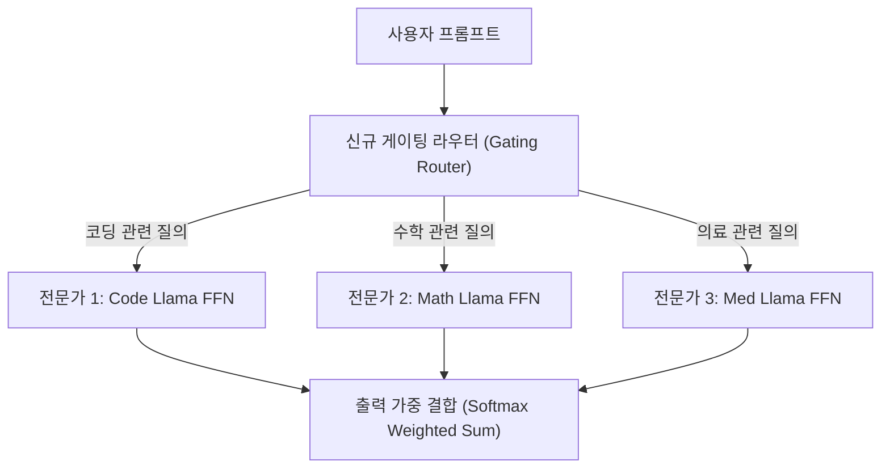
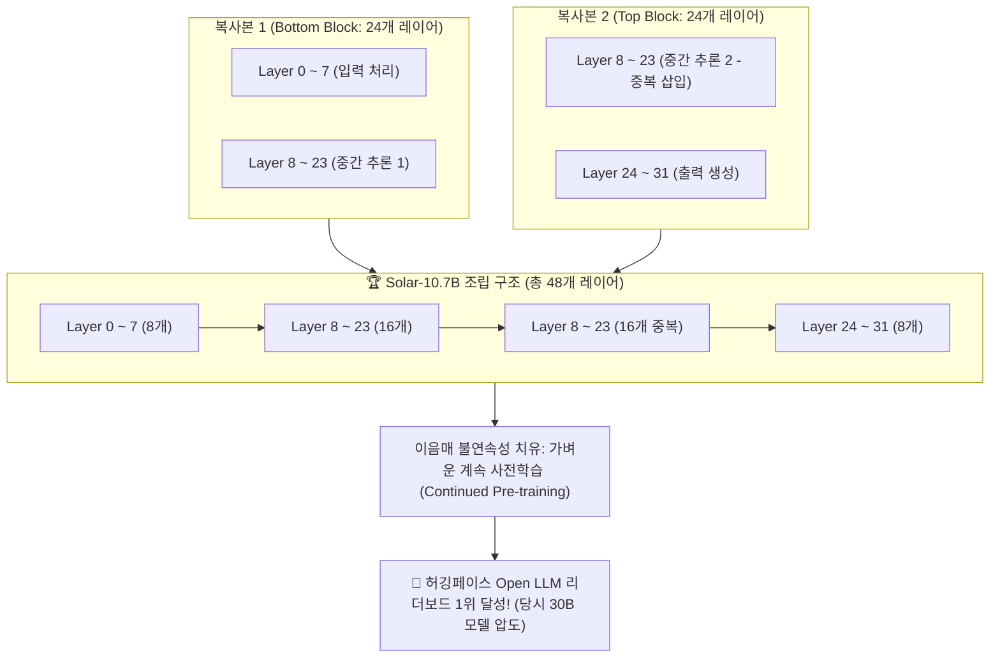

# 04. 모델 병합(Model Merging)과 가중치 산술 연산

## 📌 핵심 요약 & 전체 맥락
> **"단 1원의 추가 GPU 학습 비용도 들이지 않고, 여러 전문 모델의 지능을 단 하나의 고성능 모델로 결합할 수 있습니다."**  
> 전통적인 앙상블(Ensemble) 기법은 $N$개의 모델을 메모리에 동시에 띄워 각각 추론을 실행해야 하므로 서빙 메모리와 연산 비용이 $N$배로 폭증합니다.  
> 반면 **모델 병합 (Model Merging)**은 동일한 베이스 모델에서 파생된 여러 파인튜닝 모델의 **가중치 행렬 자체를 산술 연산(Weight Arithmetic)하여 단 하나의 통합 가중치로 합성**하는 혁신적인 제로 GPU 학습(Zero-GPU Training) 패러다임입니다.  
> 본 섹션에서는 고차원 초구면 보간법인 **SLERP (Spherical Linear Interpolation)**, 가중치 충돌을 제거하는 **TIES-Merging**과 **DARE**, 여러 특화 모델을 전문가로 묶는 **FrankenMoE (Mixture of Experts)**, 그리고 32개 레이어를 48개로 늘려 10.7B 모델을 탄생시킨 Upstage의 **Depthwise Scaling (Solar-10.7B)**까지 모델 병합의 최신 기법을 총망라합니다.

---

## 🗺️ 도표(Figure & Table) 색인 및 매핑 가이드

본문의 핵심 원리를 시각적으로 확인할 수 있는 책 내 도표의 위치와 해설 매핑입니다:

| 도표 번호 | 도표 제목 및 핵심 내용 | 책 페이지 | 본문 해당 주제 |
| :---: | :--- | :---: | :--- |
| **Figure 7-13** | 인퍼런스 비용이 배가되는 앙상블(Ensemble) vs 단일 모델로 합치는 모델 병합(Model Merging) 비교 | **p. 343** | 1. 앙상블 vs 모델 병합 |
| **Figure 7-14** | 모델 병합 3대 접근법 (가중치 산술 연산, 깊이 스태킹, 라우터 기반 MoE 결합) | **p. 345** | 1. 모델 병합 3대 기법 분류 |
| **Figure 7-15** | 동일한 구조의 두 모델 레이어 가중치를 단순 산술 평균하는 선형 결합 구조 | **p. 346** | 2. 선형 평균과 태스크 산술 |
| **Figure 7-16** | 고차원 초구면 상에서 두 벡터의 최단 호를 따라 각도를 보간하는 SLERP 기하학적 원리 | **p. 347** | 3. 구면 선형 보간 (SLERP) |
| **Figure 7-17** | 태스크 벡터의 하위 80%를 제거(가지치기)해도 성능이 유지되는 TIES-Merging/DARE 곡선 | **p. 349** | 4. 간섭 제거: TIES-Merging & DARE |
| **Figure 7-18** | 복수의 파인튜닝 모델을 전문가(Experts)로 묶고 라우터를 붙여 MoE로 변환하는 FrankenMoE | **p. 351** | 5. 구조 확장: FrankenMoE |
| **Figure 7-19** | 32개 레이어를 중첩 연결하여 48개 레이어로 확장하는 Depthwise Scaling (Solar-10.7B) | **p. 353** | 5. 구조 확장: Solar-10.7B |
| **Figure 7-20** | 서로 다른 LoRA 어댑터 행렬을 결합하여 랭크 $r_1 + r_2$의 통합 어댑터를 만드는 LoRA 병합 | **p. 355** | 6. LoRA 어댑터 가중치 병합 |

---

## 1. 모델 병합의 필요성과 앙상블 비교 (Figure 7-13, 7-14, pp. 347 ~ 349)

### ① 멀티태스크 파인튜닝의 3가지 접근법
단일 모델에 여러 작업(수학, 코딩, 의료 상담 등) 능력을 주입하고자 할 때 취할 수 있는 전략 비교:

1. **동시 파인튜닝 (Simultaneous Finetuning):**  
   모든 태스크 데이터셋을 하나로 섞어 한꺼번에 학습.  
   ❌ **한계:** 여러 기술을 동시에 학습하는 것은 난이도가 높아 훨씬 방대한 데이터와 학습 시간이 소모됨.
2. **순차 파인튜닝 (Sequential Finetuning):**  
   태스크 A ➔ 태스크 B ➔ 태스크 C를 차례대로 순차 학습.  
   ❌ **치명적 한계 (파국적 망각 / Catastrophic Forgetting, Kirkpatrick et al., 2016):** 새로운 태스크 B를 배울 때 이전 태스크 A의 가중치가 덮어씌워져 기존 능력이 급격히 붕괴됨.
3. **병렬 파인튜닝 + 모델 병합 (Parallel FT + Merging) 🏆:**  
   동일한 베이스 모델을 출발점으로 각 태스크를 **독립적으로 병렬 파인튜닝한 뒤, 최종 가중치를 하나로 병합**.  
   🚀 **장점:** 파국적 망각 위험 없이 각 태스크의 고유 능력을 깊이 있게 학습시키고 단일 모델로 통합!

---

### ② 온디바이스(On-Device) 배포와 연합 학습(Federated Learning)
* **온디바이스 경량 배포:** 스마트폰, 스마트워치, 자율주행차, 로봇 등 메모리가 극도로 제한된 엣지 디바이스에 여러 개의 특화 모델을 다 올릴 수 없을 때, **단 하나의 병합 모델로 압축 탑재**하여 클라우드 API 통신 비용을 없애고 개인정보를 기기 내부에 격리(Privacy 보존).
* **연합 학습 (Federated Learning, McMahan et al., 2016):** 각 사용자 디바이스에서 독립적으로 학습된 로컬 모델 가중치들을 중앙 서버에서 주기적으로 산술 병합하여 전사 베이스 모델을 지속 개선.

---

### ③ 앙상블(Ensemble) vs 모델 병합(Model Merging) 비교 (Figure 7-13)



| 비교 항목 | 전통적 앙상블 (Ensemble) | 모델 병합 (Model Merging) 🏆 |
| :--- | :--- | :--- |
| **결합 대상** | 모델의 **출력값 (Outputs / Probabilities)** | 모델의 **가중치 매개변수 (Weights / Parameters)** |
| **서빙 GPU 메모리** | $N$개 모델 크기만큼 $N$배 폭증 (예: 42 GB) | **단 1개 모델 크기 그대로 유지 (14 GB)** |
| **추론 지연시간 (Latency)** | $N$번의 순전파 실행으로 심각한 지연 발생 | **1번의 순전파로 완벽히 동일 (오버헤드 0%)** |
| **추가 학습 비용** | 모델들을 합치기 위한 별도 학습 불필요 | **GPU 연산 없이 CPU RAM 상에서 즉시 가중치 합성** |

---

### ④ 모델 병합의 3대 패러다임 (Figure 7-14)
1. **합산 기반 (Summing):** 가중치 행렬을 산술 평균하거나 기하학적으로 보간 (선형 평균, Task Arithmetic, SLERP, TIES, DARE).
2. **레이어 스태킹 (Layer Stacking):** 모델의 레이어를 수직으로 이어 붙여 모델 깊이(Depth)와 파라미터 체급을 확장 (Solar-10.7B).
3. **연결 기반 (Concatenation):** 여러 모델을 전문가(Experts)로 수평 배치하고 라우터를 결합하여 MoE 구조로 변환 (FrankenMoE).

---

## 2. 가중치 산술 연산과 태스크 산술 (Figure 7-15, pp. 349 ~ 352)

### ① 선형 결합과 모델 수프 (Model Soups, Wortsman et al., 2022, Figure 7-15)
동일한 베이스 모델 $A, B$의 가중치를 가중 평균(Weighted Average)하는 가장 단순한 방식입니다:

$$\text{Merge}(A, B) = \frac{w_A A + w_B B}{w_A + w_B}$$

* **Model Soups (Wortsman et al., 2022):** 서로 다른 하이퍼파라미터로 파인튜닝된 여러 모델의 가중치를 단순 평균하는 것만으로, 단일 모델 대비 벤치마크 정확도와 일반화 능력이 비약적으로 상승함을 입증.

---

### ② 태스크 벡터 (Task Vector, $\tau$)
파인튜닝된 모델 가중치 $W_{\text{FT}}$(**F**ine-**T**uned Weights)에서 사전 훈련된 베이스 가중치 $W_{\text{Base}}$(**Base** Weights)를 뺀 차이 벡터를 **태스크 벡터($\tau$, 델타 파라미터 $\Delta W$)**라고 합니다:

$$\tau = W_{\text{FT}} - W_{\text{Base}}$$

* **$W_{\text{FT}}$ ($W_{\text{Fine-Tuned}}$):** 특정 태스크(수학, 코딩, 의료 등) 데이터셋으로 **파인튜닝(Fine-Tuning)을 완료한 모델의 전체 가중치**입니다.
* **$W_{\text{Base}}$ ($W_{\text{Pre-trained}}$):** 파인튜닝의 출발점이 된 **사전 훈련 베이스 파운데이션 모델의 가중치**입니다.
* **태스크 벡터 ($\tau$):** 파인튜닝 가중치에서 베이스 가중치를 빼면, 사전 학습 지식은 상쇄되고 오직 **'해당 태스크(Task)를 학습하면서 새롭게 획득한 고유한 능력의 방향과 크기'**만 순수하게 남게 됩니다.

---

### ③ 모델 능력의 덧셈과 뺄셈 (Task Arithmetic)
태스크 벡터들을 선형 결합(Linear Combination)하면 놀랍게도 모델의 능력을 더하거나 뺄 수 있습니다:

$$W_{\text{Merged}} = W_{\text{Base}} + \lambda_1 \tau_{\text{Math}} + \lambda_2 \tau_{\text{Code}} - \lambda_3 \tau_{\text{Toxicity}}$$

* **능력 더하기 ($+\tau_{\text{Math}} + \tau_{\text{Code}}$):** 수학 풀이 능력과 프로그래밍 코딩 능력이 하나의 모델로 동시에 주입됩니다.
* **부정적 행동 빼기 ($-\tau_{\text{Toxicity}}$):** 유해하거나 편향된 텍스트를 생성하도록 고의 파인튜닝된 모델의 태스크 벡터를 빼버림으로써, **모델의 독성(Toxicity)을 가중치 수준에서 영구 정화**할 수 있습니다.

---

## 3. 구면 선형 보간 (SLERP, Spherical Linear Interpolation, Figure 7-16) ⭐

### ① 단순 선형 결합(LERP)의 치명적 결함: 노름 축소 (Norm Shrinking)
두 모델의 가중치 행렬을 단순히 산술 평균($\frac{W_1 + W_2}{2}$)하면, 고차원 구면 공간에서 **가중치 벡터의 크기(Norm)가 줄어드는 심각한 축소 현상**이 발생하여 모델의 생성 능력이 급격히 붕괴합니다:

```
[ 선형 보간 (LERP) vs 구면 선형 보간 (SLERP) 기하학 비교 ]

• LERP (단순 평균) : 직선 현(Chord)을 따라 가중치를 평균하므로 중심 쪽으로 노름이 수축됨 (||W|| 감소 ➔ 멍청해짐)
• SLERP (구면 보간) : 고차원 초구면(Hypersphere) 표면의 최단 호(Arc)를 따라 회전하므로 크기와 각도가 100% 보존됨!
```



### ② SLERP 수학 공식 (Figure 7-16)
두 가중치 벡터 $W_1, W_2$ 사이의 사잇각을 $\theta = \arccos\left(\frac{W_1 \cdot W_2}{\|W_1\| \|W_2\|}\right)$라 할 때, 보간 비율 $t \in [0, 1]$에 대한 SLERP 공식은 다음과 같습니다:

$$\text{SLERP}(W_1, W_2; t) = \frac{\sin((1-t)\theta)}{\sin\theta} W_1 + \frac{\sin(t\theta)}{\sin\theta} W_2$$

* $t=0.5$일 때 두 모델의 능력이 기하학적으로 완벽히 균형 있게 합성됩니다.

---

## 4. 간섭 제거 병합: TIES-Merging & DARE (Figure 7-17, pp. 348 ~ 351)

여러 개의 파인튜닝 모델을 합칠 때, 서로 다른 모델이 동일한 가중치 좌표를 **정반대 방향(+0.5 vs -0.5)으로 수정하여 상쇄되는 부호 충돌(Sign Interference)**이 발생합니다:



### ① TIES-Merging (TrIm, Elect Sign, and Merge, Yadav et al., 2023)
1. **Trim (가지치기):** 태스크 벡터의 하위 80%를 날려버려도 모델의 핵심 성능은 100% 보존됩니다 (Figure 7-17 실증).
2. **Elect Sign (부호 결정):** 파라미터별로 모든 모델의 변화량 부호($+1$ 또는 $-1$)를 투표하여 다수결 부호로 통일합니다.
3. **Merge (병합):** 다수결 부호와 일치하는 핵심 가중치들만 평균하여 간섭을 완벽히 제거합니다.

### ② DARE (Drop And REscale, Yu et al., 2023)
* 복잡한 부호 투표 없이, **베르누이 드롭아웃(Bernoulli Dropout)으로 델타 가중치의 90% 이상을 무작위로 0으로 드롭**시킵니다.
* 살아남은 10%의 가중치를 $\frac{1}{1-p}$로 스케일업하여 가중치 밀도를 낮춤으로써 다중 모델 병합 시의 간섭을 원천 차단합니다.

---

## 5. 구조 확장: FrankenMoE & Solar-10.7B Depthwise Scaling (Figures 7-18, 7-19)

### ① FrankenMoE (비공식 MoE 합성, Figure 7-18)
* 코딩 특화 Llama, 수학 특화 Llama, 의학 특화 Llama의 FFN(Feed-Forward Network) 계층을 각각 전문가(**Experts**)로 묶습니다.
* 입력 토큰을 보고 어떤 전문가에게 보낼지 결정하는 게이팅 라우터(Router) 계층을 추가하여 **단 몇 분 만에 8x7B 형태의 MoE (Mixture of Experts) 모델**을 즉석 합성합니다.



---

### ② Upstage Solar-10.7B의 Depthwise Scaling (DWS, Figure 7-19) ⭐

한국의 AI 스타트업 Upstage(업스테이지)가 개발한 **Depthwise Scaling (깊이 방향 확장, DWS)**은 **32개 레이어(7B 모델)**를 복사하고 잘라 붙여 **48개 레이어(10.7B 모델)**로 체급을 키운 대표적인 모델 업스케일링(Model Upscaling) 혁신 사례입니다:

```
[ Solar-10.7B의 32레이어 ➔ 48레이어 슬라이싱 & 스태킹 구조 (Figure 7-19) ]

■ 원본 Llama-2-7B (총 32개 레이어: Layer 0 ~ 31)
  │
  ├─► [복사본 1 (Bottom Block)] : Layer 0 ~ 23 (하위 24개 레이어 추출, 상위 8개 제거)
  │
  └─► [복사본 2 (Top Block)]    : Layer 8 ~ 31 (상위 24개 레이어 추출, 하위 8개 제거)

■ 최종 Solar-10.7B 조립 (24 + 24 = 총 48개 레이어):
  ┌────────────────────────────────────────────────────────────────────────┐
  │ [1] Layer 0 ~ 7   : 하위 기초 임베딩 레이어 (1회 등장)                   │
  │ [2] Layer 8 ~ 23  : 중간 추론 레이어 (복사본 1에서 1차 등장)              │ ──┐
  │ [3] Layer 8 ~ 23  : 중간 추론 레이어 (복사본 2에서 2차 중복 등장!) ⭐      │ ──┴─► 중간 16개 레이어 반복으로 깊이 확장!
  │ [4] Layer 24 ~ 31 : 상위 어휘 출력 레이어 (1회 등장)                   │
  └────────────────────────────────────────────────────────────────────────┘
  총 레이어 수 = 8 + 16 + 16 + 8 = 48개 레이어 (파라미터: 7B ➔ 10.7B 확장!)
```



#### 1. 왜 처음부터 10.7B를 학습하지 않고 이렇게 늘렸을까? (모델 업스케일링의 경제학)
* 바닥부터(From Scratch) 10.7B 파운데이션 모델을 사전 학습하려면 **수십억 원의 GPU 인프라 비용과 수개월의 시간**이 듭니다.
* 이미 최고 품질로 학습된 7B 모델의 가중치를 물리적으로 복제하여 깊이(Depth)를 늘리면, **바닥부터 학습하는 비용의 1/10도 안 되는 최소한의 컴퓨팅**으로 체급을 올릴 수 있습니다.

#### 2. 왜 하필 '중간 16개 레이어(Layer 8 ~ 23)'를 중복시켰을까?
* **입력 레이어 ($L_0 \sim L_7$):** 토큰 임베딩과 초기 문법을 처리하므로 1벌만 있으면 됩니다.
* **출력 레이어 ($L_{24} \sim L_{31}$):** 최종 단어 어휘(Vocabulary) 확률을 출력하므로 1벌만 필요합니다.
* **중간 레이어 ($L_8 \sim L_{23}$):** 문맥 이해, 복잡한 추론, 지식 변환을 담당하는 핵심 두뇌 영역입니다. 이 중간 레이어 16개를 한 번 더 통과하게 만듦으로써, 모델의 **추론 사고 깊이(Reasoning Capacity)**를 극대화한 것입니다.

#### 3. 이음매 불연속성 치유 (Healing the Seam with Continued Pre-training)
* 복사본 1의 23번 레이어 바로 뒤에 복사본 2의 8번 레이어가 붙기 때문에, 연결 부위(이음매, Seam)에서 표현 벡터가 순간적으로 튀는 불연속성이 발생합니다.
* Upstage는 이를 해결하기 위해 전체를 다시 학습하는 대신, **적은 양의 토큰으로 가벼운 계속 사전학습(Continued Pre-training)**을 수행하여 이음매를 매끄럽게 연결(치유)했습니다.
* 그 결과, 단숨에 **당시 13B~30B 체급의 오픈소스 모델들을 전면 능가하고 허깅페이스 Open LLM 리더보드 글로벌 1위**를 차지했습니다.

---

## 6. LoRA 어댑터 병합과 Mergekit 실무 (Figure 7-20)

### ① LoRA 어댑터 병합 (Figure 7-20)
* 서로 다른 목적으로 학습된 두 LoRA 어댑터 $(B_1, A_1)$과 $(B_2, A_2)$를 결합할 때, 가중치를 단순히 더하거나 행렬을 연결(Concatenation)하여 랭크 $r_1 + r_2$의 단일 어댑터로 합성할 수 있습니다.

### ② Mergekit 오픈소스 도구
실무에서는 Charles Goddard가 개발한 **`mergekit`** 도구를 사용하여 YAML 설정 파일 하나로 복잡한 SLERP, TIES, DARE 모델 병합을 GPU 없이 단 몇 분 만에 실행합니다:

```yaml
# mergekit SLERP 설정 예시 (config.yml)
slices:
  - sources:
      - model: meta-llama/Llama-2-7b-chat-hf
        layer_range: [0, 32]
      - model: WizardLM/WizardMath-7B-V1.0
        layer_range: [0, 32]
merge_method: slerp
base_model: meta-llama/Llama-2-7b-hf
parameters:
  t:
    - filter: self_attn
      value: [0, 0.5, 0.3, 0.7, 1]
    - filter: mlp
      value: [1, 0.5, 0.7, 0.3, 0]
    - value: 0.5
dtype: bfloat16
```

---

## 7. 엔지니어링 심화 Q&A

### Q1. 모델 병합(Model Merging)은 서로 다른 기본 모델(예: Llama 3와 Mistral)끼리도 가능한가요?
**원칙적으로 불가능합니다.** 모델 병합은 동일한 가중치 초기화(Weight Initialization) 및 구조적 공간에서 파생된 모델들(예: Llama-3-8B-Instruct와 Llama-3-8B-Math) 사이에서만 각 레이어의 가중치 좌표가 일치하여 정상 작동합니다. 아키텍처나 차원이 다른 모델을 강제로 합치면 완전한 노이즈가 발생합니다.

### Q2. 왜 SLERP는 두 모델만 병합할 수 있고, 3개 이상의 모델을 병합할 때는 TIES-Merging이나 DARE를 쓰나요?
구면 선형 보간(SLERP)은 기하학적으로 '두 벡터 사이의 호(Arc)'를 따라 각도를 보간하도록 정의되어 있어 2개 모델에 최적화되어 있습니다. 3개 이상의 다중 모델을 동시에 병합할 때는 부호 충돌을 투표로 해결하는 TIES-Merging이나 무작위 드롭아웃을 적용하는 DARE가 표준으로 사용됩니다.

---

## 🔗 연관 문서
* [[00-ch07-overview|00. Chapter 7 전체 개요 및 목차]]
* [[01-finetuning-foundations-and-decision-framework|01. 파인튜닝 기초와 엔지니어링 의사결정 프레임워크]]
* [[02-memory-math-and-quantization|02. 학습 메모리 수학과 수치 정밀도 및 양자화]]
* [[03-peft-lora-and-qlora|03. 매개변수 효율적 파인튜닝(PEFT)과 LoRA / QLoRA]]
* [[05-finetuning-tactics-and-hyperparameters|05. 파인튜닝 실무 전술과 하이퍼파라미터 최적화]]
* [[chapter-qa/ch09-inference-optimization-qa/03-speculative-decoding-caching-and-parallelism|Ch09-03. 추측 디코딩, 프롬프트 캐싱 및 분산 병렬화]]
