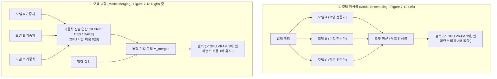
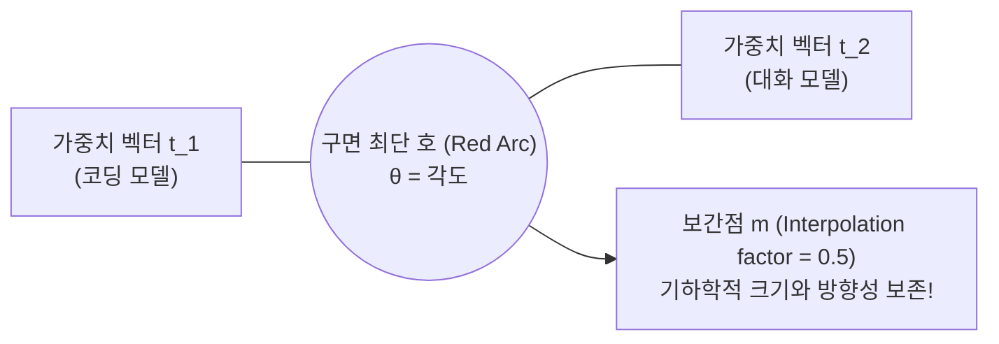
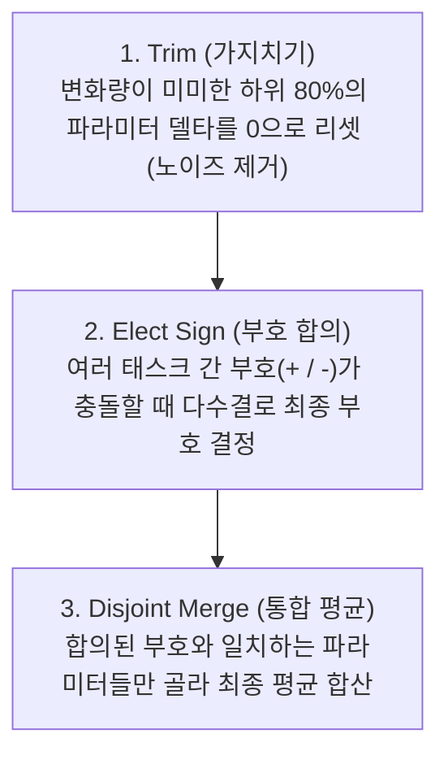
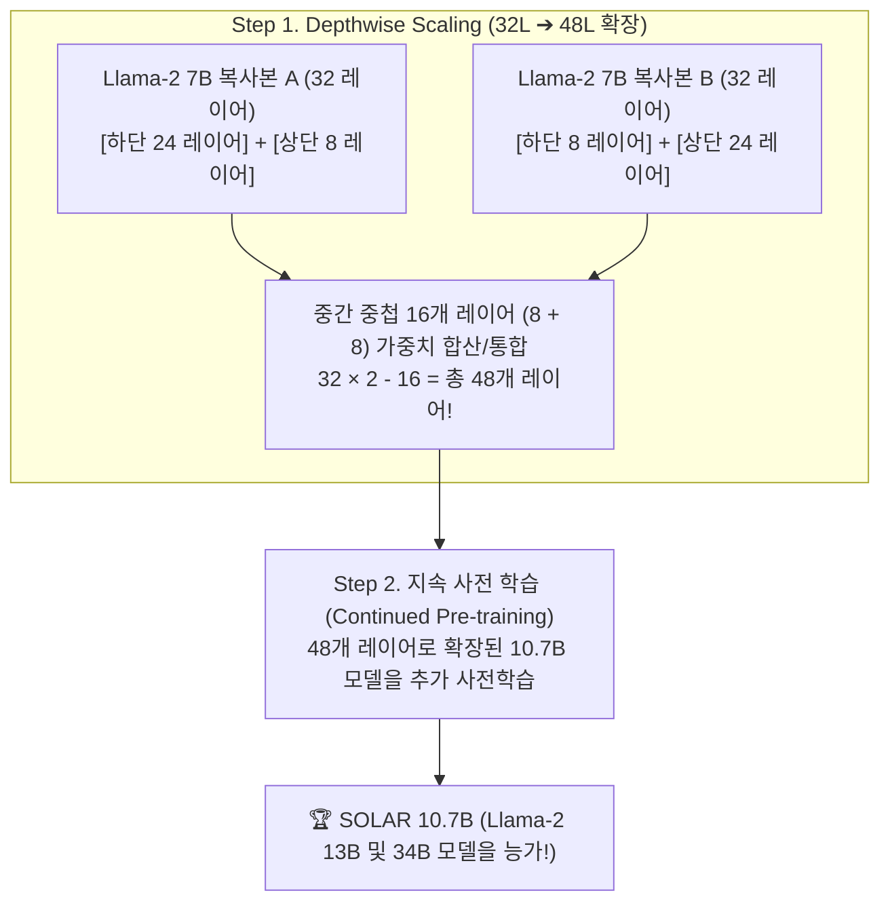

# 04. 모델 병합(Model Merging)과 가중치 산술 연산 (SLERP, TIES, Solar-10.7B)

## 📌 핵심 요약 & 전체 맥락
> **"GPU 학습 비용 0원: 가중치 산술 연산만으로 여러 전문가 모델의 지능을 하나로 결합한다."**  
> 모델 병합(Model Merging)은 동일한 베이스 모델로부터 각기 다른 도메인(코딩, 수학, 번역, 챗)으로 파인튜닝된 복수의 모델 가중치를 **추가 학습(Backpropagation) 없이 수학적 연산만으로 단일 모델로 통합**하는 혁신적인 기법입니다.  
> 인퍼런스 비용이 $N$배로 폭증하는 앙상블(Ensembling)과 달리 **추론 비용과 VRAM 소모가 $1\times$로 유지**됩니다.  
> 본 섹션에서는 **선형 가중치 평균(Linear Average)**, 고차원 초구면 최단 경로를 보간하는 **SLERP**, 모델 간 간섭과 노이즈를 80% 이상 가지치기하는 **TIES-Merging 및 DARE**, 파인튜닝 모델들을 MoE로 묶는 **FrankenMoE**, 그리고 32개 레이어를 48개 레이어로 확장한 한국 Upstage의 **Solar-10.7B Depthwise Scaling**까지 모델 병합의 모든 것을 완벽하게 정리합니다.

---

## 🗺️ 도표(Figure & Table) 색인 및 매핑 가이드

본문의 핵심 원리를 시각적으로 확인할 수 있는 책 내 도표의 위치와 해설 매핑입니다:

| 도표 번호 | 도표 제목 및 핵심 내용 | 책 페이지 | 본문 해당 주제 |
| :---: | :--- | :---: | :--- |
| **Figure 7-13** | 인퍼런스 비용이 $N$배 증가하는 앙상블(Ensemble) vs 단일 모델로 통합되는 모델 병합(Model Merging) 비교 | **p. 343-351** | 1. 모델 병합 vs 앙상블 |
| **Figure 7-14** | 모델 병합 3대 접근법 (가중치 합산/평균 Summing, 레이어 스태킹 Layer Stacking, 결합 Concatenation) | **p. 345-350** | 1. 모델 병합의 3대 패러다임 |
| **Figure 7-15** | 동일한 구조의 두 신경망 레이어 가중치를 단순 산술 평균하는 선형 결합 예시 | **p. 346-351** | 2. 선형 가중치 평균 (Linear Average) |
| **Figure 7-16** | 고차원 초구면 상에서 두 벡터 $t_1, t_2$의 최단 호(Arc)를 따라 각도를 보간하는 SLERP 기하학적 구조 | **p. 347-353** | 2. 구면 선형 보간 (SLERP) |
| **Figure 7-17** | 태스크 벡터의 하위 80% 파라미터를 가지치기(0으로 리셋)해도 성능이 유지되는 TIES-Merging/DARE 곡선 | **p. 349-353** | 3. 태스크 산술과 TIES / DARE |
| **Figure 7-18** | 사전 학습된 Dense 모델의 MLP 레이어를 다중 복제하고 라우터를 붙여 MoE로 변환하는 FrankenMoE 구조 | **p. 351-355** | 4. FrankenMoE & Sparse Upcycling |
| **Figure 7-19** | 32개 레이어 7B 모델을 중첩 스태킹하여 48개 레이어 10.7B 모델로 확장하는 Depthwise Scaling (Solar-10.7B) | **p. 353-356** | 4. 깊이 확장 (Solar-10.7B) |
| **Figure 7-20** | 서로 다른 LoRA 어댑터 $(A_1, B_1)$과 $(A_2, B_2)$를 결합하여 랭크 $r_1 + r_2$의 단일 어댑터를 만드는 연결 병합 | **p. 355-356** | 4. LoRA 어댑터 연결 병합 |

---

## 1. 모델 병합 vs 모델 앙상블 (Figure 7-13, Figure 7-14)



---

## 2. 가중치 합산 기법: Linear Average와 SLERP (pp. 345 ~ 348)

---

### ① 단순 선형 가중치 평균 (Linear Average, Figure 7-15)
동일한 베이스 모델에서 파생된 두 모델 $A, B$의 가중치 행렬을 가중 평균합니다:

$$W_{\text{merged}} = \frac{w_A W_A + w_B W_B}{w_A + w_B} = (1 - \lambda) W_A + \lambda W_B$$

* **작동 원리 (Figure 7-15):**  
  두 모델의 대응되는 뉴런 연결 가중치를 $1:1$ 산술 평균 (예: $0.4$와 $0.2$의 평균 $\rightarrow 0.3$).
* **한계점:** 고차원 공간에서 단순 선형 보간은 벡터의 크기(Norm)를 축소시켜 가중치의 활성화 스케일을 왜곡합니다.

---

### ② 구면 선형 보간 (SLERP: Spherical Linear Interpolation, Figure 7-16) ⭐

두 가중치 벡터 $t_1, t_2$를 고차원 초구면(Hypersphere) 표면의 **최단 호(Arc)를 따라 회전 보간**하여 기하학적 놈(Norm)과 방향성을 완벽히 보존합니다:



$$\text{SLERP}(W_A, W_B; t) = \frac{\sin((1-t)\theta)}{\sin\theta} W_A + \frac{\sin(t\theta)}{\sin\theta} W_B \quad (\text{단, } \cos\theta = \frac{W_A \cdot W_B}{\|W_A\| \|W_B\|})$$

---

## 3. 태스크 산술과 간섭 제거 병합: TIES-Merging & DARE (pp. 348 ~ 350)

### ① 태스크 벡터 (Task Vector: Ilharco et al., 2022)
파인튜닝된 모델 가중치에서 베이스 모델 가중치를 빼면, 해당 작업의 핵심 지식만을 담은 **태스크 델타 벡터($\tau_t$)**를 얻을 수 있습니다:

$$\tau_t = W_{\text{finetuned}}^{(t)} - W_{\text{base}}$$
$$W_{\text{multi-task}} = W_{\text{base}} + \lambda_1 \tau_1 + \lambda_2 \tau_2 - \lambda_3 \tau_{\text{toxicity}}$$

> 💡 **태스크 뺄셈의 마법:** 유해성/개인정보 태스크 벡터($\tau_{\text{toxicity}}$)를 빼버리면, **모델에서 편향과 유해 생성 능력을 제거(Unlearning)**할 수 있습니다!

---

### ② TIES-Merging과 DARE 가지치기 (Figure 7-17)

복수의 태스크 벡터를 합칠 때 서로 상충하는 부호 간섭(Interference)과 노이즈를 제거하는 3단계 프로세스 (Yadav et al., 2023):



* 🚀 **가지치기의 놀라운 발견 (Figure 7-17):**  
  태스크 벡터 파라미터의 **상위 20%만 남기고 하위 80%를 날려버려도(Pruning), 100% 전체를 유지했을 때와 완전히 동일한 벤치마크 성능(73~74%)**을 유지함.
* **DARE (Drop And REscale, Yu et al., 2023):**  
  무작위로 90~99%의 델타 파라미터를 드롭하고 남은 파라미터를 $\frac{1}{1-p}$로 리스케일링하여 극한의 간섭 제거 달성.

---

## 4. 구조적 모델 확장 및 업스케일링 (pp. 350 ~ 356)

---

### ① FrankenMoE & Sparse Upcycling (Komatsuzaki et al., 2022, Figure 7-18)
* 사전 학습된 Dense 모델의 트랜스포머 블록에서 MLP 계층을 복제하여 **$E$개의 전문가(Experts) 풀**을 구성하고, 입력 토큰을 라우팅하는 **게이팅 라우터(Router)**를 붙여 MoE 모델로 변환.
* **Mixture-of-Agents (Together AI, 2024):** 6개의 오픈 소스 중소형 모델을 MoE 구조로 결합하여 GPT-4o급 성능 달성.

---

### ② Depthwise Scaling: Solar-10.7B 아키텍처 (Upstage AI, Figure 7-19) 🏆

한국의 AI 스타트업 Upstage 연구진(Kim et al., 2023)이 개발한 혁신적인 깊이 확장 모델:



---

### ③ LoRA 어댑터 연결 병합 (Figure 7-20)
* 어댑터 1(랭크 $r_1$)과 어댑터 2(랭크 $r_2$)의 가중치 행렬을 가로/세로로 결합하여 **랭크 $r_1 + r_2$의 단일 LoRA 어댑터로 연결(Concatenation)**.

---

## 5. 실무 파인튜닝 로드맵 (Tactics, pp. 356 ~ 358)

```
[ OpenAI 권장 2대 파인튜닝 개발 경로 ]

1. 점진적 경로 (Progression Path) :
   초소형/초저가 모델로 학습 코드 검증 ➔ 중간 모델로 데이터 품질 검증 ➔ 최상위 모델로 성능 한계 돌파 ➔ 가성비 프론티어 곡선 도출

2. 증류 경로 (Distillation Path) :
   소규모 고품질 데이터로 최강 프론티어 모델 튜닝 ➔ 이 튜닝 모델로 대량의 합성 데이터 생성 ➔ 저렴한 소형 학생 모델로 지식 증류
```

---

## 🔗 연관 문서
* [[00-ch07-overview|00. Chapter 7 전체 개요 및 목차]]
* [[01-finetuning-foundations-and-decision-framework|01. 파인튜닝 기초와 엔지니어링 의사결정 프레임워크]]
* [[02-memory-math-and-quantization|02. 학습 메모리 수학과 수치 정밀도 및 양자화]]
* [[03-peft-lora-and-qlora|03. 매개변수 효율적 파인튜닝(PEFT)과 LoRA]]
