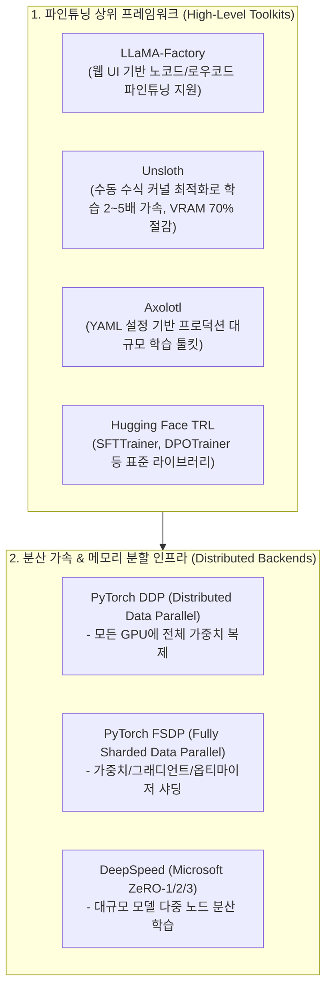
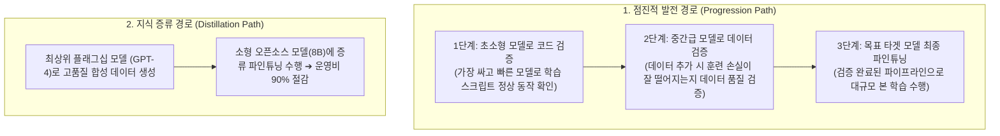
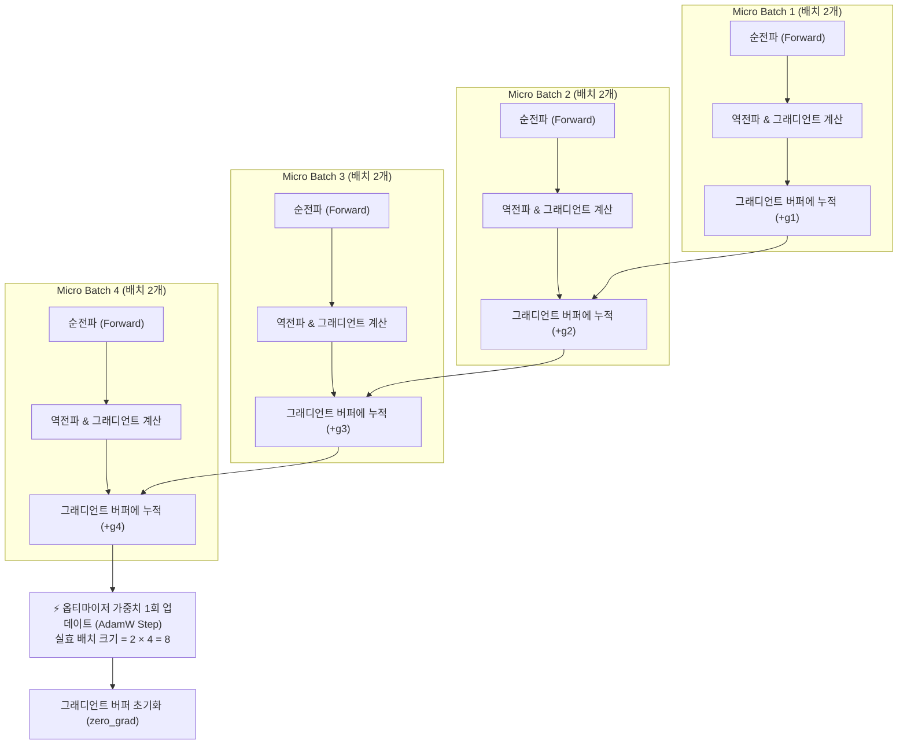

# 05. 파인튜닝 실무 전술과 하이퍼파라미터 최적화 (Finetuning Tactics)

## 📌 핵심 요약 & 전체 맥락
> **"파인튜닝 프레임워크가 발전하여 학습 스크립트를 실행하는 것 자체는 쉬워졌지만, 성공적인 파인튜닝 모델을 만드는 성패는 '정밀한 하이퍼파라미터 조율과 데이터 가중치 엔지니어링'에 달려 있습니다."**  
> 베이스 모델과 파인튜닝 기법(Full FT, LoRA, QLoRA)을 결정한 후, 엔지니어는 **학습률(Learning Rate), 배치 크기(Batch Size), 그래디언트 누적(Gradient Accumulation), 에포크 수(Epochs), 프롬프트 손실 가중치(Prompt Loss Weight)**라는 5대 핵심 하이퍼파라미터를 목적에 맞게 설정해야 합니다.  
> 특히 GPU VRAM 제약으로 인해 작은 배치 크기를 쓸 수밖에 없을 때 발생하는 학습 불안정성을 해결하는 **그래디언트 누적(Gradient Accumulation)**과, 지시 튜닝 시 사용자 프롬프트는 무시하고 오직 모델의 응답에만 손실을 집중시키는 **프롬프트 손실 마스킹(Response-Only Loss Masking)**은 실무 파인튜닝의 필수 기법입니다.  
> 본 섹션에서는 최신 파인튜닝 오픈소스 프레임워크 생태계(Unsloth, LLaMA-Factory, Axolotl, Hugging Face TRL)와 분산 학습 인프라(DeepSpeed, FSDP), 그리고 손실 곡선(Loss Curve) 분석을 통한 실전 하이퍼파라미터 튜닝 및 트러블슈팅 가이드를 총망라합니다.

---

## 🗺️ 도표(Figure & Table) 색인 및 매핑 가이드

본문의 핵심 원리를 시각적으로 확인할 수 있는 책 내 위치와 해설 매핑입니다:

| 항목 | 주제 및 핵심 내용 | 책 페이지 | 본문 해당 섹션 |
| :---: | :--- | :---: | :--- |
| **Section 7.5.1** | 파인튜닝 프레임워크 생태계와 베이스 모델 저장소 (LLaMA-Factory, Unsloth, PEFT, Axolotl, LitGPT) | **pp. 357-358** | 1. 파인튜닝 프레임워크 및 인프라 |
| **Section 7.5.2** | 학습률(Learning Rate) 선정 범위($10^{-7} \sim 10^{-3}$) 및 스케줄러와 손실 곡선 진단 | **pp. 358-359** | 2. 학습률(Learning Rate)과 스케줄러 |
| **Section 7.5.3** | 배치 크기(Batch Size)와 그래디언트 누적(Gradient Accumulation)의 수학적 원리 | **pp. 359-360** | 3. 배치 크기와 그래디언트 누적 |
| **Section 7.5.4** | 에포크(Number of Epochs) 결정과 Train/Val 손실 곡선을 통한 과적합(Overfitting) 진단 | **p. 360** | 4. 에포크 수와 과적합 진단 |
| **Section 7.5.5** | 프롬프트 손실 가중치(Prompt Loss Weight)와 응답 마스킹(Response-Only Loss) | **pp. 360-361** | 5. 프롬프트 손실 가중치 |

---

## 1. 파인튜닝 프레임워크 및 인프라 생태계 (pp. 357 ~ 358)

파운데이션 모델의 파인튜닝은 바닥부터 코드를 짤 필요 없이 검증된 고수준 오픈소스 프레임워크를 활용하는 것이 표준입니다.



### ① 주요 파인튜닝 프레임워크 비교

| 프레임워크 | 주요 특징 및 강점 | 권장 사용 시나리오 |
| :--- | :--- | :--- |
| **Unsloth** | Triton 커널 수동 재작성으로 역전파 연산 가속, LoRA/QLoRA 학습 속도 **2~5배 가속**, **VRAM 소모 70~80% 절감** | 단일 GPU(RTX 3090/4090, A100 1장) 환경에서 빠른 실험 |
| **LLaMA-Factory** | 100개 이상의 오픈소스 모델 지원, Gradio 기반 GUI 웹 인터페이스 제공, SFT/DPO/PPO 올인원 지원 | 노코드/웹 UI로 빠르게 파이프라인을 검증하고 싶을 때 |
| **Axolotl** | 선언적 YAML 설정 파일로 전체 학습 파이프라인 제어, 다양한 어텐션 메커니즘(FlashAttention-2) 및 패킹 지원 | 재현성이 중요한 팀 단위 엔지니어링 및 클라우드 클러스터 학습 |
| **LitGPT (Lightning AI)** | PyTorch Lightning 기반의 가볍고 모듈화된 파인튜닝/사전학습/서빙 통합 프레임워크 | 엔지니어가 직접 코드를 수정하며 커스텀 아키텍처를 실험할 때 |
| **Hugging Face TRL** | `SFTTrainer`, `DPOTrainer` 등 트랜스포머 표준 생태계와의 완벽한 호환성, 커스텀 데이터셋 연동 용이 | 파이썬 코드로 직접 파이프라인을 세밀하게 제어할 때 |

---

### ② 베이스 모델 선정 및 개발 경로 (OpenAI Best Practices, pp. 357 ~ 358)
파인튜닝을 시작할 때 OpenAI가 제안하는 2가지 전형적인 개발 경로(Development Paths):



* **라이선스 제약 확인:**
  * **완전 상업적 허용:** Apache 2.0, MIT 라이선스 (예: Mistral-7B, Qwen2.5) ➔ 제약 없이 상업적 서비스 및 SaaS 배포 가능.
  * **조건부 상업적 허용:** Llama 3 Community License (월간 활성 사용자 7억 명 이하 등 특정 조건 충족 필요).
  * **비상업적 연구 전용:** CC-BY-NC 라이선스 ➔ 상업적 제품화 불가.

### ③ 다중 GPU 분산 학습 백엔드 (Distributed Training)
단일 머신의 VRAM을 초과하는 대규모 모델이나 풀 파인튜닝을 진행할 때는 분산 학습 프레임워크가 필수적입니다:
* **PyTorch DDP:** 각 GPU마다 모델 전체를 복제하고 그래디언트만 올리듀스(All-Reduce) 동기화 (모델이 단일 GPU에 들어갈 때만 사용 가능).
* **PyTorch FSDP (Fully Sharded Data Parallel):** 가중치, 그래디언트, 옵티마이저 상태를 여러 GPU에 걸쳐 조각내어(Sharding) 저장함으로써 거대 모델 학습 가능.
* **DeepSpeed ZeRO (Zero Redundancy Optimizer):**
  * **ZeRO-Stage 1:** 옵티마이저 상태 분할 (메모리 4배 절감)
  * **ZeRO-Stage 2:** 옵티마이저 상태 + 그래디언트 분할 (메모리 8배 절감)
  * **ZeRO-Stage 3:** 옵티마이저 + 그래디언트 + 모델 가중치 전면 분할 (GPU 메모리 한계 극복)

---

## 2. 학습률(Learning Rate)과 스케줄러 (pp. 358 ~ 359)

학습률(Learning Rate, $\eta$)은 매 스텝마다 모델의 가중치를 얼마만큼의 보폭(Step Size)으로 업데이트할지 결정하는 가장 결정적인 하이퍼파라미터입니다.

### ① 파인튜닝 학습률의 경험적 규칙
* **탐색 범위:** 일반적으로 **$10^{-7} \sim 10^{-3}$ ($1\text{e-}7 \sim 1\text{e-}3$)** 사이에서 실험합니다.
* **사전 훈련 LR 기반 휴리스틱:**
  * 파인튜닝은 모델이 이미 학습한 지식을 파괴하지 않고 미세 조정해야 하므로, **사전 훈련(Pre-training) 종료 시점의 최종 학습률에 $0.1 \sim 1.0$ 배율을 곱한 값**을 시작점으로 설정하는 것이 표준입니다.
  * **Full Fine-Tuning:** $1\text{e-}5 \sim 5\text{e-}5$ (가중치 전체가 흔들리므로 매우 작은 보폭 사용)
  * **LoRA / QLoRA:** $1\text{e-}4 \sim 5\text{e-}4$ (사전 훈련 가중치는 고정되고 작은 어댑터만 학습하므로 상대적으로 큰 LR 사용 가능)

### ② 손실 곡선(Loss Curve)을 통한 학습률 진단

```
[ 손실 곡선(Loss Curve) 패턴 분석 및 대처법 ]

1. 손실 값이 극심하게 출렁거리거나 NaN/무한대로 발산 (Fluctuating / Diverging)
   ➔ 원인: 학습률이 너무 큼 (Overstepping)
   ➔ 조치: 학습률을 1/2 ~ 1/10 수준으로 대폭 축소

2. 손실 값이 매우 안정적이지만 수천 스텝이 지나도 거의 줄어들지 않음 (Plateau)
   ➔ 원인: 학습률이 너무 작음 (Understepping)
   ➔ 조치: 손실 곡선이 안정성을 유지하는 한도 내에서 학습률을 점진적으로 상향

3. 초반에 급격히 감소하다가 완만하게 최적점으로 수렴 (Smooth Convergence) 🏆
   ➔ 이상적인 최적 학습률 상태
```

### ③ 학습률 스케줄러 (Learning Rate Schedules)
고정된 학습률을 쓰는 대신, 학습 단계에 따라 학습률을 동적으로 변화시킵니다:
* **웜업 (Warmup):** 학습 초기(전체 스텝의 3~10%)에는 0에서 목표 학습률까지 선형적으로 서서히 증가시켜, 초반의 무작위 그래디언트로 인해 가중치가 파괴되는 현상을 방지.
* **코사인 감쇠 (Cosine Annealing Decay):** 웜업 이후 학습률을 코사인 곡선을 따라 0에 가깝게 완만하게 줄여 최적의 극소점(Local Minima)에 안정적으로 안착시킴.

---

## 3. 배치 크기와 그래디언트 누적 (pp. 359 ~ 360) ⭐

### ① 배치 크기(Batch Size)의 딜레마
* **작은 배치 크기 ($< 8$):** 개별 샘플의 노이즈에 크게 휘둘려 가중치 업데이트 방향이 심하게 흔들리고 학습이 불안정해짐.
* **큰 배치 크기 ($32 \sim 128+$):** 여러 데이터의 그래디언트가 평균화되어 안정적이고 신뢰할 수 있는 방향으로 수렴하며 처리 속도가 빨라짐.
* ❌ **하드웨어 메모리 병목:** 거대 LLM은 모델 가중치와 활성화 메모리 때문에 GPU VRAM에 큰 배치를 올릴 수 없습니다 (Batch Size = 1 또는 2만 올려도 OOM 발생).

### ② 그래디언트 누적 (Gradient Accumulation, Watcharapichat et al., 2016)
하드웨어 메모리 한계로 인해 실제 GPU에는 작은 마이크로 배치(Micro-batch)만 올리면서도, 수학적으로는 큰 배치 크기를 적용한 것과 100% 동일한 효과를 내는 기법입니다 (분산 학습 시스템 연구인 *Ako* 논문에서 출발):



$$\text{Effective Batch Size} = \text{Per-Device Micro Batch Size} \times \text{Gradient Accumulation Steps} \times \text{Number of GPUs}$$

* **실무 예시:**
  * GPU VRAM 제약으로 `per_device_train_batch_size = 2`만 가능할 때,
  * `gradient_accumulation_steps = 16`을 설정하면,
  * **실효 배치 크기(Effective Batch Size)는 $2 \times 16 = 32$**가 되어 안정적인 대규모 배치 학습 효과를 누릴 수 있습니다.

---

## 4. 에포크(Epochs) 수와 과적합 진단 (p. 360)

에포크(Epoch)는 **전체 학습 데이터셋을 처음부터 끝까지 한 바퀴 완전히 순회한 횟수**를 의미합니다.

### ① 데이터셋 크기별 권장 에포크 수
* **대규모 데이터셋 (수십만 ~ 수백만 건):** **1 ~ 2 에포크**로 충분합니다. 데이터 자체가 방대하므로 1회 순회만으로도 모델이 충분한 패턴을 학습하며, 그 이상 학습하면 과적합 위험이 커집니다.
* **소규모 데이터셋 (수백 ~ 수천 건):** **3 ~ 10 에포크**가 필요할 수 있습니다. 데이터의 표본 수가 적기 때문에 반복 노출을 통해 형식을 체화시켜야 합니다.

### ② Train Loss vs Validation Loss 다이버전스 분석

```
[ 과적합(Overfitting) 진단 매트릭스 ]

1. 학습 진행 중 (정상 상태):
   • Training Loss   : ───↘ (감소)
   • Validation Loss : ───↘ (감소)
   ➔ 해석: 모델이 일반화(Generalization) 능력을 잘 키우고 있음. 추가 학습 가능!

2. 과적합 발생 (조기 종료 시점):
   • Training Loss   : ──────↘ (계속 감소)
   • Validation Loss : ───↗ (다시 증가하기 시작 - Divergence!)
   ➔ 해석: 모델이 학습 데이터를 단순 암기(Memorization)하기 시작함.
   ➔ 조치: 에포크 수를 줄이거나, Validation Loss가 최소였던 체크포인트로 롤백(Early Stopping).
```

---

## 5. 프롬프트 손실 가중치와 응답 마스킹 (pp. 360 ~ 361) ⭐

지도 미세조정(SFT / Instruction Finetuning)에서 각 학습 샘플은 **지시문(Prompt)**과 **모범 응답(Response)**의 쌍으로 이루어집니다:

$$\text{Training Sample} = \underbrace{\text{"다음 영문 기사를 한국어로 3줄 요약해줘: [기사 내용]" }}_{\text{Prompt (Input)}} + \underbrace{\text{"1. ... 2. ... 3. ..." }}_{\text{Response (Target)}}$$

### ① 프롬프트에 손실을 계산하면 안 되는 이유
* **추론(Inference) 환경의 본질:** 실제 서비스 환경에서 프롬프트는 사용자가 입력하는 데이터이며 모델이 생성하는 대상이 아닙니다. 모델이 생성해야 하는 것은 오직 **응답(Response)**입니다.
* 만약 프롬프트 토큰에 대해서도 동일한 손실(Cross-Entropy Loss)을 계산하면, 모델은 '사용자 프롬프트 텍스트 자체를 예측하는 데' 아까운 파라미터 용량을 낭비하게 됩니다.

### ② 프롬프트 손실 가중치 (Prompt Loss Weight) 설정 비교 (pp. 360 ~ 361)
프롬프트 손실 가중치는 프롬프트 토큰이 전체 손실에 기여하는 비중을 결정합니다:

| 가중치 설정 | 동작 메커니즘 | 학습 효과 및 장단점 |
| :--- | :--- | :--- |
| **100% (Default LM)** | 프롬프트와 응답의 모든 토큰에 대해 동일한 언어 모델 손실 계산 | 사전학습 방식 그대로 진행되며, 지시문 생성에 불필요한 가중치 낭비 발생 |
| **10% (Framework Default)** | 프롬프트 손실을 10%만 반영하고 응답 손실을 90% 반영 | 프롬프트 구조 이해를 보조하면서 응답 생성에 집중하는 절충형 기본값 |
| **0% (Response-Only Masking) 🏆** | 프롬프트 토큰 레이블을 `-100`으로 마스킹하여 오직 응답 토큰에서만 손실 계산 | **실무 SFT 절대 표준 🏆** (추론 환경과 완벽히 일치하여 최고 성능 달성) |

```python
# PyTorch / Hugging Face SFTTrainer의 DataCollatorForCompletionOnlyLM 원리
labels = input_ids.clone()
# 프롬프트 영역의 인덱스를 찾아 -100(ignore_index)으로 마스킹 (손실 계산 제외)
labels[:prompt_end_idx] = -100  
loss = cross_entropy_loss(logits, labels)  # 응답 토큰에서만 loss 발생!
```

---

## 6. 파인튜닝 실무 체크리스트 & 트러블슈팅

```
[ 파인튜닝 성공을 위한 6단계 실무 체크리스트 ]

□ 1단계: 베이스 모델 선정 (Task에 적합한 아키텍처 및 라이선스 확인)
□ 2단계: 파인튜닝 방식 결정 (단일 GPU면 QLoRA/LoRA ➔ 다중 GPU면 FSDP Full FT)
□ 3단계: 학습률 설정 (LoRA 기준 2e-4 시작, Warmup 3% + Cosine Decay 스케줄러 적용)
□ 4단계: 실효 배치 크기 확보 (Micro-batch 2~4 설정 후 Gradient Accumulation 8~16으로 실효 배치 32~64 구성)
□ 5단계: 손실 마스킹 적용 (프롬프트 토큰 레이블을 -100으로 마스킹하여 Response에만 손실 집중)
□ 6단계: 과적합 모니터링 (50스텝마다 Eval Loss를 측정하여 Val Loss 반등 시 학습 조기 종료)
```

---

## 7. 엔지니어링 심화 Q&A

### Q1. LoRA 학습 시 손실(Loss)이 전혀 떨어지지 않고 평평하게 유지됩니다. 무엇을 점검해야 하나요?
1. **학습률(Learning Rate) 과소:** LoRA는 전체 가중치가 아닌 극소수 어댑터만 학습하므로 Full FT보다 훨씬 큰 LR($1\text{e-}4 \sim 5\text{e-}4$)이 필요합니다. $1\text{e-}5$ 이하로 설정되어 있다면 LR을 10배 이상 올려야 합니다.
2. **LoRA 타겟 모듈 누락:** $W_q, W_v$ 등 극히 일부 레이어에만 어댑터를 부착했는지 확인하고, $W_k, W_o, \text{gate\_proj}, \text{up\_proj}, \text{down\_proj}$ 등 모든 Linear 레이어로 타겟을 확장해 보세요.
3. **데이터 레이블 마스킹 오류:** 프롬프트 손실 마스킹 과정에서 응답 토큰까지 실수로 전부 `-100`으로 마스킹되어 계산할 손실이 0이 되었는지 확인해야 합니다.

### Q2. Unsloth는 어떻게 동일한 GPU에서 학습 속도를 2~5배 가속하고 VRAM을 절감하나요?
Unsloth는 PyTorch의 고수준 자동 미분(Autograd) 연산자를 사용하는 대신, OpenAI의 **Triton 언어를 사용하여 트랜스포머의 어텐션, RoPE(회전 위치 임베딩), Cross-Entropy 손실 함수, LoRA 행렬 곱셈 커널을 수동으로 통합 작성(Kernel Fusion)**했습니다.  
중간 단계의 불필요한 텐서 메모리 할당(Allocations)과 GPU VRAM 읽기/쓰기 오버헤드를 완벽히 제거하여 극단적인 속도 향상과 70% 이상의 메모리 절감을 달성했습니다.

---

## 🔗 연관 문서
* [[00-ch07-overview|00. Chapter 7 전체 개요 및 목차]]
* [[01-finetuning-foundations-and-decision-framework|01. 파인튜닝 기초와 엔지니어링 의사결정 프레임워크]]
* [[02-memory-math-and-quantization|02. 학습 메모리 수학과 수치 정밀도 및 양자화]]
* [[03-peft-lora-and-qlora|03. 매개변수 효율적 파인튜닝(PEFT)과 LoRA / QLoRA]]
* [[04-model-merging-and-weight-arithmetic|04. 모델 병합(Model Merging)과 가중치 산술 연산]]
* [[chapter-qa/ch08-datasets-and-data-engineering-qa/01-data-curation-and-quality|Ch08-01. 파인튜닝 데이터 큐레이션 및 품질 관리]]
