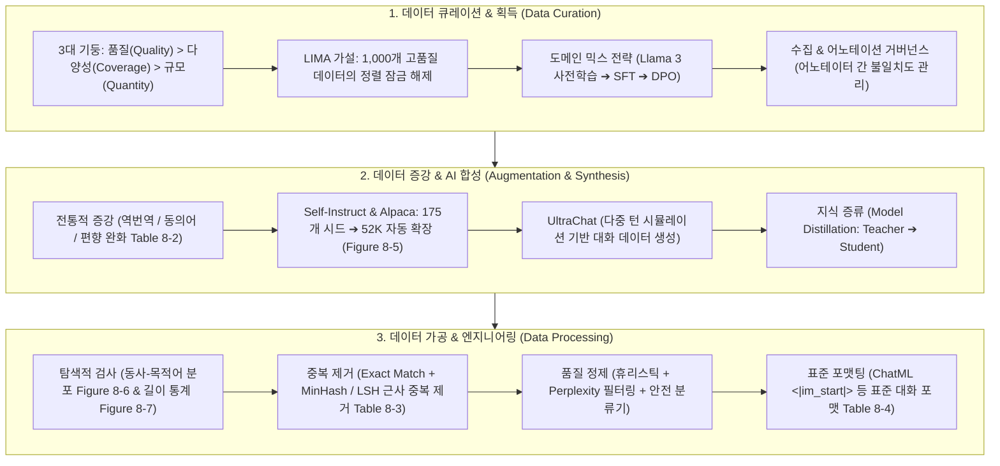

# Chapter 08. 데이터셋 엔지니어링과 데이터 품질 (Dataset Engineering)

> **"전통적인 머신러닝이 알고리즘 중심(Model-Centric)이었다면, 파운데이션 모델 시대의 핵심 경쟁력은 고품질 데이터를 설계하고 정제하는 데이터 중심(Data-Centric AI)에 있습니다."**  
> 아무리 매개변수가 큰 최첨단 모델이라도 저품질의 노이즈 데이터로 학습시키면 치명적인 성능 저하와 환각을 겪게 됩니다 (*"Garbage In, Garbage Out"*).  
> 본 챕터에서는 **데이터 큐레이션의 3대 기둥(품질, 다양성, 규모)**과 1,000개 고품질 데이터의 힘을 증명한 **LIMA 가설**, **사내 데이터 추출 및 어노테이션 거버넌스(Inter-Annotator Agreement)**, 전통적 데이터 증강부터 최신 **AI 합성 데이터 생성 파이프라인(Self-Instruct, Alpaca, UltraChat, 지식 증류)**, 그리고 대규모 데이터셋의 **탐색적 분석(EDA), 중복 제거(MinHash, LSH), 정제 및 최신 포맷팅 표준(ChatML)**까지 데이터셋 엔지니어링의 모든 것을 심층적으로 다룹니다.

---

## 🗺️ Chapter 8 학습 로드맵 및 소챕터 구성

| 번호 | 문서 제목 | 핵심 내용 및 주요 키워드 | 원문 페이지 |
| :---: | :--- | :--- | :--- |
| **00** | [[00-ch08-overview\|00. Chapter 8 전체 개요 및 목차]] | 데이터셋 엔지니어링 전체 로드맵, 개념 지도 및 도표 총괄 색인 | pp. 363-404 |
| **01** | [[01-data-curation-quality-coverage-and-quantity\|01. 데이터 큐레이션: 품질, 다양성 및 데이터 규모]] | 데이터 큐레이션 3대 기둥, LIMA 가설(Figure 8-1), Llama 3 도메인 믹스 전략(Table 8-1), 데이터 규모와 베이스 모델 체급(Figure 8-2, 8-3), 다중 태스크 다양성(Figure 8-4), 데이터 수집 및 어노테이션 거버넌스 (pp. 363-380) | `Data Curation`, `LIMA Hypothesis`, `Data Quality`, `Data Coverage`, `Domain Mix`, `Data Annotation`, `Inter-Annotator Agreement` |
| **02** | [[02-data-augmentation-and-synthesis\|02. 데이터 증강과 AI 기반 합성 데이터 생성 기법]] | 전통적 데이터 증강 4종(역번역, 동의어, 섭동, 편향 완화 Table 8-2), AI 합성 데이터 파이프라인(Self-Instruct & Alpaca Figure 8-5, UltraChat), 합성 데이터 검증(LLM-as-a-Judge), 교사-학생 지식 증류 (pp. 380-396) | `Data Augmentation`, `Synthetic Data`, `Self-Instruct`, `Stanford Alpaca`, `UltraChat`, `Model Distillation` |
| **03** | [[03-data-processing-deduplication-and-formatting\|03. 데이터 검사, 중복 제거, 정제 및 표준 포맷팅]] | 데이터 통계 검사(Figure 8-6, 8-7), 완전/근사 중복 제거(MinHash, LSH Table 8-3), 휴리스틱/퍼플렉서티 필터링, 데이터 표준 포맷(ChatML, Alpaca 포맷 Table 8-4) (pp. 396-403) | `Data Inspection`, `EDA`, `Deduplication`, `MinHash`, `LSH`, `Data Filtering`, `ChatML`, `Alpaca Format` |

---

## 🧠 Chapter 8 전체 개념 아키텍처 다이어그램

---

## 📊 Chapter 8 주요 도표 & 수치 색인

| 도표 번호 | 도표 제목 및 핵심 내용 | 책 페이지 | 해당 소챕터 |
| :---: | :--- | :---: | :---: |
| **Table 8-1** | Llama 3의 학습 단계별(사전학습, SFT, 선호도 튜닝) 최적 도메인 믹스 구성비 | **p. 371** | 01 |
| **Figure 8-1** | 고품질·고다양성(Filtered StackExchange) vs 저품질·고다양성 vs 고품질·저다양성 7B 모델 품질 비교 (LIMA) | **p. 372** | 01 |
| **Figure 8-2** | 데이터가 적을 때(100개)는 대형 모델이 압도하지만 데이터가 많을 때(55만개)는 소형 모델도 대등해지는 성능 곡선 | **p. 374** | 01 |
| **Figure 8-3** | 데이터셋 크기 증가에 따른 성능 향상 곡선 (초기 급경사 상승 후 완만한 정체 구간 Plateau 진입) | **p. 376** | 01 |
| **Figure 8-4** | 파인튜닝 태스크 다양성(0개 ➔ 282개 ➔ 1,836개) 증가에 따른 미평가 태스크(Held-out) 일반화 성능 곡선 (FLAN) | **p. 377** | 01 |
| **Table 8-2** | 프롬프트 내 대명사 및 고정관념 엔티티 교체를 통해 편향을 완화하는 데이터 증강 예시표 | **p. 385** | 02 |
| **Figure 8-5** | Stanford Alpaca의 175개 시드 태스크로부터 새로운 태스크 및 응답을 자동 생성하는 Self-Instruct 파이프라인 | **p. 390** | 02 |
| **Figure 8-6** | Alpaca 데이터셋의 (동사, 직접목적어) 쌍 중심 원형 분포 분석 (지시 다양성 검증) | **p. 398** | 03 |
| **Figure 8-7** | GPT-4(평균 1,200토큰)와 GPT-3(평균 400토큰)의 응답 길이 분포 비교 (품질 및 스타일 차이) | **p. 399** | 03 |
| **Table 8-3** | 완전 중복 및 의미론적 근사 중복 데이터가 모델 암기와 성능 평가를 왜곡하는 실증 예시표 | **p. 400** | 03 |
| **Table 8-4** | 프롬프트 엔지니어링 예제를 파인튜닝용 학습 데이터 포맷(음식 분류 태스크)으로 변환한 예시표 | **p. 402** | 03 |

---

## 💡 주요 축약어 원문 및 해설 사전 (Abbreviations Glossary)

* **LIMA (Less Is More for Alignment, 정렬을 위한 '적을수록 좋다' 가설):** 사전 훈련된 모델의 능력을 사용자 지시 이행에 맞게 정렬하는 데는 수십만 개의 데이터보다 엄선된 1,000개의 고품질 예시가 훨씬 효과적이라는 Meta의 핵심 연구.
* **Self-Instruct (셀프 인스트럭트):** 소수의 고품질 시드 지시문(Seed Tasks)을 LLM에 입력하여 새로운 지시문, 입력 문맥, 모범 응답을 스스로 대량 증식하는 AI 합성 데이터 생성 프레임워크.
* **Alpaca (알파카):** Stanford 대학에서 175개의 시드 태스크로 GPT-3.5를 활용해 52,000개의 지시 데이터를 자동 생성하고 LLaMA-7B를 파인튜닝한 최초의 공개 합성 데이터 정렬 모델.
* **UltraChat (울트라챗):** 두 개의 LLM 에이전트(사용자 에이전트와 어시스턴트 에이전트)를 대화시켜 복잡한 멀티턴 대화 데이터를 수십만 건 자동 생성하는 시뮬레이션 프레임워크.
* **Model Distillation (지식 증류):** 거대하고 강력한 교사 모델(Teacher Model: GPT-4)의 지식과 출력 분포를 작고 빠른 학생 모델(Student Model: 7B/8B)로 전이시키는 경량화 파이프라인.
* **MinHash (최소 해시):** 두 문서 간의 자카드 유사도(Jaccard Similarity)를 고속으로 근사 계산하기 위해 텍스트 $N$-gram을 해시 함수로 변환하는 알고리즘.
* **LSH (Locality-Sensitive Hashing, 위치 민감 해시):** 유사한 문서들이 동일한 해시 버킷에 들어갈 확률을 높여 대규모 코퍼스에서 $O(N^2)$ 비교 없이 $O(N)$으로 근사 중복을 찾아내는 색인 기법.
* **Perplexity (PPL, 퍼플렉서티/혼란도):** 언어 모델이 주어진 텍스트를 얼마나 자연스럽게 예측하는지 나타내는 지표로, 지나치게 높으면 저품질 노이즈 텍스트로 판정하여 필터링하는 데 활용.
* **ChatML (Chat Markup Language, 챗 마크업 언어):** OpenAI가 도입한 표준 대화 포맷으로, `<|im_start|>system...<|im_end|>` 등의 특수 토큰을 사용해 시스템 지시, 사용자 입력, 모델 응답의 경계를 엄격히 분리하는 포맷.
* **Inter-Annotator Agreement (어노테이터 간 일치도):** 동일한 데이터에 대해 서로 다른 작업자가 라벨링했을 때 판단이 얼마나 일치하는지 측정하여 어노테이션 신뢰도를 검증하는 개념.
