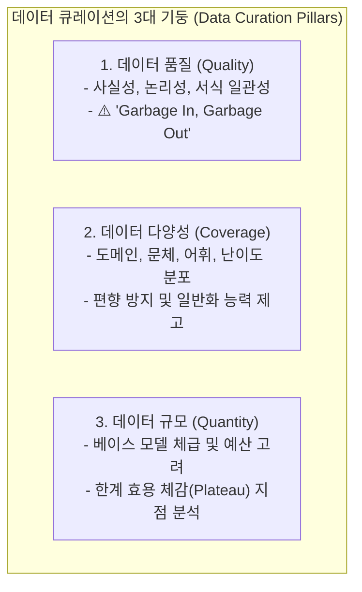
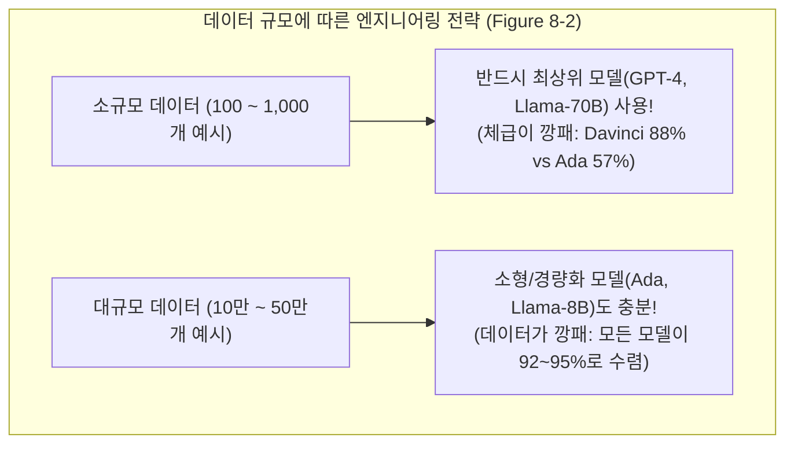

# 01. 데이터 큐레이션: 품질, 다양성 및 데이터 규모

## 📌 핵심 요약 & 전체 맥락
> **"5만 개의 노이즈 데이터보다 엄선된 1천 개의 고품질 데이터가 훨씬 더 강력한 지시 정렬 모델을 만듭니다."**  
> 데이터 중심 AI(Data-Centric AI)의 핵심은 무조건 많은 양(Quantity)을 긁어모으는 것이 아니라, **높은 품질(Quality)과 광범위한 다양성(Coverage)**을 정밀하게 확보하는 것입니다.  
> 2023년 Meta의 **LIMA 가설 (Less Is More for Alignment)**은 정밀하게 큐레이션된 단 1,000개의 예시만으로 52,000개의 Alpaca나 DaVinci 기반 모델을 압도할 수 있음을 실증했습니다 (Figure 8-1).  
> 또한 Llama 3의 **사전 학습 ➔ SFT (Supervised Fine-Tuning) ➔ 선호도 튜닝 (DPO / RLHF) 단계별 최적 도메인 믹스 비율(Table 8-1)**, 데이터가 적을 때와 많을 때의 모델 체급별 성능 곡선(Figure 8-2), 그리고 태스크 다양성 증가에 따른 한계 수렴 법칙(Figures 8-3, 8-4)을 완벽하게 정리합니다.

---

## 🗺️ 도표(Figure & Table) 색인 및 매핑 가이드

본문의 핵심 원리를 시각적으로 확인할 수 있는 책 내 도표의 위치와 해설 매핑입니다:

| 도표 번호 | 도표 제목 및 핵심 내용 | 책 페이지 | 본문 해당 주제 |
| :---: | :--- | :---: | :--- |
| **Table 8-1** | Llama 3의 학습 단계별(사전학습, SFT, 선호도 튜닝) 최적 도메인 믹스 구성비 | **p. 371-395** | 2. 데이터 다양성과 도메인 믹스 |
| **Figure 8-1** | 고품질·고다양성(Filtered StackExchange) vs 저품질·고다양성(Unfiltered) vs 고품질·저다양성(wikiHow) 7B 모델 생성 품질 비교 (LIMA) | **p. 372-396** | 1. 데이터 품질과 LIMA 가설 |
| **Figure 8-2** | 데이터가 적을 때(100개)는 상위 모델(Davinci)이 압도하지만, 데이터가 많을 때(55만개)는 소형 모델(Ada)도 대등해지는 성능 비교표 | **p. 374-398** | 3. 데이터 규모와 베이스 모델 체급 |
| **Figure 8-3** | 데이터셋 크기 증가에 따른 성능 향상 곡선 (초기 급경사 상승 후 완만한 정체 구간 Plateau 진입) | **p. 376-400** | 3. 데이터 스케일링과 한계 효용 체감 |
| **Figure 8-4** | 파인튜닝 태스크 다양성(0개 ➔ 282개 ➔ 1,836개) 증가에 따른 미평가 태스크(Held-out) 일반화 성능 곡선 (FLAN) | **p. 377-401** | 2. 다중 태스크 다양성 스케일링 |

---

## 1. 데이터 큐레이션 3대 기둥과 LIMA 가설 (pp. 363 ~ 373)

### 🌟 LIMA 가설 (Less Is More for Alignment, Zhou et al., 2023)
* **핵심 질문:** *"사전 학습된 모델을 인간의 지시를 따르는 정렬(Alignment) 모델로 만들려면 수십만 개의 방대한 데이터가 필요한가?"*
* **실험 설계 (Figure 8-1):** 7B LLaMA 모델을 2,000개 데이터셋으로 학습시키되 품질과 다양성을 대조군으로 비교:
  1. `wikiHow` (고품질이지만 문체가 단조로운 튜토리얼 포맷 - 저다양성): 생성 품질 **3.49**
  2. `Unfiltered StackExchange` (질문-답변 다양성은 높지만 노이즈와 비속어, 틀린 답변 포함 - 저품질): 생성 품질 **3.33**
  3. `Filtered StackExchange` (엄격한 추천수와 필터링을 거친 고품질 + 고다양성): 생성 품질 **3.83 🚀**
* **결론:**  
  정교하게 사람이 수작업 큐레이션한 **단 1,000개의 고품질 데이터**로 학습한 LIMA 모델이 52,000개의 Alpaca 데이터나 DaVinci-003 기반 모델보다 인간 선호도 블라인드 평가에서 더 높은 승률을 기록했습니다.  
  ➔ **"거대 언어 모델의 지식과 능력은 사전 학습(Pre-training) 단계에서 99% 획득되며, 파인튜닝은 이미 내재된 지식을 올바른 응답 스타일과 사용자 친화적 서식으로 표출시키는 얇은 인터페이스 튜닝에 불과하다."**

---

## 2. 데이터 다양성과 도메인 믹스 전략 (Table 8-1, Figure 8-4)

### ① Llama 3 단계별 최적 도메인 믹스 (Table 8-1, p. 371)

| 도메인 카테고리 | 사전 학습 (Pre-training) | 지도 파인튜닝 (SFT) | 선호도 튜닝 (DPO/RLHF) | 엔지니어링 분석 및 시사점 |
| :--- | :---: | :---: | :---: | :--- |
| **일반 지식 (English)** | 50.00% | 52.66% | **81.99% 🚀** | 선호도 튜닝은 실제 사용자 일상 대화 분포를 집중 반영 |
| **수학 및 추론 (Math & Reasoning)** | **25.00%** | **21.19%** | 5.89% | 사전학습/SFT에서 논리적 추론력 증진을 위해 높은 비중 유지 |
| **코드 데이터 (Coding)** | **17.00%** | **14.89%** | 6.93% | 수학+코드가 SFT의 약 36%를 차지 (모델 인지 지능의 핵심 뼈대) |
| **다국어 (Multilingual)** | 8.00% | 3.01% | 5.19% | 글로벌 언어 토큰 지원 |
| **시험 문제 유형 (Exam-like)** | 0% | **8.14%** | 0% | 벤치마크 및 전문 지식 추론력 주입 |
| **롱 컨텍스트 (Long context)** | 0% | **0.11%** | 0% | 긴 문서 처리 능력 주입 |

> 💡 **코드와 수학 데이터의 어닐링(Annealing) 마법:**  
> Llama 3 연구진은 학습 후반부에 학습률(Learning Rate)을 서서히 낮추며 고품질 코드/수학 데이터 비중을 높이는 **어닐링(Annealing)** 기법을 수행하여 자연어 일반 추론 능력을 극적으로 끌어올렸습니다.

---

### ② 다중 태스크 다양성 스케일링 (FLAN: Chung et al., 2022, Figure 8-4)
* **FLAN (Finetuned Language Net):** 파인튜닝 시 태스크 수를 **0개 ➔ 9개 ➔ 282개**로 늘릴수록 한 번도 보지 못한 미평가 태스크(Held-out tasks)의 제로샷 일반화 정확도가 가파르게 수직 상승합니다.
* **282개 태스크 이상(682개, 1,836개)**에서는 성능 향상이 완만한 정체(Plateau)에 도달합니다.  
  ➔ 실무에서는 단일 작업만 튜닝하기보다 **유관한 다양한 포맷(요약, 분류, Q&A, 번역)을 함께 섞어서 튜닝하는 것이 과적합(Overfitting)을 방지하고 일반화 성능을 유지하는 데 필수적**입니다.

---

## 3. 데이터 규모와 베이스 모델 체급의 상관관계 (Figures 8-2, 8-3)

### 📈 데이터 한계 효용 체감 곡선 (Diminishing Returns, Figure 8-3)
* **초기 급경사 구간 (Steep Slope):** 첫 50~100개의 예시가 모델의 출력 형식 오류를 80% 이상 즉각적으로 교정합니다.
* **완만한 정체 구간 (Plateau Slope):** 1,000개에서 2,000개로 늘릴 때는 10% 향상되지만, 10,000개에서 20,000개로 늘릴 때는 1~2% 미만의 미미한 향상에 그칩니다.
* 💡 **실무 권장 액션:**  
  수만 건의 외주 라벨링을 발주하기 전에, **먼저 50~100개의 고품질 샘플로 파일럿 파인튜닝을 돌려보고 성능 개선 여부를 검증**해야 합니다.

---

## 🔗 연관 문서
* [[00-ch08-overview|00. Chapter 8 전체 개요 및 목차]]
* [[02-data-augmentation-and-synthesis|02. 데이터 증강과 AI 합성 데이터 (Self-Instruct & Model Collapse)]]
* [[03-data-processing-deduplication-and-formatting|03. 데이터 탐색, 중복 제거 및 포맷팅 엔지니어링]]
* [[chapter-qa/ch07-fine-tuning-qa/01-finetuning-foundations-and-decision-framework|Ch07-01. 파인튜닝 기초와 엔지니어링 의사결정 프레임워크]]
