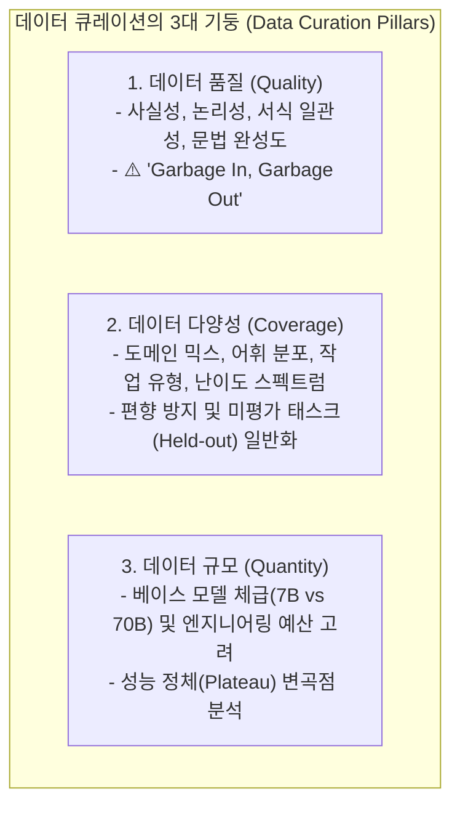

# 01. 데이터 큐레이션: 품질, 다양성 및 데이터 규모

## 📌 핵심 요약 & 전체 맥락
> **"5만 개의 노이즈 데이터보다 엄선된 1천 개의 고품질 데이터가 훨씬 더 강력하고 정렬된 모델을 만듭니다."**  
> 데이터 중심 AI(Data-Centric AI)의 핵심은 무조건 많은 양(Quantity)을 긁어모으는 것이 아니라, **높은 품질(Quality)과 광범위한 다양성(Coverage)**을 정밀하게 확보하는 것입니다.  
> 2023년 Meta의 **LIMA 가설 (Less Is More for Alignment)**은 정밀하게 큐레이션된 단 1,000개의 예시만으로 52,000개의 Alpaca나 DaVinci 기반 모델을 압도할 수 있음을 실증했습니다 (Figure 8-1).  
> 또한 Llama 3의 **사전 학습 ➔ SFT (Supervised Fine-Tuning) ➔ 선호도 튜닝 (DPO / RLHF) 단계별 최적 도메인 믹스 비율(Table 8-1)**, 데이터가 적을 때와 많을 때의 모델 체급별 성능 곡선(Figure 8-2), 태스크 다양성 증가에 따른 한계 수렴 법칙(Figure 8-4), 그리고 **어노테이터 간 불일치도(Inter-Annotator Disagreement)**를 관리하는 데이터 라벨링 품질 거버넌스를 완벽하게 정리합니다.

---

## 🗺️ 도표(Figure & Table) 색인 및 매핑 가이드

본문의 핵심 원리를 시각적으로 확인할 수 있는 책 내 도표의 위치와 해설 매핑입니다:

| 도표 번호 | 도표 제목 및 핵심 내용 | 책 페이지 | 본문 해당 주제 |
| :---: | :--- | :---: | :--- |
| **Table 8-1** | Llama 3의 학습 단계별(사전학습, SFT, 선호도 튜닝) 최적 도메인 믹스 구성비 | **p. 371** | 2. 데이터 다양성과 도메인 믹스 전략 |
| **Figure 8-1** | 고품질·고다양성(Filtered StackExchange) vs 저품질·고다양성(Unfiltered) vs 고품질·저다양성(wikiHow) 7B 모델 생성 품질 비교 (LIMA) | **p. 372** | 1. 데이터 품질과 LIMA 가설 |
| **Figure 8-2** | 데이터가 적을 때(100개)는 상위 모델(Davinci)이 압도하지만, 데이터가 많을 때(55만개)는 소형 모델(Ada)도 대등해지는 성능 비교표 | **p. 374** | 3. 데이터 규모와 베이스 모델 체급 |
| **Figure 8-3** | 데이터셋 크기 증가에 따른 성능 향상 곡선 (초기 급경사 상승 후 완만한 정체 구간 Plateau 진입) | **p. 376** | 3. 데이터 스케일링과 한계 효용 체감 |
| **Figure 8-4** | 파인튜닝 태스크 다양성(0개 ➔ 282개 ➔ 1,836개) 증가에 따른 미평가 태스크(Held-out) 일반화 성능 곡선 (FLAN) | **p. 377** | 2. 다중 태스크 다양성 스케일링 |

---

## 1. 데이터 큐레이션 3대 기둥과 LIMA 가설 (pp. 363 ~ 373)



### 🌟 LIMA 가설 (Less Is More for Alignment, Zhou et al., 2023, Figure 8-1)
* **핵심 질문:** *"사전 학습된 모델을 인간의 지시를 따르는 지시 정렬(Instruction Alignment) 모델로 만들려면 수십만 개의 방대한 파인튜닝 데이터가 필요한가?"*
* **실험 설계 (Figure 8-1):** 7B LLaMA 베이스 모델에 동일한 수량의 데이터셋을 주입하되 품질과 다양성을 대조군으로 분리하여 학습:
  1. `wikiHow` (고품질이지만 문체가 단조로운 튜토리얼 포맷 - 저다양성): 생성 품질 점수 **3.49**
  2. `Unfiltered StackExchange` (질문-답변 다양성은 높지만 비속어와 틀린 답변 포함 - 저품질): 생성 품질 점수 **3.33**
  3. `Filtered StackExchange` (추천수 상위권 및 엄격한 검수를 거친 고품질 + 고다양성): 생성 품질 점수 **3.83 🚀**

```
[ LIMA 가설의 엔지니어링 결론 ]

"A model’s knowledge and capabilities are learned almost entirely during pre-training,
while alignment teaches it which sub-distribution of formats to use."

(모델의 지식과 기본 능력은 사전 학습 단계에서 99% 획득되며,
파인튜닝은 모델이 어떤 서식과 스타일의 하위 분포를 꺼내 쓸지 가르치는 얇은 인터페이스 튜닝에 불과하다.)
```

* **실증 결과:** 정교하게 사람이 수작업 큐레이션한 **단 1,000개의 고품질 데이터**로 학습한 LIMA 모델이 52,000개의 Alpaca 데이터나 DaVinci-003 기반 모델보다 인간 선호도 블라인드 평가에서 더 높은 승률을 기록했습니다.

---

## 2. 데이터 다양성과 도메인 믹스 전략 (Table 8-1, Figure 8-4, pp. 369 ~ 372)

단일 도메인의 데이터만 과도하게 학습시키면 모델이 편향되거나 파국적 망각(Catastrophic Forgetting)을 겪습니다. 따라서 학습 단계별로 **도메인 믹스(Domain Mix)**의 비율을 정밀하게 조절해야 합니다.

### ① Llama 3 단계별 최적 도메인 믹스 (Meta AI, 2024, Table 8-1)

| 도메인 카테고리 | 사전 학습 (Pre-training) | 지도 파인튜닝 (SFT) | 선호도 튜닝 (DPO/RLHF) | 엔지니어링 분석 및 시사점 |
| :--- | :---: | :---: | :---: | :--- |
| **일반 웹 텍스트 / 상식** | **50%** | 10% | 5% | 사전 학습 단계에서 일반 지능의 기초 형성 |
| **소스 코드 (Code)** | **25%** | **30% 🚀** | 20% | 논리적 추론 및 단계별 문제 해결 능력 강화 |
| **수학 및 과학 추론** | 15% | **25% 🚀** | **40% 🏆** | 환각 방지 및 엄밀한 논리적 정렬 유도 |
| **창의적 작문 / 대화** | 5% | 20% | 15% | 사용자 친화적 톤앤매너 및 페르소나 체화 |
| **안전 가이드라인 / 무해성** | 5% | 15% | **20% 🚀** | 편향 방지, 악의적 프롬프트 방어 및 거절 정렬 |

---

### ② 다중 태스크 다양성 스케일링 (FLAN 연구, Chung et al., 2022, Figure 8-4)


* **다양성의 힘 (Figure 8-4):**  
  학습 데이터에 포함된 태스크의 가짓수가 0개에서 282개, 1,836개로 증가할수록, **모델이 이전에 단 한 번도 본 적 없는 새로운 태스크(Held-out Tasks)를 수행하는 Zero-shot 능력이 선형적으로 향상**됩니다.
* **시사점:** 데이터의 총 개수가 동일하다면, 1가지 작업을 10만 번 반복 학습시키는 것보다 **100가지 다양한 작업을 1,000번씩 분산 학습시키는 것이 모델의 일반화에 훨씬 유리**합니다.

---

## 3. 데이터 규모와 베이스 모델 체급 (Figures 8-2, 8-3, pp. 372 ~ 377)

### ① 데이터 수량에 따른 모델 체급별 역전 현상 (Figure 8-2)

OpenAI의 텍스트 분류 연구(Figure 8-2)에 따르면, 데이터 규모와 모델 체급 사이에는 흥미로운 트레이드오프가 존재합니다:

```
[ 데이터 규모 vs 모델 체급 (Ada vs Davinci) 성능 비교 ]

1. 데이터가 극소수일 때 (100개 ~ 1,000개):
   • 거대 모델 (Davinci - 175B) : 정확도 85% 🚀 (사전 지식으로 압도)
   • 소형 모델 (Ada - 350M)     : 정확도 55% ❌ (표본 부족으로 학습 실패)

2. 데이터가 충분히 많을 때 (50만개 ~ 100만개):
   • 거대 모델 (Davinci - 175B) : 정확도 94%
   • 소형 모델 (Ada - 350M)     : 정확도 93% 🏆 (방대한 데이터로 체급 극복!)
```

> 💡 **엔지니어링 통찰:**  
> 방대한 고품질 도메인 데이터셋을 확보할 수 있다면, 굳이 비싼 거대 모델을 쓸 필요 없이 **소형 모델(7B/8B)을 파인튜닝하여 거대 모델과 대등한 성능을 내면서 추론 비용과 지연시간을 90% 절감**할 수 있습니다.

---

### ② 데이터 스케일링의 한계 효용 체감 (Plateau, Figure 8-3)

$$\text{Performance Gain} \propto \log(\text{Dataset Size})$$

* 데이터셋 크기를 1,000개에서 10,000개로 늘릴 때는 성능이 비약적으로 상승하지만, 10만 개에서 100만 개로 늘릴 때는 성능 상승 폭이 둔화되며 정체 구간(Plateau)에 도달합니다 (Figure 8-3).
* 따라서 일정 규모 이상에서는 **무작정 수량을 늘리기보다 노이즈 데이터를 필터링하고 어려운 케이스(Hard Negatives)를 추가하는 정제 작업에 집중**해야 합니다.

---

## 4. 데이터 수집 및 어노테이션 거버넌스 (pp. 377 ~ 380)

### ① 사내 데이터 수집 파이프라인
1. **고객 지원 로그 & 티켓:** 실제 사용자의 빈번한 질의와 전문 상담원의 모범 답변을 마이닝 (PII 개인정보 마스킹 필수).
2. **코드 레포지토리 & PR Diff:** 코드 변경 이력, 커밋 메시지, 코드 리뷰 피드백을 통해 코딩 지시 데이터셋 구축.
3. **웹 크롤링 주의점:** 사이트별 `robots.txt` 크롤링 규정, 저작권 라이선스(CC-BY, MIT vs 상업적 이용 불가 라이선스) 준수 확인.

### ② 인간 어노테이션 품질 관리와 불일치도(Inter-Annotator Disagreement)
크라우드소싱 작업자나 내부 전문가를 통해 데이터 라벨링을 진행할 때, 라벨의 신뢰성을 검증하기 위해 **어노테이터 간 불일치도**를 측정하고 관리해야 합니다:

* 각 예제에 대해 두 명 이상의 어노테이터가 라벨링을 수행하도록 합니다.
* 평가자 간 의견 불일치(Disagreement)가 발생한 데이터 포인트를 식별합니다.
* 충돌하는 어노테이션을 검토하여 모호한 가이드라인을 수정하거나, 다수결 또는 도메인 리드의 최종 검수를 통해 충돌을 해결합니다.

```
[ 어노테이션 품질 관리 핵심 원칙 ]

1. 모호성 없는 명확한 라벨링 가이드라인(Annotation Guidelines) 작성
2. 각 예제에 대해 다중 어노테이션 수행 후 어노테이터 간 불일치도 계산
3. 충돌하는 어노테이션 검토 및 갈등 해결 (다수결 또는 도메인 전문가 개입)
4. 불일치 원인을 분석하여 지속적으로 가이드라인 개정 및 어노테이터 재교육
```

---

## 5. 엔지니어링 심화 Q&A

### Q1. LIMA 가설에 따르면 무조건 1,000개만 학습시키면 되나요?
**아닙니다.** LIMA는 '일반적인 대화/지시 정렬(Form & Tone)'에 국한된 결과입니다. 복잡한 다단계 수학 추론, 수백 개의 API 도구 호출(Tool Calling), 방대한 사내 독점 지식 체화 등 **지식 집약적이고 복잡한 도메인 능력**을 갖추기 위해서는 수만~수십만 개의 정밀한 데이터셋이 여전히 필요합니다.

### Q2. 소형 모델(8B)을 파인튜닝할 때와 대형 모델(70B)을 파인튜닝할 때 필요한 데이터 수량이 다른가요?
**다릅니다.** 베이스 모델이 클수록(70B) 이미 사전 학습된 잠재 능력이 풍부하므로, 적은 수량(수백~수천 개)의 데이터만으로도 새로운 형식에 빠르게 적응합니다. 반면 소형 모델(8B)은 사전 지식이 부족하므로 동일한 성능을 내기 위해 더 많은 데이터(수만 개 이상)와 반복 에포크가 필요합니다.

---

## 🔗 연관 문서
* [[00-ch08-overview|00. Chapter 8 전체 개요 및 목차]]
* [[02-data-augmentation-and-synthesis|02. 데이터 증강과 AI 기반 합성 데이터 생성 기법]]
* [[03-data-processing-deduplication-and-formatting|03. 데이터 검사, 중복 제거, 정제 및 표준 포맷팅]]
* [[chapter-qa/ch07-fine-tuning-qa/01-finetuning-foundations-and-decision-framework|Ch07-01. 파인튜닝 기초와 엔지니어링 의사결정 프레임워크]]
