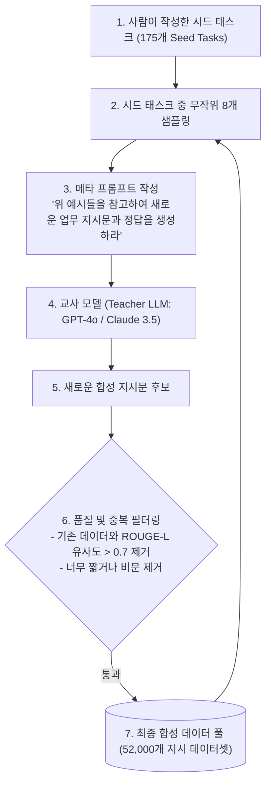

# 02. 데이터 증강과 AI 합성 데이터 (Self-Instruct & Model Collapse)

## 📌 핵심 요약 & 전체 맥락
> **"인간이 작성한 데이터가 고갈되는 시대, AI를 훈련시키기 위해 다른 최고 성능 AI가 데이터를 생성하는 합성 데이터(Synthetic Data)가 필연적인 대안으로 떠올랐습니다."**  
> 사람의 수작업 데이터 수집은 비용이 비싸고 개인정보(PII) 침해 위험이 크며 엣지 케이스가 부족합니다.  
> 이에 스탠퍼드의 **Self-Instruct** 및 **Alpaca**는 소수의 시드(Seed) 태스크 175개로부터 GPT-4를 호출하여 52,000개의 고품질 지시 데이터셋을 단 500달러 미만의 비용으로 전자동 합성해 냈습니다 (Figure 8-5).  
> 그러나 AI가 생성한 합성 데이터를 다음 세대 모델이 재귀적으로 다시 학습하는 과정에서 데이터 분포의 꼬리(Tail) 부분이 영구 유실되어 출력이 횡설수설 망가지는 **모델 붕괴 (Model Collapse / The Curse of Recursion)** 위험성을 엄격히 통제해야 합니다.

---

## 🗺️ 도표(Figure & Table) 색인 및 매핑 가이드

본문의 핵심 원리를 시각적으로 확인할 수 있는 책 내 도표의 위치와 해설 매핑입니다:

| 도표 번호 | 도표 제목 및 핵심 내용 | 책 페이지 | 본문 해당 주제 |
| :---: | :--- | :---: | :--- |
| **Table 8-2** | '의사-남성', '간호사-여성' 성별 편향을 반대 대명사로 뒤집어 완화하는 반사실적 데이터 증강(CDA) 예시표 | **p. 382** | 1. 전통적 데이터 증강 기법 |
| **Figure 8-5** | Alpaca에서 175개의 수작업 Seed 지시문과 GPT-3.5가 자동 합성한 52,000개 태스크의 동사-명사 분포 비교 | **p. 386** | 2. AI 기반 합성 데이터 생성 (Self-Instruct) |

---

## 1. 전통적 데이터 증강 기법과 편향 완화 (pp. 379 ~ 383)

1. **역번역 (Back-Translation):**  
   한국어 문장을 영어로 번역했다가 다시 한국어로 재번역하여 의미는 100% 동일하지만 문장 구조와 어휘가 다양한 패러프레이징 샘플을 무한정 생성.
2. **반사실적 데이터 증강 (CDA, Counterfactual Data Augmentation, Table 8-2):**  
   사회적 성별/인종 편향을 해소하기 위해 텍스트 속의 특정 키워드를 대칭적으로 교체한 쌍(Pair) 데이터를 생성:
   * *원본:* `"의사가 병원에 도착했을 때, **그(He)**는 즉시 수술실로 향했다."*
   * *증강:* `"의사가 병원에 도착했을 때, **그녀(She)**는 즉시 수술실로 향했다."*

---

## 2. AI 기반 합성 데이터 생성 기법 (pp. 383 ~ 389, Figure 8-5)



* **Evol-Instruct (WizardLM):**  
  기존의 단순한 질문을 AI를 이용해 **구속조건 추가(Deepening), 구체화(Concretizing), 다단계 추론화(Reasoning)** 단계로 점진적 진화시켜 초고난도 수학/코딩 데이터셋을 합성하는 기법.
* **Constitutional AI 및 RLAIF (Reinforcement Learning from AI Feedback):**  
  인간 라벨러 대신 사전에 정의된 '윤리 헌법(Constitution)' 원칙에 따라 AI가 모델의 출력을 스스로 비판(Critique)하고 수정(Revision)하여 무해한 안전 데이터셋을 생성하는 앤스로픽(Anthropic)의 핵심 기법.

---

## 3. 모델 붕괴 위험: 재귀의 저주 (Model Collapse: The Curse of Recursion, pp. 389 ~ 391) ⭐

* **모델 붕괴 현상 (Shumailov et al., Nature 2024):**  
  AI가 생성한 합성 데이터만을 가지고 다음 세대 AI를 학습시키고, 그 AI가 만든 데이터로 또 다음 세대 AI를 학습시키는 **재귀적 루프(Recursive Training Loop)**를 반복하면 모델의 지능이 완전히 파괴되는 현상.

```
[ 모델 붕괴가 일어나는 3단계 메커니즘 ]

1세대 모델 (인간 데이터 학습) ──▶ 데이터 분포의 중심(평범한 내용)과 꼬리(희귀한 지식)를 모두 학습
2세대 모델 (1세대 합성 데이터) ──▶ 확률이 낮은 꼬리(Tail) 영역의 정보가 먼저 증발 (분산 축소)
5세대 모델 (반복 재귀 학습)    ──▶ 극단적인 모드 붕괴(Mode Collapse) 발생 ➔ "중세 건축" 질문에 개구리 소리만 반복 출력
```

* **엔지니어링 방지책:**  
  1. **골든 앵커 (Golden Anchor):** 학습 코퍼스에 반드시 **검증된 인간 원본 데이터(Human-generated data)를 최소 20~30% 이상 필수 배합**할 것.
  2. **엄격한 사실성 검증기:** 생성된 합성 데이터를 필터링 없이 그대로 넣지 말고, 컴파일러(코드), 단위 테스트, 수학 연산기 등을 통해 **100% 정답이 입증된 데이터만 풀에 주입**할 것.

---

## 🔗 연관 문서
* [[00-ch08-overview|00. Chapter 8 전체 개요 및 목차]]
* [[01-data-curation-quality-coverage-and-quantity|01. 데이터 큐레이션: 품질, 다양성 및 데이터 규모]]
* [[03-data-processing-deduplication-and-formatting|03. 데이터 탐색, 중복 제거 및 포맷팅 엔지니어링]]
* [[chapter-qa/ch07-fine-tuning-qa/01-finetuning-foundations-and-decision-framework|Ch07-01. 파인튜닝 기초와 엔지니어링 의사결정 프레임워크]]
