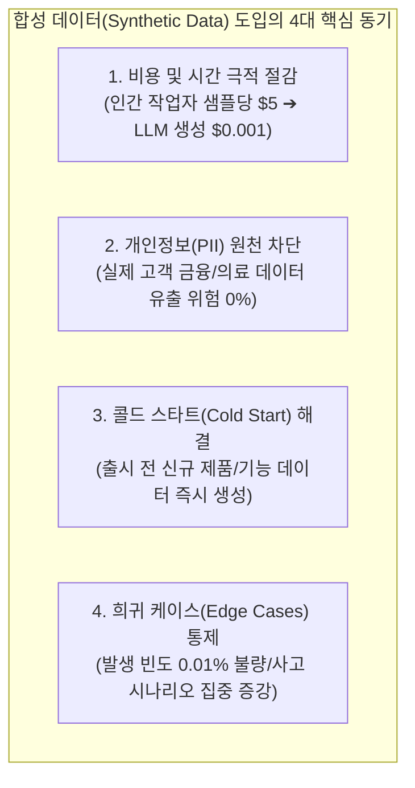
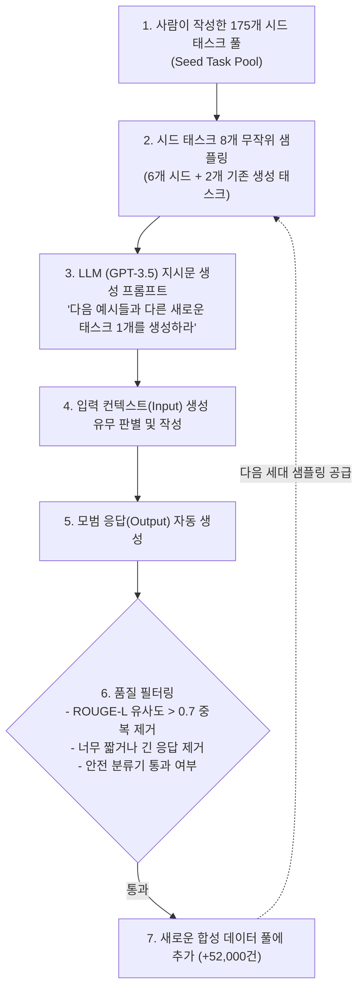
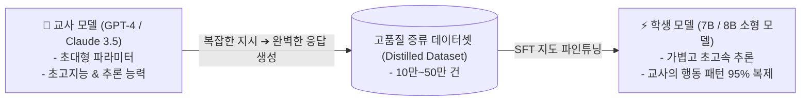
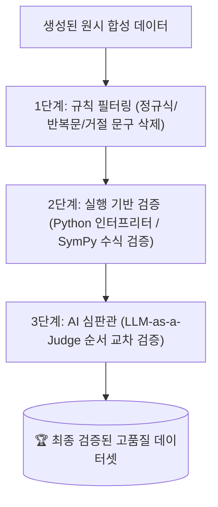

# 02. 데이터 증강과 AI 기반 합성 데이터 생성 기법

## 📌 핵심 요약 & 전체 맥락
> **"인간이 수작업으로 수백만 개의 데이터를 만드는 시대는 끝났습니다. 이제는 소수의 고품질 시드(Seed)를 바탕으로 LLM이 스스로 데이터를 생성하고 검증하는 '합성 데이터(Synthetic Data) 플라이휠'의 시대입니다."**  
> 데이터 수집의 높은 비용과 개인정보(PII) 규제, 콜드 스타트 문제를 해결하기 위해 **합성 데이터**는 현대 AI 엔지니어링의 필수 무기가 되었습니다.  
> 본 섹션에서는 역번역과 편향 완화를 위한 **전통적 데이터 증강 기법(Table 8-2)**부터, 175개 시드 태스크로 52,000개의 지시 데이터를 자동 생성한 **Self-Instruct 및 Stanford Alpaca 파이프라인(Figure 8-5)**,  
> 지시문의 난이도를 단계별로 진화시키는 **Evol-Instruct**, 에이전트 간 시뮬레이션으로 멀티턴 대화를 구축하는 **UltraChat**, 그리고 거대 모델의 지능을 소형 모델로 전이시키는 **교사-학생 지식 증류 (Model Distillation)**까지 최신 합성 데이터 기법을 완벽히 정리합니다.

---

## 🗺️ 도표(Figure & Table) 색인 및 매핑 가이드

본문의 핵심 원리를 시각적으로 확인할 수 있는 책 내 도표의 위치와 해설 매핑입니다:

| 도표 번호 | 도표 제목 및 핵심 내용 | 책 페이지 | 본문 해당 주제 |
| :---: | :--- | :---: | :--- |
| **Table 8-2** | 프롬프트 내 대명사 및 고정관념 엔티티 교체를 통해 편향을 완화하는 데이터 증강 예시표 | **p. 385** | 1. 전통적 데이터 증강과 편향 완화 |
| **Figure 8-5** | Stanford Alpaca의 175개 시드 태스크로부터 새로운 태스크 및 응답을 자동 생성하는 Self-Instruct 파이프라인 | **p. 390** | 2. AI 기반 합성 데이터: Self-Instruct |

---

## 1. 데이터 증강의 필요성과 전통적 기법 (Table 8-2, pp. 380 ~ 386)



### ① 전통적 데이터 증강 4대 기법
1. **역번역 (Back-translation):**  
   한국어 원문을 독일어나 프랑스어로 번역한 뒤, 이를 다시 한국어로 재번역하여 **의미는 보존하면서 문장 구조와 어휘를 자연스럽게 다양화**.
2. **동의어 교체 (Synonym Substitution):**  
   WordNet이나 임베딩 공간에서 유사한 단어로 무작위 치환.
3. **규칙 기반 섭동 (Perturbation & Typo Injection):**  
   실제 사용자가 저지르는 오타, 띄어쓰기 오류, 음성 인식(STT) 노이즈를 고의로 주입하여 모델의 강건성(Robustness) 향상.
4. **편향 완화 증강 (Bias Mitigation, Table 8-2):**  
   성별, 인종, 직업에 대한 고정관념 편향을 제거하기 위해 주어와 대명사를 체계적으로 교체:

| 원본 데이터 (편향 위험) | 증강 데이터 (편향 완화 및 중립화) | 효과 |
| :--- | :--- | :--- |
| "의사가 수술을 시작했고, **그(He)**는 간호사에게 가위를 요청했다." | "의사가 수술을 시작했고, **그녀(She)**는 간호사에게 가위를 요청했다." | 직업-성별 고정관념 교정 |
| "간호사가 환자를 안심시키며 **그녀의(Her)** 손을 잡았다." | "간호사가 환자를 안심시키며 **그의(His)** 손을 잡았다." | 성별 균형 학습 |

---

## 2. AI 기반 합성 데이터: Self-Instruct & Alpaca (Figure 8-5, pp. 386 ~ 392) ⭐

### ① Self-Instruct 프레임워크 (Wang et al., 2022)
소수의 사람이 작성한 고품질 시드 지시문(Seed Tasks)을 바탕으로, LLM 스스로 새로운 지시문과 모범 응답을 자동 확장하는 파이프라인입니다:



### ② Stanford Alpaca 실증 사례 (Taori et al., 2023, Figure 8-5)
* **비용의 혁명:** Stanford 연구진은 OpenAI `text-davinci-003` API를 사용하여 **단 500달러(약 65만 원)**의 API 비용으로 **52,000개의 고품질 지시 데이터셋**을 완전 자동 생성했습니다.
* 이 데이터로 LLaMA-7B 모델을 파인튜닝하여 당시 수억 원이 든 대형 모델들과 대등한 대화 능력을 보여주며 오픈소스 생태계의 기폭제가 되었습니다.

---

## 3. 고도화된 합성 기법: Evol-Instruct & UltraChat (pp. 392 ~ 395)

단순한 Self-Instruct는 쉬운 질문만 반복 생성하는 경향이 있습니다. 이를 극복하기 위해 난이도와 멀티턴을 진화시키는 기법들이 개발되었습니다:

```
[ Evol-Instruct 2대 진화 메커니즘 (WizardLM) ]

1. 심도 진화 (In-Depth Evolution) - 난이도 상승 :
   • 제약 조건 추가 (Add Constraints) : "단, 파이썬 내장 함수를 쓰지 말고 시간복잡도 O(N)으로 구현해."
   • 추론 심화 (Deepen Reasoning)     : "단순 결론 대신 왜 그렇게 되는지 3단계 증명 과정을 포함해."
   • 입력 복잡화 (Complicate Input)   : 문제 설명에 여러 예외 조건과 코너 케이스 추가.

2. 너비 진화 (In-Breadth Evolution) - 도메인 확장 :
   • 완전히 새로운 주제나 비인기 전문 도메인(양자역학, 해양법)으로 지시문 변이 생성.
```

* 💬 **UltraChat (멀티턴 대화 시뮬레이션):**  
  하나의 LLM은 '호기심 많은 사용자(User Agent)' 역할을, 다른 LLM은 '전문가 비서(Assistant Agent)' 역할을 맡아 둘이서 5~10턴 동안 질의응답과 토론을 진행하는 로그를 수집하여 **수십만 건의 고난도 멀티턴 대화 데이터셋**을 구축합니다.

---

## 4. 모델 지식 증류 (Model Distillation, pp. 395 ~ 396)

**지식 증류 (Knowledge Distillation)**는 거대하고 똑똑한 교사 모델(Teacher: GPT-4, Claude 3.5 Sonnet)의 지능을 작고 효율적인 학생 모델(Student: 7B/8B 모델)로 전이시키는 기술입니다:



* **시퀀스 수준 증류 (Sequence-Level Distillation):**  
  교사 모델의 내부 가중치나 로짓(Logit) 확률 분포에 접근할 수 없더라도, **교사 모델이 생성한 텍스트 데이터셋 자체를 학생 모델의 지도 학습 타겟으로 사용**함으로써 강력한 성능 전이를 달성합니다.

---

## 5. 합성 데이터 품질 검증 및 실무 테크닉 (pp. 388 ~ 396) ⭐

합성 데이터는 환각(Hallucination)이 섞일 위험이 있으므로 체계적인 검증 루프와 편향 상쇄 기법이 필수적입니다:



### ① 실무 합성 데이터 3대 검증 테크닉 (Book pp. 388 ~ 390)
1. **코드 왕복 역번역 검증 (Code Back-Translation Verification):**  
   원본 소스 코드 ➔ AI로 설명서/독스트링 생성 ➔ 설명서만 보고 다시 AI로 코드 재작성 ➔ **재작성된 코드가 원본 코드와 동일하게 동작할 때만** 해당 설명-코드 쌍을 학습셋으로 최종 채택.
2. **NVIDIA의 선호도 판정 편향 상쇄 (Position Bias Mitigation, NVIDIA 2024):**  
   LLM 채점관은 첫 번째 제시된 답변을 편애하는 **첫 번째 위치 편향(First-Position Bias)**을 가집니다. NVIDIA는 답변의 순서를 `(A, B)`와 `(B, A)`로 맞바꿔 2번 질문한 뒤, **두 번 모두 일관되게 동일한 답변을 승자로 선택한 삼중쌍(Prompt, Winner, Loser)만 DPO/RLHF 학습 데이터로 수집**했습니다.
3. **대규모 합성 사전학습 데이터셋: Cosmopedia (Allal et al., 2024):**  
   Hugging Face는 Mixtral-8x7B를 활용하여 250억 토큰(25B tokens) 규모의 합성 교과서, 기술 블로그, 교육용 기사를 생성하여 사전 학습에 투입함으로써 합성 데이터만으로도 강력한 기본 지능을 구축할 수 있음을 증명했습니다.

---

## 6. 엔지니어링 심화 Q&A

### Q1. AI가 생성한 합성 데이터로 다시 AI를 학습시키면 '모델 붕괴(Model Collapse)'가 발생하지 않나요?
**품질 필터링 없이 무분별하게 반복하면 모델 붕괴가 발생합니다.** 모델이 생성한 데이터의 꼬리 부분(낮은 확률의 창의적 표현)이 잘려 나가고 중심부만 남아 언어의 다양성이 퇴화하기 때문입니다.  
이를 방지하기 위해 **1) 인간이 작성한 실제 데이터(Anchor Data)를 10~20% 섞고, 2) 엄격한 품질 필터링과 실행 검증을 거친 상위 10%의 고품질 합성 데이터만 선별 학습**시켜야 합니다.

---

## 🔗 연관 문서
* [[00-ch08-overview|00. Chapter 8 전체 개요 및 목차]]
* [[01-data-curation-quality-coverage-and-quantity|01. 데이터 큐레이션: 품질, 다양성 및 데이터 규모]]
* [[03-data-processing-deduplication-and-formatting|03. 데이터 검사, 중복 제거, 정제 및 표준 포맷팅]]
* [[chapter-qa/ch07-fine-tuning-qa/03-peft-lora-and-qlora|Ch07-03. 매개변수 효율적 파인튜닝(PEFT)과 LoRA]]
